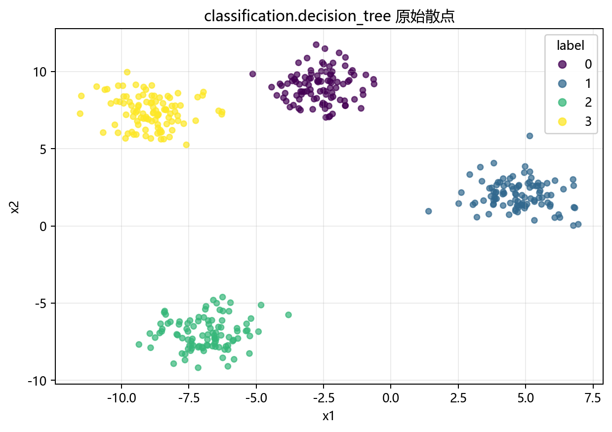
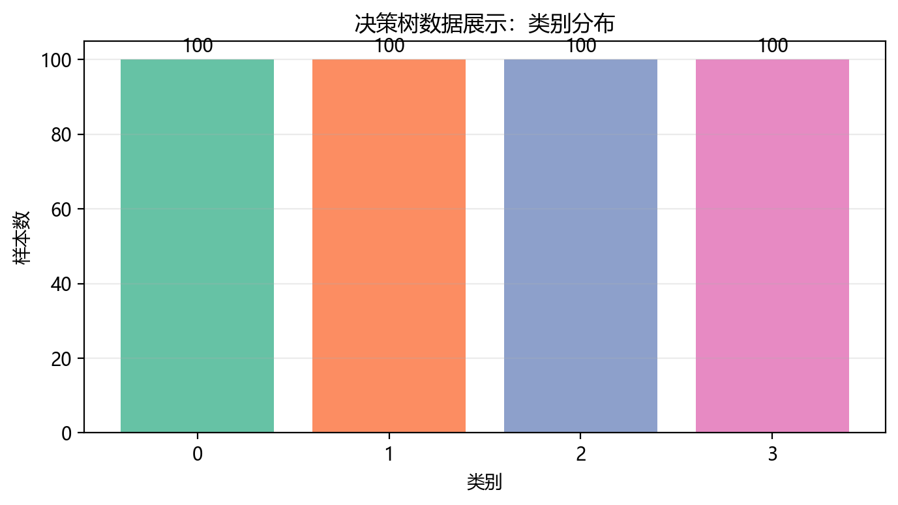
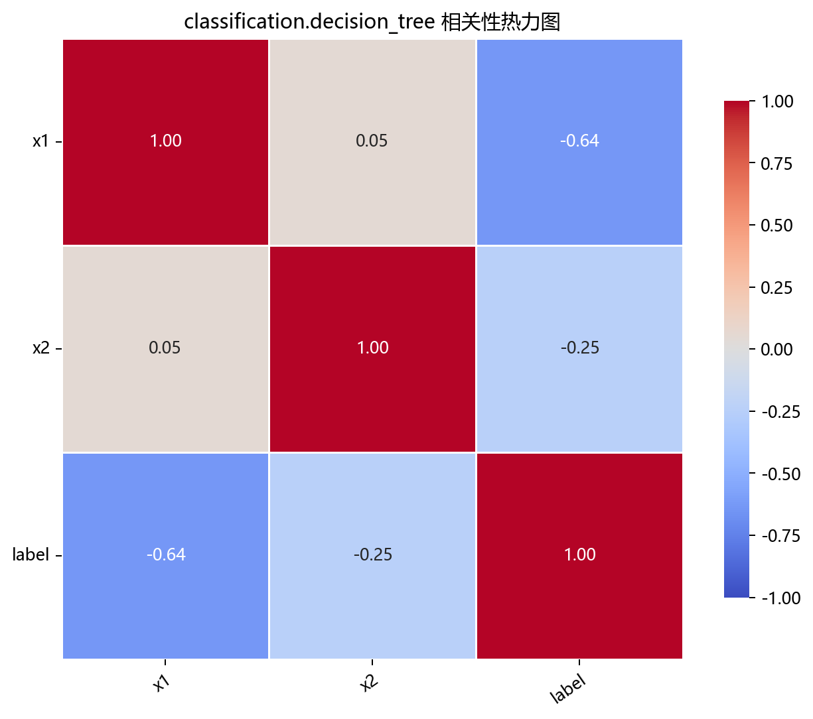

# 数据构成

> 对应代码：`data_generation/classification.py`、`data_generation/__init__.py`、`pipelines/classification/decision_tree.py`
>
> 相关对象：`ClassificationData.decision_tree()`、`decision_tree_classification_data`

## 本章目标

1. 明确本仓库 Decision Tree 数据来自 `ClassificationData.decision_tree()` 的 blob 生成逻辑。
2. 明确特征列与标签列在当前流水线中的拆分方式。
3. 明确训练集/测试集切分方式，以及为什么当前主模型流程里没有显式标准化步骤。

## 重点方法与概念速览

| 名称 | 类型 | 作用 |
|---|---|---|
| `ClassificationData.decision_tree()` | 方法 | 生成决策树使用的二维多分类数据 |
| `make_blobs(...)` | 函数 | scikit-learn 提供的多簇分类数据生成器 |
| `decision_tree_classification_data` | 变量 | 在 `data_generation/__init__.py` 中导出的数据对象 |
| `label` | 列名 | 当前流水线中的监督分类标签 |
| `feature_names` | 变量 | 用于特征重要性图显示的特征名列表 |

## 1. 本仓库数据入口

- 数据变量：`data_generation/__init__.py` 中导出的 `decision_tree_classification_data`
- 生成来源：`data_generation/classification.py` 中的 `ClassificationData.decision_tree()`
- 流水线使用：`pipelines/classification/decision_tree.py` 中的 `data = decision_tree_classification_data.copy()`

### 理解重点

- `decision_tree_classification_data` 在导入时就已经生成完成，因此流水线里直接 `.copy()` 使用即可。
- 用 `.copy()` 的目的，是避免后续处理意外修改原始数据对象。
- 当前数据是为决策树教学场景专门构造的，因此与区域切分直觉比较匹配。

## 2. 数据生成函数 `ClassificationData.decision_tree()`

### 参数速览（本节）

适用 API（分项）：

1. `ClassificationData.decision_tree()`
2. `make_blobs(n_samples=self.n_samples, centers=self.dt_centers, cluster_std=self.dt_cluster_std, random_state=self.random_state)`

| 参数名 | 本例取值 | 说明 |
|---|---|---|
| `n_samples` | `400` | 样本数 |
| `centers` | `4` | 类别中心数，对应 4 类 |
| `cluster_std` | `1.0` | 类内离散程度 |
| `random_state` | `42` | 随机种子，保证可复现 |
| 返回值 | `DataFrame` | 含 `x1`、`x2` 与 `label` 的数据表 |

### 示例代码

```python
X, y = make_blobs(
    n_samples=self.n_samples,
    centers=self.dt_centers,
    cluster_std=self.dt_cluster_std,
    random_state=self.random_state,
)
columns = [f"x{i + 1}" for i in range(2)]
data = DataFrame(X, columns=columns)
data["label"] = y
```

### 理解重点

- 当前数据是二维 4 分类 blob 数据，类别分布在不同区域。
- 这种数据很适合展示决策树如何通过一系列轴对齐切分把样本空间分成若干块。
- 这也是当前分册和 KNN 双月牙数据、逻辑回归高维数据的教学目标不同之处。

## 3. 特征列与标签列

当前数据表结构如下：

- 特征列：`x1`、`x2`
- 标签列：`label`

### 示例代码

```python
X = data.drop(columns=["label"])
y = data["label"]
feature_names = list(X.columns)
```

### 理解重点

- `label` 是监督训练标签，会真实参与 `model.fit(X_train, y_train)`。
- `feature_names` 会被后续特征重要性图复用，因此当前流水线在早期就把它提取出来。
- 这说明决策树分册除了分类预测，还特别强调“树如何利用特征”的解释层。

## 4. 切分与当前预处理特点

### 参数速览（本节）

适用 API：`train_test_split(X, y, test_size=0.2, random_state=42, stratify=y)`

| 参数名 | 本例取值 | 说明 |
|---|---|---|
| `test_size` | `0.2` | 测试集占比 |
| `random_state` | `42` | 保证可复现划分 |
| `stratify` | `y` | 保持训练集和测试集的类别比例一致 |

### 示例代码

```python
X_train, X_test, y_train, y_test = train_test_split(
    X, y, test_size=0.2, random_state=42, stratify=y
)
```

### 理解重点

- 当前主模型训练流程没有像 KNN、SVC、Logistic Regression 那样显式做标准化。
- 这是因为树模型基于阈值切分，不依赖欧氏距离或梯度优化，因此对尺度不敏感得多。
- 这也是当前决策树分册在工程流程上与距离型模型显著不同的地方。

## 数据可视化







## 常见坑

1. 忘记把 `label` 从特征表中剥离出来。
2. 忽略 `feature_names` 在特征重要性图中的作用。
3. 误以为所有分类模型都必须先标准化，忽略树模型的划分机制不同。
4. 只看到 blob 数据简单，却忽略它和决策树区域切分直觉高度匹配。

## 小结

- 当前 Decision Tree 数据来自 `ClassificationData.decision_tree()`，底层使用的是 `make_blobs(...)`。
- 数据表结构清晰：`x1`、`x2` 是特征，`label` 是监督分类标签。
- 读懂数据来源、切分方式和当前不显式标准化的原因，是理解后续训练与评估章节的前提。
