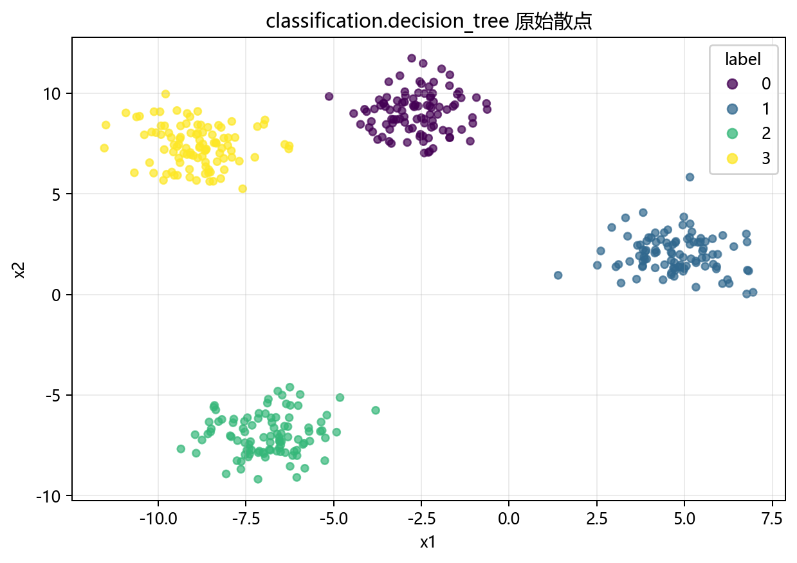
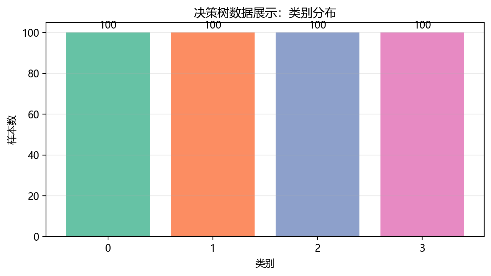
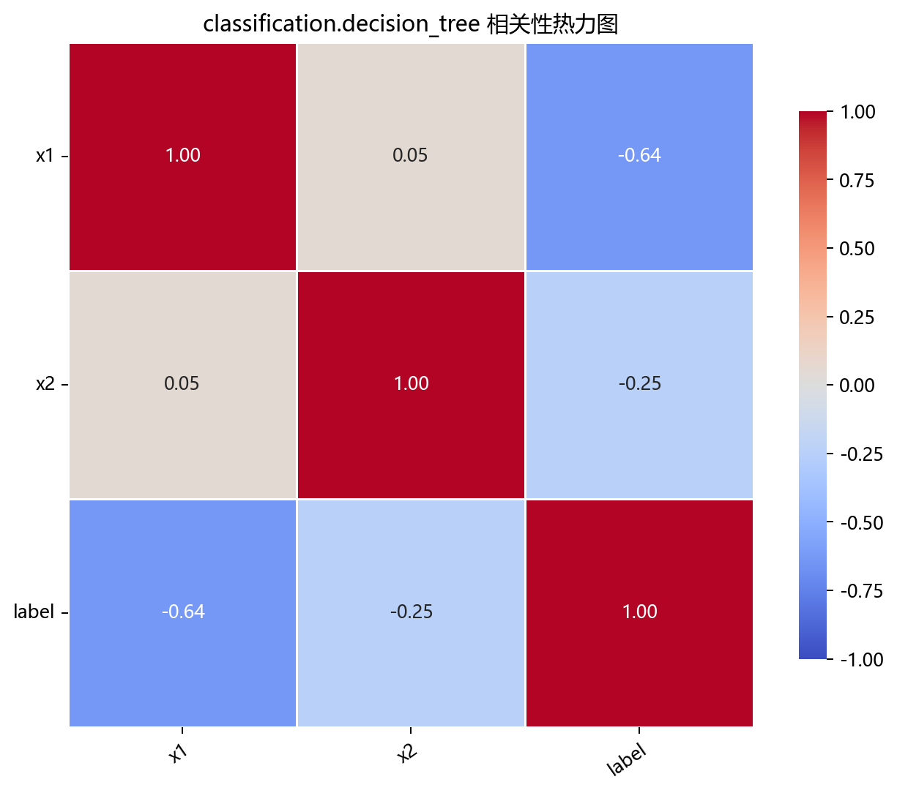

# 数据构成


## 本章目标

1. 明确本仓库 Decision Tree 数据来自 `ClassificationData.decision_tree()` 的 blob 生成逻辑。
2. 明确 `make_blobs` 各参数的数据含义与当前取值。
3. 明确训练集/测试集切分方式，以及为什么当前主模型流程里没有显式标准化步骤。

## 重点方法与概念速览

| 名称 | 类型 | 作用 |
|---|---|---|
| `ClassificationData.decision_tree()` | 方法 | 生成决策树使用的二维多分类数据 |
| `make_blobs(...)` | 函数 | scikit-learn 提供的多簇分类数据生成器 |
| `decision_tree_classification_data` | 变量 | 在 `data_generation/__init__.py` 中导出的数据对象 |
| `label` | 列名 | 当前流水线中的监督分类标签 |
| `feature_names` | 变量 | 用于特征重要性图显示的特征名列表 |

## 1. 本仓库数据入口

- 数据变量：`data_generation/__init__.py` 中导出的 `decision_tree_classification_data`
- 生成来源：`data_generation/classification.py` 中的 `ClassificationData.decision_tree()`
- 流水线使用：`pipelines/classification/decision_tree.py` 中的 `data = decision_tree_classification_data.copy()`

### 理解重点

- `decision_tree_classification_data` 在导入时就已经生成完成，因此流水线里直接 `.copy()` 使用即可。
- 用 `.copy()` 的目的，是避免后续处理意外修改原始数据对象。
- 当前数据是为决策树教学场景专门构造的，因此与区域切分直觉比较匹配。

## 2. 数据生成函数 `ClassificationData.decision_tree()`

底层调用 `sklearn.datasets.make_blobs`，生成多个各向同性高斯簇的数据。

### 参数速览

`make_blobs` 核心参数：

| 参数名 | 类型 | 说明 | 示例取值 |
|---|---|---|---|
| `n_samples` | `int` | 总样本数 $N$。当前取 `400`，每个类别约 100 个样本。默认为 `100` | `100`、`400`、`1000` |
| `centers` | `int` 或 `ndarray` | 簇中心数 $K$（即类别数）。当前取 `4`，生成 4 个各向同性高斯簇。若传入数组则为各中心坐标。默认为 `None`（需指定） | `3`、`4`、`[(0,0),(5,5)]` |
| `cluster_std` | `float` 或 `array_like` | 各簇的标准差 $\sigma$。控制类内离散程度——$\sigma$ 越大各类重叠越多，分类越难。当前取 `1.0`。默认为 `1.0` | `0.5`、`1.0`、`2.0` |
| `random_state` | `int` | 随机种子，保证每次生成相同数据。默认为 `None` | `42` |
| `n_features` | `int` | 特征维度 $d$。当前取 `2`，便于可视化。默认为 `2` | `2`、`10`、`100` |
| `return_centers` | `bool` | 是否同时返回簇中心坐标。默认为 `False` | `True` |

### 示例代码

```python
from sklearn.datasets import make_blobs

X, y = make_blobs(
    n_samples=400,
    centers=4,
    cluster_std=1.0,
    random_state=42,
)
# X.shape = (400, 2), y 取值 {0, 1, 2, 3}
```

### 理解重点

- 当前数据是二维 4 分类 blob 数据，类别分布在不同区域。
- 这种数据很适合展示决策树如何通过一系列轴对齐切分把样本空间分成若干块。
- `cluster_std` 越大，各类之间的重叠越多，决策树边界越复杂——这是实验调参的好入口。

## 3. 特征列与标签列

当前数据表结构：

- 特征列：`x1`、`x2`（二维实数特征）
- 标签列：`label`（取值为 0、1、2、3 的多分类标签）

### 示例代码

```python
X = data.drop(columns=["label"])
y = data["label"]
feature_names = list(X.columns)  # ['x1', 'x2']
```

### 理解重点

- `label` 是监督训练标签，会真实参与 `model.fit(X_train, y_train)`。
- `feature_names` 会被后续特征重要性图复用，因此当前流水线在早期就把它提取出来。
- 这说明决策树分册除了分类预测，还特别强调"树如何利用特征"的解释层。

## 4. 切分与当前预处理特点

### 参数速览

`train_test_split` 参数：

| 参数名 | 类型 | 说明 | 示例取值 |
|---|---|---|---|
| `test_size` | `float` 或 `int` | 测试集占比（`0.0`~`1.0`）或绝对样本数。当前取 `0.2`（20%）。默认为 `None`（需指定其一） | `0.2`、`0.3`、`100` |
| `random_state` | `int` | 随机种子，保证每次切分结果一致。默认为 `None` | `42` |
| `stratify` | `array_like` | 按此数组类别比例分层抽样。传入 `y` 确保训练集和测试集各类别比例与原始数据一致。默认为 `None` | `y`、`None` |
| `shuffle` | `bool` | 切分前是否打乱数据。默认为 `True` | `True` |

### 示例代码

```python
from sklearn.model_selection import train_test_split

X_train, X_test, y_train, y_test = train_test_split(
    X, y, test_size=0.2, random_state=42, stratify=y
)
```

### 理解重点

- 当前主模型训练流程没有像 KNN、SVC、Logistic Regression 那样显式做标准化。
- 这是因为树模型基于阈值切分（如 $x_1 \leq 3.2$），不依赖欧氏距离或梯度优化，因此对特征尺度不敏感。
- 这也是当前决策树分册在工程流程上与距离型模型显著不同的地方。

## 数据可视化







## 常见坑

1. 忘记把 `label` 从特征表中剥离出来。
2. 忽略 `feature_names` 在特征重要性图中的作用。
3. 误以为所有分类模型都必须先标准化，忽略树模型的阈值划分机制不同。
4. 只看到 blob 数据简单，却忽略它和决策树区域切分直觉高度匹配。

## 小结

- 当前 Decision Tree 数据来自 `ClassificationData.decision_tree()`，底层使用 `make_blobs(n_samples=400, centers=4)`。
- 数据表结构清晰：`x1`、`x2` 是二维特征，`label` 是 4 分类监督标签。
- 树模型基于阈值切分，不依赖距离尺度——因此不需要标准化，这是与 KNN/SVM/逻辑回归的核心工程差异。
- 读懂数据来源、切分方式和预处理选择，是理解后续训练与评估章节的前提。
