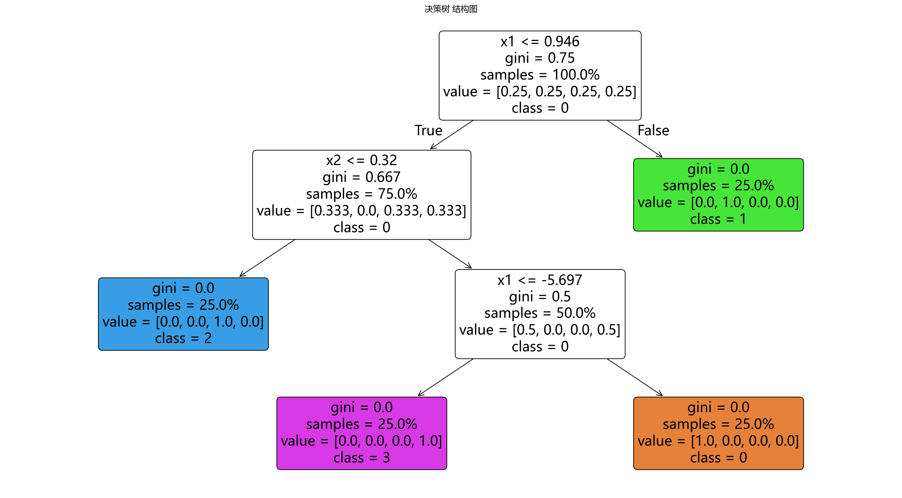

# 模型构建

> 对应代码：`model_training/classification/decision_tree.py`
>
> 运行方式：`python -m model_training.classification.decision_tree`

## 本章目标

1. 明确 `train_model(...)` 如何构建并训练 `DecisionTreeClassifier`。
2. 理解 `get_depth()`、`get_n_leaves()`、`feature_importances_` 在当前源码中的作用。
3. 看清训练函数除了 `fit(...)` 之外还做了哪些工程封装。

## 重点方法与概念速览

| 名称 | 类型 | 作用 |
|---|---|---|
| `train_model(...)` | 函数 | 构建并训练一个 `sklearn.tree.DecisionTreeClassifier` 模型 |
| `DecisionTreeClassifier(...)` | 类 | scikit-learn 提供的分类决策树模型 |
| `model.fit(X_train, y_train)` | 方法 | 在训练数据上递归学习划分规则 |
| `model.get_depth()` | 方法 | 返回树的实际深度 |
| `model.get_n_leaves()` | 方法 | 返回叶子节点数量 |
| `model.feature_importances_` | 属性 | 返回特征重要性分数 |
| `@print_func_info` / `@timeit` | 装饰器 | 打印函数信息并统计训练耗时 |

## 1. `train_model(...)` 的函数签名

### 参数速览（本节）

适用函数：`train_model(X_train, y_train, max_depth=6, min_samples_split=4, min_samples_leaf=2, criterion='gini', random_state=42)`

| 参数名 | 本例取值 | 说明 |
|---|---|---|
| `X_train` | 训练特征 | 输入给 `DecisionTreeClassifier.fit(...)` 的训练矩阵 |
| `y_train` | 训练标签 | 每个样本对应的类别标签 |
| `max_depth` | `6` | 最大树深 |
| `min_samples_split` | `4` | 内部节点再划分所需最小样本数 |
| `min_samples_leaf` | `2` | 叶子节点最小样本数 |
| `criterion` | `'gini'` | 划分标准 |
| `random_state` | `42` | 随机种子 |
| 返回值 | `DecisionTreeClassifier` | 已训练完成的模型对象 |

### 示例代码

```python
from model_training.classification.decision_tree import train_model

model = train_model(X_train.values, y_train.values)
```

### 理解重点

- 当前训练入口很直接，只负责训练一个 `DecisionTreeClassifier` 模型。
- 和部分实验型代码不同，这里没有剪枝调参逻辑，也没有多模型对比。
- 所有默认超参数都写在函数签名里，阅读成本较低，适合作为源码入口。

## 2. `DecisionTreeClassifier(...)` 的实际构建方式

### 参数速览（本节）

适用 API（分项）：

1. `DecisionTreeClassifier(...)`
2. `model.fit(X_train, y_train)`

| 项目 | 当前实现 | 说明 |
|---|---|---|
| 训练模型 | `DecisionTreeClassifier(...)` | 使用源码中显式给出的超参数 |
| 输入特征 | `X_train` | 当前流水线传入的是原始数值特征 |
| 输入标签 | `y_train` | 多分类监督标签 |
| 训练方式 | `fit(X_train, y_train)` | 在监督数据上递归学习划分规则 |
| 返回值 | 已训练模型 | 含深度、叶节点和特征重要性等信息 |

### 示例代码

```python
model = DecisionTreeClassifier(
    max_depth=max_depth,
    min_samples_split=min_samples_split,
    min_samples_leaf=min_samples_leaf,
    criterion=criterion,
    random_state=random_state,
)
model.fit(X_train, y_train)
```

### 理解重点

- 仓库没有自己实现树分裂算法，而是直接调用 scikit-learn 的成熟实现。
- 当前封装的重点，不是重写决策树算法，而是把超参数、训练耗时和关键结果日志组织清楚。
- 这里最值得强调的是：当前默认采用 `criterion='gini'`、`max_depth=6` 等复杂度控制配置。

## 3. 训练完成后最重要的模型属性

### 参数速览（本节）

适用属性（分项）：

1. `model.get_depth()`
2. `model.get_n_leaves()`
3. `model.feature_importances_`

| 属性名 | 当前含义 | 作用 |
|---|---|---|
| `get_depth()` | 实际树深 | 用于观察树的复杂度 |
| `get_n_leaves()` | 叶节点数 | 用于观察最终划分区域数量 |
| `feature_importances_` | 特征重要性分数 | 用于解释哪些特征最常被用来分裂 |

### 示例代码

```python
print(f"最大深度: {model.get_depth()}")
print(f"叶子节点数: {model.get_n_leaves()}")
print(f"criterion: {criterion}")
```

### 理解重点

- `get_depth()` 和 `get_n_leaves()` 是当前决策树分册最值得关注的训练结果之一。
- 它们把“树复杂度”这一理论概念，映射成源码里可以直接观察和解释的输出。
- `feature_importances_` 则是后续特征重要性图的直接数据来源。

## 4. 训练阶段的工程封装

除了 `DecisionTreeClassifier(...).fit(...)` 之外，`train_model(...)` 还做了几层工程包装。

### 参数速览（本节）

适用装饰与输出（分项）：

1. `@print_func_info`
2. `@timeit`
3. `with timer(name="模型训练耗时")`
4. 日志输出 `最大深度`、`叶子节点数`、`criterion`

| 输出项 | 作用 |
|---|---|
| 函数调用标题 | 帮助在终端中定位训练入口 |
| 训练耗时 | 观察当前模型拟合时间 |
| `模型训练完成` | 明确训练阶段已结束 |
| 深度与叶节点日志 | 帮助理解树的复杂度 |
| 划分标准日志 | 确认当前树使用的准则 |

### 理解重点

- 当前封装强调的是教学型可读性，而不是复杂训练框架。
- 这一层封装把“构建模型”“训练模型”“打印结果”收在一个函数里，方便文档和流水线复用。
- 从工程角度看，这样的拆分也让 `pipelines/classification/decision_tree.py` 保持简洁。

## 模型可视化



## 常见坑

1. 把决策树的 `fit(...)` 理解成和线性模型一样的参数优化过程。
2. 只知道可以 `predict(...)`，却忽略 `get_depth()`、`get_n_leaves()`、`feature_importances_` 才是理解树行为的重要线索。
3. 忘记当前 `X_train` 直接使用原始特征值，而不是标准化后的特征。
4. 把训练函数和后续 ROC、特征重要性、学习曲线等评估逻辑混在一起理解。

## 小结

- `train_model(...)` 是本仓库 Decision Tree 的核心训练入口。
- 它本质上是对 `sklearn.tree.DecisionTreeClassifier` 的薄封装，重点在于把超参数、训练结果和日志输出组织清楚。
- 读懂这一层之后，再看流水线中的概率输出、特征重要性和学习曲线会更顺畅。
