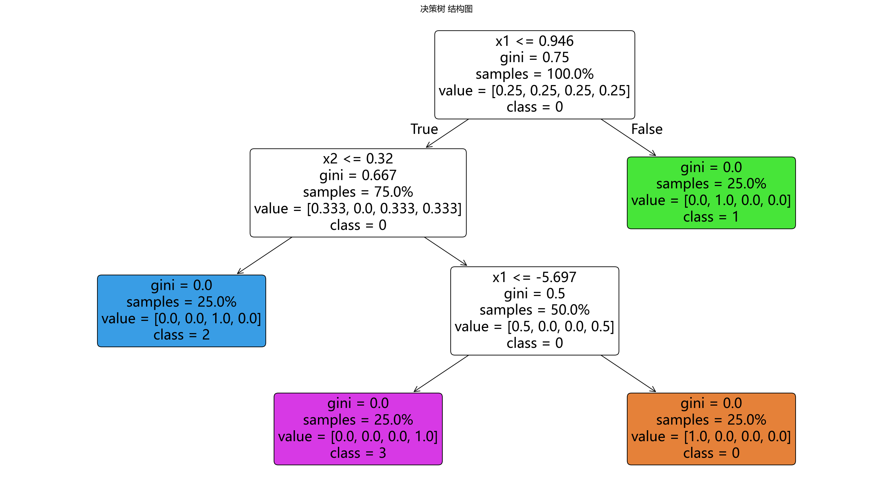

# 模型构建


## 本章目标

1. 明确 `train_model(...)` 如何构建并训练 `DecisionTreeClassifier`。
2. 理解每个构造器参数的数学含义与调参方向。
3. 理解 `get_depth()`、`get_n_leaves()`、`feature_importances_` 在当前源码中的作用。

## 重点方法与概念速览

| 名称 | 类型 | 作用 |
|---|---|---|
| `train_model(X_train, y_train, ...)` | 函数 | 构建并训练 `DecisionTreeClassifier`，返回已训练模型 |
| `DecisionTreeClassifier(...)` | 构造器 | 创建分类决策树，通过超参数控制树的生长与复杂度 |
| `model.fit(X_train, y_train)` | 方法 | 在训练数据上递归学习划分规则 |
| `model.get_depth()` | 方法 | 返回树的实际深度 $d$ |
| `model.get_n_leaves()` | 方法 | 返回叶子节点数量 $\vert T\vert$ |
| `model.feature_importances_` | 属性 | 返回特征重要性分数，基于不纯度下降加权求和 |

## 1. `train_model(...)` 的函数签名

### 参数速览

| 参数名 | 类型 | 说明 | 示例取值 |
|---|---|---|---|
| `X_train` | `array_like` | 训练特征矩阵，形状 `(n_samples, n_features)`。传入 `model.fit()`。每行为一个样本，每列为一个特征 | `X_train.values` |
| `y_train` | `array_like` | 训练标签向量，形状 `(n_samples,)`。多分类标签取值为 `{0, 1, ..., K-1}` | `y_train.values` |
| `max_depth` | `int` | 树的最大深度 $d_{\max}$。当前默认 `6`——限制划分轮数防止过拟合 | `3`、`6`、`None` |
| `min_samples_split` | `int` | 内部节点继续分裂所需最小样本数。当前默认 `4` | `2`、`4`、`10` |
| `min_samples_leaf` | `int` | 叶节点最少样本数。当前默认 `2`——保证每个叶节点至少含 2 个样本 | `1`、`2`、`5` |
| `criterion` | `str` | 不纯度度量：`"gini"` = $1 - \sum p_k^2$，`"entropy"` = $-\sum p_k \log_2 p_k$。当前默认 `"gini"` | `"gini"`、`"entropy"` |
| `random_state` | `int` | 随机种子，保证分裂中的随机性可复现。默认为 `None` | `42` |
| 返回值 | `DecisionTreeClassifier` | 已训练完成的模型对象，含 `classes_`、`feature_importances_` 等属性 | — |

### 示例代码

```python
from model_training.classification.decision_tree import train_model

model = train_model(X_train.values, y_train.values)
```

### 理解重点

- 当前训练入口很直接，只负责训练一个 `DecisionTreeClassifier` 模型。
- 和部分实验型代码不同，这里没有剪枝调参逻辑，也没有多模型对比。
- 所有默认超参数都写在函数签名里，阅读成本较低，适合作为源码入口。

## 2. `DecisionTreeClassifier(...)` 的完整参数

### 参数速览

| 参数名 | 类型 | 说明 | 示例取值 |
|---|---|---|---|
| `criterion` | `str` | 划分不纯度度量函数。`"gini"` = $\text{Gini}(D) = 1 - \sum p_k^2$；`"entropy"` = $H(D) = -\sum p_k \log_2 p_k$；`"log_loss"` 等同于 `"entropy"`。默认为 `"gini"` | `"gini"`、`"entropy"` |
| `splitter` | `str` | 划分策略。`"best"` 在所有特征中选最优划分点；`"random"` 随机选最优划分点。默认为 `"best"` | `"best"`、`"random"` |
| `max_depth` | `int` 或 `None` | 树的最大深度 $d_{\max}$。`None` 表示不限制，节点持续分裂直到纯净。增大 → 更复杂，过拟合风险更高。默认为 `None` | `3`、`6`、`None` |
| `min_samples_split` | `int` 或 `float` | 内部节点再划分所需最小样本数。`float`（如 `0.1`）表示比例 × `n_samples`。增大可抑制过拟合。默认为 `2` | `2`、`4`、`10` |
| `min_samples_leaf` | `int` 或 `float` | 叶节点最少样本数。`float` 表示比例。增大使树更保守，防止叶节点包含极少数样本。默认为 `1` | `1`、`2`、`5` |
| `min_weight_fraction_leaf` | `float` | 叶节点最小加权样本比例。仅在 `sample_weight` 非 `None` 时有效。默认为 `0.0` | `0.0`、`0.01` |
| `max_features` | `int`、`float`、`str` 或 `None` | 每次分裂考虑的候选特征数。`None` 用全部；`"sqrt"` = $\sqrt{d}$；`"log2"` = $\log_2 d$；`int` = 固定数量。默认为 `None` | `None`、`"sqrt"`、`2` |
| `random_state` | `int` | 随机种子，保证分裂和特征选择中的随机性可复现。默认为 `None` | `42` |
| `max_leaf_nodes` | `int` 或 `None` | 最大叶节点数限制。以最佳优先方式生长，达到限制后停止。`None` 不限制。默认为 `None` | `None`、`10`、`50` |
| `min_impurity_decrease` | `float` | 最小不纯度下降阈值。分裂必须使不纯度下降 ≥ 该值才被接受。默认为 `0.0` | `0.0`、`0.01` |
| `class_weight` | `str`、`dict` 或 `None` | 类别权重。`"balanced"` 自动按 $w_k = n / (K \cdot n_k)$ 加权；`dict` 手动指定 `{class: weight}`。默认为 `None` | `None`、`"balanced"`、`{0:1, 1:2}` |
| `ccp_alpha` | `float` | 代价复杂度剪枝参数 $\alpha$。最小化 $R(T) + \alpha \cdot \vert T\vert$。$\alpha > 0$ 时进行后剪枝。默认为 `0.0` | `0.0`、`0.01` |

### 示例代码

```python
from sklearn.tree import DecisionTreeClassifier

model = DecisionTreeClassifier(
    max_depth=6,
    min_samples_split=4,
    min_samples_leaf=2,
    criterion="gini",
    random_state=42,
)
model.fit(X_train, y_train)
```

### 理解重点

- 仓库没有自己实现树分裂算法，而是直接调用 scikit-learn 的成熟 CART 实现。
- 当前封装的重点不是重写算法，而是把超参数、训练耗时和关键结果日志组织清楚。
- 最值得关注的是复杂度控制三参数：`max_depth`、`min_samples_split`、`min_samples_leaf`。

## 3. 训练完成后最重要的模型属性

### 属性表

| 属性 | 类型 | 数学含义 |
|---|---|---|
| `classes_` | `ndarray` | 模型学到的类别标签数组，形状 `(n_classes,)` |
| `n_classes_` | `int` | 类别数量 $K$ |
| `n_features_in_` | `int` | 训练时的特征维度 $d$ |
| `feature_importances_` | `ndarray` | 各特征重要性分数，基于不纯度下降加权求和，和为 1 |
| `tree_` | `Tree` | 底层 Cython Tree 对象，包含分裂阈值、子节点索引等内部结构 |
| `max_depth_` | `int` | 通过 `get_depth()` 获取的实际树深 |
| `n_leaves_` | `int` | 通过 `get_n_leaves()` 获取的实际叶节点数 |

### 示例代码

```python
print(f"实际深度: {model.get_depth()}")
print(f"叶节点数: {model.get_n_leaves()}")
print(f"特征重要性: {model.feature_importances_}")
```

### 理解重点

- `get_depth()` 和 `get_n_leaves()` 是当前决策树分册最值得关注的训练结果——它们把"树复杂度"映射成可直接观察的输出。
- `feature_importances_` 是后续特征重要性图的直接数据来源。
- `get_depth()` 返回的实际深度 ≤ `max_depth`。

## 4. 训练阶段的工程封装

除了 `DecisionTreeClassifier(...).fit(...)` 之外，`train_model(...)` 还做了几层工程包装：

| 输出项 | 作用 |
|---|---|
| 函数调用标题（`@print_func_info`） | 帮助在终端中定位训练入口 |
| 训练耗时（`@timeit`） | 观察当前模型拟合时间 |
| 深度与叶节点日志 | 帮助理解树的复杂度 |
| 划分标准日志 | 确认当前树使用的 criterion |

### 理解重点

- 当前封装强调的是教学型可读性，而不是复杂训练框架。
- 这一层封装把"构建模型""训练模型""打印结果"收在一个函数里，方便文档和流水线复用。
- 从工程角度看，这样的拆分也让 `pipelines/classification/decision_tree.py` 保持简洁。

## 模型可视化



## 常见坑

1. 把决策树的 `fit(...)` 理解成和线性模型一样的参数优化过程——树是递归划分，不是梯度下降。
2. 只知道可以 `predict(...)`，却忽略 `get_depth()`、`get_n_leaves()`、`feature_importances_` 才是理解树行为的重要线索。
3. 忘记当前 `X_train` 直接使用原始特征值，而不是标准化后的特征。
4. 把训练函数和后续 ROC、特征重要性、学习曲线等评估逻辑混在一起理解。

## 小结

- `train_model(...)` 是本仓库 Decision Tree 的核心训练入口，本质是对 `sklearn.tree.DecisionTreeClassifier` 的薄封装。
- `DecisionTreeClassifier` 的 12 个构造器参数中，`criterion`、`max_depth`、`min_samples_split`、`min_samples_leaf` 是最核心的四个。
- 训练后属性 `feature_importances_`、`get_depth()`、`get_n_leaves()` 是后续评估与解释的直接数据来源。
- 读懂这一层之后，再看流水线中的概率输出、特征重要性和学习曲线会更顺畅。
