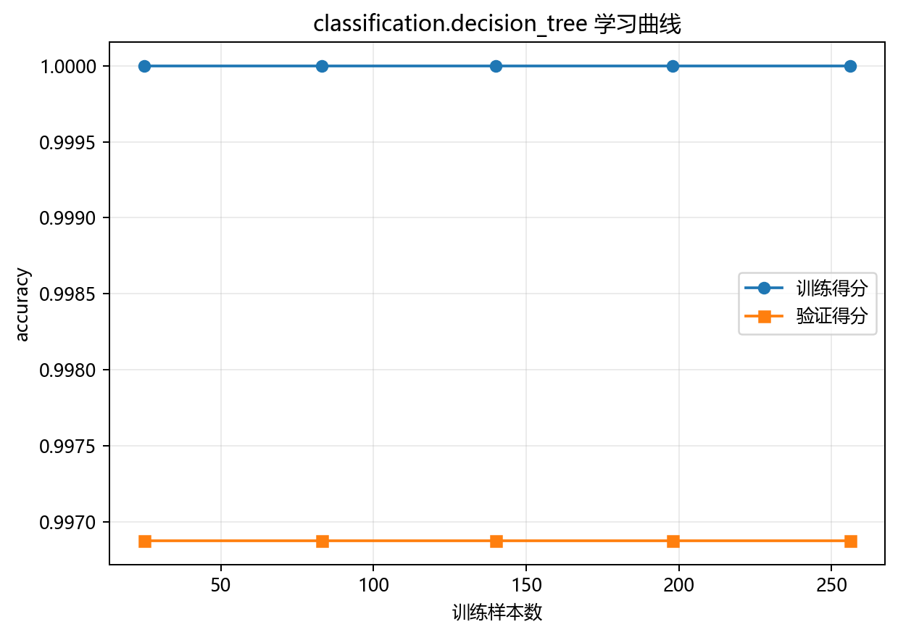

# 训练与预测


## 本章目标

1. 按源码顺序看清当前 Decision Tree 流水线到底执行了哪些步骤。
2. 理解训练集/测试集拆分、训练、类别预测和概率预测之间的连接关系。
3. 理解主模型与二维可视化模型在当前实现中的职责差异。

## 重点方法与概念速览

| 名称 | 类型 | 作用 |
|---|---|---|
| `decision_tree_classification_data.copy()` | 方法 | 复制原始数据，避免修改源对象 |
| `train_test_split(...)` | 方法 | 划分训练集与测试集 |
| `train_model(X_train.values, y_train.values)` | 函数 | 训练主分类树模型 |
| `model.predict(X_test.values)` | 方法 | 生成测试集类别预测结果 |
| `model.predict_proba(X_test.values)` | 方法 | 生成测试集类别概率输出 |
| `PCA(n_components=2)` | 类 | 为决策边界可视化构造二维表示 |
| `model_2d` | 模型 | 专门用于二维决策边界展示 |

## 1. 流水线从复制数据开始

当前流水线先复制 `decision_tree_classification_data`，再拆出 `X`、`y` 和 `feature_names`。

### 示例代码

```python
data = decision_tree_classification_data.copy()
X = data.drop(columns=["label"])
y = data["label"]
feature_names = list(X.columns)
```

### 理解重点

- `feature_names` 会在后续特征重要性图中使用，因此流水线较早就把它保存下来。
- 当前任务是监督多分类，因此 `y` 会真实参与训练和预测评估。

## 2. 先切分训练集与测试集

当前流水线使用 `train_test_split` 将数据按 8:2 比例切分，并通过 `stratify=y` 保持类别分布一致。

### 参数速览

适用函数：`sklearn.model_selection.train_test_split`

| 参数名 | 类型 | 说明 | 示例取值 |
|---|---|---|---|
| `*arrays` | `array_like` | 待切分的数据序列。传入 `(X, y)` 则分别对应切分。长度必须一致 | `X, y` |
| `test_size` | `float` 或 `int` | 测试集占比（`0.0`~`1.0`）或绝对样本数。当前取 `0.2`，即 80 个测试样本（总样本 400 × 20%） | `0.2`、`0.3`、`100` |
| `train_size` | `float` 或 `int` | 训练集占比或绝对样本数。默认 `1 - test_size`，通常不显式指定 | `0.8`、`None` |
| `random_state` | `int` | 随机种子，保证每次切分结果一致。当前取 `42` | `42` |
| `shuffle` | `bool` | 切分前是否打乱数据。默认为 `True`，确保样本顺序不引入偏差 | `True` |
| `stratify` | `array_like` | 按此数组类别比例分层抽样。传入 `y` 确保训练集和测试集各类别比例与原始数据一致，数学上保证 $\frac{n_{k,\text{train}}}{n_{k,\text{test}}} \approx \frac{N_{\text{train}}}{N_{\text{test}}}$，避免小类别在某一集合中意外缺失 | `y`、`None` |

### 示例代码

```python
from sklearn.model_selection import train_test_split

X_train, X_test, y_train, y_test = train_test_split(
    X, y, test_size=0.2, random_state=42, stratify=y
)
```

### 理解重点

- `stratify=y` 的作用，是让训练集和测试集保持相近的类别比例。
- 对当前 4 分类任务（每类约 100 样本）来说，stratify 保证每类约有 80 个训练样本、20 个测试样本。

## 3. 主模型训练与正式预测

当前决策树主流程没有显式标准化步骤，而是直接把原始数值特征传入模型。训练完成后，
`model.predict(...)` 为每个测试样本输出一个类别标签。

### 参数速览

适用方法：`DecisionTreeClassifier.predict(X)`

| 参数名 | 类型 | 说明 | 示例取值 |
|---|---|---|---|
| `X` | `array_like`，形状 `(n_samples, n_features)` | 待预测的特征矩阵。特征维度必须与训练时一致，即 `n_features = d = 2` | `X_test.values` |
| 返回值 | `ndarray`，形状 `(n_samples,)` | 预测类别标签，取值 $\hat{y}_i \in \{0, 1, \dots, K-1\}$，其中 $K = 4$。每个样本被分配到对应叶节点中样本数最多的类别 | — |

### 示例代码

```python
model = train_model(X_train.values, y_train.values)
y_pred = model.predict(X_test.values)
```

### 理解重点

- `model` 是当前分册的主模型，用于正式训练和测试集类别预测。
- 决策树通过阈值切分特征空间（如 $x_1 \leq 3.2$），不依赖欧氏距离或梯度优化，因此不像 KNN、SVC 那样强依赖标准化。
- `y_pred` 是后续混淆矩阵评估的直接输入。

## 4. 概率输出如何进入流水线

`predict_proba(...)` 给出每个测试样本在各个类别上的概率估计，是 ROC 曲线可视化的直接输入。

### 参数速览

适用方法：`DecisionTreeClassifier.predict_proba(X)`

| 参数名 | 类型 | 说明 | 示例取值 |
|---|---|---|---|
| `X` | `array_like`，形状 `(n_samples, n_features)` | 待预测的特征矩阵。特征维度必须与训练时一致 | `X_test.values` |
| 返回值 | `ndarray`，形状 `(n_samples, n_classes)` | 各类别概率估计，数学上 $P(\hat{y}_i = k \mid \mathbf{x}_i) = \frac{n_k^{\text{leaf}}}{n^{\text{leaf}}}$，即样本落入的叶节点中各类别样本占比。每行和为 1 | — |

### 示例代码

```python
y_scores = model.predict_proba(X_test.values)
```

### 理解重点

- 树模型的概率输出基于叶节点内各类别样本占比，这不同于逻辑回归通过 sigmoid/softmax 映射得分到概率。
- 当前任务是多分类（$K=4$），因此 `y_scores.shape = (80, 4)`，后续 ROC 模块按 One-vs-Rest 方式处理这些概率。
- 如果 `max_depth` 设得过深导致叶节点样本极少，概率估计会变得极不稳定（接近 0 或 1）。

## 5. 特征重要性如何进入流水线

树模型在分裂过程中天然累积特征重要性分数——每次分裂带来的不纯度下降按样本量加权后归到对应特征上。

### 参数速览

适用函数：`result_visualization.feature_importance.plot_feature_importance`

| 参数名 | 类型 | 说明 | 示例取值 |
|---|---|---|---|
| `model` | `DecisionTreeClassifier` | 已训练的主决策树模型，提供 `feature_importances_` 属性。其数学含义为 $\text{imp}_j = \frac{\sum_{t \in T_j} \Delta I(t) \cdot n_t}{\sum_{t \in T} \Delta I(t) \cdot n_t}$，其中 $\Delta I(t)$ 是节点 $t$ 的不纯度下降量，$n_t$ 是该节点样本数，$T_j$ 是使用特征 $j$ 分裂的所有节点集合 | `model` |
| `feature_names` | `list[str]` | 特征名列表，长度 = `n_features_in_`。用于图中标注横轴标签 | `['x1', 'x2']` |
| `title` | `str` | 图表标题 | `"决策树 特征重要性"` |
| `dataset_name` | `str` | 数据集名称，用于输出文件名 | `DATASET` |
| `model_name` | `str` | 模型名称，用于输出文件名 | `MODEL` |

### 示例代码

```python
plot_feature_importance(
    model,
    feature_names=feature_names,
    title="决策树 特征重要性",
    dataset_name=DATASET,
    model_name=MODEL,
)
```

### 理解重点

- `feature_names` 与 `feature_importances_` 的组合，可以把抽象的树分裂信息转成直观的解释图。
- 这是当前分册区别于很多其他分类分册（如逻辑回归）的重要评估入口——树模型天然具备特征重要性解释能力。

## 6. 决策边界为什么要额外训练一个 model_2d

主模型在原始二维特征空间训练，但决策边界图需要支持任意网格点的预测。
当前实现采用 PCA 将特征投影到二维空间，再单独训练一个二维决策树模型用于可视化。

### 参数速览

适用类：`sklearn.decomposition.PCA`

| 参数名 | 类型 | 说明 | 示例取值 |
|---|---|---|---|
| `n_components` | `int` | 保留的主成分数 $k$。$k=2$ 时将 $d$ 维特征投影到二维平面，便于可视化。数学上 PCA 通过 SVD 分解 $\mathbf{X} = \mathbf{U} \boldsymbol{\Sigma} \mathbf{V}^T$，取前 $k$ 个奇异向量构成投影矩阵 $\mathbf{V}_k$ | `2`、`3`、`None` |
| `random_state` | `int` | 随机种子。PCA 本身是确定性的（基于 SVD），但某些求解器使用随机化算法时需要。当前取 `42` | `42` |

### 示例代码

```python
from sklearn.decomposition import PCA

pca = PCA(n_components=2, random_state=42)
X_2d = pca.fit_transform(X.values)
model_2d = DecisionTreeClassifier(max_depth=6, random_state=42)
model_2d.fit(pca.transform(X_train.values), y_train.values)
```

### 理解重点

- 这里的 `model_2d` 不是主评估模型，而是专门为二维可视化服务的辅助模型。
- 主模型训练在原始特征空间中，而决策边界图需要二维输入来对每个网格点做预测。
- 这是整个决策树分册里需要重点讲清的工程细节——`model` 和 `model_2d` 的职责不同，不能混淆。

## 7. 学习曲线如何接入流水线

学习曲线用于诊断模型性能是否随训练样本量增加而持续改善。

### 参数速览

适用函数：`result_visualization.learning_curve.plot_learning_curve`

| 参数名 | 类型 | 说明 | 示例取值 |
|---|---|---|---|
| `estimator` | `estimator` | 新创建的模型实例。传入 `DecisionTreeClassifier(max_depth=6, random_state=42)`，内部会克隆并逐段训练，不修改传入实例 | `DecisionTreeClassifier(...)` |
| `X` | `array_like` | 训练特征矩阵。当前传入 `X_train.values`，学习曲线内部会按不同比例采样 | `X_train.values` |
| `y` | `array_like` | 训练标签向量 | `y_train.values` |
| `scoring` | `str` | 评分类指标。`"accuracy"` 即 $\frac{\text{正确预测样本数}}{\text{总样本数}}$。默认为 `None`（使用 estimator 默认 score） | `"accuracy"`、`"f1_macro"` |
| `cv` | `int` | 交叉验证折数。默认 `5`，即 5 折交叉验证计算验证得分 | `5`、`10` |

### 示例代码

```python
plot_learning_curve(
    DecisionTreeClassifier(max_depth=6, random_state=42),
    X_train.values,
    y_train.values,
    title="决策树 学习曲线",
    dataset_name=DATASET,
    model_name=MODEL,
)
```

### 理解重点

- 学习曲线使用的是一个新的 `DecisionTreeClassifier(...)` 实例，而不是直接复用 `model`。
- 这是因为学习曲线函数内部会自行克隆和重复训练模型（`sklearn.model_selection.learning_curve` 的默认行为）。
- 文档需要把"主模型用于正式预测"和"新模型实例用于曲线诊断"区分清楚。

## 训练诊断可视化



## 常见坑

1. 把 `predict(...)` 和 `predict_proba(...)` 混为一谈——前者返回标签，后者返回概率。
2. 把特征重要性图看成与训练主流程无关的附加内容——它直接来自 `model.feature_importances_`。
3. 把 `model_2d` 误认为正式预测模型本体——它仅是二维可视化辅助模型。
4. 混淆主模型预测、二维可视化模型和学习曲线模型三者的职责——三者共享相同的 `max_depth=6` 超参数，但分别在原始特征空间（`model`）、PCA 空间（`model_2d`）和交叉验证循环（学习曲线）中运行。

## 小结

- 当前 Decision Tree 流水线的训练过程：复制数据 → 切分 → 训练主模型 → 类别预测 → 概率预测 → 特征重要性分析 → 多种可视化诊断。
- 对本仓库而言，`model`、`model_2d` 和学习曲线中的新模型实例分别承担不同职责。
- 关键数学关系：`predict_proba` 输出基于叶节点内类别占比 $n_k^{\text{leaf}} / n^{\text{leaf}}$；`feature_importances_` 基于不纯度下降加权求和 $\sum \Delta I(t) \cdot n_t$。
