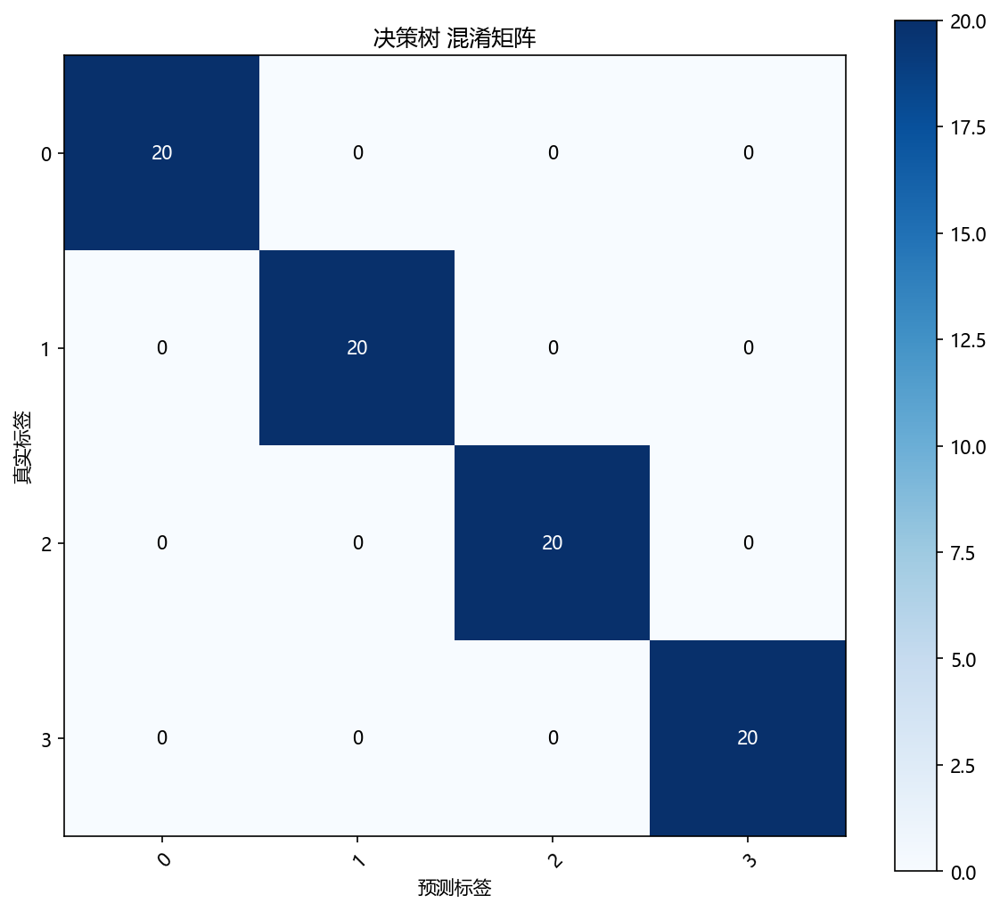
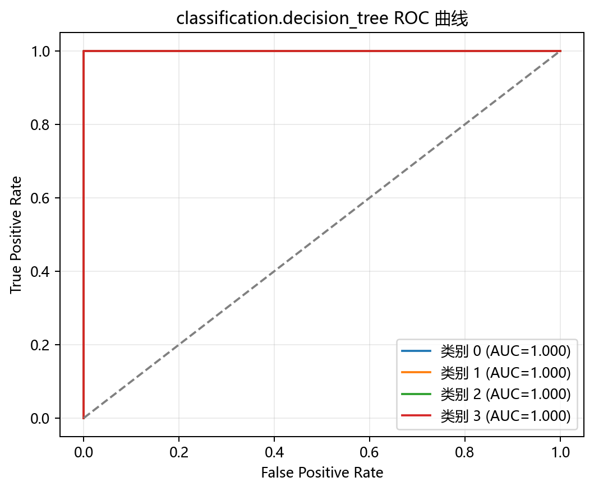
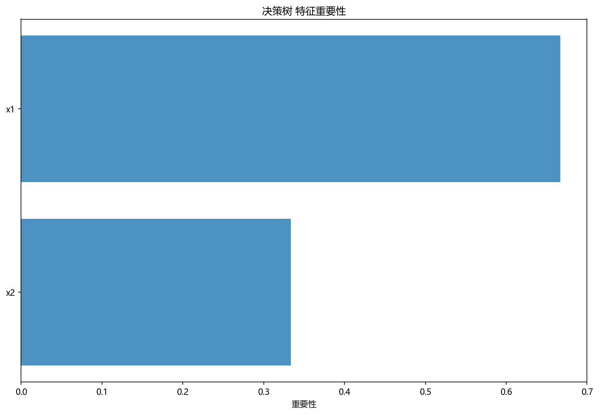

# 评估与诊断

> 对应代码：`pipelines/classification/decision_tree.py`、`result_visualization/confusion_matrix.py`、`result_visualization/roc_curve.py`、`result_visualization/feature_importance.py`、`result_visualization/decision_boundary.py`、`result_visualization/learning_curve.py`
>
> 相关对象：`y_pred`、`y_scores`、`plot_confusion_matrix(...)`、`plot_roc_curve(...)`、`plot_feature_importance(...)`、`plot_decision_boundary(...)`、`plot_learning_curve(...)`

## 本章目标

1. 明确当前仓库 Decision Tree 实现实际上是如何做结果诊断的。
2. 理解混淆矩阵、ROC 曲线、特征重要性图、PCA 决策边界图和学习曲线分别能说明什么。
3. 理解多分类 ROC、特征重要性和二维决策边界图的展示边界。

## 重点方法与概念速览

| 名称 | 类型 | 作用 |
|---|---|---|
| `y_pred` | 预测结果 | 测试集类别输出 |
| `y_scores` | 预测概率 | 测试集各类别概率输出 |
| `plot_confusion_matrix(...)` | 函数 | 绘制预测标签与真实标签的混淆矩阵 |
| `plot_roc_curve(...)` | 函数 | 绘制多分类 One-vs-Rest ROC 曲线 |
| `plot_feature_importance(...)` | 函数 | 绘制树模型特征重要性图 |
| `plot_decision_boundary(...)` | 函数 | 绘制 PCA 2D 空间下的分类边界 |
| `plot_learning_curve(...)` | 函数 | 绘制训练/验证得分随样本量变化的曲线 |

## 1. 当前仓库的评估入口

当前 Decision Tree 流水线里的主要结果诊断手段有五个：

1. 混淆矩阵
2. ROC 曲线
3. 特征重要性图
4. PCA 2D 决策边界图
5. 学习曲线

### 示例代码

```python
y_pred = model.predict(X_test.values)
y_scores = model.predict_proba(X_test.values)

plot_confusion_matrix(...)
plot_roc_curve(...)
plot_feature_importance(...)
plot_decision_boundary(...)
plot_learning_curve(...)
```

### 理解重点

- 当前实现没有把所有诊断都压缩成一个数字，而是同时提供结果矩阵、概率曲线、重要性图、边界图和曲线图五类视角。
- 对教学型仓库来说，这样的设计比只打印单个分数更利于理解模型行为。
- 五种可视化分别回答的是不同问题，不能互相替代。

## 2. 混淆矩阵能观察什么

### 参数速览（本节）

适用函数：`plot_confusion_matrix(y_true, y_pred, ...)`

| 参数名 | 当前对象 | 说明 |
|---|---|---|
| `y_true` | `y_test` | 测试集真实标签 |
| `y_pred` | `model.predict(X_test.values)` | 测试集预测标签 |

### 理解重点

- 混淆矩阵最适合回答：模型把哪些类别分对了，哪些类别更容易互相混淆。
- 对当前 4 分类任务来说，它能直观看出各类别之间的误分类方向。
- 当前流水线没有显式打印 accuracy，但混淆矩阵已经能给出很强的误差结构信息。

## 3. ROC 曲线能观察什么

### 参数速览（本节）

适用函数：`plot_roc_curve(y_test, y_scores, ...)`

| 参数名 | 当前对象 | 说明 |
|---|---|---|
| `y_true` | `y_test` | 测试集真实标签 |
| `y_scores` | `model.predict_proba(X_test.values)` | 测试集各类别概率输出 |

### 理解重点

- 当前任务是多分类，因此 ROC 曲线会按 One-vs-Rest 方式分别计算每个类别的曲线。
- 这也是为什么当前分册里必须强调 `predict_proba(...)` 的作用，因为没有概率输出就无法形成多分类 ROC 曲线。
- 文档要明确：这里不是只有一条全局 ROC 曲线，而是每个类别各有一条对其余类别的区分曲线。

## 4. 特征重要性能观察什么

### 参数速览（本节）

适用函数：`plot_feature_importance(model, feature_names, ...)`

| 参数名 | 当前对象 | 说明 |
|---|---|---|
| `model` | 主决策树模型 | 提供 `feature_importances_` |
| `feature_names` | `list(X.columns)` | 用于图中显示特征名 |

### 理解重点

- 特征重要性图最适合回答：当前树在划分过程中，更依赖哪些特征。
- 这让决策树比很多模型更容易解释，也正是本分册评估的重要特色之一。
- 但特征重要性表示的是“当前树分裂时的贡献”，不等于严格因果关系。

## 5. PCA 2D 决策边界图能观察什么

### 参数速览（本节）

适用函数：`plot_decision_boundary(model_2d, X_2d, y.values, ...)`

| 参数名 | 当前对象 | 说明 |
|---|---|---|
| `model_2d` | 单独训练的二维决策树模型 | 用于可视化边界 |
| `X_2d` | `PCA` 降到二维后的特征 | 用于画图 |
| `y.values` | 全量标签数组 | 用于点着色 |

### 理解重点

- 这张图最适合回答：当前树模型在二维投影视角下，形成了怎样的区域切分。
- 它能帮助读者直观理解决策树边界通常呈现块状、分段式区域，而不是平滑曲线。
- 但它只是 PCA 投影空间中的近似展示，不是原始高维划分结构的完整真相。

## 6. 学习曲线能观察什么

### 参数速览（本节）

适用函数：`plot_learning_curve(model, X_train.values, y_train.values, scoring='accuracy', ...)`

| 参数名 | 当前对象 | 说明 |
|---|---|---|
| `model` | `DecisionTreeClassifier(max_depth=6, random_state=42)` | 用于曲线诊断的新模型实例 |
| `X_train.values` | 原始训练特征 | 学习曲线输入特征 |
| `y_train.values` | 训练标签 | 学习曲线输入标签 |
| `scoring` | `accuracy` | 当前评分类指标 |

### 理解重点

- 学习曲线最适合回答：当前模型是否随着训练样本数增加而继续改善。
- 训练得分与验证得分之间的距离，也能帮助判断是否存在欠拟合或过拟合倾向。
- 对决策树来说，这张图尤其有助于观察树深受限时的泛化行为。

## 7. 当前实现中尚未纳入但常见的分类指标

在一般分类任务中，还常见以下指标：

- 准确率（Accuracy）
- 精确率（Precision）
- 召回率（Recall）
- F1 分数

### 理解重点

- 当前仓库并没有在 Decision Tree 流水线中显式打印这些指标。
- 文档可以提到它们是常见扩展方向，但不能写成“当前源码已经在计算”。
- 现阶段最准确的表述是：当前实现以混淆矩阵、ROC 曲线、特征重要性图、决策边界图和学习曲线为主要诊断手段。

## 评估图表







## 常见坑

1. 把 `predict(...)` 和 `predict_proba(...)` 的用途混为一谈。
2. 把特征重要性图误解为严格因果解释。
3. 把 PCA 决策边界图误认为原始特征空间划分结构的完整表达。
4. 把当前仓库未实现的 accuracy、precision、recall、f1 写成现有流程的一部分。

## 小结

- 当前仓库对 Decision Tree 的评估方式很明确：结果矩阵上看混淆矩阵，概率区分能力上看 ROC 曲线，解释性上看特征重要性图，边界形状上看 PCA 决策边界图，训练行为上看学习曲线。
- 五者组合起来，比单一指标更能解释当前分类树模型的实际表现。
- 对当前二维多分类 blob 教学数据而言，这样的评估设计兼顾了直观性、解释性与工程可读性。
