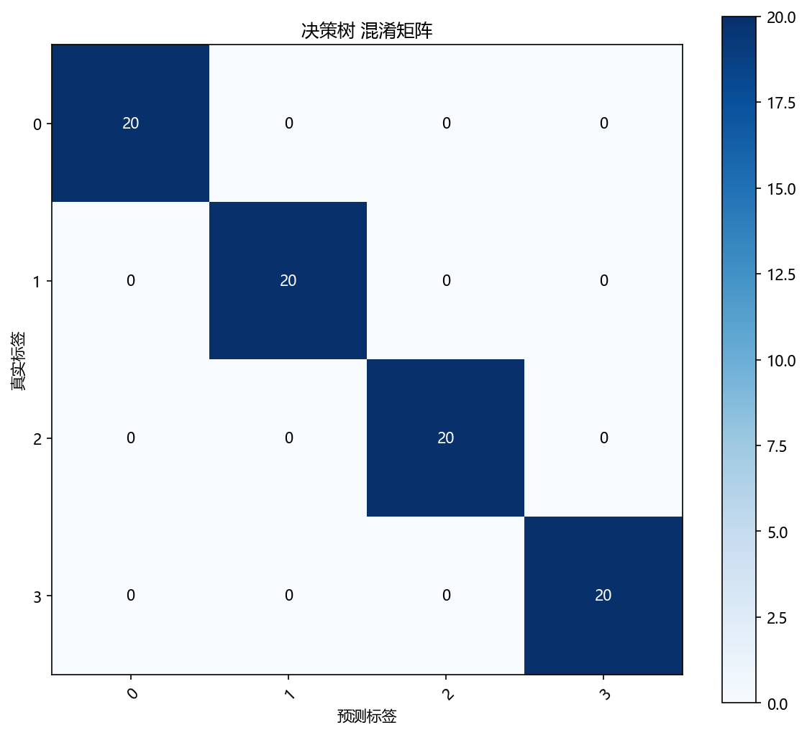
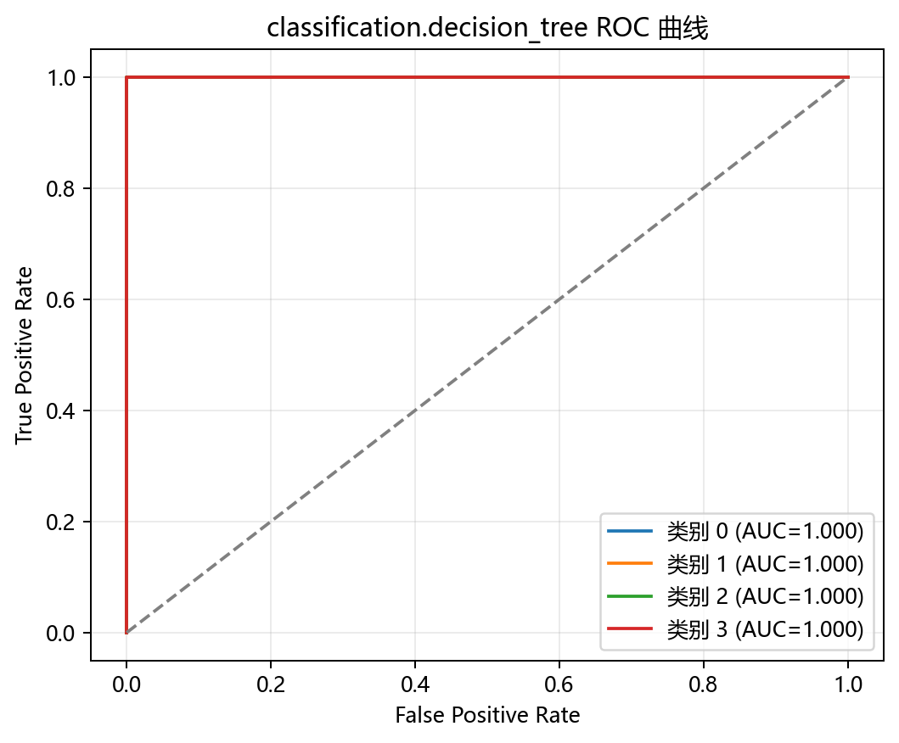
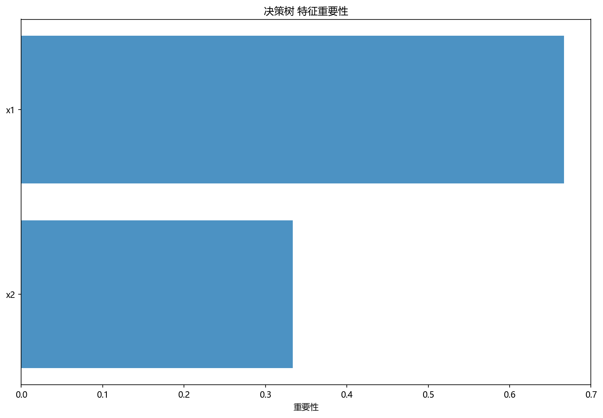

# 评估与诊断


## 本章目标

1. 明确当前仓库 Decision Tree 实现实际上是如何做结果诊断的。
2. 理解混淆矩阵、ROC 曲线、特征重要性图、PCA 决策边界图和学习曲线分别能说明什么。
3. 理解多分类 ROC、特征重要性和二维决策边界图的展示边界。

## 重点方法与概念速览

| 名称 | 类型 | 作用 |
|---|---|---|
| `y_pred` | 预测结果 | 测试集类别输出 |
| `y_scores` | 预测概率 | 测试集各类别概率输出 |
| `plot_confusion_matrix(...)` | 函数 | 绘制预测标签与真实标签的混淆矩阵 |
| `plot_roc_curve(...)` | 函数 | 绘制多分类 One-vs-Rest ROC 曲线 |
| `plot_feature_importance(...)` | 函数 | 绘制树模型特征重要性图 |
| `plot_decision_boundary(...)` | 函数 | 绘制 PCA 2D 空间下的分类边界 |
| `plot_learning_curve(...)` | 函数 | 绘制训练/验证得分随样本量变化的曲线 |

## 1. 当前仓库的评估入口

当前 Decision Tree 流水线里的主要结果诊断手段有五个：

1. 混淆矩阵
2. ROC 曲线
3. 特征重要性图
4. PCA 2D 决策边界图
5. 学习曲线

### 示例代码

```python
y_pred = model.predict(X_test.values)
y_scores = model.predict_proba(X_test.values)

plot_confusion_matrix(...)
plot_roc_curve(...)
plot_feature_importance(...)
plot_decision_boundary(...)
plot_learning_curve(...)
```

### 理解重点

- 当前实现没有把所有诊断都压缩成一个数字，而是同时提供结果矩阵、概率曲线、重要性图、边界图和曲线图五类视角。
- 五种可视化分别回答的是不同问题：
  - 混淆矩阵 → 分对了吗？分错了哪几类？
  - ROC 曲线 → 概率区分能力如何？
  - 特征重要性 → 树更依赖哪些特征？
  - 决策边界图 → 树的划分区域长什么样？
  - 学习曲线 → 更多训练数据有无帮助？

## 2. 混淆矩阵能观察什么

混淆矩阵 $\mathbf{C}$ 是一个 $K \times K$ 矩阵，其中 $C_{ij}$ 表示真实类别为 $i$、预测类别为 $j$ 的样本数。数学上：

$$
C_{ij} = \sum_{k=1}^{n_{\text{test}}} \mathbb{1}[y_k = i \land \hat{y}_k = j]
$$

从混淆矩阵可导出常用指标：准确率 $\text{Accuracy} = \frac{\sum_i C_{ii}}{\sum_{i,j} C_{ij}}$，各类别精确率 $\text{Precision}_i = \frac{C_{ii}}{\sum_j C_{ji}}$，召回率 $\text{Recall}_i = \frac{C_{ii}}{\sum_j C_{ij}}$。

### 参数速览

适用函数：`plot_confusion_matrix(y_true, y_pred, ...)`

| 参数名 | 类型 | 说明 | 示例取值 |
|---|---|---|---|
| `y_true` | `array_like`，形状 `(n_samples,)` | 测试集真实标签，取值 $y_i \in \{0, 1, \dots, K-1\}$，$K=4$ | `y_test` |
| `y_pred` | `array_like`，形状 `(n_samples,)` | 模型预测标签，取值 $\hat{y}_i \in \{0, 1, \dots, K-1\}$，来自 `model.predict(X_test.values)` | `y_pred` |
| `class_names` | `list[str]` | 类别显示名列表，长度 = $K$。默认为 `None`，使用类别标签自身 | `['0', '1', '2', '3']` |
| `normalize` | `bool` 或 `str` | 归一化方式：`True`/`'true'` 按行（真实类别），`'pred'` 按列（预测类别），`'all'` 按全体。默认为 `False`（绝对数量） | `True`、`'true'` |

### 示例代码

```python
plot_confusion_matrix(
    y_true=y_test,
    y_pred=y_pred,
    title="决策树 混淆矩阵",
    dataset_name=DATASET,
    model_name=MODEL,
)
```

### 理解重点

- 混淆矩阵最适合回答：模型把哪些类别分对了，哪些类别更容易互相混淆。
- 对当前 4 分类任务来说，对角线元素 $C_{ii}$ 就是各类别的正确预测数。
- 当前流水线没有显式打印 accuracy，但混淆矩阵已能给出误差结构信息。

## 3. ROC 曲线能观察什么

ROC（Receiver Operating Characteristic）曲线绘制真正例率（TPR）随假正例率（FPR）变化的轨迹。多分类场景下按 One-vs-Rest 方式为每个类别分别计算：

$$
\text{TPR}_k = \frac{\text{TP}_k}{\text{TP}_k + \text{FN}_k}, \quad
\text{FPR}_k = \frac{\text{FP}_k}{\text{FP}_k + \text{TN}_k}
$$

AUC（Area Under Curve）是 ROC 曲线下面积，$\text{AUC} \in [0.5, 1.0]$，越接近 1 表示区分能力越强。

### 参数速览

适用函数：`plot_roc_curve(y_test, y_scores, ...)`

| 参数名 | 类型 | 说明 | 示例取值 |
|---|---|---|---|
| `y_true` | `array_like`，形状 `(n_samples,)` | 测试集真实标签，取值 $y_i \in \{0, 1, \dots, K-1\}$ | `y_test` |
| `y_scores` | `array_like`，形状 `(n_samples, n_classes)` | 各类别概率估计，来自 `model.predict_proba(X_test.values)`。第 $k$ 列作为类别 $k$ 的 One-vs-Rest 得分 | `y_scores` |
| `class_names` | `list[str]` | 类别显示名列表，长度 = $K$。用于图例标注每条 ROC 曲线对应的类别 | `['0', '1', '2', '3']` |
| `multi_class` | `str` | 多分类策略：`"ovr"`（One-vs-Rest，当前使用），`"ovo"`（One-vs-One）。默认为 `"ovr"` | `"ovr"`、`"ovo"` |

### 示例代码

```python
plot_roc_curve(
    y_test,
    y_scores,
    class_names=["0", "1", "2", "3"],
    title="决策树 ROC 曲线",
    dataset_name=DATASET,
    model_name=MODEL,
)
```

### 理解重点

- 当前任务是多分类，因此 ROC 曲线按 One-vs-Rest 方式分别计算每个类别的 TPR/FPR。
- 这也是为什么需要强调 `predict_proba(...)`——没有概率输出就无法生成连续变化阈值的 ROC 曲线。
- 文档要明确：这里不是一条全局 ROC 曲线，而是每个类别各有一条对其余类别的区分曲线（共 4 条）。

## 4. 特征重要性能观察什么

特征重要性 $\text{imp}_j$ 反映特征 $j$ 在树分裂过程中带来的不纯度下降贡献：

$$
\text{imp}_j = \frac{\sum_{t \in T_j} \Delta I(t) \cdot n_t}{\sum_{t \in T} \Delta I(t) \cdot n_t}
$$

其中 $\Delta I(t) = I(t) - \sum_{c \in \text{children}(t)} \frac{n_c}{n_t} I(c)$ 是节点 $t$ 的不纯度下降量（基于 `criterion` 度量），$n_t$ 是该节点样本数，$T_j$ 是使用特征 $j$ 分裂的所有节点集合。所有特征重要性之和为 1。

### 参数速览

适用函数：`plot_feature_importance(model, feature_names, ...)`

| 参数名 | 类型 | 说明 | 示例取值 |
|---|---|---|---|
| `model` | `DecisionTreeClassifier` | 已训练的主决策树模型，提供 `feature_importances_` 属性。值来自训练时累积的不纯度下降加权和 | `model` |
| `feature_names` | `list[str]` | 特征名列表，长度 = `n_features_in_`。用于图中标注横轴标签 | `['x1', 'x2']` |
| `title` | `str` | 图表标题 | `"决策树 特征重要性"` |
| `dataset_name` | `str` | 数据集名称，用于输出文件命名 | `DATASET` |
| `model_name` | `str` | 模型名称，用于输出文件命名 | `MODEL` |

### 示例代码

```python
plot_feature_importance(
    model,
    feature_names=feature_names,
    title="决策树 特征重要性",
    dataset_name=DATASET,
    model_name=MODEL,
)
```

### 理解重点

- 特征重要性图回答：当前树在划分过程中，更依赖哪些特征。
- 但需要注意：特征重要性表示的是"当前树分裂时的贡献"，不等于严格因果关系。
- 对当前二维 blob 数据（`x1`、`x2` 各向同性生成），两个特征的重要性通常接近，差异不大。

## 5. PCA 2D 决策边界图能观察什么

决策边界图在二维平面上以不同颜色填充不同预测区域，直观展示树模型的区域切分形状。

### 参数速览

适用函数：`plot_decision_boundary(model_2d, X_2d, y.values, ...)`

| 参数名 | 类型 | 说明 | 示例取值 |
|---|---|---|---|
| `model_2d` | `DecisionTreeClassifier` | 在 PCA 二维空间上单独训练的决策树模型。`max_depth=6`，与主模型共享相同超参数，仅在特征空间维度上不同 | `model_2d` |
| `X_2d` | `ndarray`，形状 `(n_samples, 2)` | PCA 投影后的二维特征，用于生成网格点预测和散点着色。列分别为 PC1、PC2 | `X_2d` |
| `y` | `array_like`，形状 `(n_samples,)` | 全量标签数组，用于散点的真实类别着色 | `y.values` |
| `title` | `str` | 图表标题 | `"决策树 决策边界 (PCA 2D)"` |

### 示例代码

```python
plot_decision_boundary(
    model_2d,
    X_2d,
    y.values,
    title="决策树 决策边界 (PCA 2D)",
    dataset_name=DATASET,
    model_name=MODEL,
)
```

### 理解重点

- 这张图最适合直观感受决策树的轴对齐切分——边界通常呈现垂直线段和平行线段的组合（如 $x_1 \leq 3.2$），而不是平滑曲线或对角线。
- 但它只是 PCA 投影空间中的近似展示，不是原始高维划分结构的完整真相。
- 当原始特征维度 $d > 2$ 时，PCA 投影会丢失部分划分信息。

## 6. 学习曲线能观察什么

学习曲线绘制训练得分和交叉验证得分随训练样本数增加的变化：

- 训练得分高、验证得分低且差距大 → 过拟合倾向
- 训练得分和验证得分都低且接近 → 欠拟合倾向
- 验证得分持续上升且未收敛 → 更多数据可能有帮助

### 参数速览

适用函数：`plot_learning_curve(estimator, X, y, ...)`

| 参数名 | 类型 | 说明 | 示例取值 |
|---|---|---|---|
| `estimator` | `estimator` | 新创建的模型实例。传入 `DecisionTreeClassifier(max_depth=6, random_state=42)`，内部克隆后逐段训练。使用新实例是为了避免干扰主模型 | `DecisionTreeClassifier(max_depth=6, random_state=42)` |
| `X` | `array_like`，形状 `(n_samples, n_features)` | 训练特征矩阵。学习曲线内部按不同比例（如 10%, 20%, ..., 100%）逐步增加样本量 | `X_train.values` |
| `y` | `array_like`，形状 `(n_samples,)` | 训练标签向量 | `y_train.values` |
| `scoring` | `str` | 评分类指标。当前取 `"accuracy"`，即 $\frac{\sum \mathbb{1}[y_i = \hat{y}_i]}{n}$。`"f1_macro"` 为各类别 F1 的算术平均 | `"accuracy"`、`"f1_macro"` |
| `cv` | `int` | 交叉验证折数。默认 `5`，每次对当前采样量做 5 折 CV 计算验证得分误差带 | `5`、`10` |
| `train_sizes` | `array_like` | 训练样本量的递增序列。默认为 `np.linspace(0.1, 1.0, 5)` | `[0.1, 0.33, 0.55, 0.78, 1.0]` |
| `n_jobs` | `int` | 并行作业数。`-1` 使用全部核心。默认为 `None`（单核） | `-1`、`1` |

### 示例代码

```python
plot_learning_curve(
    DecisionTreeClassifier(max_depth=6, random_state=42),
    X_train.values,
    y_train.values,
    title="决策树 学习曲线",
    dataset_name=DATASET,
    model_name=MODEL,
)
```

### 理解重点

- 对决策树而言，学习曲线尤其有助于观察 `max_depth=6` 受限时模型的泛化行为。
- 如果训练得分很高（接近 1.0）但验证得分明显偏低，说明当前树深仍可能导致过拟合。
- 验证得分误差带（CV 标准差）也能提示模型在不同数据划分下的稳定性。

## 7. 当前实现中尚未纳入但常见的分类指标

在一般分类任务中，还常见以下指标，数学定义如下：

| 指标 | 公式 | 说明 |
|---|---|---|
| 准确率（Accuracy） | $\frac{\sum_i C_{ii}}{\sum_{i,j} C_{ij}}$ | 整体正确率，各类别样本数不均衡时可能误导 |
| 精确率（Precision） | $\frac{C_{ii}}{\sum_j C_{ji}}$ | 预测为类别 $i$ 的样本中有多少确实是 $i$ |
| 召回率（Recall） | $\frac{C_{ii}}{\sum_j C_{ij}}$ | 真实类别 $i$ 的样本中有多少被正确找出 |
| F1 分数 | $2 \cdot \frac{\text{Precision} \cdot \text{Recall}}{\text{Precision} + \text{Recall}}$ | Precision 和 Recall 的调和平均 |

### 理解重点

- 当前仓库没有在 Decision Tree 流水线中显式打印这些指标，而是通过混淆矩阵隐式呈现。
- 文档可以提到它们是常见扩展方向，但不能写成"当前源码已经在单独计算"。

## 评估图表







## 常见坑

1. 把 `predict(...)` 和 `predict_proba(...)` 的用途混为一谈——前者用于混淆矩阵，后者用于 ROC。
2. 把特征重要性图误解为严格因果解释——它反映的是树的分裂选择，不是特征的真实因果贡献。
3. 把 PCA 决策边界图误认为原始特征空间划分结构的完整表达——它只是二维投影近似。
4. 把当前仓库未实现的 accuracy、precision、recall、f1 写成现有流程的一部分。

## 小结

- 当前仓库对 Decision Tree 的评估方式：混淆矩阵看错误分布，ROC 曲线看概率区分能力，特征重要性图看解释性，PCA 决策边界图看边界形状，学习曲线看训练行为。
- 核心数学：混淆矩阵 $C_{ij} = \sum \mathbb{1}[y_k=i \land \hat{y}_k=j]$，ROC/TPR/FPR 通过阈值扫描得到，特征重要性基于 $\sum \Delta I(t) \cdot n_t$。
- 五者组合起来，比单一指标更能解释当前分类树模型的实际表现。
