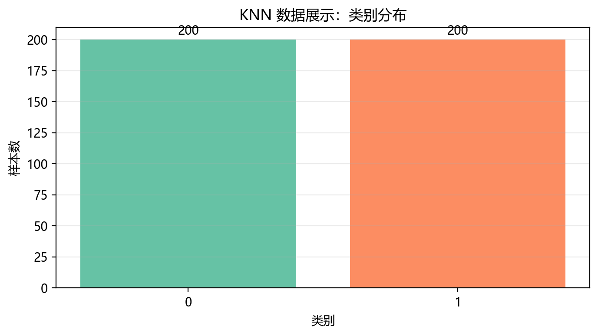
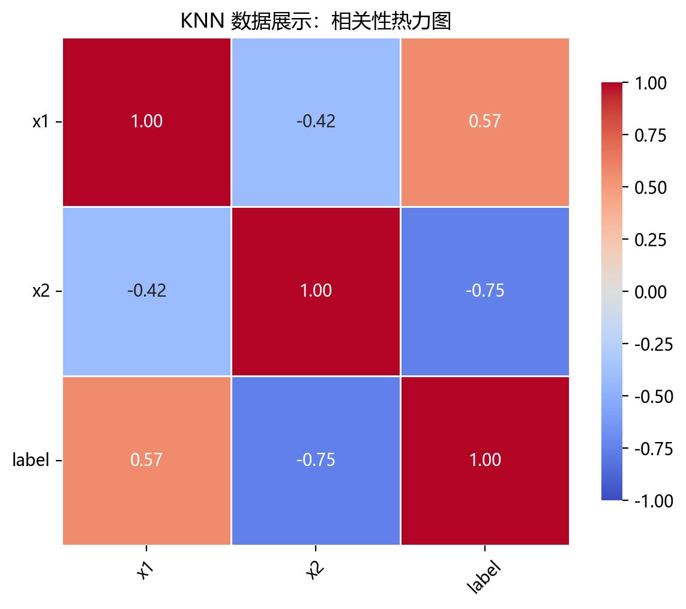
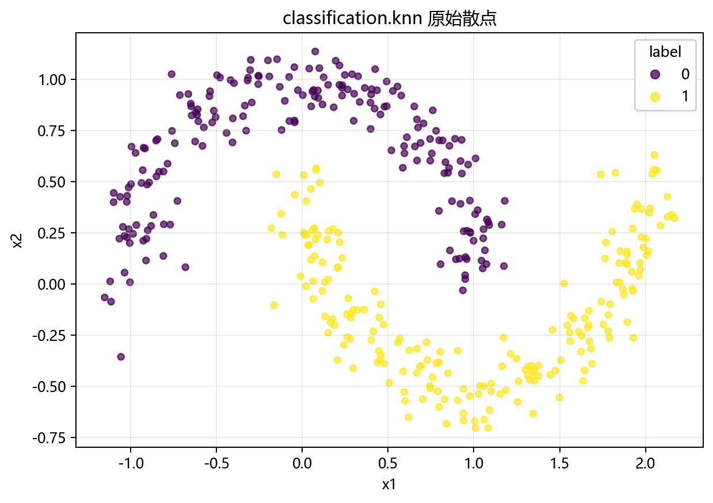

# 数据构成

> 对应代码：`data_generation/classification.py`、`data_generation/__init__.py`、`pipelines/classification/knn.py`
>
> 相关对象：`ClassificationData.knn()`、`knn_data`

## 本章目标

1. 明确本仓库 KNN 数据来自 `ClassificationData.knn()` 的双月牙生成逻辑。
2. 明确特征列与标签列在当前流水线中的拆分方式。
3. 明确训练集/测试集切分与标准化的顺序和边界。

## 重点方法与概念速览

| 名称 | 类型 | 作用 |
|---|---|---|
| `ClassificationData.knn()` | 方法 | 生成 KNN 使用的非线性二分类数据 |
| `make_moons(...)` | 函数 | scikit-learn 提供的双月牙数据生成器 |
| `knn_data` | 变量 | 在 `data_generation/__init__.py` 中导出的数据对象 |
| `label` | 列名 | 当前流水线中的监督分类标签 |
| `StandardScaler` | 类 | 对特征做标准化，保证距离度量合理 |

## 1. 本仓库数据入口

- 数据变量：`data_generation/__init__.py` 中导出的 `knn_data`
- 生成来源：`data_generation/classification.py` 中的 `ClassificationData.knn()`
- 流水线使用：`pipelines/classification/knn.py` 中的 `data = knn_data.copy()`

### 理解重点

- `knn_data` 在导入时就已经生成完成，因此流水线里直接 `.copy()` 使用即可。
- 用 `.copy()` 的目的，是避免后续处理意外修改原始数据对象。
- 当前数据是为 KNN 教学场景专门构造的，因此与局部邻域分类思路高度匹配。

## 2. 数据生成函数 `ClassificationData.knn()`

### 参数速览（本节）

适用 API（分项）：

1. `ClassificationData.knn()`
2. `make_moons(n_samples=self.n_samples, noise=self.knn_noise, random_state=self.random_state)`

| 参数名 | 本例取值 | 说明 |
|---|---|---|
| `n_samples` | `400` | 样本数 |
| `noise` | `0.1` | 月牙边界噪声强度 |
| `random_state` | `42` | 随机种子，保证可复现 |
| 返回值 | `DataFrame` | 含 `x1`、`x2` 与 `label` 的数据表 |

### 示例代码

```python
X, y = make_moons(
    n_samples=self.n_samples,
    noise=self.knn_noise,
    random_state=self.random_state,
)
columns = [f"x{i + 1}" for i in range(2)]
data = DataFrame(X, columns=columns)
data["label"] = y
```

### 理解重点

- 当前数据是双月牙二分类结构，天然带有非线性边界。
- 这种数据很适合展示 KNN 的局部感知能力，因为“周围邻居是谁”比“全局一条直线怎么切”更重要。
- 这也是当前分册和逻辑回归分册数据选择明显不同的原因。

## 3. 特征列与标签列

当前数据表结构如下：

- 特征列：`x1`、`x2`
- 标签列：`label`

### 示例代码

```python
X = data.drop(columns=["label"])
y = data["label"]
```

### 理解重点

- `label` 是监督训练标签，会真实参与 `model.fit(X_train, y_train)`。
- 当前流水线把特征和标签明确拆开，这是后续切分、标准化和训练的前提。
- 与聚类分册不同，这里标签不是只用于对照，而是训练过程的一部分。

## 4. 切分与标准化

### 参数速览（本节）

适用 API（分项）：

1. `train_test_split(X, y, test_size=0.2, random_state=42, stratify=y)`
2. `StandardScaler().fit_transform(X_train)`
3. `StandardScaler().transform(X_test)`

| 参数名 | 本例取值 | 说明 |
|---|---|---|
| `test_size` | `0.2` | 测试集占比 |
| `random_state` | `42` | 保证可复现划分 |
| `stratify` | `y` | 保持训练集和测试集的类别比例一致 |
| `X_train` | 训练特征 | 只在训练集上拟合标准化统计量 |
| `X_test` | 测试特征 | 使用训练集统计量做变换 |

### 示例代码

```python
X_train, X_test, y_train, y_test = train_test_split(
    X, y, test_size=0.2, random_state=42, stratify=y
)

scaler = StandardScaler()
X_train_s = scaler.fit_transform(X_train)
X_test_s = scaler.transform(X_test)
```

### 理解重点

- 标准化必须发生在切分之后，否则会造成数据泄露。
- 当前流水线显式使用 `stratify=y`，说明作者希望训练集和测试集在类别比例上保持稳定。
- 对 KNN 来说，标准化尤其关键，因为距离关系会直接决定邻居集合和最终投票结果。

## 数据可视化







## 常见坑

1. 忘记把 `label` 从特征表中剥离出来。
2. 在切分之前就对全量数据做标准化。
3. 忽略 `stratify=y`，导致训练集和测试集类别比例不稳定。
4. 只看到 KNN 是“简单模型”，却忽略当前双月牙数据正好需要局部非线性判别能力。

## 小结

- 当前 KNN 数据来自 `ClassificationData.knn()`，底层使用的是 `make_moons(...)`。
- 数据表结构清晰：`x1`、`x2` 是特征，`label` 是监督分类标签。
- 读懂数据来源、切分方式和标准化顺序，是理解后续训练与评估章节的前提。
