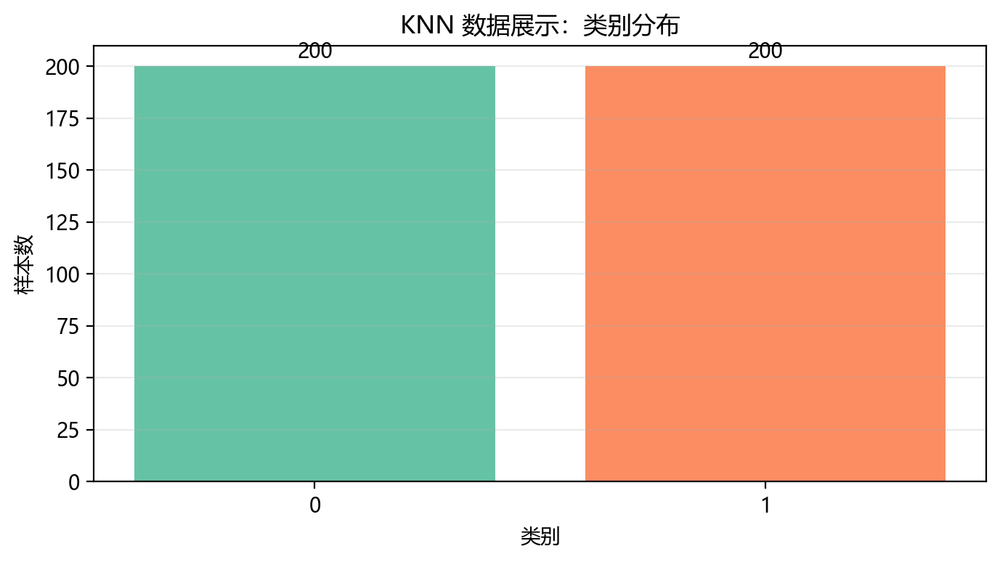
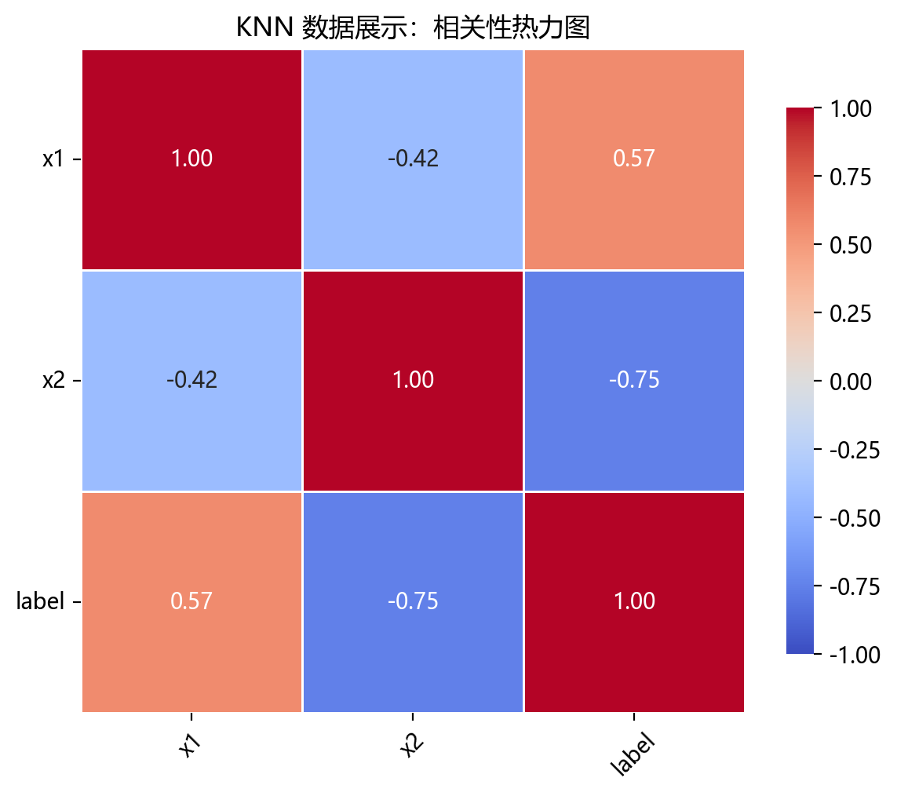
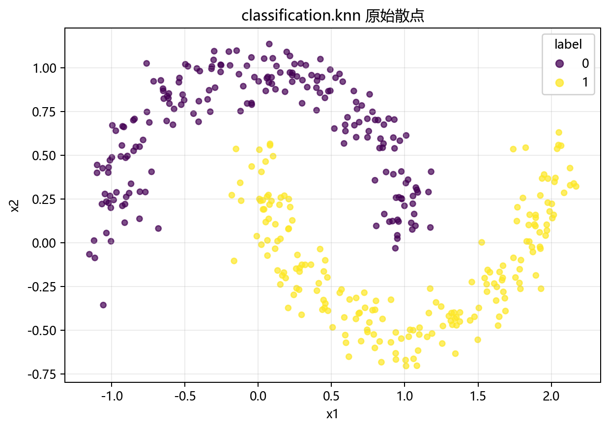

# 数据构成

## 本章目标

1. 明确本仓库 KNN 数据来自 `ClassificationData.knn()` 的双月牙生成逻辑。
2. 明确 `make_moons` 各参数的数据含义与当前取值。
3. 明确训练集/测试集切分与标准化的顺序和边界。

## 重点方法与概念速览

| 名称 | 类型 | 作用 |
|---|---|---|
| `ClassificationData.knn()` | 方法 | 生成 KNN 使用的非线性二分类双月牙数据 |
| `make_moons(...)` | 函数 | scikit-learn 提供的双月牙数据生成器，两个半月形各为一个类别 |
| `knn_data` | 变量 | 在 `data_generation/__init__.py` 中导出的数据对象 |
| `label` | 列名 | 当前流水线中的监督分类标签，取值 $\{0, 1\}$ |
| `StandardScaler` | 类 | 对特征做标准化，保证距离度量中的各维度贡献均衡 |

## 1. 本仓库数据入口

- 数据变量：`data_generation/__init__.py` 中导出的 `knn_data`
- 生成来源：`data_generation/classification.py` 中的 `ClassificationData.knn()`
- 流水线使用：`pipelines/classification/knn.py` 中的 `data = knn_data.copy()`

### 理解重点

- `knn_data` 在导入时就已经生成完成，因此流水线里直接 `.copy()` 使用即可。
- 用 `.copy()` 的目的是避免后续处理意外修改原始数据对象。
- 当前数据是为 KNN 教学场景专门构造的双月牙二分类数据，与局部邻域分类思路高度匹配。

## 2. 数据生成函数 `ClassificationData.knn()`

底层调用 `sklearn.datasets.make_moons`，生成两个交错半月形的二分类数据。

### 参数速览

适用函数：`sklearn.datasets.make_moons`

| 参数名 | 类型 | 说明 | 示例取值 |
|---|---|---|---|
| `n_samples` | `int` 或 `tuple[int, int]` | 总样本数 $N$。当前取 `400`，每个类别约 200 个样本（默认各半）。若传入元组 `(n0, n1)` 可分别指定两个类别的样本数。默认为 `100` | `100`、`400`、`(150, 250)` |
| `shuffle` | `bool` | 是否打乱样本顺序。默认为 `True` | `True` |
| `noise` | `float` | 添加到数据中的高斯噪声标准差 $\sigma_{\text{noise}}$。$\sigma_{\text{noise}} = 0$ 为完美半月形，值越大两类边界越模糊。当前取 `0.1` | `0.0`、`0.1`、`0.3` |
| `random_state` | `int` | 随机种子，保证每次生成相同数据。当前取 `42` | `42` |

### 示例代码

```python
from sklearn.datasets import make_moons
from pandas import DataFrame

X, y = make_moons(n_samples=400, noise=0.1, random_state=42)
# X.shape = (400, 2), y 取值 {0, 1}
columns = [f"x{i + 1}" for i in range(2)]
data = DataFrame(X, columns=columns)
data["label"] = y
```

### 理解重点

- `make_moons` 生成的两个半月形天然带有非线性边界——全局一条直线无法干净分开两个类别。
- 这种数据很适合展示 KNN 的局部感知能力，因为"周围邻居是谁"比"全局边界怎么切"更重要。
- `noise=0.1` 在半月形边界上添加少量高斯噪声，使数据更接近真实场景，同时不会完全破坏半月形结构。
- 这也是当前分册和逻辑回归分册数据选择明显不同的原因——逻辑回归用 blob 数据（近线性可分），KNN 用双月牙数据（非线性）。

## 3. 特征列与标签列

当前数据表结构：

- 特征列：`x1`、`x2`（二维实数特征，来自半月形的 $x$、$y$ 坐标）
- 标签列：`label`（二分类标签，取值为 $0$ 或 $1$）

### 示例代码

```python
X = data.drop(columns=["label"])
y = data["label"]
```

### 理解重点

- `label` 是监督训练标签，会真实参与 `model.fit(X_train, y_train)`。
- 当前任务为二分类，因此标签只有 0 和 1 两个取值。
- 与无监督聚类分册不同，这里的标签不是只用于对照，而是训练过程的一部分。

## 4. 切分与标准化的顺序

KNN 流水线中的标准化必须在切分之后执行，否则会造成数据泄露——测试集的信息会通过标准化统计量泄露到训练过程中。

### 参数速览

适用函数：`train_test_split`、`StandardScaler`

| 参数名 | 类型 | 说明 | 示例取值 |
|---|---|---|---|
| `test_size` | `float` | 测试集占比。当前取 `0.2`，即 80 个测试样本（总样本 400 × 20%） | `0.2`、`0.3` |
| `random_state` | `int` | 随机种子，保证每次切分结果一致。当前取 `42` | `42` |
| `stratify` | `array_like` | 按 `y` 的类别比例分层抽样。数学上保证 $\frac{n_{0,\text{train}}}{n_{0,\text{test}}} \approx \frac{N_{\text{train}}}{N_{\text{test}}}$，避免某一类别在测试集中意外过多或过少 | `y`、`None` |
| `scaler.fit_transform(X_train)` | 方法 | 在训练集上计算 $\mu_i, \sigma_i$ 并变换：$x_i' = (x_i - \mu_i) / \sigma_i$ | — |
| `scaler.transform(X_test)` | 方法 | 使用训练集的 $\mu_i, \sigma_i$ 变换测试集，不重新计算统计量 | — |

### 示例代码

```python
from sklearn.model_selection import train_test_split
from sklearn.preprocessing import StandardScaler

# 先切分
X_train, X_test, y_train, y_test = train_test_split(
    X, y, test_size=0.2, random_state=42, stratify=y
)

# 再标准化（仅在训练集上 fit）
scaler = StandardScaler()
X_train_s = scaler.fit_transform(X_train)
X_test_s = scaler.transform(X_test)
```

### 理解重点

- 对 KNN 来说，标准化尤其关键——距离关系直接决定邻居集合和最终投票结果。
- `fit_transform` 在训练集上同时完成统计量学习（$\mu_i, \sigma_i$）和数据变换。
- `transform` 在测试集上只用训练集学到的统计量，模拟真实部署场景（新数据来了只能用训练时的标准化参数）。

## 数据可视化







## 常见坑

1. 忘记把 `label` 从特征表中剥离出来。
2. 在切分之前就对全量数据做标准化——造成数据泄露，验证结果不可信。
3. 忽略 `stratify=y`，导致训练集和测试集类别比例不稳定——尤其在小样本或类别不均衡时影响更明显。
4. 只看到 KNN 是"简单模型"，却忽略双月牙数据正好需要局部非线性判别能力——如果用逻辑回归的 blob 数据来评估 KNN，就错过了它的核心优势。

## 小结

- 当前 KNN 数据来自 `ClassificationData.knn()`，底层使用 `make_moons(n_samples=400, noise=0.1)`。
- 数据表结构清晰：`x1`、`x2` 是二维特征，`label` 是二分类监督标签。
- KNN 完全依赖距离关系，因此标准化是必需的预处理步骤——且必须严格在切分后、训练前执行。
- 读懂数据来源、切分方式和标准化顺序，是理解后续训练与评估章节的前提。
