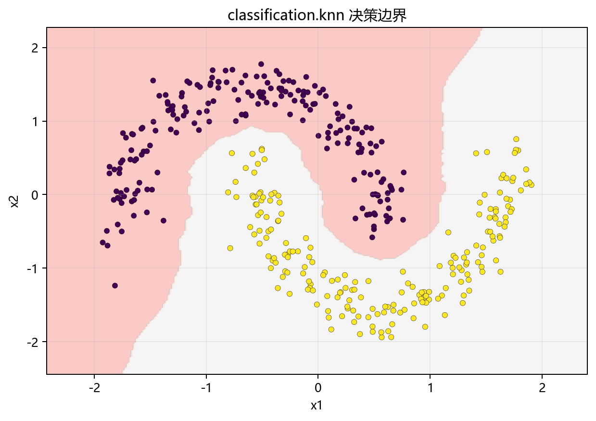

# 思路与直觉

## 本章目标

1. 用直观方式理解 KNN 到底在做什么——不看数学公式，先看"邻居"。
2. 理解为什么它在当前双月牙数据上更能体现局部分类优势。
3. 理解它与逻辑回归、决策树在思路上的关键差异。

## 重点方法与概念速览

| 名称 | 类型 | 作用 |
|---|---|---|
| 邻域投票 | 核心直觉 | 用最近样本的类别分布决定预测结果 |
| 局部结构 | 决策依据 | 当前点周围的几何关系比全局边界更重要——KNN 只关心"附近" |
| 非线性边界 | 决策形状 | 天然适应双月牙等弯曲边界，无需显式学习曲线参数 |
| $k$ 值 | 超参数 | 控制"看多大范围的邻居"——$k$ 小看近处，$k$ 大看远方 |
| 懒惰学习 | 算法范式 | 训练时只存数据，不做任何计算，预测时才"开工" |
| 逻辑回归 | 对比算法 | 学习全局线性边界 $\mathbf{w}^T\mathbf{x} + b = 0$ |
| 决策树 | 对比算法 | 递归轴对齐切分，形成分段常数区域 |

## 1. 为什么需要 KNN

对于一些分类问题，我们不一定非要先学一条全局边界。有时更自然的问题是：

一个新样本周围都是什么类别的点？

KNN 给出的思路是：

- 不急着先学参数——甚至不需要"训练"这个阶段。
- 先找到离当前样本最近的 $k$ 个训练样本。
- 再根据这些邻居的类别来投票决定结果。

### 理解重点

- KNN 是一种非常典型的局部方法——它的预测不依赖一个全局固定公式，而依赖当前点周围的数据分布。
- 这意味着同一个模型在不同区域可以表现出完全不同的决策行为，天然适应非线性边界。
- 这也是为什么它常被称为"懒惰学习"——把所有工作推迟到预测阶段才做。

## 2. 为什么当前仓库示例里它表现合理

当前 KNN 数据来自 `make_moons(n_samples=400, noise=0.1)`，特点是：

- 两个半月形交错排列
- 类别边界呈明显弧线弯曲
- 不存在一条直线能干净分开两类

### 理解重点

- 对这类数据，"局部邻域关系"比"全局一条直线怎么切"更重要。
- 如果附近大多数点都属于同一类，那么当前点也很可能属于这一类——KNN 直接利用了这个朴素直觉。
- 这也是为什么 KNN 在此类数据上通常优于逻辑回归。

## 3. 用"看周围邻居是谁"理解算法

可以把 KNN 理解成一个三步走的过程：

1. 找到待预测点附近最近的 $k$ 个训练样本
2. 统计这 $k$ 个样本分别属于哪一类
3. 投票：得票最多的类别就是预测结果

### 理解重点

- 这也是为什么 `n_neighbors` 在当前分册里最值得专门观察——$k$ 直接决定了"周围"的范围。
- 如果 $k=1$，只看最近的一个邻居，边界会非常曲折——每个训练点周围都形成一个独立区域。
- 如果 $k$ 很大，相当于看很远，边界会变得更平滑，但可能忽略重要的局部结构。
- 如果把 KNN 仅理解成"一个会分类的黑盒"，就会错过它最有辨识度的局部投票思想。

## 4. 为什么标准化会显著影响结果

KNN 通过距离来定义"谁是谁的邻居"。如果两个特征的量纲差很多——比如 `x1` 的范围是 $[0, 1000]$，`x2` 的范围是 $[0, 1]$——那么：

- $x_1$ 对距离 $d = \sqrt{(x_1 - y_1)^2 + (x_2 - y_2)^2}$ 的贡献是 $x_2$ 的 $10^6$ 倍
- 近邻关系几乎完全由 $x_1$ 决定，$x_2$ 形同虚设

### 理解重点

- 标准化 $x_i' = (x_i - \mu_i) / \sigma_i$ 让所有特征处于同一尺度，距离计算才公平。
- 这也是 KNN 比决策树更需要标准化的原因——决策树基于阈值切分（$x_1 \leq 3.2$），只关心相对顺序，不关心绝对量纲。

## 5. 与逻辑回归、决策树的直觉差异

三者的核心差异可以这样理解：

| 算法 | 决策边界 | 核心依据 | 是否需要标准化 | 适用场景 |
|---|---|---|---|---|
| LogisticRegression | 全局线性超平面 $\mathbf{w}^T\mathbf{x} + b = 0$ | 线性打分 + Sigmoid 概率映射 | 是（梯度优化敏感） | 近线性可分数据 |
| DecisionTreeClassifier | 局部轴对齐分段边界 | 不纯度下降 + 递归划分 | 否（阈值切分不依赖距离） | 区域化分布数据 |
| KNN | 局部非参数复杂边界 | 最近邻投票 | 是（距离度量必须） | 非线性局部结构数据 |

### 理解重点

- 逻辑回归在问：整张图上最好的一条全局边界是什么。
- 决策树在问：先切哪一刀最能让类别变纯。
- KNN 在问：当前点周围最近的 $k$ 个邻居大多是什么类别。
- 当前双月牙数据最适合把 KNN 作为局部分类基线来讲解——它的边界自然贴合数据的弧形结构。

## 可视化

## 常见坑

1. 只知道 KNN 很简单，却说不出它为什么适合当前双月牙数据——关键在"局部 > 全局"。
2. 把所有样本都当成同等重要，而忽略 KNN 只关心局部邻域——远离待预测点的样本对结果没有直接影响。
3. 只会机械调 $k$，却不理解它对应的是局部范围大小——$k$ 小看近处，$k$ 大看远方。
4. 忽略标准化，让近邻关系本身失真——量纲差异导致距离度量失去意义。

## 小结

- KNN 的直觉核心：局部邻域投票——先看附近是谁，再决定自己是谁。
- 当前仓库使用双月牙数据，正好体现了它在非线性局部结构上的优势——边界不需要是直线。
- 与逻辑回归（全局线性）和决策树（轴对齐分段）不同，KNN 的边界形状完全由数据局部密度决定，不需要显式学习任何参数。
- 标准化不是可选项，而是距离型模型的前提——不标准化就意味着"邻居"这个概念被量纲绑架。
