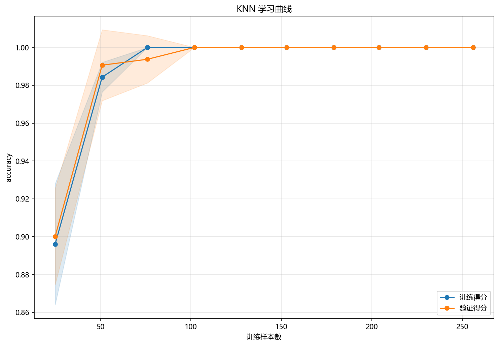

# 训练与预测

## 本章目标

1. 按源码顺序看清当前 KNN 流水线到底执行了哪些步骤。
2. 理解训练集/测试集拆分、标准化、训练、类别预测和概率预测之间的连接关系。
3. 理解主模型与二维可视化模型在当前实现中的职责差异。

## 重点方法与概念速览

| 名称 | 类型 | 作用 |
|---|---|---|
| `knn_data.copy()` | 方法 | 复制原始数据，避免修改源对象 |
| `train_test_split(...)` | 方法 | 划分训练集与测试集 |
| `StandardScaler` | 类 | 对训练/测试特征做一致的标准化处理 |
| `train_model(X_train_s, y_train)` | 函数 | 训练主 KNN 模型 |
| `model.predict(X_test_s)` | 方法 | 生成测试集类别预测结果 |
| `model.predict_proba(X_test_s)` | 方法 | 生成测试集类别概率输出 |
| `PCA(n_components=2)` | 类 | 为决策边界可视化构造二维表示 |
| `model_2d` | 模型 | 专门用于二维决策边界展示 |

## 1. 流水线从复制数据开始

当前流水线先复制 `knn_data`，再拆出 `X` 和 `y`。

### 示例代码

```python
data = knn_data.copy()
X = data.drop(columns=["label"])
y = data["label"]
```

### 理解重点

- 这和回归、决策树分册保持一致，体现了"原始数据只读、流程内部再处理"的习惯。
- 当前任务是监督二分类，因此 `y` 会真实参与训练和预测评估。

## 2. 先切分训练集与测试集

使用 `train_test_split` 将数据按 8:2 比例切分，并通过 `stratify=y` 保持类别分布一致。

### 参数速览

适用函数：`sklearn.model_selection.train_test_split`

| 参数名 | 类型 | 说明 | 示例取值 |
|---|---|---|---|
| `*arrays` | `array_like` | 待切分的数据序列。传入 `(X, y)` 分别对应切分。长度必须一致 | `X, y` |
| `test_size` | `float` 或 `int` | 测试集占比（`0.0`~`1.0`）或绝对样本数。当前取 `0.2` | `0.2`、`0.3` |
| `random_state` | `int` | 随机种子，保证每次切分结果一致。当前取 `42` | `42` |
| `shuffle` | `bool` | 切分前是否打乱数据。默认为 `True` | `True` |
| `stratify` | `array_like` | 按此数组类别比例分层抽样。传入 `y` 确保每类在训练集和测试集中的比例一致，$\frac{n_{k,\text{train}}}{n_{k,\text{test}}} \approx \frac{N_{\text{train}}}{N_{\text{test}}}$ | `y`、`None` |

### 示例代码

```python
from sklearn.model_selection import train_test_split

X_train, X_test, y_train, y_test = train_test_split(
    X, y, test_size=0.2, random_state=42, stratify=y
)
```

### 理解重点

- 当前流水线明确区分了训练阶段和测试阶段。
- `stratify=y` 保证训练集和测试集保持相近的类别比例——这对二分类任务尤其重要。

## 3. 标准化只在训练集上拟合

标准化必须严格在切分后执行——`fit_transform` 在训练集上计算 $\mu_i, \sigma_i$，`transform` 将相同统计量应用于测试集。

### 参数速览

适用类：`sklearn.preprocessing.StandardScaler`

| 参数名 | 类型 | 说明 | 示例取值 |
|---|---|---|---|
| `scaler.fit_transform(X_train)` | 方法 | 计算训练集的均值 $\mu_i$ 和标准差 $\sigma_i$，并执行 $x_i' = (x_i - \mu_i)/\sigma_i$。返回 `X_train_s` | — |
| `scaler.transform(X_test)` | 方法 | 使用训练集的 $\mu_i$ 和 $\sigma_i$ 变换测试集，不重新计算统计量。返回 `X_test_s` | — |

### 示例代码

```python
from sklearn.preprocessing import StandardScaler

scaler = StandardScaler()
X_train_s = scaler.fit_transform(X_train)
X_test_s = scaler.transform(X_test)
```

### 理解重点

- 对 KNN 来说，标准化不是可选的——距离 $d_p(\mathbf{x}, \mathbf{y})$ 直接由各维度差异求和得到，量纲差异会让大值特征主导近邻关系。
- `fit_transform` vs `transform` 的区分模拟了真实部署场景：新数据只能用训练时的标准化参数。

## 4. 主模型训练与正式预测

KNN 的 `fit()` 并不做优化，而是存储训练样本并建立近邻查询索引。训练完成后，
`model.predict(...)` 为每个测试样本找到 $k$ 个最近邻居并投票决定输出类别。

### 参数速览

适用方法：`KNeighborsClassifier.predict(X)`

| 参数名 | 类型 | 说明 | 示例取值 |
|---|---|---|---|
| `X` | `array_like`，形状 `(n_samples, n_features)` | 待预测的标准化特征矩阵。特征维度必须与训练时一致，即 $d = 2$ | `X_test_s` |
| 返回值 | `ndarray`，形状 `(n_samples,)` | 预测类别标签。对于二分类，$\hat{y}_i \in \{0, 1\}$。预测结果由 $k$ 个最近邻的多数投票决定：$\hat{y} = \arg\max_c \sum \mathbb{1}(y_i = c)$ | — |

### 示例代码

```python
model = train_model(X_train_s, y_train)
y_pred = model.predict(X_test_s)
```

### 理解重点

- `model` 是当前分册的主模型，用于正式训练和测试集类别预测。
- `fit()` 很快（只建索引），但 `predict()` 需要扫描全部训练样本计算距离——样本量越大预测越慢。
- `y_pred` 是后续混淆矩阵评估的直接输入。

## 5. 条件式概率输出如何进入流水线

当前流水线不是无条件调用概率输出，而是先做接口存在性检查：

### 参数速览

适用方法：`KNeighborsClassifier.predict_proba(X)`

| 参数名 | 类型 | 说明 | 示例取值 |
|---|---|---|---|
| `X` | `array_like`，形状 `(n_samples, n_features)` | 待预测的标准化特征矩阵 | `X_test_s` |
| 返回值 | `ndarray`，形状 `(n_samples, n_classes)` | 各类别概率估计。对于 `weights='uniform'`，$P(\hat{y} = c \mid \mathbf{x}) = \frac{1}{k} \sum_{i \in \mathcal{N}_k} \mathbb{1}(y_i = c)$。由于 $k=5$，概率值只能取 $\{0, 0.2, 0.4, 0.6, 0.8, 1.0\}$ | — |

### 示例代码

```python
if hasattr(model, "predict_proba"):
    y_scores = model.predict_proba(X_test_s)
```

### 理解重点

- `KNeighborsClassifier` 支持 `predict_proba(...)`，因此这段逻辑在当前实现中会生效。
- 显式加 `hasattr(...)` 是为了让流水线结构更稳健——方便复用到其他可能没有概率接口的分类器。
- KNN 的概率输出基于邻域内各类别频率，是离散值而非连续函数映射。
- 这些概率是 ROC 曲线可视化的直接输入。

## 6. 决策边界为什么要额外训练一个 model_2d

主模型在标准化后的原始特征空间中训练，但决策边界图需要能够在二维平面上对任意网格点做预测。
当前实现采用 PCA 投影到二维，再单独训练一个 KNN 模型用于可视化。

### 参数速览

适用类：`sklearn.decomposition.PCA`

| 参数名 | 类型 | 说明 | 示例取值 |
|---|---|---|---|
| `n_components` | `int` | 保留的主成分数 $k$。$k=2$ 时将 $d$ 维特征投影到二维平面。PCA 通过 SVD 分解 $\mathbf{X} = \mathbf{U} \boldsymbol{\Sigma} \mathbf{V}^T$，取前 $k$ 个奇异向量构成投影矩阵 $\mathbf{V}_k$ | `2` |
| `random_state` | `int` | 随机种子。PCA 本身基于 SVD 是确定性的，但某些求解器使用随机化算法时需要。当前取 `42` | `42` |

### 示例代码

```python
from sklearn.decomposition import PCA

pca = PCA(n_components=2, random_state=42)
X_all_s = scaler.transform(X)  # 先标准化全量数据
X_2d = pca.fit_transform(X_all_s)
model_2d = KNeighborsClassifier(n_neighbors=5)
model_2d.fit(pca.transform(X_train_s), y_train)
```

### 理解重点

- 这里的 `model_2d` 不是主评估模型，而是专门为二维可视化服务的辅助模型。
- 主模型训练在标准化后的原特征空间中，而决策边界图需要二维输入来对每个网格点做预测。
- KNN 的边界可视化尤其有价值——可以直观看到局部投票产生的非线性、贴合数据的弧形分界。

## 7. 学习曲线如何接入流水线

学习曲线用于诊断模型性能是否随训练样本量增加而持续改善。

### 参数速览

适用函数：`result_visualization.learning_curve.plot_learning_curve`

| 参数名 | 类型 | 说明 | 示例取值 |
|---|---|---|---|
| `estimator` | `estimator` | 新创建的模型实例。传入 `KNeighborsClassifier(n_neighbors=5)`，内部会克隆并逐段训练，不修改传入实例 | `KNeighborsClassifier(n_neighbors=5)` |
| `X` | `array_like` | 标准化后的训练特征矩阵。当前传入 `X_train_s`，学习曲线内部按不同比例采样 | `X_train_s` |
| `y` | `array_like` | 训练标签向量 | `y_train` |
| `scoring` | `str` | 评分类指标。`"accuracy"` 即 $\frac{\sum \mathbb{1}[y_i = \hat{y}_i]}{n}$。默认为 `None`（使用 estimator 默认 score） | `"accuracy"`、`"f1"` |
| `cv` | `int` | 交叉验证折数。默认 `5`，每次对当前采样量做 5 折 CV 计算验证得分误差带 | `5`、`10` |

### 示例代码

```python
plot_learning_curve(
    KNeighborsClassifier(n_neighbors=5),
    X_train_s,
    y_train,
    title="KNN 学习曲线",
    dataset_name=DATASET,
    model_name=MODEL,
)
```

### 理解重点

- 学习曲线使用新的 `KNeighborsClassifier` 实例，不直接复用 `model`——因为内部会克隆后重新训练。
- 对 KNN 而言，学习曲线尤其有助于观察：当 $k=5$ 固定、训练样本逐渐增加时，验证得分是否收敛。

## 训练诊断可视化



## 常见坑

1. 把 `predict(...)` 和 `predict_proba(...)` 混为一谈——前者返回标签，后者返回概率。
2. 忽略当前流水线对 `predict_proba(...)` 做了接口存在性判断——这不是多余代码，而是结构稳健性的体现。
3. 把 `model_2d` 误认为正式预测模型本体——它仅在 PCA 空间训练，仅用于可视化。
4. 混淆主模型预测、二维可视化模型和学习曲线模型三者的职责——三者共享 `n_neighbors=5`，但在不同特征空间或数据子集上运行。

## 小结

- 当前 KNN 流水线的训练过程：复制数据 → 切分 → 标准化 → 训练主模型（建索引）→ 类别预测 → 概率预测 → 多种可视化诊断。
- KNN 的独特之处：`fit()` 只建索引不优化；`predict()` 才真正做计算；标准化不是可选步骤。
- 对本仓库而言，`model`（标准化空间）、`model_2d`（PCA 空间）和学习曲线实例分别承担不同职责。
