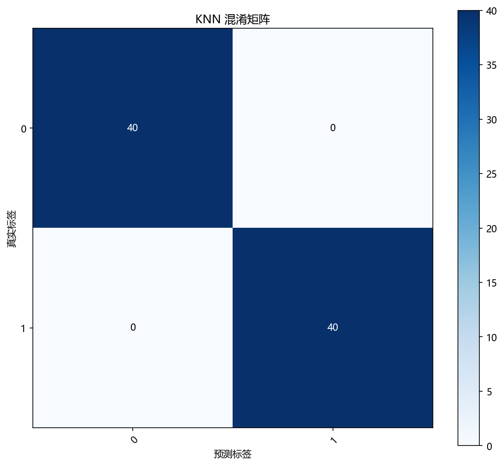
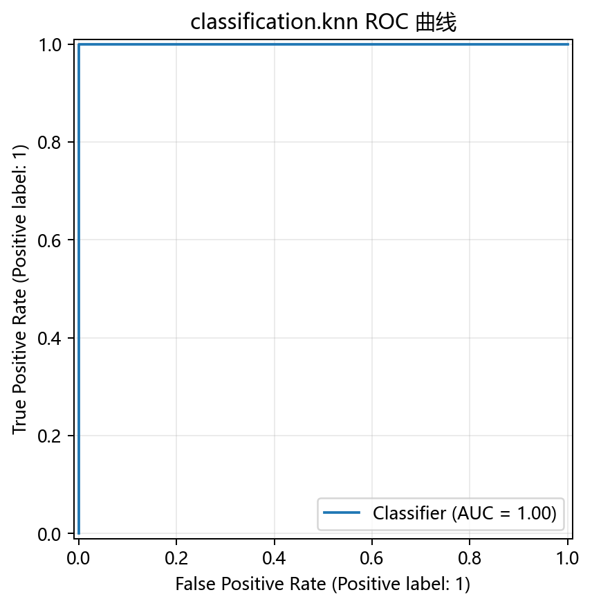

# 评估与诊断

## 本章目标

1. 明确当前仓库 KNN 实现实际上是如何做结果诊断的。
2. 理解混淆矩阵、ROC 曲线、PCA 决策边界图和学习曲线分别能说明什么。
3. 理解条件式概率输出与二维决策边界图的展示边界。

## 重点方法与概念速览

| 名称 | 类型 | 作用 |
|---|---|---|
| `y_pred` | 预测结果 | 测试集类别输出，由 $k$ 近邻多数投票得到 |
| `y_scores` | 预测概率 | 测试集类别概率输出，由邻域内各类别频率得到 |
| `plot_confusion_matrix(...)` | 函数 | 绘制预测标签与真实标签的混淆矩阵 |
| `plot_roc_curve(...)` | 函数 | 绘制二分类 ROC 曲线 |
| `plot_decision_boundary(...)` | 函数 | 绘制 PCA 2D 空间下的分类边界 |
| `plot_learning_curve(...)` | 函数 | 绘制训练/验证得分随样本量变化的曲线 |

## 1. 当前仓库的评估入口

当前 KNN 流水线里的主要结果诊断手段有四个：

1. 混淆矩阵
2. ROC 曲线
3. PCA 2D 决策边界图
4. 学习曲线

### 示例代码

```python
y_pred = model.predict(X_test_s)

if hasattr(model, "predict_proba"):
    y_scores = model.predict_proba(X_test_s)

plot_confusion_matrix(...)
plot_roc_curve(...)
plot_decision_boundary(...)
plot_learning_curve(...)
```

### 理解重点

- 当前实现同时提供结果矩阵、概率曲线、边界图和曲线图四类视角。
- KNN 没有特征重要性图（这是决策树特有的），因此评估方式比决策树少一项。
- 四种可视化分别回答不同问题：分对了吗（混淆矩阵）、概率区分力如何（ROC）、边界长什么样（决策边界）、更多数据有用吗（学习曲线）。

## 2. 混淆矩阵能观察什么

混淆矩阵 $\mathbf{C}$ 是一个 $2 \times 2$ 矩阵（二分类），$C_{ij}$ 表示真实类别为 $i$、预测类别为 $j$ 的样本数：

$$
C = \begin{bmatrix} \text{TN} & \text{FP} \\ \text{FN} & \text{TP} \end{bmatrix}
$$

### 参数速览

适用函数：`plot_confusion_matrix(y_true, y_pred, ...)`

| 参数名 | 类型 | 说明 | 示例取值 |
|---|---|---|---|
| `y_true` | `array_like`，形状 `(n_samples,)` | 测试集真实标签，取值 $y_i \in \{0, 1\}$ | `y_test` |
| `y_pred` | `array_like`，形状 `(n_samples,)` | 模型预测标签，来自 `model.predict(X_test_s)` | `y_pred` |
| `normalize` | `bool` 或 `str` | 归一化方式：`True`/`'true'` 按行（真实类别），`'pred'` 按列（预测类别），`'all'` 按全体。默认为 `False`（绝对数量） | `True`、`'true'` |

### 示例代码

```python
plot_confusion_matrix(
    y_true=y_test,
    y_pred=y_pred,
    title="KNN 混淆矩阵",
    dataset_name=DATASET,
    model_name=MODEL,
)
```

### 理解重点

- 混淆矩阵最适合回答：模型把正负类分别分对了多少，误分类倾向哪个方向。
- 对当前二分类双月牙任务，对角线元素即正确分类数，非对角线反映两个半月交界处的混淆情况。

## 3. ROC 曲线能观察什么

ROC 曲线绘制真正例率（TPR）随假正例率（FPR）变化的轨迹：

$$
\text{TPR} = \frac{\text{TP}}{\text{TP} + \text{FN}}, \quad
\text{FPR} = \frac{\text{FP}}{\text{FP} + \text{TN}}
$$

AUC（曲线下面积）$\in [0.5, 1.0]$，越接近 1 表示区分能力越强。

### 参数速览

适用函数：`plot_roc_curve(y_test, y_scores, ...)`

| 参数名 | 类型 | 说明 | 示例取值 |
|---|---|---|---|
| `y_true` | `array_like`，形状 `(n_samples,)` | 测试集真实标签，取值 $y_i \in \{0, 1\}$ | `y_test` |
| `y_scores` | `array_like`，形状 `(n_samples, n_classes)` | 各类别概率估计，来自 `model.predict_proba(X_test_s)`。二分类时使用正类（类别 1）的概率列作为得分 | `y_scores` |
| `pos_label` | `int` | 正类标签。二分类默认取 `1`，即取 `y_scores[:, 1]` 作为阳性得分 | `1` |

### 示例代码

```python
plot_roc_curve(
    y_test,
    y_scores,
    title="KNN ROC 曲线",
    dataset_name=DATASET,
    model_name=MODEL,
)
```

### 理解重点

- KNN 的概率输出来自邻域频率，取值离散（分母为 $k=5$），因此 ROC 曲线的阶梯形状会比逻辑回归更明显。
- 当前代码在调用前显式检查了 `predict_proba(...)` 是否存在，体现了对不同分类器接口差异的兼容。

## 4. PCA 2D 决策边界图能观察什么

决策边界图在二维平面上以不同颜色填充不同预测区域，直观展示 KNN 的局部邻域分类产生的边界形状。

### 参数速览

适用函数：`plot_decision_boundary(model_2d, X_2d, y.values, ...)`

| 参数名 | 类型 | 说明 | 示例取值 |
|---|---|---|---|
| `model_2d` | `KNeighborsClassifier` | 在 PCA 二维空间上单独训练的 KNN 模型。`n_neighbors=5`，与主模型共享相同的 $k$ | `model_2d` |
| `X_2d` | `ndarray`，形状 `(n_samples, 2)` | 标准化后 PCA 投影到二维的特征，用于生成网格点预测和散点着色。列分别为 PC1、PC2 | `X_2d` |
| `y` | `array_like`，形状 `(n_samples,)` | 全量标签数组，用于散点的真实类别着色 | `y.values` |

### 示例代码

```python
plot_decision_boundary(
    model_2d,
    X_2d,
    y.values,
    title="KNN 决策边界 (PCA 2D)",
    dataset_name=DATASET,
    model_name=MODEL,
)
```

### 理解重点

- KNN 的边界通常会呈现蜿蜒曲线，贴近数据的局部结构，与决策树的轴对齐分段边界和逻辑回归的直线边界截然不同。
- 当 $k$ 较小时，边界锯齿状明显（紧贴训练样本）；$k$ 较大时，边界更平滑。
- 但这只是 PCA 投影空间中的近似展示，不是原始邻域关系的完整表达。

## 5. 学习曲线能观察什么

学习曲线绘制训练得分和交叉验证得分随训练样本数增加的变化：

- 训练得分高、验证得分低且差距大 → 过拟合倾向（对 KNN，通常 $k$ 太小时出现）
- 验证得分持续上升且未收敛 → 更多数据可能有帮助

### 参数速览

适用函数：`plot_learning_curve(estimator, X, y, ...)`

| 参数名 | 类型 | 说明 | 示例取值 |
|---|---|---|---|
| `estimator` | `estimator` | 新创建的 KNN 模型实例。传入 `KNeighborsClassifier(n_neighbors=5)`，内部克隆后逐段训练 | `KNeighborsClassifier(n_neighbors=5)` |
| `X` | `array_like` | 标准化后的训练特征矩阵。学习曲线内部按不同比例逐步增加样本量 | `X_train_s` |
| `y` | `array_like` | 训练标签向量 | `y_train` |
| `scoring` | `str` | 评分类指标。当前取 `"accuracy"`，即 $\frac{\sum \mathbb{1}[y_i = \hat{y}_i]}{n}$ | `"accuracy"`、`"f1"` |
| `cv` | `int` | 交叉验证折数。默认 `5`，每次对当前采样量做 5 折 CV 计算验证得分误差带 | `5`、`10` |
| `train_sizes` | `array_like` | 训练样本量的递增序列。默认为 `np.linspace(0.1, 1.0, 5)` | `[0.1, 0.33, 0.55, 0.78, 1.0]` |

### 示例代码

```python
plot_learning_curve(
    KNeighborsClassifier(n_neighbors=5),
    X_train_s,
    y_train,
    title="KNN 学习曲线",
    dataset_name=DATASET,
    model_name=MODEL,
)
```

### 理解重点

- KNN 的学习曲线能反映：在 $k=5$ 固定的情况下，更多训练数据能否提升邻域投票的可靠性。
- 如果验证得分在小样本量时已经较高且接近训练得分，说明现有数据量已足够——邻域信息已经充分。
- 验证得分误差带（CV 标准差）能提示模型在不同数据划分下的稳定性。

## 6. 当前实现中尚未纳入但常见的分类指标

在一般分类任务中，还常见以下指标：

| 指标 | 公式 | 说明 |
|---|---|---|
| 准确率（Accuracy） | $\frac{\text{TP} + \text{TN}}{\text{TP} + \text{TN} + \text{FP} + \text{FN}}$ | 整体正确率 |
| 精确率（Precision） | $\frac{\text{TP}}{\text{TP} + \text{FP}}$ | 预测为正类的样本中有多少确实是正类 |
| 召回率（Recall） | $\frac{\text{TP}}{\text{TP} + \text{FN}}$ | 真实正类样本中有多少被正确找出 |
| F1 分数 | $2 \cdot \frac{\text{Precision} \cdot \text{Recall}}{\text{Precision} + \text{Recall}}$ | Precision 和 Recall 的调和平均 |

### 理解重点

- 当前仓库没有在 KNN 流水线中显式打印这些指标，而是通过混淆矩阵隐式呈现。
- 文档可以提到它们是常见扩展方向，但不能写成"当前源码已经在单独计算"。

## 评估图表





## 常见坑

1. 把 `predict(...)` 和 `predict_proba(...)` 的用途混为一谈——前者用于混淆矩阵，后者用于 ROC。
2. 忽略当前流水线对 `predict_proba(...)` 做了条件检查——不是所有分类器都有概率接口。
3. 把 PCA 决策边界图误认为原始特征空间邻域结构的完整表达——它是投影近似。
4. 把当前仓库未实现的 accuracy、precision、recall、f1 写成现有流程的一部分。

## 小结

- 当前仓库对 KNN 的评估方式：混淆矩阵看错误分布，ROC 曲线看概率区分力，PCA 决策边界图看边界形状，学习曲线看训练行为。
- KNN 没有特征重要性评估（它是基于实例的懒惰学习，不是基于特征分裂的模型），这与决策树分册不同。
- 四项评估组合起来，能全面解释当前 $k=5$ 的 KNN 在双月牙数据上的实际表现——特别是其非线性边界的优势。
