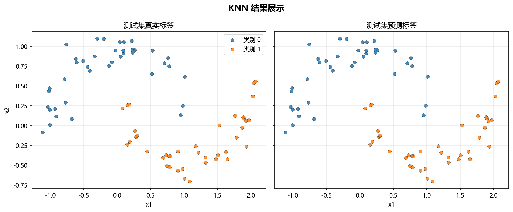

# 工程实现

## 本章目标

1. 从工程角度看清 KNN 在本仓库中的完整调用链。
2. 理解数据生成、模型训练、流水线编排和结果可视化分别负责什么。
3. 理解为什么当前实现要把训练逻辑、标准化逻辑、预测逻辑和可视化逻辑拆开。

## 对应代码速览

| 组件 | 路径 | 说明 |
|---|---|---|
| 数据生成 | `data_generation/classification.py` | `ClassificationData.knn()` 生成双月牙二分类数据 |
| 数据导出 | `data_generation/__init__.py` | 向外暴露 `knn_data` |
| 训练封装 | `model_training/classification/knn.py` | 构建并训练 `KNeighborsClassifier`，打印训练日志 |
| 流水线入口 | `pipelines/classification/knn.py` | 组织切分、标准化、训练、预测与可视化评估的完整编排 |
| 混淆矩阵可视化 | `result_visualization/confusion_matrix.py` | 保存混淆矩阵图 |
| ROC 曲线可视化 | `result_visualization/roc_curve.py` | 保存二分类 ROC 曲线图 |
| 决策边界可视化 | `result_visualization/decision_boundary.py` | 保存 PCA 二维决策边界图 |
| 学习曲线可视化 | `result_visualization/learning_curve.py` | 保存学习曲线图 |

## 1. 端到端运行入口

### 示例代码

```bash
python -m pipelines.classification.knn
```

### 理解重点

- 这个命令是理解 KNN 工程实现的最佳入口。
- 它会依次完成数据读取、标准化、模型训练、预测和结果可视化。
- 如果只读一个文件，建议先读 `pipelines/classification/knn.py`——编排层。

## 2. run() 串起了整个流程

当前流水线的核心函数 `run()` 采用线性编排风格：

```python
def run():
    # 1. 复制数据 & 拆出特征/标签
    data = knn_data.copy()
    X = data.drop(columns=["label"])
    y = data["label"]

    # 2. 划分训练/测试集
    X_train, X_test, y_train, y_test = train_test_split(
        X, y, test_size=0.2, random_state=42, stratify=y
    )

    # 3. 标准化（仅训练集上 fit）
    scaler = StandardScaler()
    X_train_s = scaler.fit_transform(X_train)
    X_test_s = scaler.transform(X_test)

    # 4. 训练主模型（建索引）& 正式预测
    model = train_model(X_train_s, y_train)
    y_pred = model.predict(X_test_s)
    if hasattr(model, "predict_proba"):
        y_scores = model.predict_proba(X_test_s)

    # 5. 可视化诊断（混淆矩阵、ROC、决策边界、学习曲线）
    plot_confusion_matrix(y_test, y_pred, ...)
    plot_roc_curve(y_test, y_scores, ...)
    plot_decision_boundary(model_2d, X_2d, y.values, ...)
    plot_learning_curve(KNeighborsClassifier(...), X_train_s, y_train, ...)
```

### 理解重点

- `run()` 的职责是编排，不是算法实现——每一步的输入明确来自上一步的输出。
- 数据流是单向的：数据 → 切分 → 标准化 → 训练 → 预测 → 评估。

## 3. 训练模块负责什么

`model_training/classification/knn.py` 里的 `train_model(...)` 主要负责四件事：

1. 创建 `KNeighborsClassifier(...)` 实例（按给定超参数）
2. 调用 `model.fit(X_train, y_train)`——存储样本、建立近邻查询结构
3. 打印训练日志：训练耗时、$k$、`weights`、`metric`
4. 返回训练完成的主模型对象

### 参数速览

| 参数名 | 类型 | 说明 | 示例取值 |
|---|---|---|---|
| `X_train` | `array_like` | 标准化后的训练特征矩阵。传入 `KNeighborsClassifier.fit()` | `X_train_s` |
| `y_train` | `array_like` | 训练标签向量，取值 $\{0, 1\}$ | `y_train` |
| `n_neighbors` | `int` | 近邻数量 $k$。默认 `5` | `3`、`5`、`15` |
| `weights` | `str` | 投票权重方式。默认 `"uniform"` | `"uniform"`、`"distance"` |
| `metric` | `str` | 距离度量方式。默认 `"minkowski"` | `"minkowski"`、`"euclidean"` |
| 返回值 | `KNeighborsClassifier` | 已完成 `fit()` 的模型对象，可直接调用 `predict()` 和 `predict_proba()` | — |

### 理解重点

- 这层抽离让"模型构建逻辑"和"流程编排逻辑"分开——`train_model()` 可被流水线调用，也可单独运行做局部验证。
- 这也是当前仓库多个算法分册共享的组织方式。

## 4. 四类评估模块分别负责什么

### 模块职责速览

| 模块 | 函数 | 输入 | 输出 |
|---|---|---|---|
| 混淆矩阵 | `plot_confusion_matrix(...)` | `y_test`、`y_pred` | 混淆矩阵图片（PNG） |
| ROC 曲线 | `plot_roc_curve(...)` | `y_test`、`y_scores` | 二分类 ROC 曲线图片（PNG） |
| 决策边界 | `plot_decision_boundary(...)` | `model_2d`、`X_2d`、`y.values` | 二维分类边界图（PNG） |
| 学习曲线 | `plot_learning_curve(...)` | `estimator`、`X_train_s`、`y_train` | 训练/验证得分曲线（PNG） |

### 理解重点

- 四类可视化都不是训练的一部分，而是训练完成后的诊断步骤——它们不修改模型。
- 决策边界图依赖单独训练的 `model_2d`（在 PCA 空间），ROC 曲线依赖 `predict_proba()` 的输出。
- KNN 没有特征重要性评估，因为它是基于实例的懒惰学习——没有"特征贡献"这个概念。

## 5. 模块间的数据依赖关系

| 数据 | 生产者 | 消费者 |
|---|---|---|
| `knn_data` | `data_generation/classification.py` | `pipelines/classification/knn.py` |
| `model`（主模型） | `train_model(...)` | `predict`、`predict_proba` |
| `y_pred` | `model.predict(...)` | `plot_confusion_matrix` |
| `y_scores` | `model.predict_proba(...)` | `plot_roc_curve` |
| `model_2d` | `KNeighborsClassifier.fit(...)`（PCA 空间） | `plot_decision_boundary` |
| 图片产物 | 各可视化函数 | `outputs/knn/` 目录 |

### 理解重点

- KNN 的流水线与决策树的关键差异在于：先标准化再训练；没有特征重要性评估模块。
- 数据流向单向、无循环依赖，每个模块可以独立测试和替换。

## 6. 运行后能得到什么

### 输出项

| 输出类型 | 当前结果 | 用途 |
|---|---|---|
| 终端标题 | `KNN 分类流水线` | 在终端中定位当前运行入口 |
| 训练日志 | 训练耗时、$k$、`weights`、`metric` | 确认 KNN 配置和训练效率 |
| 混淆矩阵图 | `outputs/knn/confusion_matrix.png` | 观察正负类误分类方向 |
| ROC 曲线图 | `outputs/knn/roc_curve.png` | 评估二分类概率区分能力 |
| 决策边界图 | `outputs/knn/decision_boundary.png` | 观察 KNN 的非线性弧形边界 |
| 学习曲线图 | `outputs/knn/learning_curve.png` | 诊断过拟合/欠拟合倾向 |

### 理解重点

- 运行结果不只是模型对象，还包括日志和多种图像产物。
- 对教学仓库而言，"代码 + 日志 + 图像"的组合比单纯返回分类结果更能帮助理解 KNN 的局部分类行为。

## 7. 推荐的源码阅读顺序

1. 先看 `pipelines/classification/knn.py` — 入口，了解整体流程
2. 再看 `model_training/classification/knn.py` — 训练封装，理解超参数和日志
3. 再看 `result_visualization/confusion_matrix.py` — 基础分类结果评估
4. 再看 `result_visualization/roc_curve.py` — 概率区分能力评估
5. 再看 `result_visualization/decision_boundary.py` — 空间划分可视化
6. 再看 `result_visualization/learning_curve.py` — 训练行为诊断
7. 最后回到 `data_generation/classification.py` — 理解数据生成参数

### 理解重点

- 从入口看整体流程，再下钻到训练与可视化细节，阅读成本最低。
- 这个顺序也对应了数据流方向：数据 → 标准化 → 训练 → 预测 → 评估。

## 运行结果



## 常见坑

1. 把 `pipeline` 文件误认为训练算法实现本体——它只是编排层，真正的训练在 `model_training/` 中。
2. 不区分"主模型""二维可视化模型"和"学习曲线模型实例"的职责边界——三者训练在不同空间或不同数据子集。
3. 忽略 KNN 的 `fit()` 和参数化模型的 `fit()` 本质不同——前者建索引，后者做梯度优化。
4. 只看单个文件，不顺着调用链理解整体执行流程。

## 小结

- 当前 KNN 工程实现采用清晰的模块分层：数据生成 → 训练封装 → 流水线编排 → 结果可视化。
- `run()` 负责串联流程，`train_model(...)` 负责训练主模型（实际是建索引），各可视化函数负责结果展示与诊断。
- 数据流单向，各模块职责单一，便于教学讲解和后续扩展。
