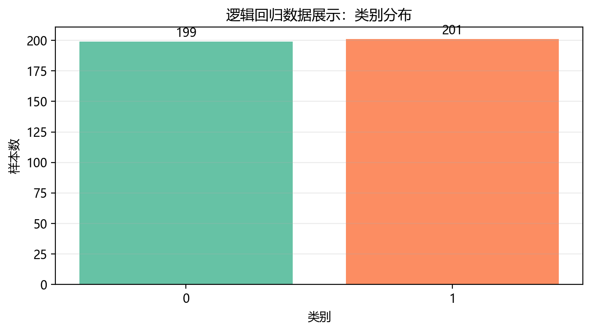
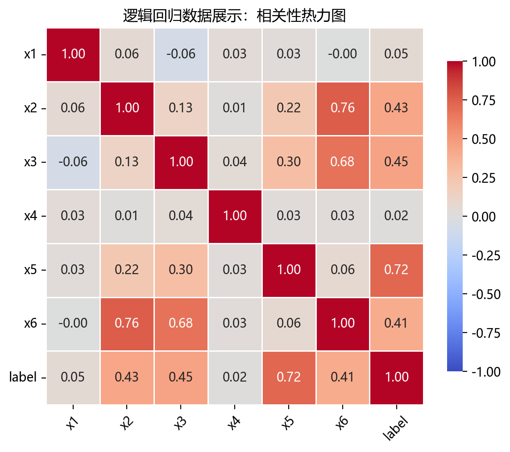
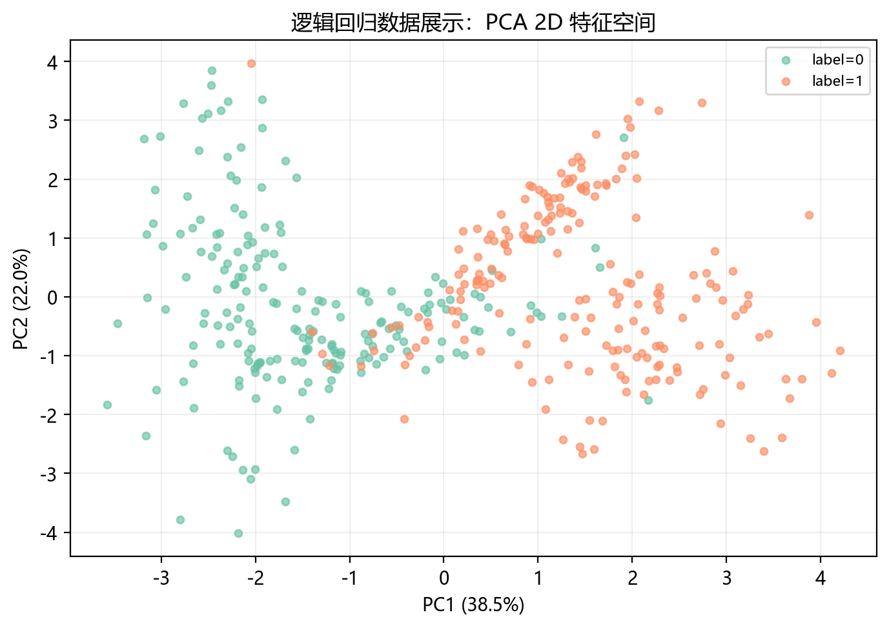

# 数据构成

## 本章目标

1. 明确本仓库 Logistic Regression 数据来自 `ClassificationData.logistic_regression()` 的生成逻辑。
2. 明确 `make_classification` 各参数的数据含义与当前取值。
3. 明确训练集/测试集切分与标准化的顺序和边界——逻辑回归基于梯度优化，标准化直接影响收敛和系数可比性。

## 重点方法与概念速览

| 名称 | 类型 | 作用 |
|---|---|---|
| `ClassificationData.logistic_regression()` | 方法 | 生成逻辑回归使用的高维二分类数据 |
| `make_classification(...)` | 函数 | scikit-learn 提供的监督分类数据生成器，可控制特征类型与噪声 |
| `logistic_regression_data` | 变量 | 在 `data_generation/__init__.py` 中导出的数据对象 |
| `label` | 列名 | 当前流水线中的监督分类标签，取值 $\{0, 1\}$ |
| `StandardScaler` | 类 | 对特征做标准化，改善梯度优化收敛与系数可比性 |

## 1. 本仓库数据入口

- 数据变量：`data_generation/__init__.py` 中导出的 `logistic_regression_data`
- 生成来源：`data_generation/classification.py` 中的 `ClassificationData.logistic_regression()`
- 流水线使用：`pipelines/classification/logistic_regression.py` 中的 `data = logistic_regression_data.copy()`

### 理解重点

- `logistic_regression_data` 在导入时就已经生成完成，因此流水线里直接 `.copy()` 使用即可。
- 用 `.copy()` 的目的是避免后续处理意外修改原始数据对象。
- 当前数据是为逻辑回归教学场景专门构造的高维二分类数据，与线性分类边界假设高度匹配。

## 2. 数据生成函数 `ClassificationData.logistic_regression()`

底层调用 `sklearn.datasets.make_classification`，生成包含有效特征、冗余特征和标签噪声的高维二分类数据。

### 参数速览

适用函数：`sklearn.datasets.make_classification`

| 参数名 | 类型 | 说明 | 示例取值 |
|---|---|---|---|
| `n_samples` | `int` | 总样本数 $N$。当前取 `400` | `100`、`400`、`1000` |
| `n_features` | `int` | 总特征数 $d$。当前取 `6`，包含有效、冗余和重复特征 | `2`、`6`、`20` |
| `n_informative` | `int` | 有效特征数——对类别有真实区分力的特征数量。当前取 `3`，即 6 个特征中只有 3 个真正携带分类信息 | `2`、`3`、`5` |
| `n_redundant` | `int` | 冗余特征数——由有效特征线性组合生成的随机线性组合。当前取 `1`，用于观察模型在冗余信息上的表现 | `0`、`1`、`3` |
| `n_repeated` | `int` | 重复特征数——从有效和冗余特征中随机复制。当前取 `0` | `0`、`1` |
| `n_classes` | `int` | 类别数 $K$。当前取 `2`（二分类） | `2`、`3` |
| `n_clusters_per_class` | `int` | 每个类别的簇数。默认为 `2`，影响类内数据分布形态 | `1`、`2` |
| `class_sep` | `float` | 类别间分离程度。值越大类别越容易区分。当前取 `1.2`——近线性可分但不完美，适合展示逻辑回归在中等难度数据上的行为 | `0.5`、`1.0`、`1.5` |
| `flip_y` | `float` | 标签噪声比例。随机翻转该比例样本的标签。当前取 `0.03`（3%）——模拟少数误标样本 | `0.0`、`0.03`、`0.1` |
| `random_state` | `int` | 随机种子，保证每次生成相同数据。当前取 `42` | `42` |
| `shuffle` | `bool` | 是否打乱样本顺序。默认为 `True` | `True` |

### 示例代码

```python
from sklearn.datasets import make_classification
from pandas import DataFrame

X, y = make_classification(
    n_samples=400,
    n_features=6,
    n_informative=3,
    n_redundant=1,
    n_repeated=0,
    n_classes=2,
    class_sep=1.2,
    flip_y=0.03,
    random_state=42,
)
columns = [f"x{i + 1}" for i in range(6)]
data = DataFrame(X, columns=columns)
data["label"] = y
```

### 理解重点

- 当前数据是高维二分类数据（$d=6$），不是二维玩具问题——无法直接可视化原始空间中的决策边界，需要 PCA 降维。
- `n_informative=3`、`n_redundant=1` 意味着：6 个特征中 3 个真正有用，1 个是冗余的线性组合——适合展示逻辑回归对冗余特征的容忍度。
- `class_sep=1.2` 使得数据近线性可分但不完美——逻辑回归能找到合理的边界，但无法达到完美精度。
- `flip_y=0.03` 模拟 3% 的标签噪声，展示逻辑回归在轻微噪声下的鲁棒性。

## 3. 特征列与标签列

当前数据表结构：

- 特征列：`x1` ~ `x6`（6 维实数特征）
- 标签列：`label`（二分类标签，取值为 $0$ 或 $1$）

### 示例代码

```python
X = data.drop(columns=["label"])
y = data["label"]
```

### 理解重点

- `label` 是监督训练标签，会真实参与 `model.fit(X_train, y_train)`。
- 当前任务为二分类——逻辑回归的 Sigmoid 输出天然适合二分类概率建模。
- 6 维特征意味着原始空间中的决策边界是 5 维超平面——无法直接可视化，需借助 PCA。

## 4. 切分与标准化的顺序

标准化必须在切分之后执行——`fit_transform` 在训练集上计算 $\mu_i, \sigma_i$，`transform` 将相同统计量应用于测试集。顺序错误会导致数据泄露。

### 参数速览

适用函数：`train_test_split`、`StandardScaler`

| 参数名 | 类型 | 说明 | 示例取值 |
|---|---|---|---|
| `test_size` | `float` | 测试集占比。当前取 `0.2`，即 80 个测试样本（总样本 400 × 20%） | `0.2`、`0.3` |
| `random_state` | `int` | 随机种子，保证每次切分结果一致。当前取 `42` | `42` |
| `stratify` | `array_like` | 按 `y` 的类别比例分层抽样。数学上保证 $\frac{n_{0,\text{train}}}{n_{0,\text{test}}} \approx \frac{N_{\text{train}}}{N_{\text{test}}}$，尤其重要因为 `flip_y` 可能让类别比例略有偏移 | `y`、`None` |
| `scaler.fit_transform(X_train)` | 方法 | 在训练集上计算 $\mu_i, \sigma_i$ 并变换：$x_i' = (x_i - \mu_i) / \sigma_i$ | — |
| `scaler.transform(X_test)` | 方法 | 使用训练集的 $\mu_i, \sigma_i$ 变换测试集，不重新计算统计量 | — |

### 示例代码

```python
from sklearn.model_selection import train_test_split
from sklearn.preprocessing import StandardScaler

# 先切分
X_train, X_test, y_train, y_test = train_test_split(
    X, y, test_size=0.2, random_state=42, stratify=y
)

# 再标准化（仅在训练集上 fit）
scaler = StandardScaler()
X_train_s = scaler.fit_transform(X_train)
X_test_s = scaler.transform(X_test)
```

### 理解重点

- 对逻辑回归来说，标准化有三个好处：梯度优化器（`lbfgs`）收敛稳定、正则化惩罚均匀、`coef_` 之间可直接比较大小。
- `stratify=y` 确保训练集和测试集的类别比例一致——在标签噪声存在时这尤其重要。
- 标准化后 $w_j \approx 0$ 的特征基本没有贡献，$w_j$ 绝对值大的特征对正类倾向影响强。

## 数据可视化







## 常见坑

1. 忘记把 `label` 从特征表中剥离出来。
2. 在切分之前就对全量数据做标准化——造成数据泄露，验证结果不可信。
3. 忽略 `stratify=y`，导致训练集和测试集类别比例不稳定。
4. 只看到"逻辑回归是线性模型"，却忽略当前数据中仍有 3 个冗余特征和 3% 的标签噪声——不是完美线性可分。

## 小结

- 当前 Logistic Regression 数据来自 `ClassificationData.logistic_regression()`，底层使用 `make_classification(n_samples=400, n_features=6, n_informative=3, n_redundant=1, class_sep=1.2, flip_y=0.03)`。
- 数据表结构：`x1` ~ `x6` 是 6 维特征，`label` 是二分类监督标签。
- 数据特点：高维、含冗余特征、近线性可分但不完美——适合展示逻辑回归在真实场景下的线性概率分类能力。
- 标准化对逻辑回归影响深远——不仅关乎收敛速度，还直接影响系数解释和正则化效果。
