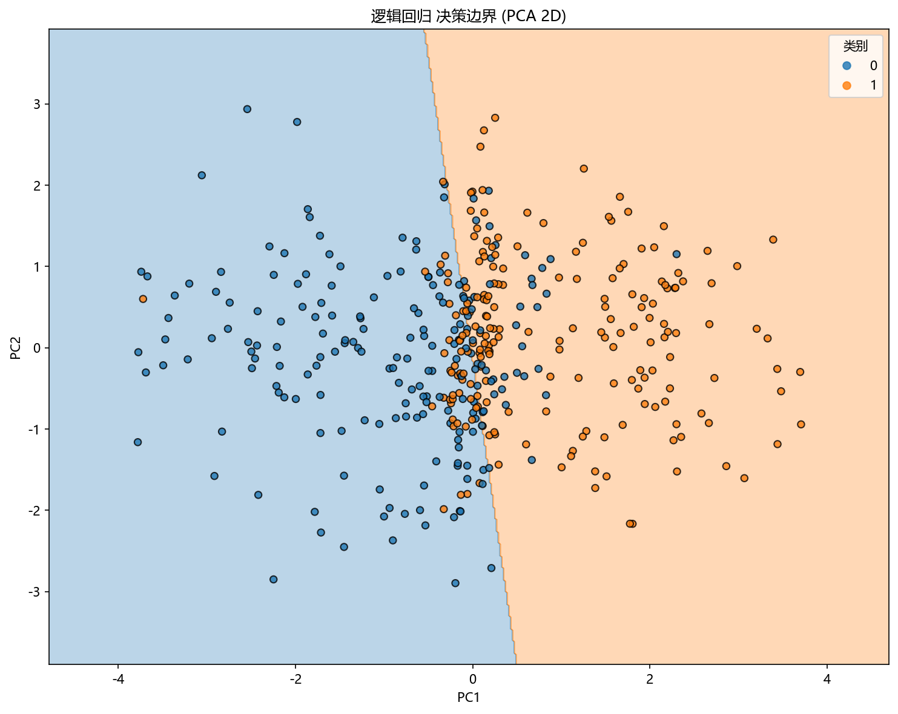

# 思路与直觉

## 本章目标

1. 用直观方式理解逻辑回归到底在做什么——线性打分 → Sigmoid → 概率输出。
2. 理解为什么它在当前高维近线性可分数据上是合理的概率分类基线。
3. 理解它与 KNN（局部投票）、决策树（轴对齐切分）、SVC（最大间隔）在思路上的关键差异。

## 重点方法与概念速览

| 名称 | 类型 | 作用 |
|---|---|---|
| 线性打分 | 核心直觉 | 先给样本一个线性分值 $z = \mathbf{w}^T\mathbf{x} + b$，分值越高越倾向正类 |
| Sigmoid 概率 | 输出形式 | 把无界分值 $z \in (-\infty, +\infty)$ 压缩成 $(0, 1)$ 的概率 |
| 线性边界 $\mathbf{w}^T\mathbf{x} + b = 0$ | 决策形状 | 在 $\sigma(z) = 0.5$ 处形成一张平坦超平面 |
| 系数解释 | 可解释性 | $\mathbf{w}$ 的正负和大小直接反映特征对正类倾向的方向和强度 |
| KNN | 对比算法 | 局部邻域投票，边界贴合数据局部结构 |
| 决策树 | 对比算法 | 递归轴对齐切分，形成分段常数区域 |
| SVC | 对比算法 | 最大间隔分类，追求边界到样本的最小距离最大化 |

## 1. 为什么需要逻辑回归

对于很多分类问题，我们不只想要"分成两类"，还希望模型能告诉我们：

它认为样本属于正类的概率大概有多大？

逻辑回归的思路：

- 先对特征做线性加权求和：$z = w_1 x_1 + w_2 x_2 + \dots + w_d x_d + b$
- 再把结果通过 Sigmoid 映射成概率：$\sigma(z) = \frac{1}{1+e^{-z}}$
- 得分越高 → 概率越接近 1；得分越低 → 概率越接近 0；$z=0$ → 概率正好 0.5

### 理解重点

- 逻辑回归天然兼具"分类能力"和"概率解释"——输出不只是标签，还有置信度。
- 当前流水线的 `predict_proba(...)`、ROC 曲线，都建立在概率输出之上。
- 与 KNN 的"看周围邻居"不同，逻辑回归的预测由一个全局公式 $\sigma(\mathbf{w}^T\mathbf{x} + b)$ 给出。

## 2. 为什么当前仓库示例里它表现合理

当前逻辑回归数据来自 `make_classification(n_features=6, n_informative=3, class_sep=1.2, flip_y=0.03)`，特点是：

- 二分类任务
- 6 维特征（含有效和冗余）
- 近线性可分（`class_sep=1.2`）
- 含少量标签噪声（`flip_y=0.03`）

### 理解重点

- 数据整体呈近线性可分结构——一条超平面能大致分开两类，虽不能完美（因为有噪声和冗余）。
- 对逻辑回归来说，这是很合适的教学场景：既能展示线性边界的清晰性，又不会因数据过于理想而失去现实感。
- 与 KNN 的双月牙数据（非线性弧形）和决策树的 blob 数据（区域化分布）教学目的截然不同。

## 3. 用"线性打分 → 概率"理解算法

可以把逻辑回归理解成一个三步走的过程：

1. 先给样本算一个线性得分——特征加权求和
2. 得分越大，越倾向正类；得分越小，越倾向负类
3. 再用 Sigmoid 把这个得分变成 0 到 1 之间的概率

### 理解重点

- 这也是为什么 `coef_` 和 `intercept_` 在当前分册中值得专门观察——它们直接告诉你每个特征"推"正类还是"拉"负类。
- 线性得分的符号决定分类方向（正分 → 正类），绝对值大小反映分类置信度。
- 如果把逻辑回归仅理解成"一个会分类的黑盒"，就会错过它最有价值的可解释性部分——系数本身就是模型解释。

## 4. 为什么 coef_ 值得重点看

在标准化后的特征空间中，`coef_` 有清晰的解释：

- $w_j > 0$：特征 $x_j$ 增大 → 正类概率升高
- $w_j < 0$：特征 $x_j$ 增大 → 正类概率降低
- $\vert w_j \vert$ 大：特征 $x_j$ 对分类结果影响大
- $\vert w_j \vert \approx 0$：特征 $x_j$ 在当前决策中基本不参与

### 理解重点

- 当前训练日志直接打印系数和截距，就是为了让读者把模型输出和数据特征联系起来看。
- 与 KNN（没有显式系数）和决策树（特征重要性不是方向性的）不同，逻辑回归的系数天然带有"正负方向"的含义。

## 5. 与 KNN、决策树、SVC 的直觉差异

四者在当前仓库中的核心差异：

| 算法 | 决策边界 | 核心依据 | 是否需要标准化 | 概率输出方式 | 适用场景 |
|---|---|---|---|---|---|
| LogisticRegression | 全局线性超平面 $\mathbf{w}^T\mathbf{x} + b = 0$ | Sigmoid 概率映射 + 交叉熵优化 | 是（梯度优化 + 系数可比） | Sigmoid 连续映射 | 近线性可分数据 |
| KNN | 局部非参数复杂边界 | $k$ 近邻多数投票 | 是（距离度量必需） | 邻域频率（离散值） | 非线性局部结构数据 |
| DecisionTreeClassifier | 局部轴对齐分段边界 | 不纯度下降 + 递归划分 | 否（阈值切分不依赖距离） | 叶节点内类别占比 | 区域化分布数据 |
| SVC | 最大间隔 + 核变换非线性边界 | 支持向量 + hinge loss | 是（距离/核函数依赖） | 需额外概率校准 | 复杂分布数据 |

### 理解重点

- 逻辑回归在问：哪个方向最能区分正负类（全局线性 $z = \mathbf{w}^T\mathbf{x} + b$）。
- KNN 在问：当前点周围最近的 $k$ 个邻居大多是什么类别（局部投票）。
- 决策树在问：先切哪一刀最能让类别变纯（递归划分）。
- 当前高维近线性可分数据最适合把逻辑回归作为线性概率基线来讲解。

## 可视化

## 常见坑

1. 只知道逻辑回归会分类，却说不出它为什么还能输出概率——Sigmoid 把 $z \in (-\infty, +\infty)$ 映射到 $(0, 1)$。
2. 把所有线性模型都当成同一种东西——逻辑回归用交叉熵 + Sigmoid 做概率分类，线性回归用 MSE 做连续值回归。
3. 只关注预测结果，不关注系数和截距的解释价值——标准化后 $\mathbf{w}$ 的正负和大小直接反映特征影响。
4. 忽略标准化，让系数比较和梯度优化都变得不稳定——不同量纲的特征在优化中"抢梯度"。

## 小结

- 逻辑回归的直觉核心：线性打分 → Sigmoid 概率映射——先算分值再转概率。
- 与 KNN（局部邻域投票）、决策树（轴对齐递归切分）和 SVC（最大间隔）不同，逻辑回归学习的是全局线性概率边界。
- 标准化后 `coef_` 直接反映特征对正类概率的影响方向和强度——这是逻辑回归区别于其他分类模型的重要可解释性优势。
