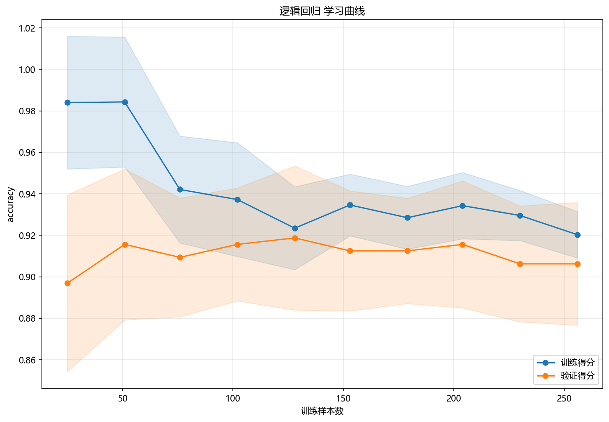

# 训练与预测

## 本章目标

1. 按源码顺序看清当前 Logistic Regression 流水线到底执行了哪些步骤。
2. 理解训练集/测试集拆分、标准化、训练、类别预测和概率预测之间的连接关系。
3. 理解主模型与二维可视化模型在当前实现中的职责差异。

## 重点方法与概念速览

| 名称 | 类型 | 作用 |
|---|---|---|
| `logistic_regression_data.copy()` | 方法 | 复制原始数据，避免修改源对象 |
| `train_test_split(...)` | 方法 | 划分训练集与测试集 |
| `StandardScaler` | 类 | 对训练/测试特征做一致的标准化处理 |
| `train_model(X_train_s, y_train)` | 函数 | 使用 `lbfgs` 优化器训练主逻辑回归模型 |
| `model.predict(X_test_s)` | 方法 | 生成测试集硬分类结果，判断 $\sigma(\mathbf{w}^T\mathbf{x}+b) \geq 0.5$ |
| `model.predict_proba(X_test_s)` | 方法 | 生成测试集各类别概率输出，正类概率为 $\sigma(\mathbf{w}^T\mathbf{x}+b)$ |
| `PCA(n_components=2)` | 类 | 为决策边界可视化构造二维表示 |
| `model_2d` | 模型 | 专门用于二维决策边界展示 |

## 1. 流水线从复制数据开始

当前流水线先复制 `logistic_regression_data`，再拆出 `X` 和 `y`。

### 示例代码

```python
data = logistic_regression_data.copy()
X = data.drop(columns=["label"])
y = data["label"]
```

### 理解重点

- 原始数据只读、流程内部再处理——这是当前仓库多个分册的统一习惯。
- 当前任务是监督二分类，因此 `y` 会真实参与训练和预测评估。

## 2. 先切分训练集与测试集

使用 `train_test_split` 按 8:2 切分，`stratify=y` 保持类别分布一致。

### 参数速览

适用函数：`sklearn.model_selection.train_test_split`

| 参数名 | 类型 | 说明 | 示例取值 |
|---|---|---|---|
| `*arrays` | `array_like` | 待切分的数据序列。传入 `(X, y)` 分别对应切分 | `X, y` |
| `test_size` | `float` | 测试集占比。当前取 `0.2`，即 80 个测试样本 | `0.2` |
| `random_state` | `int` | 随机种子。当前取 `42` | `42` |
| `stratify` | `array_like` | 按 `y` 类别比例分层抽样。在当前含 3% 标签噪声的数据上尤其重要 | `y`、`None` |

### 示例代码

```python
X_train, X_test, y_train, y_test = train_test_split(
    X, y, test_size=0.2, random_state=42, stratify=y
)
```

### 理解重点

- 当前流水线明确区分了训练阶段和测试阶段。
- `stratify=y` 保证训练集和测试集类别比例一致——在 `flip_y=0.03` 的场景下这尤其重要。

## 3. 标准化只在训练集上拟合

标准化必须严格在切分后执行——`fit_transform` 在训练集上计算 $\mu_i, \sigma_i$，`transform` 将相同统计量应用于测试集。

### 参数速览

适用类：`sklearn.preprocessing.StandardScaler`

| 参数名 | 类型 | 说明 | 示例取值 |
|---|---|---|---|
| `scaler.fit_transform(X_train)` | 方法 | 计算训练集的 $\mu_i$ 和 $\sigma_i$，并执行 $x_i' = (x_i - \mu_i)/\sigma_i$。返回 `X_train_s` | — |
| `scaler.transform(X_test)` | 方法 | 使用训练集的 $\mu_i$ 和 $\sigma_i$ 变换测试集。返回 `X_test_s` | — |

### 示例代码

```python
scaler = StandardScaler()
X_train_s = scaler.fit_transform(X_train)
X_test_s = scaler.transform(X_test)
```

### 理解重点

- 标准化对逻辑回归有三个好处：`lbfgs` 优化器收敛稳定、L2 正则化惩罚均匀、`coef_` 之间可直接比较。
- `fit_transform` vs `transform` 的区分模拟了真实部署场景——新数据只能用训练时的标准化参数。

## 4. 主模型训练与正式预测

逻辑回归的 `fit()` 使用 `lbfgs` 优化器最小化 L2 正则化交叉熵损失。训练完成后，`model.predict(...)` 按概率阈值 0.5 输出类别标签。

### 参数速览

适用方法：`LogisticRegression.predict(X)`

| 参数名 | 类型 | 说明 | 示例取值 |
|---|---|---|---|
| `X` | `array_like`，形状 `(n_samples, n_features)` | 待预测的标准化特征矩阵。$d = 6$，必须与训练特征维度一致 | `X_test_s` |
| 返回值 | `ndarray`，形状 `(n_samples,)` | 预测类别标签，$\hat{y}_i \in \{0, 1\}$。$\hat{y} = 1$ 当 $\sigma(\mathbf{w}^T\mathbf{x} + b) \geq 0.5$，等价于 $\mathbf{w}^T\mathbf{x} + b \geq 0$ | — |

### 示例代码

```python
model = train_model(X_train_s, y_train)
y_pred = model.predict(X_test_s)
```

### 理解重点

- `model` 是当前分册的主模型，用于正式训练和测试集类别预测。
- 类别预测的阈值默认是 0.5——概率 ≥ 0.5 判为正类，等价于 $\mathbf{w}^T\mathbf{x} + b \geq 0$。
- `y_pred` 是后续混淆矩阵评估的直接输入。

## 5. 概率输出如何进入流水线

`sigmoid` 映射后的正类概率是 ROC 曲线可视化的直接输入。

### 参数速览

适用方法：`LogisticRegression.predict_proba(X)`

| 参数名 | 类型 | 说明 | 示例取值 |
|---|---|---|---|
| `X` | `array_like`，形状 `(n_samples, n_features)` | 待预测的标准化特征矩阵 | `X_test_s` |
| 返回值 | `ndarray`，形状 `(n_samples, n_classes)` | 各类别概率估计。第 1 列 $P(y=0\vert\mathbf{x})$，第 2 列 $P(y=1\vert\mathbf{x}) = \sigma(\mathbf{w}^T\mathbf{x} + b)$。每行和为 1 | — |

### 示例代码

```python
y_scores = model.predict_proba(X_test_s)
```

### 理解重点

- `predict_proba(...)` 是逻辑回归的重要接口——概率输出来自 Sigmoid 的连续映射，不像 KNN 那样是离散的邻域频率。
- 连续概率意味着 ROC 曲线是平滑的（而非阶梯状），这是逻辑回归相对于 KNN 在概率输出上的优势。
- 在当前二分类实现中，ROC 曲线实际使用的是 `y_scores[:, 1]`——正类概率列。

## 6. 决策边界为什么要额外训练一个 model_2d

主模型在标准化后的 6 维特征空间中训练，但决策边界图需要能在二维平面上对任意网格点做预测。
当前实现采用 PCA 投影到二维，再单独训练一个逻辑回归模型用于可视化。

### 参数速览

适用类：`sklearn.decomposition.PCA`

| 参数名 | 类型 | 说明 | 示例取值 |
|---|---|---|---|
| `n_components` | `int` | 保留的主成分数 $k$。$k=2$ 时将 $d=6$ 维特征投影到二维平面。PCA 通过 SVD 分解 $\mathbf{X} = \mathbf{U}\boldsymbol{\Sigma}\mathbf{V}^T$，取前 $k$ 个奇异向量 | `2` |
| `random_state` | `int` | 随机种子。PCA 基于 SVD 是确定性的，但某些求解器用随机化算法时需要。当前取 `42` | `42` |

### 示例代码

```python
pca = PCA(n_components=2, random_state=42)
X_all_s = scaler.transform(X)
X_2d = pca.fit_transform(X_all_s)
model_2d = LogisticRegression(max_iter=1000, random_state=42)
model_2d.fit(pca.transform(X_train_s), y_train)
```

### 理解重点

- `model_2d` 不是主评估模型，而是专门为二维可视化服务的辅助模型——它在 PCA 空间训练，仅在决策边界图中使用。
- 主模型训练在标准化后的原 6 维特征空间中，两者职责不同，不可混淆。
- 逻辑回归的 PCA 决策边界通常呈现一条直线——因为逻辑回归本身是线性分类器，在二维空间中边界就是一条直线。

## 7. 学习曲线如何接入流水线

学习曲线用于诊断模型性能是否随训练样本量增加而持续改善。

### 参数速览

适用函数：`result_visualization.learning_curve.plot_learning_curve`

| 参数名 | 类型 | 说明 | 示例取值 |
|---|---|---|---|
| `estimator` | `estimator` | 新创建的模型实例。传入 `LogisticRegression(max_iter=1000, random_state=42)`，内部会克隆并逐段训练 | `LogisticRegression(max_iter=1000, random_state=42)` |
| `X` | `array_like` | 标准化后的训练特征矩阵。当前传入 `X_train_s` | `X_train_s` |
| `y` | `array_like` | 训练标签向量 | `y_train` |
| `scoring` | `str` | 评分类指标。`"accuracy"` = $\frac{\sum \mathbb{1}[y_i=\hat{y}_i]}{n}$ | `"accuracy"` |
| `cv` | `int` | 交叉验证折数。默认 `5` | `5`、`10` |

### 示例代码

```python
plot_learning_curve(
    LogisticRegression(max_iter=1000, random_state=42),
    X_train_s,
    y_train,
    title="逻辑回归 学习曲线",
    dataset_name=DATASET,
    model_name=MODEL,
)
```

### 理解重点

- 学习曲线使用新的 `LogisticRegression` 实例，不直接复用 `model`——因为内部会克隆后重新训练。
- 对逻辑回归而言，学习曲线能直观反映：在 $C=1.0$、`penalty='l2'` 固定时，更多训练数据能否提升泛化性能。

## 训练诊断可视化



## 常见坑

1. 把 `predict(...)` 和 `predict_proba(...)` 混为一谈——前者返回标签，后者返回概率。
2. 把 `model_2d` 误认为正式预测模型本体——它仅在 PCA 空间训练。
3. 忘记标准化必须在训练集上 `fit_transform`、在测试集上 `transform`——反过来会造成数据泄露。
4. 混淆主模型预测（6 维空间）、二维可视化模型（PCA 空间）和学习曲线模型（交叉验证循环）三者的职责。

## 小结

- 当前 Logistic Regression 流水线的训练过程：复制数据 → 切分 → 标准化 → `lbfgs` 优化 L2 正则化交叉熵 → 类别预测 → Sigmoid 概率输出 → 多种可视化诊断。
- 逻辑回归的独特之处：概率输出来自连续的 Sigmoid 映射（相对于 KNN 的离散邻域频率），ROC 曲线更平滑。
- 对本仓库而言，`model`（6 维标准化空间）、`model_2d`（PCA 2D 空间）和学习曲线实例分别承担不同职责。
