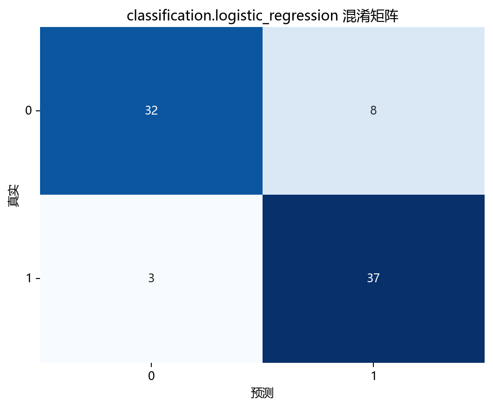
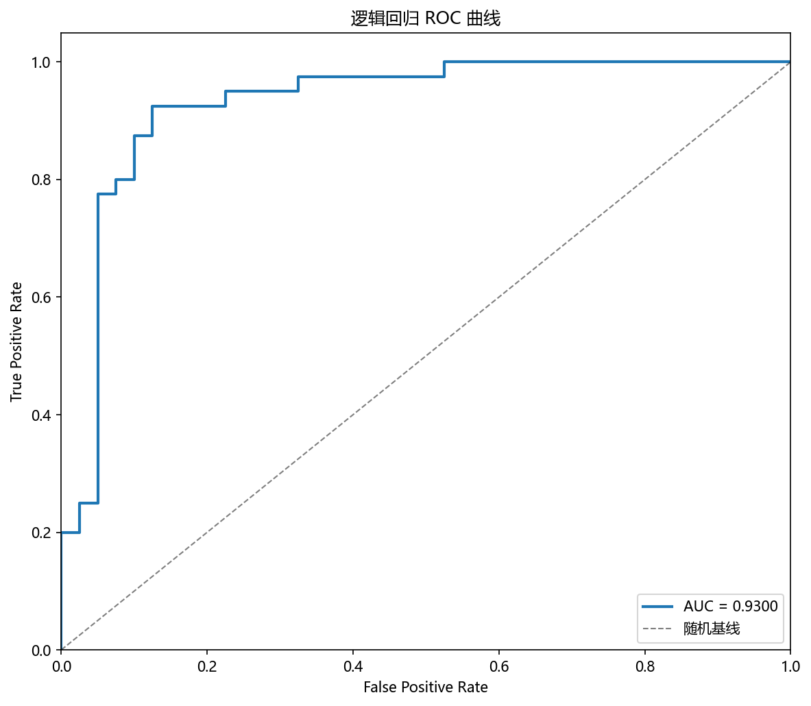

# 评估与诊断

## 本章目标

1. 明确当前仓库 Logistic Regression 实现实际上是如何做结果诊断的。
2. 理解混淆矩阵、ROC 曲线、PCA 决策边界图和学习曲线分别能说明什么。
3. 理解二分类 ROC 与二维决策边界图的展示边界。

## 重点方法与概念速览

| 名称 | 类型 | 作用 |
|---|---|---|
| `y_pred` | 预测结果 | 测试集类别输出，由 $\sigma(\mathbf{w}^T\mathbf{x}+b) \geq 0.5$ 决定 |
| `y_scores` | 预测概率 | 测试集正类概率输出，来自连续的 Sigmoid 映射 |
| `plot_confusion_matrix(...)` | 函数 | 绘制预测标签与真实标签的混淆矩阵 |
| `plot_roc_curve(...)` | 函数 | 绘制二分类 ROC 曲线 |
| `plot_decision_boundary(...)` | 函数 | 绘制 PCA 2D 空间下的分类边界 |
| `plot_learning_curve(...)` | 函数 | 绘制训练/验证得分随样本量变化的曲线 |

## 1. 当前仓库的评估入口

当前 Logistic Regression 流水线里的主要结果诊断手段有四个：

1. 混淆矩阵
2. ROC 曲线
3. PCA 2D 决策边界图
4. 学习曲线

### 示例代码

```python
y_pred = model.predict(X_test_s)
y_scores = model.predict_proba(X_test_s)

plot_confusion_matrix(...)
plot_roc_curve(...)
plot_decision_boundary(...)
plot_learning_curve(...)
```

### 理解重点

- 当前实现同时提供结果矩阵、概率曲线、边界图和曲线图四类视角。
- 逻辑回归没有特征重要性图（这是决策树特有的），但 `coef_` 直接反映了特征的影响方向和强度——这比可视化更重要。
- 四种可视化分别回答：分对了吗（混淆矩阵）、区分力如何（ROC）、边界长什么样（决策边界）、更多数据有用吗（学习曲线）。

## 2. 混淆矩阵能观察什么

混淆矩阵 $\mathbf{C}$ 是一个 $2 \times 2$ 矩阵（二分类）：

$$
C = \begin{bmatrix} \text{TN} & \text{FP} \\ \text{FN} & \text{TP} \end{bmatrix}
$$

### 参数速览

适用函数：`plot_confusion_matrix(y_true, y_pred, ...)`

| 参数名 | 类型 | 说明 | 示例取值 |
|---|---|---|---|
| `y_true` | `array_like`，形状 `(n_samples,)` | 测试集真实标签，取值 $y_i \in \{0, 1\}$ | `y_test` |
| `y_pred` | `array_like`，形状 `(n_samples,)` | 模型预测标签，来自 $\sigma(\mathbf{w}^T\mathbf{x}+b) \geq 0.5$ 的硬分类 | `y_pred` |
| `normalize` | `bool` 或 `str` | 归一化方式。`True`/`'true'` 按行（真实类别），`'pred'` 按列，`'all'` 按全体。默认为 `False` | `True`、`'true'` |

### 示例代码

```python
plot_confusion_matrix(
    y_true=y_test,
    y_pred=y_pred,
    title="逻辑回归 混淆矩阵",
    dataset_name=DATASET,
    model_name=MODEL,
)
```

### 理解重点

- 混淆矩阵最适合回答：正负类分别分对了多少，误分类偏向哪个方向。
- 在当前 `class_sep=1.2`、`flip_y=0.03` 的数据上，逻辑回归通常能获得较高准确率，但受标签噪声影响会有少量误分类。

## 3. ROC 曲线能观察什么

ROC 曲线绘制 TPR 随 FPR 变化的轨迹，通过改变分类阈值（默认 0.5）得到：

$$
\text{TPR} = \frac{\text{TP}}{\text{TP} + \text{FN}}, \quad
\text{FPR} = \frac{\text{FP}}{\text{FP} + \text{TN}}
$$

### 参数速览

适用函数：`plot_roc_curve(y_test, y_scores, ...)`

| 参数名 | 类型 | 说明 | 示例取值 |
|---|---|---|---|
| `y_true` | `array_like`，形状 `(n_samples,)` | 测试集真实标签 | `y_test` |
| `y_scores` | `array_like`，形状 `(n_samples, n_classes)` | 各类别概率估计，来自 `model.predict_proba(X_test_s)`。二分类使用 `y_scores[:, 1]`（正类概率列） | `y_scores` |

### 示例代码

```python
plot_roc_curve(
    y_test,
    y_scores,
    title="逻辑回归 ROC 曲线",
    dataset_name=DATASET,
    model_name=MODEL,
)
```

### 理解重点

- 逻辑回归的概率输出来自连续的 Sigmoid 映射 $\sigma(\mathbf{w}^T\mathbf{x}+b) \in [0, 1]$，因此 ROC 曲线是平滑的——这与 KNN（离散邻域频率）形成对比。
- AUC 越接近 1 表示概率区分能力越强。在当前近线性可分数据上，逻辑回归通常能获得较高的 AUC。
- 当前任务是二分类，ROC 只使用正类概率列就足够了。

## 4. PCA 2D 决策边界图能观察什么

### 参数速览

适用函数：`plot_decision_boundary(model_2d, X_2d, y.values, ...)`

| 参数名 | 类型 | 说明 | 示例取值 |
|---|---|---|---|
| `model_2d` | `LogisticRegression` | 在 PCA 二维空间上单独训练的逻辑回归模型。`max_iter=1000`，与主模型共享相同的正则化配置 | `model_2d` |
| `X_2d` | `ndarray`，形状 `(n_samples, 2)` | 标准化后 PCA 投影到二维的特征，列分别为 PC1、PC2 | `X_2d` |
| `y` | `array_like`，形状 `(n_samples,)` | 全量标签数组，用于散点的真实类别着色 | `y.values` |

### 示例代码

```python
plot_decision_boundary(
    model_2d,
    X_2d,
    y.values,
    title="逻辑回归 决策边界 (PCA 2D)",
    dataset_name=DATASET,
    model_name=MODEL,
)
```

### 理解重点

- 逻辑回归的决策边界在二维 PCA 空间中呈现为一条直线——这是因为逻辑回归本身是线性分类器。
- 这与 KNN 的蜿蜒边界和决策树的轴对齐分段边界形成鲜明对比。
- 但这只是 PCA 投影空间中的近似展示，原始 6 维特征空间中的决策面是 5 维超平面。

## 5. 学习曲线能观察什么

### 参数速览

适用函数：`plot_learning_curve(estimator, X, y, ...)`

| 参数名 | 类型 | 说明 | 示例取值 |
|---|---|---|---|
| `estimator` | `estimator` | 新创建的逻辑回归实例。传入 `LogisticRegression(max_iter=1000, random_state=42)` | `LogisticRegression(max_iter=1000, random_state=42)` |
| `X` | `array_like` | 标准化后的训练特征矩阵 | `X_train_s` |
| `y` | `array_like` | 训练标签向量 | `y_train` |
| `scoring` | `str` | 评分类指标。当前取 `"accuracy"` | `"accuracy"` |
| `cv` | `int` | 交叉验证折数。默认 `5` | `5`、`10` |
| `train_sizes` | `array_like` | 训练样本量的递增序列。默认为 `np.linspace(0.1, 1.0, 5)` | `[0.1, 0.33, 0.55, 0.78, 1.0]` |

### 示例代码

```python
plot_learning_curve(
    LogisticRegression(max_iter=1000, random_state=42),
    X_train_s,
    y_train,
    title="逻辑回归 学习曲线",
    dataset_name=DATASET,
    model_name=MODEL,
)
```

### 理解重点

- 逻辑回归是参数化模型（$d+1$ 个参数），即使样本量不大通常也能稳定学习。学习曲线可以用来验证是否需要更多数据。
- 如果训练得分和验证得分都很高且接近，说明模型在当前 $C=1.0$ 下没有明显过拟合——正则化起作用了。

## 6. 当前实现中尚未纳入但常见的分类指标

| 指标 | 公式 | 说明 |
|---|---|---|
| 准确率（Accuracy） | $\frac{\text{TP} + \text{TN}}{\text{TP} + \text{TN} + \text{FP} + \text{FN}}$ | 整体正确率 |
| 精确率（Precision） | $\frac{\text{TP}}{\text{TP} + \text{FP}}$ | 预测为正类中有多少真实正类 |
| 召回率（Recall） | $\frac{\text{TP}}{\text{TP} + \text{FN}}$ | 真实正类中有多少被正确找出 |
| F1 分数 | $2 \cdot \frac{\text{Precision} \cdot \text{Recall}}{\text{Precision} + \text{Recall}}$ | 精确率与召回率的调和平均 |

### 理解重点

- 当前仓库没有在 Logistic Regression 流水线中显式打印这些指标。
- 文档可以提到它们是常见扩展方向，但不能写成"当前源码已经在单独计算"。
- 混淆矩阵已经隐式包含了计算这些指标所需的所有信息（TP、TN、FP、FN）。

## 评估图表





## 常见坑

1. 把 `predict(...)` 和 `predict_proba(...)` 的用途混为一谈——前者用于混淆矩阵，后者用于 ROC。
2. 把 ROC 曲线误解成对类别预测标签直接作图——需要概率输出（Sigmoid 映射后的连续值）来变化阈值。
3. 把 PCA 决策边界图误认为原始 6 维特征空间决策面的完整表达——它只是二维投影近似。
4. 把当前仓库未实现的 accuracy、precision、recall、f1 写成现有流程的一部分。

## 小结

- 当前仓库对 Logistic Regression 的评估方式：混淆矩阵看错误分布，ROC 曲线看概率区分力，PCA 决策边界图看边界形状，学习曲线看训练行为。
- 逻辑回归没有特征重要性评估（这是决策树特有的），但标准化后 `coef_` 的绝对值大小可以粗略反映特征影响——这比可视化更重要。
- 四项评估组合起来，能全面解释当前 $C=1.0$、L2 正则化逻辑回归在高维近线性可分数据上的实际表现。
