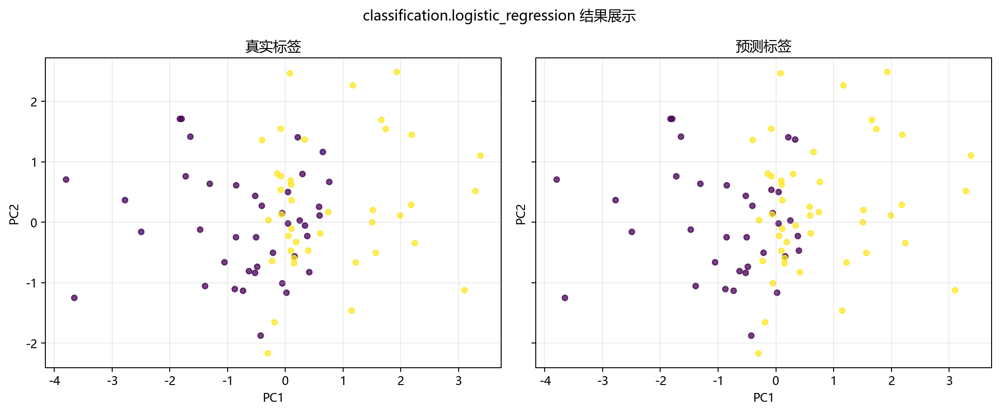

# 工程实现

## 本章目标

1. 从工程角度看清 Logistic Regression 在本仓库中的完整调用链。
2. 理解数据生成、模型训练、流水线编排和结果可视化分别负责什么。
3. 理解为什么当前实现要把训练逻辑、标准化逻辑、概率输出逻辑和可视化逻辑拆开。

## 对应代码速览

| 组件 | 路径 | 说明 |
|---|---|---|
| 数据生成 | `data_generation/classification.py` | `ClassificationData.logistic_regression()` 生成高维二分类数据 |
| 数据导出 | `data_generation/__init__.py` | 向外暴露 `logistic_regression_data` |
| 训练封装 | `model_training/classification/logistic_regression.py` | 构建并训练 `LogisticRegression`，打印训练日志含 `coef_` 和 `intercept_` |
| 流水线入口 | `pipelines/classification/logistic_regression.py` | 组织切分、标准化、训练、预测与可视化评估的完整编排 |
| 混淆矩阵可视化 | `result_visualization/confusion_matrix.py` | 保存混淆矩阵图 |
| ROC 曲线可视化 | `result_visualization/roc_curve.py` | 保存二分类 ROC 曲线图 |
| 决策边界可视化 | `result_visualization/decision_boundary.py` | 保存 PCA 二维决策边界图 |
| 学习曲线可视化 | `result_visualization/learning_curve.py` | 保存学习曲线图 |

## 1. 端到端运行入口

### 示例代码

```bash
python -m pipelines.classification.logistic_regression
```

### 理解重点

- 这个命令是理解 Logistic Regression 工程实现的最佳入口。
- 它会依次完成数据读取、标准化、模型训练（`lbfgs` 优化）、预测和结果可视化。
- 如果只读一个文件，建议先读 `pipelines/classification/logistic_regression.py`——编排层。

## 2. run() 串起了整个流程

当前流水线的核心函数 `run()` 采用线性编排风格：

```python
def run():
    # 1. 复制数据 & 拆出特征/标签
    data = logistic_regression_data.copy()
    X = data.drop(columns=["label"])
    y = data["label"]

    # 2. 划分训练/测试集
    X_train, X_test, y_train, y_test = train_test_split(
        X, y, test_size=0.2, random_state=42, stratify=y
    )

    # 3. 标准化（仅训练集上 fit）
    scaler = StandardScaler()
    X_train_s = scaler.fit_transform(X_train)
    X_test_s = scaler.transform(X_test)

    # 4. lbfgs 优化 L2 正则化交叉熵 & 正式预测
    model = train_model(X_train_s, y_train)
    y_pred = model.predict(X_test_s)
    y_scores = model.predict_proba(X_test_s)

    # 5. 可视化诊断（混淆矩阵、ROC、决策边界、学习曲线）
    plot_confusion_matrix(y_test, y_pred, ...)
    plot_roc_curve(y_test, y_scores, ...)
    plot_decision_boundary(model_2d, X_2d, y.values, ...)
    plot_learning_curve(LogisticRegression(...), X_train_s, y_train, ...)
```

### 理解重点

- `run()` 的职责是编排，不是算法实现——真正的优化在 `LogisticRegression.fit()`（`lbfgs`）中。
- 数据流是单向的：数据 → 切分 → 标准化 → `lbfgs` 优化 → 预测 → 评估。
- 标准化后 `coef_` 可解释，这是逻辑回归流水线相对于其他算法的一个重要工程特性。

## 3. 训练模块负责什么

`model_training/classification/logistic_regression.py` 里的 `train_model(...)` 主要负责四件事：

1. 创建 `LogisticRegression(...)` 实例（按给定超参数：`penalty='l2'`、`C=1.0` 等）
2. 调用 `model.fit(X_train, y_train)`——`lbfgs` 优化器最小化 L2 正则化交叉熵
3. 打印训练日志：训练耗时、`penalty`、`C`、`solver`、`max_iter`、`classes_`、`intercept_`、`coef_`
4. 返回训练完成的主模型对象

### 参数速览

| 参数名 | 类型 | 说明 | 示例取值 |
|---|---|---|---|
| `X_train` | `array_like` | 标准化后的训练特征矩阵。传入 `LogisticRegression.fit()` | `X_train_s` |
| `y_train` | `array_like` | 训练标签向量，取值 $\{0, 1\}$ | `y_train` |
| `penalty` | `str` | 正则化类型。默认 `"l2"` | `"l2"`、`"l1"` |
| `C` | `float` | 正则化强度倒数 $\lambda = 1/C$。默认 `1.0` | `0.01`、`1.0`、`100.0` |
| `solver` | `str` | 优化器。默认 `"lbfgs"` | `"lbfgs"`、`"liblinear"` |
| `max_iter` | `int` | 最大迭代次数。默认 `1000` | `500`、`1000` |
| `class_weight` | `dict`、`str` 或 `None` | 类别权重。默认 `None` | `None`、`"balanced"` |
| `random_state` | `int` | 随机种子。默认 `42` | `42` |
| 返回值 | `LogisticRegression` | 已完成 `fit()` 的模型对象，含 `coef_`、`intercept_` 等属性 | — |

### 理解重点

- 逻辑回归的 `fit()` 本质是迭代优化——与 KNN（只建索引）和决策树（递归划分）的计算特征不同。
- `coef_` 和 `intercept_` 的输出使得逻辑回归的训练日志比其他算法更有信息量——直接看到特征影响方向和强度。

## 4. 四类评估模块分别负责什么

### 模块职责速览

| 模块 | 函数 | 输入 | 输出 |
|---|---|---|---|
| 混淆矩阵 | `plot_confusion_matrix(...)` | `y_test`、`y_pred` | 混淆矩阵图片（PNG） |
| ROC 曲线 | `plot_roc_curve(...)` | `y_test`、`y_scores` | 二分类 ROC 曲线图片（PNG） |
| 决策边界 | `plot_decision_boundary(...)` | `model_2d`、`X_2d`、`y.values` | PCA 二维分类边界图（PNG） |
| 学习曲线 | `plot_learning_curve(...)` | `estimator`、`X_train_s`、`y_train` | 训练/验证得分曲线（PNG） |

### 理解重点

- 四类可视化都不是训练的一部分，而是训练完成后的诊断步骤。
- 决策边界图依赖 PCA 降维（$d=6 \to 2$）后的 `model_2d`——在 PCA 空间中是直线边界；ROC 曲线依赖 Sigmoid 概率输出——是平滑曲线。
- 逻辑回归没有特征重要性评估，但有 `coef_` 提供更直接的系数解释。

## 5. 模块间的数据依赖关系

| 数据 | 生产者 | 消费者 |
|---|---|---|
| `logistic_regression_data` | `data_generation/classification.py` | `pipelines/classification/logistic_regression.py` |
| `model`（主模型） | `train_model(...)` | `predict`、`predict_proba` |
| `y_pred` | `model.predict(...)` | `plot_confusion_matrix` |
| `y_scores` | `model.predict_proba(...)` | `plot_roc_curve` |
| `model_2d` | `LogisticRegression.fit(...)`（PCA 空间） | `plot_decision_boundary` |
| 图片产物 | 各可视化函数 | `outputs/logistic_regression/` 目录 |

### 理解重点

- 逻辑回归的流水线与 KNN 结构相似（都需要标准化，都没有特征重要性），但与决策树不同（决策树不需要标准化且有特征重要性）。
- 数据流向单向、无循环依赖，每个模块可以独立测试和替换。

## 6. 运行后能得到什么

### 输出项

| 输出类型 | 当前结果 | 用途 |
|---|---|---|
| 终端标题 | `逻辑回归分类流水线` | 在终端中定位当前运行入口 |
| 训练日志 | 训练耗时、`penalty`、`C`、`solver`、`classes_`、`intercept_`、`coef_` | 查看优化耗时、正则配置和线性边界参数 |
| 混淆矩阵图 | `outputs/logistic_regression/confusion_matrix.png` | 观察正负类误分类方向 |
| ROC 曲线图 | `outputs/logistic_regression/roc_curve.png` | 评估 Sigmoid 概率区分能力 |
| 决策边界图 | `outputs/logistic_regression/decision_boundary.png` | 观察 PCA 2D 空间中的线性边界 |
| 学习曲线图 | `outputs/logistic_regression/learning_curve.png` | 诊断过拟合/欠拟合倾向 |

### 理解重点

- 逻辑回归的训练日志特别有价值——`coef_` 直接反映标准化后各特征对正类倾向的影响。
- 例如 `coef_ = [[1.2, -0.8, 0.3, -0.1, 0.05, 0.02]]`，说明 `x1` 推正类（$w_1 > 0$），`x2` 压正类（$w_2 < 0$），而 `x4`、`x5`、`x6` 几乎不参与（$w_j \approx 0$——可能对应冗余特征）。

## 7. 推荐的源码阅读顺序

1. 先看 `pipelines/classification/logistic_regression.py` — 入口，了解整体流程
2. 再看 `model_training/classification/logistic_regression.py` — 训练封装，理解超参数和 `coef_` 日志
3. 再看 `result_visualization/confusion_matrix.py` — 基础分类结果评估
4. 再看 `result_visualization/roc_curve.py` — Sigmoid 概率区分能力评估
5. 再看 `result_visualization/decision_boundary.py` — PCA 空间线性边界可视化
6. 再看 `result_visualization/learning_curve.py` — 训练行为诊断
7. 最后回到 `data_generation/classification.py` — 理解数据生成参数

### 理解重点

- 从入口看整体流程，再下钻到训练与可视化细节，阅读成本最低。
- 这个顺序对应数据流方向：数据 → 标准化 → `lbfgs` 优化 → 预测 → 评估。

## 运行结果



## 常见坑

1. 把 `pipeline` 文件误认为训练算法实现本体——它只是编排层，真正的优化在 `LogisticRegression.fit()`（`lbfgs`）中。
2. 不区分"主模型"（6 维空间）、"二维可视化模型"（PCA 空间）和"学习曲线模型实例"（CV 循环）的职责边界。
3. 忽略 `coef_` 和 `intercept_` 的日志输出——这是逻辑回归最重要的训练产出。
4. 只看单个文件，不顺着调用链理解整体执行流程。

## 小结

- 当前 Logistic Regression 工程实现采用清晰的模块分层：数据生成 → 训练封装 → 流水线编排 → 结果可视化。
- `run()` 负责串联流程，`train_model(...)` 负责 `lbfgs` 优化 L2 正则化交叉熵，各可视化函数负责结果展示与诊断。
- 逻辑回归在工程上最不同于 KNN/决策树的地方：`fit()` 是真正的迭代优化（需要考虑收敛）；`coef_` 提供了显式的系数解释；标准化同时影响优化收敛和系数可比性。
