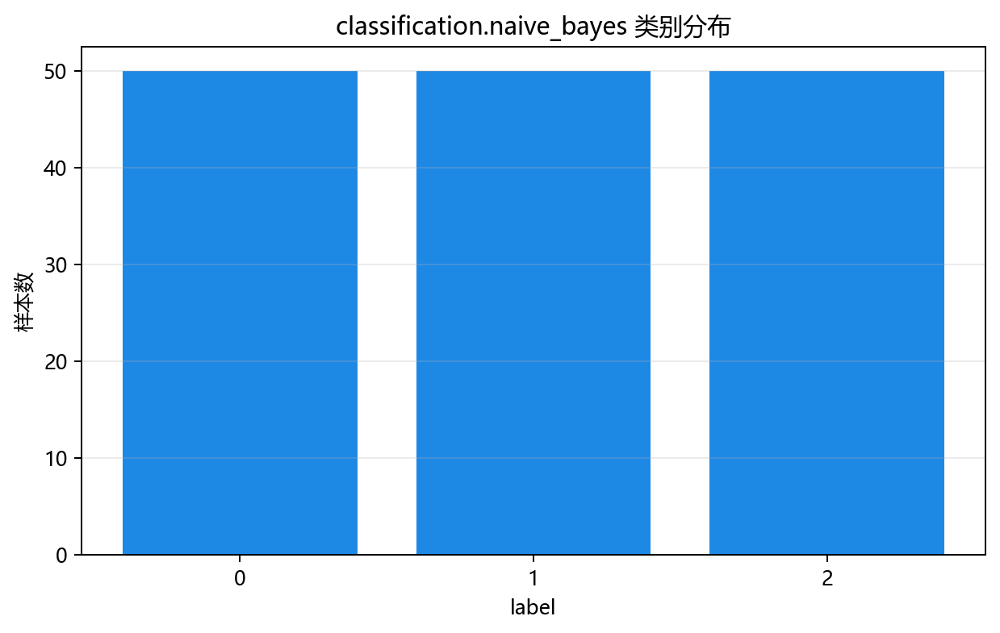
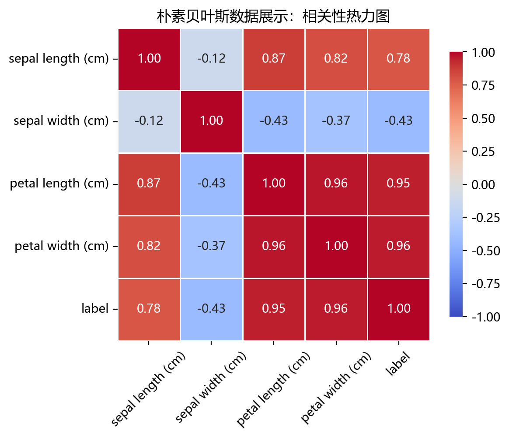
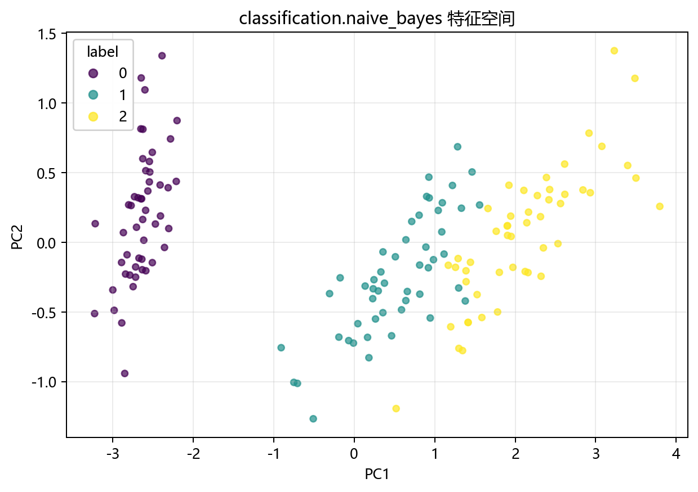

# 数据构成

> 对应代码：`data_generation/classification.py`、`data_generation/__init__.py`、`pipelines/classification/naive_bayes.py`
>
> 相关对象：`ClassificationData.naive_bayes()`、`naive_bayes_data`

## 本章目标

1. 明确本仓库 Naive Bayes 数据来自 `ClassificationData.naive_bayes()` 的 iris 加载逻辑。
2. 明确特征列与标签列在当前流水线中的拆分方式。
3. 明确训练集/测试集切分与标准化的顺序和边界。

## 重点方法与概念速览

| 名称 | 类型 | 作用 |
|---|---|---|
| `ClassificationData.naive_bayes()` | 方法 | 加载 Naive Bayes 使用的 iris 数据集 |
| `load_iris()` | 函数 | scikit-learn 提供的经典多分类数据集加载器 |
| `naive_bayes_data` | 变量 | 在 `data_generation/__init__.py` 中导出的数据对象 |
| `label` | 列名 | 当前流水线中的监督分类标签 |
| `StandardScaler` | 类 | 对特征做标准化，保持训练/评估流程一致 |

## 1. 本仓库数据入口

- 数据变量：`data_generation/__init__.py` 中导出的 `naive_bayes_data`
- 加载来源：`data_generation/classification.py` 中的 `ClassificationData.naive_bayes()`
- 流水线使用：`pipelines/classification/naive_bayes.py` 中的 `data = naive_bayes_data.copy()`

### 理解重点

- `naive_bayes_data` 在导入时就已经加载完成，因此流水线里直接 `.copy()` 使用即可。
- 用 `.copy()` 的目的，是避免后续处理意外修改原始数据对象。
- 当前分册和很多玩具示例不同，使用的是真实数据集而不是人工合成数据。

## 2. 数据加载函数 `ClassificationData.naive_bayes()`

### 参数速览（本节）

适用 API（分项）：

1. `ClassificationData.naive_bayes()`
2. `load_iris()`

| 项目 | 当前实现 | 说明 |
|---|---|---|
| 数据源 | `load_iris()` | 直接加载 iris 真实数据集 |
| 样本数 | `150` | 三类鸢尾花样本总数 |
| 特征数 | `4` | 四个连续值特征 |
| 类别数 | `3` | 三分类任务 |
| 返回值 | `DataFrame` | 含 4 个特征列与 `label` 的数据表 |

### 示例代码

```python
iris = load_iris()
data = DataFrame(iris.data, columns=iris.feature_names)
data["label"] = iris.target
```

### 理解重点

- 当前数据不是随机生成的，而是经典的 iris 基准数据集。
- 四个特征都是连续值，这和 `GaussianNB` 的高斯条件分布假设天然对应。
- 三分类结构也让 ROC 曲线部分需要使用 One-vs-Rest 方式来解释。

## 3. 特征列与标签列

当前数据表结构如下：

- 特征列：`iris.feature_names` 对应的 4 个连续特征
- 标签列：`label`

### 示例代码

```python
X = data.drop(columns=["label"])
y = data["label"]
```

### 理解重点

- `label` 是监督训练标签，会真实参与 `model.fit(X_train, y_train)`。
- 当前流水线把特征和标签明确拆开，这是后续切分、标准化和训练的前提。
- 与聚类分册不同，这里标签不是只用于对照，而是训练过程的一部分。

## 4. 切分与标准化

### 参数速览（本节）

适用 API（分项）：

1. `train_test_split(X, y, test_size=0.2, random_state=42, stratify=y)`
2. `StandardScaler().fit_transform(X_train)`
3. `StandardScaler().transform(X_test)`

| 参数名 | 本例取值 | 说明 |
|---|---|---|
| `test_size` | `0.2` | 测试集占比 |
| `random_state` | `42` | 保证可复现划分 |
| `stratify` | `y` | 保持训练集和测试集的类别比例一致 |
| `X_train` | 训练特征 | 只在训练集上拟合标准化统计量 |
| `X_test` | 测试特征 | 使用训练集统计量做变换 |

### 示例代码

```python
X_train, X_test, y_train, y_test = train_test_split(
    X, y, test_size=0.2, random_state=42, stratify=y
)

scaler = StandardScaler()
X_train_s = scaler.fit_transform(X_train)
X_test_s = scaler.transform(X_test)
```

### 理解重点

- 标准化必须发生在切分之后，否则会造成数据泄露。
- 当前流水线显式使用 `stratify=y`，说明作者希望训练集和测试集在类别比例上保持稳定。
- 虽然 GaussianNB 并不像核方法那样强依赖尺度，但当前仓库统一保留标准化步骤，有利于整个分类分册风格一致，也便于后续 PCA 和可视化处理。

## 数据可视化







## 常见坑

1. 忘记把 `label` 从特征表中剥离出来。
2. 在切分之前就对全量数据做标准化。
3. 忽略 `stratify=y`，导致训练集和测试集类别比例不稳定。
4. 误以为 iris 是人工构造的玩具数据，而忽略它是真实经典数据集。

## 小结

- 当前 Naive Bayes 数据来自 `ClassificationData.naive_bayes()`，底层使用的是 `load_iris()`。
- 数据表结构清晰：4 个连续特征列 + `label` 监督标签。
- 读懂数据来源、切分方式和标准化顺序，是理解后续训练与评估章节的前提。
