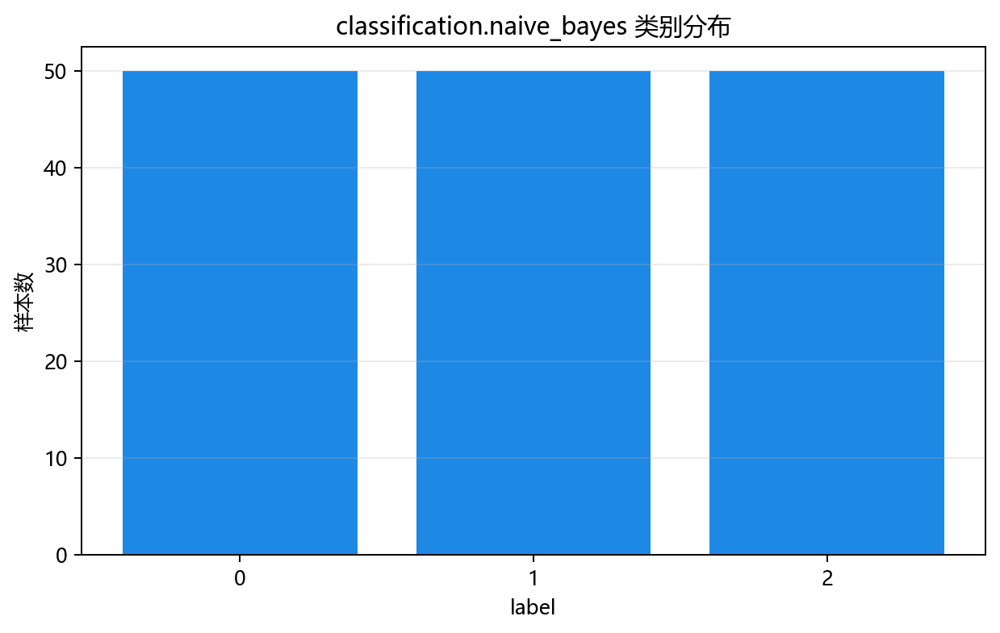
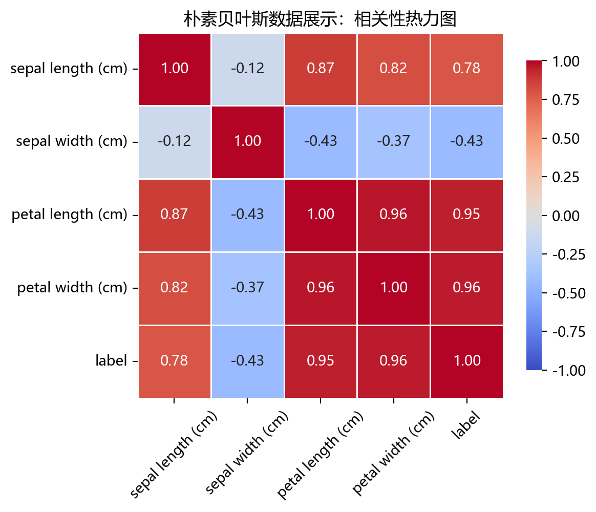
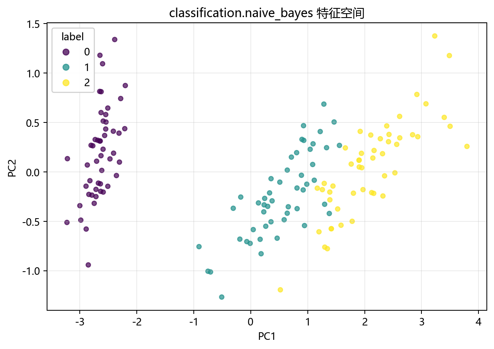

# 数据构成

## 本章目标

1. 明确本仓库 Naive Bayes 数据来自 `load_iris()` 真实数据集。
2. 理解 iris 的 4 个连续特征与 `GaussianNB` 高斯假设之间的天然适配关系。
3. 明确训练集/测试集切分与标准化的顺序和边界。

## 重点方法与概念速览

| 名称 | 类型 | 作用 |
|---|---|---|
| `load_iris()` | 函数 | 加载 iris 经典多分类真实数据集 |
| `naive_bayes_data` | 变量 | 在 `data_generation/__init__.py` 中导出的 DataFrame |
| `label` | 列名 | 当前流水线中的监督分类标签，取值 $\{0, 1, 2\}$ |
| `train_test_split` | 函数 | 按 `stratify=y` 保持类别比例划分训练/测试集 |
| `StandardScaler` | 类 | 对特征做 Z-score 标准化，统一量纲并利于 PCA 可视化 |

## 1. 数据加载：`load_iris()`

当前 Naive Bayes 数据来自 `ClassificationData.naive_bayes()`，底层调用 `sklearn.datasets.load_iris()`。

### 参数速览

适用函数：`load_iris()`

| 参数名 | 类型 | 说明 | 示例取值 |
|---|---|---|---|
| `return_X_y` | `bool` | 是否仅返回 `(X, y)` 元组。默认 `False` 返回 Bunch 对象 | `False` |
| `as_frame` | `bool` | 是否以 DataFrame 形式返回。默认 `False` 返回 ndarray | `False` |
| 样本数 | `int` | iris 数据集固定为 150 个样本，三类鸢尾花各 50 个 | `150` |
| 特征数 | `int` | 4 个连续特征，来自 `iris.feature_names` | `4` |
| 类别数 | `int` | 3 个类别（Setosa / Versicolour / Virginica），标签为 $0, 1, 2$ | `3` |

### 示例代码

```python
from sklearn.datasets import load_iris
from pandas import DataFrame

iris = load_iris()
data = DataFrame(iris.data, columns=iris.feature_names)
data["label"] = iris.target
```

### 理解重点

- iris 是真实经典基准数据集，不是人工合成数据——四个连续特征分别对应萼片长宽和花瓣长宽。
- 4 个特征全为连续值，与 `GaussianNB` 对连续特征的高斯建模假设天然匹配。
- 三类各 50 样本的均衡设计使得类别先验 $P(Y=c_k) \approx 1/3$，无需处理类别不平衡。
- 三分类结构让 ROC 曲线部分需要使用 One-vs-Rest 方式分别绘制。

## 2. 特征列与标签列

### 参数速览

| 参数名 | 类型 | 说明 | 示例取值 |
|---|---|---|---|
| `X` | `DataFrame` | 含 4 个连续特征的特征矩阵，列名来自 `iris.feature_names` | `data.drop(columns=["label"])` |
| `y` | `Series` | 监督分类标签，取值 $y_i \in \{0, 1, 2\}$ | `data["label"]` |

### 示例代码

```python
X = data.drop(columns=["label"])
y = data["label"]
```

### 理解重点

- 特征列名与 iris 原始特征名称一致，具有明确的物理解释（萼片长宽、花瓣长宽）。
- `label` 是监督训练标签，会真实参与 `model.fit(X_train, y_train)`——与聚类分册不同，标签在这里是训练过程的一部分。
- 将特征和标签明确拆分是后续切分、标准化和训练的前提。

## 3. 训练/测试集切分

### 参数速览

适用函数：`train_test_split(X, y, test_size=0.2, random_state=42, stratify=y)`

| 参数名 | 类型 | 说明 | 示例取值 |
|---|---|---|---|
| `X` | `array_like` | 特征矩阵，形状 $(150, 4)$ | `X` |
| `y` | `array_like` | 标签向量，形状 $(150,)$ | `y` |
| `test_size` | `float` | 测试集占比，默认 `0.2`。150 样本下训练 120 / 测试 30 | `0.2` |
| `random_state` | `int` | 随机种子，保证每次运行切分结果一致。默认 `42` | `42` |
| `stratify` | `array_like` | 分层变量，传入 `y` 时保持训练/测试集类别比例与原始数据一致 | `y` |

### 示例代码

```python
X_train, X_test, y_train, y_test = train_test_split(
    X, y, test_size=0.2, random_state=42, stratify=y
)
```

### 理解重点

- `stratify=y` 确保三类各 50 样本在三分类中训练/测试比例稳定——这对小样本数据集（150 条）尤为重要。
- 标准化必须在切分**之后**执行，否则测试集信息会通过标准化统计量泄露到训练过程中。

## 4. 标准化

### 参数速览

适用 API：`StandardScaler().fit_transform(X_train)` / `StandardScaler().transform(X_test)`

| 参数名 | 类型 | 说明 | 示例取值 |
|---|---|---|---|
| `X_train` | `array_like` | 训练特征矩阵，形状 $(120, 4)$，用于 `fit_transform`——即计算 $\mu_j, \sigma_j$ 并原地变换 | `X_train` |
| `X_test` | `array_like` | 测试特征矩阵，形状 $(30, 4)$，用训练集统计量 `transform` | `X_test` |
| 返回值 | `ndarray` | 标准化后的特征矩阵 $z_{ij} = (x_{ij} - \mu_j) / \sigma_j$ | `X_train_s`、`X_test_s` |

### 示例代码

```python
scaler = StandardScaler()
X_train_s = scaler.fit_transform(X_train)
X_test_s = scaler.transform(X_test)
```

### 理解重点

- 虽然 GaussianNB 不依赖梯度优化，但标准化使各特征方差估计更稳定（不受量纲影响），且利于后续 PCA 可视化。
- `fit_transform` 在训练集上同时计算统计量和变换，`transform` 在测试集上使用同一统计量——这是标准工程做法。
- 当前仓库在所有分类流水线中统一保留标准化步骤，便于跨算法分册对比和风格一致。

## 数据可视化







## 常见坑

1. 忘记把 `label` 从特征表中剥离出来——特征矩阵不能包含标签列。
2. 在切分之前就对全量数据做标准化——这是数据泄露，测试信息混入了训练统计量。
3. 忽略 `stratify=y`——小样本多分类任务中类别比例偏差会显著影响评估结论。
4. 误以为 iris 是人工合成的玩具数据——它是真实经典基准集，四个特征有明确物理含义。

## 小结

- 当前 Naive Bayes 数据来自 `load_iris()`：150 样本、4 个连续特征、3 个均衡类别。
- 数据流为：加载 → 特征/标签拆分 → 切分（`stratify=y`）→ 标准化（仅在训练集 `fit`）。
- iris 的连续特征与高斯朴素贝叶斯的 $\mathcal{N}(\mu_{kj}, \sigma_{kj}^2)$ 假设天然匹配，是教学场景中的自然选择。
