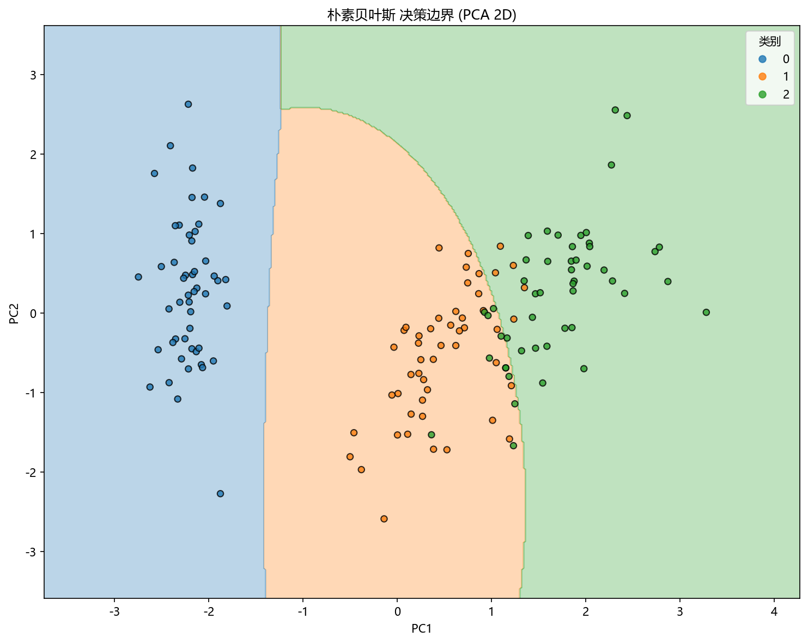

# 思路与直觉

> 对应代码：`data_generation/classification.py`、`pipelines/classification/naive_bayes.py`
>
> 对比对象：`docs/classification/svc/`

## 本章目标

1. 用直观方式理解 GaussianNB 到底在做什么。
2. 理解为什么它适合当前 iris 连续特征数据。
3. 理解它与更偏判别式方法在思路上的关键差异。

## 重点方法与概念速览

| 名称 | 类型 | 作用 |
|---|---|---|
| 概率分类 | 核心直觉 | 通过比较后验概率决定类别 |
| 类别先验 | 基础概率 | 反映各类别的基础出现比例 |
| 特征似然 | 概率建模 | 描述特征在某类别下出现的可能性 |
| 条件独立 | 简化假设 | 让高维概率建模变得可计算 |
| GaussianNB | 模型 | 用高斯分布描述连续特征 |

## 1. 为什么需要朴素贝叶斯

对于分类问题，我们不一定总是要先画出复杂边界。有时更自然的问题是：

如果样本属于某个类别，它的这些特征值出现的概率大不大？

朴素贝叶斯给出的思路是：

- 先看每个类别本来有多常见。
- 再看当前特征在每个类别下有多“像”这个类别。
- 最后选后验概率最大的类别。

### 理解重点

- 这是一种从概率生成过程出发的分类思路。
- 它不直接优化分类边界，而是比较不同类别对当前样本的解释能力。
- 这也是为什么它常被称为生成式分类器。

## 2. 为什么当前仓库示例里适合 GaussianNB

当前 Naive Bayes 数据来自 iris 数据集，特点是：

- 4 个连续值特征
- 3 个类别
- 样本规模适中、结构清晰

### 理解重点

- GaussianNB 假设每个类别下的每个特征近似服从高斯分布。
- iris 的连续特征形式，使这个假设在教学场景里非常自然。
- 当前分册的重点因此不是文本分类常见的词频型朴素贝叶斯，而是连续特征上的高斯版本。

## 3. 用“先验 + 似然”理解预测

可以把 GaussianNB 理解成：

1. 先看类别本来有多常见。
2. 再看当前样本的各个特征值，在这个类别下出现得是否自然。
3. 把这些信息合在一起，选最可能的类别。

### 示例代码

```text
对每个类别分别计算:
  先验概率 × 各特征在该类别下的概率
最后选择后验概率最大的类别
```

### 理解重点

- 这也是为什么 `predict_proba(...)` 在当前分册里很重要。
- 当前模型不仅能给出类别结果，还能给出每个类别的概率估计，这直接支撑了 ROC 曲线可视化。

## 4. 为什么叫“朴素”但仍然常常有效

### 理解重点

- “朴素”指的是条件独立假设，而不是算法没有价值。
- 即使特征在现实中不完全独立，这个假设也常常足够好，能带来稳定而高效的分类效果。
- 当前文档应强调：朴素贝叶斯的魅力就在于假设简单，但工程上仍然很实用。

## 5. 与 SVC 的直觉差异

两者的核心差异可以这样理解：

| 算法 | 更关注什么 | 核心依据 |
|---|---|---|
| SVC | 分类边界 | 间隔最大化与判别式边界 |
| GaussianNB | 类别下的数据分布 | 先验概率 + 条件概率 |

### 理解重点

- SVC 更像是在问：怎样画一条边界分开类别。
- GaussianNB 更像是在问：这个样本更像由哪个类别生成出来的。
- 当前 iris 多分类场景非常适合用这种生成式思路做入门说明。

## 可视化



## 常见坑

1. 把朴素贝叶斯理解成“低配版分类器”，而忽略它本质上是概率模型。
2. 把条件独立假设当成必须严格成立的现实前提。
3. 不区分连续特征的 GaussianNB 和其他朴素贝叶斯变体。
4. 只关注最终类别，不关注概率输出与类别先验。

## 小结

- GaussianNB 的直觉重点有两个：用概率做分类，以及用简单假设换取可计算性。
- 当前仓库使用 iris 连续特征数据，正好体现了高斯朴素贝叶斯的适用方式。
- 如果已经理解“为什么它先比较各类别的解释概率，再决定分类”，就已经抓住了本分册最核心的直觉。
