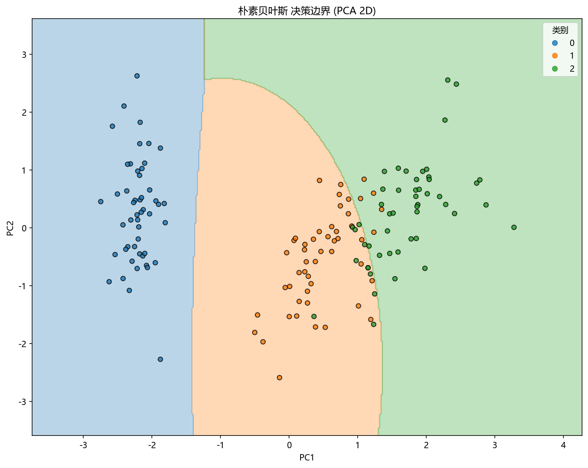

# 思路与直觉

## 本章目标

1. 用直观方式理解 GaussianNB 的生成式分类思路——从"数据怎么生成"出发，而非从"边界画在哪"出发。
2. 理解为什么 iris 的连续特征天然适合高斯假设。
3. 通过与其他分类算法的对比，建立 GaussianNB 在整个分类算法图中的定位。

## 重点方法与概念速览

| 名称 | 类型 | 作用 |
|---|---|---|
| 生成式分类 | 核心直觉 | 先建模 $P(\mathbf{x} \vert Y)$，再通过贝叶斯公式反推 $P(Y \vert \mathbf{x})$ |
| 类别先验 | 基础概率 | 反映各类别的基础出现比例 $P(Y=c_k) = n_k/N$ |
| 高斯似然 | 概率建模 | 在每个类别内用 $\mathcal{N}(\mu_{kj}, \sigma_{kj}^2)$ 描述每个连续特征的分布 |
| 条件独立 | 简化假设 | 假设特征间在给定类别后相互独立，使高维概率可计算 |
| 后验概率 | 决策依据 | 综合先验和似然，选出概率最大的类别 |

## 1. 生成式分类：从"数据怎么来"思考

大多数分类算法直接学习分类边界——即给定特征后直接输出类别。朴素贝叶斯走的是另一条路：

**先回答"如果样本属于类别 $c_k$，那它的特征值长什么样的概率最大"，再反推向"看到这组特征值，样本最可能属于哪一类"。**

这就是生成式模型的直觉核心：对 $P(\mathbf{x} \vert Y)$ 建模，而非直接建模 $P(Y \vert \mathbf{x})$。

### 理解重点

- 生成式视角的本质是：比较不同类别对当前样本的"解释能力"。
- 如果当前样本的特征值在类别 A 的高斯分布下很常见，在类别 B 下很罕见，那就倾向于选 A。
- 这与逻辑回归（直接拟合 $\sigma(\mathbf{w}^T \mathbf{x} + b)$）的判别式思路有本质区别——一个关心数据怎么生成，一个关心边界画在哪。

## 2. 为什么 iris 适合 GaussianNB

iris 数据集的四个特征（萼片长宽、花瓣长宽）都是连续测量值：

- 同类鸢尾花的花瓣长度通常在某个均值附近波动——这恰好是高斯分布能描述的模式。
- 三类鸢尾花的特征分布有明显的均值差异——这为基于似然的分类提供了区分力。

### 理解重点

- GaussianNB 在每个类别内为每个特征单独拟合一个高斯分布——iris 的连续特征与这一假设天然匹配。
- 如果换成文本词频数据（离散计数），应该用 MultinomialNB；如果换成二元特征，应该用 BernoulliNB。
- 当前分册选择 iris + GaussianNB 的组合，是朴素贝叶斯家族中最适合连续特征教学的配置。

## 3. 用"先验 + 似然"理解整个预测过程

可以把 GaussianNB 的预测想象成三步：

1. **先验判断**：在不看任何特征之前，先问"这个类别本身有多常见"——$P(Y=c_k)$
2. **似然评估**：对每个特征，计算"这个特征值在类别 $c_k$ 的高斯分布下有多自然"——$P(x_j \vert Y=c_k)$
3. **综合决策**：把先验和所有特征的似然乘起来（取对数相加），选得分最高的类别

$$
\hat{y} = \arg\max_{c_k} \left[ \ln P(Y=c_k) + \sum_{j=1}^{d} \ln P(x_j \vert Y=c_k) \right]
$$

### 理解重点

- 两个信息源：类别本身有多常见（先验）+ 当前特征值在这个类别下有多典型（似然）。
- 两者之间没有人为赋予的权重超参数——模型对先验和似然的信任完全由数据决定。
- 对数形式不是数学花招，而是工程必须——连乘 $d$ 个 $(0,1)$ 区间的概率值会迅速下溢到浮点数零。

## 4. 与其他分类算法的直觉对比

| 算法 | 核心问题 | 回答方式 | 是否需要迭代优化 |
|---|---|---|---|
| GaussianNB | 这个样本更像由哪个类别生成的？ | 比较各类别下的 $P(\mathbf{x} \vert Y) \cdot P(Y)$ | 否——统计量一步到位 |
| 逻辑回归 | 正类和负类之间的分界线长什么样？ | 拟合 $\sigma(\mathbf{w}^T \mathbf{x} + b)$ 的权重 $\mathbf{w}$ | 是——`lbfgs` 迭代优化交叉熵 |
| KNN | 周围最近的邻居投给哪个类别？ | 在训练集中找到最近邻，多数表决 | 否——但需要遍历全部训练集 |
| 决策树 | 按哪个特征在哪个阈值切分最好？ | 递归选择使 Gini/Entropy 下降最快的分裂 | 是——递归贪心搜索分裂点 |

### 理解重点

- GaussianNB 的独特之处在于：它既不像逻辑回归那样迭代优化，也不像 KNN 那样依赖全部训练集做预测——参数估计极快，预测也极快。
- 但代价是两项强假设：① 每类内特征服从高斯分布；② 给定类别后特征条件独立。在真实数据上这两者都可能被违反。
- 理解 GaussianNB 与其他算法的直觉差异，是理解"何时选它、何时不选它"的基础。

## 5. "朴素"假设的直觉

条件独立假设 $P(\mathbf{x} \vert Y) = \prod_j P(x_j \vert Y)$ 在直觉上意味着：

**在已知类别的条件下，每个特征独立地提供自己的证据，各说各的，互不商量。**

- 对于 iris：模型分别看"萼片长度在类别 0 下多典型""萼片宽度在类别 0 下多典型"……然后把四条证据简单相乘。
- 它不会捕捉"萼片长度和萼片宽度通常一起变化"这样的相关性。

### 理解重点

- 这个假设在真实数据里几乎从不严格成立，但朴素贝叶斯在实践中仍然经常表现良好。
- 原因在于：即使概率估计有偏差，只要各类别的得分排序正确，分类决策就不受影响。
- 这也是朴素贝叶斯的魅力所在——用极其简单的假设换取计算上的极大便利。

## 可视化

## 常见坑

1. 把朴素贝叶斯理解成"简化版分类器"而忽略它本质上是概率生成模型——它对 $P(\mathbf{x} \vert Y)$ 的建模方式与其他算法完全不同。
2. 把"条件独立"假设当成必须严格成立的现实前提，而不是计算可行性上的实用简化。
3. 不区分 GaussianNB（连续高斯似然）和其他朴素贝叶斯变体（MultinomialNB、BernoulliNB、ComplementNB）。
4. 只关注最终类别预测，忽略 `predict_proba(...)` 给出的后验概率信息。

## 小结

- GaussianNB 的直觉核心是生成式分类：先理解每类数据长什么样，再看当前样本更像由哪类生成。
- iris 连续特征与高斯建模的天然适配，使这个组合成为教学场景中的理想选择。
- 条件独立假设是朴素贝叶斯最大的简化——它带来了极致的计算效率，代价是概率估计可能不精确，但排序往往仍是正确的。
