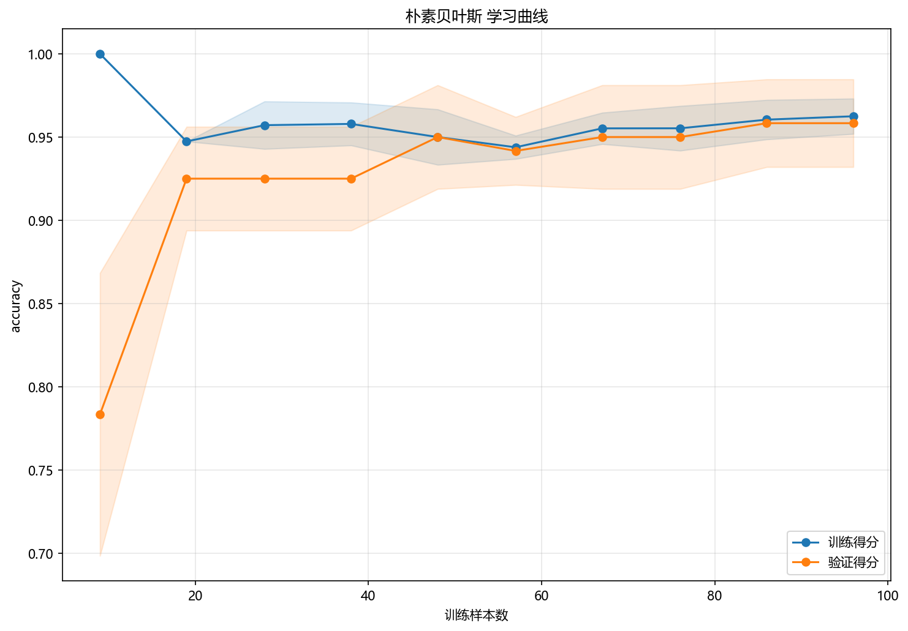

# 训练与预测

> 对应代码：`pipelines/classification/naive_bayes.py`、`model_training/classification/naive_bayes.py`
>
> 运行方式：`python -m pipelines.classification.naive_bayes`

## 本章目标

1. 按源码顺序看清当前 Naive Bayes 流水线到底执行了哪些步骤。
2. 理解训练集/测试集拆分、标准化、训练、类别预测和概率预测之间的连接关系。
3. 理解主模型与二维可视化模型在当前实现中的职责差异。

## 重点方法与概念速览

| 名称 | 类型 | 作用 |
|---|---|---|
| `naive_bayes_data.copy()` | 方法 | 复制原始数据，避免修改源对象 |
| `train_test_split(...)` | 方法 | 划分训练集与测试集 |
| `StandardScaler` | 类 | 对训练/测试特征做一致的标准化处理 |
| `train_model(X_train_s, y_train)` | 函数 | 训练主 `GaussianNB` 模型 |
| `model.predict(X_test_s)` | 方法 | 生成测试集类别预测结果 |
| `model.predict_proba(X_test_s)` | 方法 | 生成测试集类别概率输出 |
| `PCA(n_components=2)` | 类 | 为决策边界可视化构造二维表示 |
| `model_2d` | 模型 | 专门用于二维决策边界展示 |

## 1. 流水线从复制数据开始

### 示例代码

```python
data = naive_bayes_data.copy()
X = data.drop(columns=["label"])
y = data["label"]
```

### 理解重点

- 当前流水线先复制 `naive_bayes_data`，再拆出 `X` 和 `y`。
- 这和回归分册保持一致，体现了“原始数据只读、流程内部再处理”的习惯。
- 当前任务是监督多分类，因此 `y` 会真实参与训练和预测评估。

## 2. 先切分训练集与测试集

### 示例代码

```python
X_train, X_test, y_train, y_test = train_test_split(
    X, y, test_size=0.2, random_state=42, stratify=y
)
```

### 理解重点

- 当前流水线明确区分了训练阶段和测试阶段。
- `stratify=y` 的作用，是让训练集和测试集保持相近的类别比例。
- 对当前 iris 三分类任务来说，这是很常见也很必要的工程细节。

## 3. 标准化只在训练集上拟合

### 参数速览（本节）

适用 API（分项）：

1. `StandardScaler().fit_transform(X_train)`
2. `StandardScaler().transform(X_test)`

| 参数名 | 当前对象 | 说明 |
|---|---|---|
| `X_train` | 训练特征 | 用于拟合标准化统计量 |
| `X_test` | 测试特征 | 使用训练集统计量进行变换 |
| 返回值 | `X_train_s`、`X_test_s` | 标准化后的训练/测试特征 |

### 示例代码

```python
scaler = StandardScaler()
X_train_s = scaler.fit_transform(X_train)
X_test_s = scaler.transform(X_test)
```

### 理解重点

- 标准化必须发生在切分之后，否则会造成数据泄露。
- 虽然 GaussianNB 本身不是最依赖尺度的模型，但当前流水线仍然采用统一的标准化流程，便于整个分类分册保持一致，也服务于后续 PCA 可视化。
- 文档中应明确 `X_train_s`、`X_test_s` 都是源码里真实使用的变量名。

## 4. 主模型训练与正式预测

### 示例代码

```python
model = train_model(X_train_s, y_train)
y_pred = model.predict(X_test_s)
```

### 理解重点

- `model` 是当前分册的主模型，用于正式训练和测试集类别预测。
- `y_pred` 是后续混淆矩阵评估的直接输入。
- 这部分才是当前 Naive Bayes 主流程中的“正式类别预测”。

## 5. 概率输出如何进入流水线

### 示例代码

```python
y_scores = model.predict_proba(X_test_s)
```

### 理解重点

- `predict_proba(...)` 是当前 Naive Bayes 分册的重要接口，因为它直接提供每个类别的预测概率。
- 这些概率输出不是可有可无的附带信息，而是 ROC 曲线可视化的直接输入。
- 这也是当前分册与很多只看 `predict(...)` 的基础分类示例不同的地方。

## 6. 决策边界为什么要额外训练一个 `model_2d`

当前流水线里还有这样一段逻辑：

### 示例代码

```python
pca = PCA(n_components=2, random_state=42)
X_all_s = scaler.transform(X)
X_2d = pca.fit_transform(X_all_s)
model_2d = GaussianNB()
model_2d.fit(pca.transform(X_train_s), y_train)
```

### 理解重点

- 这里的 `model_2d` 不是主评估模型，而是专门为二维可视化服务的辅助模型。
- 主模型训练在标准化后的原特征空间中，而决策边界图需要二维输入。
- 因此当前实现采用 `PCA` 把特征投影到二维空间，再单独训练一个二维 `GaussianNB` 用来画图。
- 这是整个 Naive Bayes 分册里最需要讲清的工程细节之一。

## 7. 学习曲线如何接入流水线

### 示例代码

```python
plot_learning_curve(
    GaussianNB(),
    X_train_s,
    y_train,
    title="朴素贝叶斯 学习曲线",
    dataset_name=DATASET,
    model_name=MODEL,
)
```

### 理解重点

- 学习曲线使用的是一个新的 `GaussianNB()` 实例，而不是直接复用 `model`。
- 这是因为学习曲线函数内部会自行克隆和重复训练模型。
- 当前文档需要把”主模型用于正式预测”和”新模型实例用于曲线诊断”区分清楚。

## 训练诊断可视化



## 常见坑

1. 把 `predict(...)` 和 `predict_proba(...)` 混为一谈。
2. 把 `model_2d` 误认为正式预测模型本体。
3. 忘记标准化必须在训练集上 `fit`、在测试集上 `transform`。
4. 混淆主模型预测、二维可视化模型和学习曲线模型三者的职责。

## 小结

- 当前 Naive Bayes 流水线的训练过程非常清晰：复制数据、切分、标准化、训练主模型、测试集类别预测、概率预测、再做多种可视化诊断。
- 对本仓库而言，`model`、`model_2d` 和学习曲线中的新模型实例分别承担不同职责。
- 把这条链路看清楚后，再读评估与工程实现章节会更容易建立全局理解。
