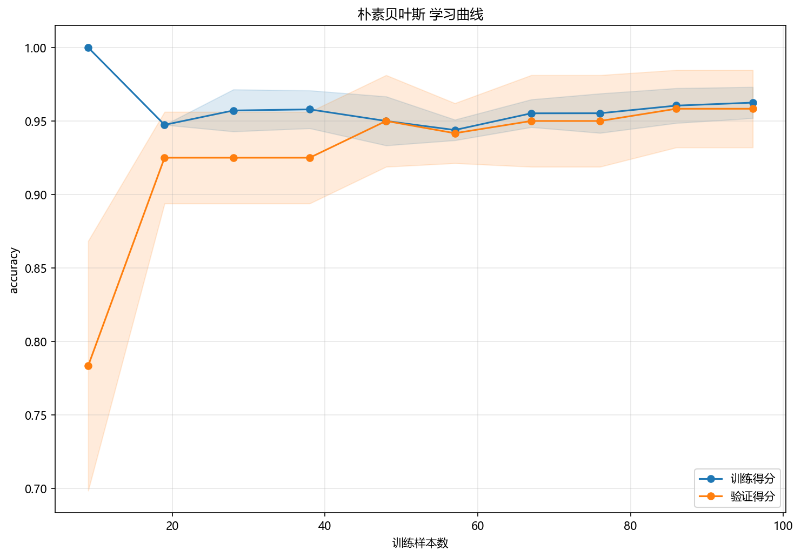

# 训练与预测

## 本章目标

1. 按源码顺序看清当前 Naive Bayes 流水线从数据复制到概率输出的完整步骤。
2. 理解主模型 (`model`)、二维可视化模型 (`model_2d`) 和学习曲线实例三者的职责边界。
3. 理解 `predict(...)` 与 `predict_proba(...)` 在 Naive Bayes 中分别对应什么数学计算。

## 重点方法与概念速览

| 名称 | 类型 | 作用 |
|---|---|---|
| `naive_bayes_data.copy()` | 方法 | 复制原始数据，避免后续处理修改源对象 |
| `train_test_split(...)` | 函数 | 按 `stratify=y` 划分训练/测试集 |
| `StandardScaler` | 类 | 对特征做一致性标准化——训练集 `fit_transform`，测试集 `transform` |
| `train_model(...)` | 函数 | 训练主 `GaussianNB` 模型，返回含 `theta_`、`var_` 的模型对象 |
| `model.predict(X_test_s)` | 方法 | 输出测试集类别预测——选择后验概率最大的类别 |
| `model.predict_proba(X_test_s)` | 方法 | 输出测试集各类别的后验概率 $P(Y=c_k \vert \mathbf{x})$ |
| `PCA(n_components=2)` | 类 | 将 4 维特征投影到 2 维，为决策边界可视化提供服务 |
| `model_2d` | 模型 | 在 PCA 2D 空间单独训练的 `GaussianNB`，专用于决策边界绘图 |

## 1. 流水线起点：复制数据并拆出特征/标签

### 示例代码

```python
data = naive_bayes_data.copy()
X = data.drop(columns=["label"])
y = data["label"]
```

### 理解重点

- `.copy()` 确保后续处理不修改在模块导入时已经加载的全局 `naive_bayes_data`。
- 当前任务是有监督多分类，因此 `y` 既参与训练 `fit(X_train_s, y_train)`，也参与评估（混淆矩阵、ROC）。
- 这一步只是数据准备，不涉及任何算法逻辑。

## 2. 训练/测试集切分

### 参数速览

适用函数：`train_test_split(X, y, test_size=0.2, random_state=42, stratify=y)`

| 参数名 | 类型 | 说明 | 示例取值 |
|---|---|---|---|
| `X` | `DataFrame` | 特征矩阵，形状 $(150, 4)$ | `X` |
| `y` | `Series` | 标签向量，取值 $y_i \in \{0, 1, 2\}$ | `y` |
| `test_size` | `float` | 测试集占比。150 × 0.2 = 30 测试样本，120 训练样本 | `0.2` |
| `random_state` | `int` | 随机种子，保证切分可复现 | `42` |
| `stratify` | `array_like` | 传入 `y` 使训练/测试集类别比例与原始数据一致 | `y` |

### 示例代码

```python
X_train, X_test, y_train, y_test = train_test_split(
    X, y, test_size=0.2, random_state=42, stratify=y
)
```

### 理解重点

- `stratify=y` 在小样本（150 条）多分类（3 类）场景下尤其重要——确保训练集和测试集都包含三类样本。
- 切分必须在标准化之前执行，否则测试集信息会通过均值和标准差泄露到训练流程中。

## 3. 标准化

### 参数速览

适用 API：`StandardScaler().fit_transform(X_train)` / `StandardScaler().transform(X_test)`

| 参数名 | 类型 | 说明 | 示例取值 |
|---|---|---|---|
| `X_train` | `array_like`，形状 $(120, 4)$ | 训练特征矩阵，用于计算 $\mu_j, \sigma_j$ 并原地标准化 | `X_train` |
| `X_test` | `array_like`，形状 $(30, 4)$ | 测试特征矩阵，使用训练集统计量进行标准化变换 | `X_test` |
| 输出 | `ndarray` | $z_{ij} = (x_{ij} - \mu_j) / \sigma_j$，每个特征化为均值 0 标准差 1 | `X_train_s`、`X_test_s` |

### 示例代码

```python
scaler = StandardScaler()
X_train_s = scaler.fit_transform(X_train)
X_test_s = scaler.transform(X_test)
```

### 理解重点

- 标准化后每个特征的尺度统一，使得方差估计不受原始量纲（如萼片长度以 cm 为单位）的影响。
- 虽然 GaussianNB 不依赖梯度优化，但标准化有利于 PCA 可视化和跨特征方差比较。
- 当前仓库在所有分类流水线中统一保留标准化步骤——这是工程一致性设计，而非 GaussianNB 的硬性要求。

## 4. 主模型训练与硬分类预测

### 参数速览

适用 API：`train_model(X_train_s, y_train)` → `model.predict(X_test_s)`

| 参数名 | 类型 | 说明 | 示例取值 |
|---|---|---|---|
| `X_train_s` | `ndarray`，形状 $(120, 4)$ | 标准化后的训练特征，传入 `GaussianNB.fit()` | `X_train_s` |
| `y_train` | `array_like` | 训练标签，用于统计各类别样本数及各类别下各特征的 $\mu_{kj}$、$\sigma_{kj}^2$ | `y_train` |
| `X_test_s` | `ndarray`，形状 $(30, 4)$ | 标准化后的测试特征，传入 `model.predict()` | `X_test_s` |
| 返回值 (`y_pred`) | `ndarray`，形状 $(30,)$ | 硬分类预测标签，来自 MAP 决策 $\hat{y} = \arg\max_c [\ln P(c) + \sum \ln P(x_j \vert c)]$ | `y_pred` |

### 示例代码

```python
model = train_model(X_train_s, y_train)
y_pred = model.predict(X_test_s)
```

### 理解重点

- `train_model(...)` 的 `fit()` 内部：扫描数据 → 统计 $n_k$ → 估计 $P(Y=c_k)$ → 每类每特征计算 $\mu_{kj}$ 和 $\sigma_{kj}^2$ → 应用 `var_smoothing`。不涉及任何迭代。
- `predict(...)` 内部：对每个测试样本计算所有类别的后验概率（对数形式），选最大值——这是纯粹的代数运算。
- `y_pred` 是后续混淆矩阵的直接输入。

## 5. 概率输出

### 参数速览

适用 API：`model.predict_proba(X_test_s)`

| 参数名 | 类型 | 说明 | 示例取值 |
|---|---|---|---|
| `X_test_s` | `ndarray`，形状 $(30, 4)$ | 标准化后的测试特征 | `X_test_s` |
| 返回值 (`y_scores`) | `ndarray`，形状 $(30, 3)$ | 每个测试样本属于各类别的后验概率 $P(Y=c_k \vert \mathbf{x})$，每行和为 1 | `y_scores` |

### 示例代码

```python
y_scores = model.predict_proba(X_test_s)
```

### 理解重点

- GaussianNB 的概率输出来自贝叶斯公式：$P(c_k \vert \mathbf{x}) \propto P(c_k) \prod_j \mathcal{N}(x_j \vert \mu_{kj}, \sigma_{kj}^2)$。
- 这些概率是连续的，因为高斯似然是连续分布——这与 KNN 的离散邻域频率概率输出本质不同。
- `y_scores` 直接支撑多分类 One-vs-Rest ROC 曲线：三分类任务会对每个类别各画一条 ROC。

## 6. 决策边界需要单独训练 `model_2d`

### 参数速览

| 参数名 | 类型 | 说明 | 示例取值 |
|---|---|---|---|
| `pca` | `PCA(n_components=2, random_state=42)` | 将 4 维标准化特征投影到 2 维主成分空间 | `pca` |
| `X_all_s` | `ndarray`，形状 $(150, 4)$ | 全量标准化特征，用于 PCA 拟合 | `scaler.transform(X)` |
| `X_2d` | `ndarray`，形状 $(150, 2)$ | PCA 二维投影后的全量特征，用于画散点 | `pca.fit_transform(X_all_s)` |
| `model_2d` | `GaussianNB()` | 在 PCA 二维空间单独训练的高斯朴素贝叶斯，专用于决策边界绘图 | `model_2d` |

### 示例代码

```python
pca = PCA(n_components=2, random_state=42)
X_all_s = scaler.transform(X)
X_2d = pca.fit_transform(X_all_s)
model_2d = GaussianNB()
model_2d.fit(pca.transform(X_train_s), y_train)
```

### 理解重点

- `model_2d` 不是主评估模型——它的唯一目的是在二维空间提供可绘制的决策边界。
- 主模型 `model` 训练在原始 4 维标准化空间，`model_2d` 训练在 PCA 2 维空间——两者是独立的对象，职责完全不同。
- PCA 降维会损失信息，因此 `model_2d` 的边界只是原始高维分类面的近似投影展示。

## 7. 学习曲线使用新的模型实例

### 参数速览

适用函数：`plot_learning_curve(GaussianNB(), X_train_s, y_train, ...)`

| 参数名 | 类型 | 说明 | 示例取值 |
|---|---|---|---|
| `estimator` | `GaussianNB` | 新创建的 `GaussianNB()` 实例，学习曲线内部会克隆和重复训练 | `GaussianNB()` |
| `X` | `ndarray`，形状 $(120, 4)$ | 标准化后的训练特征矩阵 | `X_train_s` |
| `y` | `array_like` | 训练标签向量 | `y_train` |
| `scoring` | `str` | 评分类指标，当前取 `"accuracy"` | `"accuracy"` |
| `cv` | `int` | 交叉验证折数，默认 `5` | `5` |

### 示例代码

```python
plot_learning_curve(
    GaussianNB(),
    X_train_s,
    y_train,
    title="朴素贝叶斯 学习曲线",
    dataset_name=DATASET,
    model_name=MODEL,
)
```

### 理解重点

- 传入的是 `GaussianNB()` 新实例而非 `model`——因为 `plot_learning_curve` 内部会通过 `learning_curve()` 函数多次克隆和训练模型。
- 学习曲线函数会按不同训练样本量（如 10%、33%、55%、78%、100%）做交叉验证，绘制训练得分和验证得分的变化趋势。

## 训练诊断可视化



## 常见坑

1. 把 `predict(...)` 和 `predict_proba(...)` 混为一谈——前者用于混淆矩阵（硬分类标签），后者用于 ROC 曲线（概率输出）。
2. 把 `model_2d` 误认为正式预测模型——它只在 PCA 2D 空间训练，仅服务于决策边界可视化。
3. 忘记标准化必须在训练集上 `fit_transform`、测试集上 `transform`——在切分之前标准化是数据泄露。
4. 混淆主模型（4 维空间正式预测）、二维可视化模型（PCA 空间画边界）和学习曲线模型（CV 循环克隆）的三者职责。

## 小结

- 当前 Naive Bayes 流水线的训练过程：复制数据 → 特征/标签拆分 → 切分（`stratify=y`）→ 标准化 → 训练主模型 → 硬分类预测 → 概率输出。
- 三个模型实例各司其职：`model`（4 维主评估）、`model_2d`（PCA 2D 可视化）、`GaussianNB()`（学习曲线克隆）。
- GaussianNB 的训练（`fit`）和预测（`predict`/`predict_proba`）都是纯代数运算，不涉及迭代——这是它在工程上区别于逻辑回归的最显著特征。
