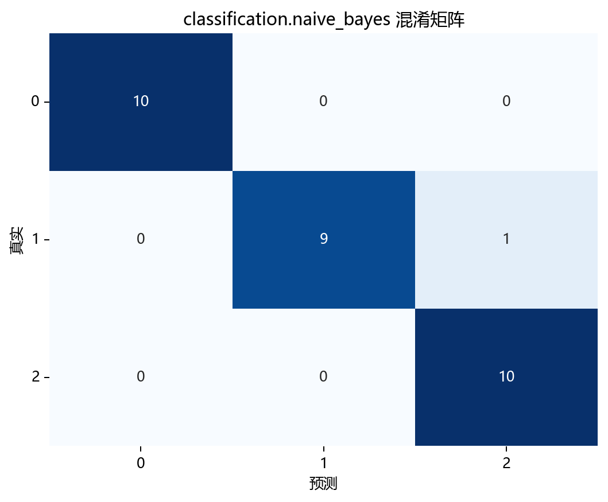
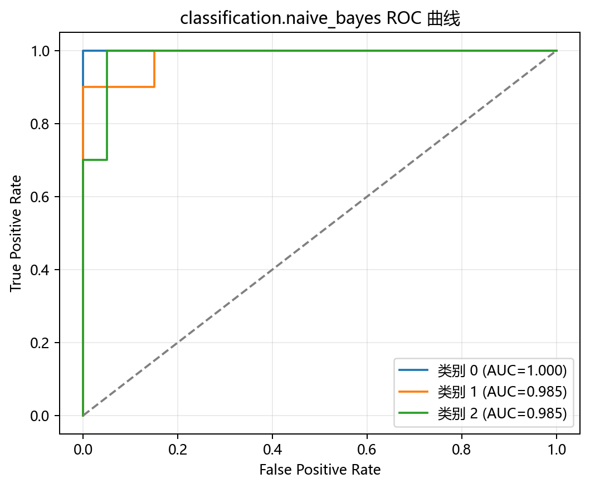

# 评估与诊断

## 本章目标

1. 明确当前仓库 Naive Bayes 实现的四种评估手段及其分别回答的问题。
2. 理解 3×3 混淆矩阵、One-vs-Rest ROC 曲线和 PCA 决策边界图在多分类场景下的解读方式。
3. 理解 GaussianNB 的独有可解释性来源——`theta_`、`var_`、`class_prior_`——而非决策树式的特征重要性。

## 重点方法与概念速览

| 名称 | 类型 | 作用 |
|---|---|---|
| `y_pred` | 预测结果 | 测试集类别输出，由 MAP 决策 $\arg\max_c [\ln P(c) + \sum \ln P(x_j \vert c)]$ 产生 |
| `y_scores` | 预测概率 | 测试集各类别后验概率，来自贝叶斯公式后验归一化 |
| `plot_confusion_matrix(...)` | 函数 | 绘制 3×3 多分类混淆矩阵 |
| `plot_roc_curve(...)` | 函数 | 绘制多分类 One-vs-Rest ROC 曲线——每类别一条 |
| `plot_decision_boundary(...)` | 函数 | 绘制 PCA 2D 空间下的分类边界 |
| `plot_learning_curve(...)` | 函数 | 绘制训练/验证得分随样本量变化的曲线 |

## 1. 当前仓库的评估入口

当前 Naive Bayes 流水线里的主要诊断手段有四个：

1. 混淆矩阵 —— 回答"分对了多少？哪两类最容易混淆？"
2. ROC 曲线（One-vs-Rest）—— 回答"每个类别的概率区分能力如何？"
3. PCA 2D 决策边界图 —— 回答"在二维投影视角下，边界长什么样？"
4. 学习曲线 —— 回答"更多训练样本还能提升表现吗？"

### 示例代码

```python
y_pred = model.predict(X_test_s)
y_scores = model.predict_proba(X_test_s)

plot_confusion_matrix(...)
plot_roc_curve(...)
plot_decision_boundary(...)
plot_learning_curve(...)
```

### 理解重点

- 四种可视化分别回答不同问题，不能互相替代。
- GaussianNB 没有决策树式的特征重要性评估（`feature_importances_`），也没有逻辑回归式的 `coef_` 系数解释——但它有 `theta_`（各类别下特征均值差异）和 `class_prior_`（先验概率）提供概率视角的可解释性。
- 对教学型仓库来说，这种多视角诊断设计比只打印一个准确率数字更利于理解模型行为。

## 2. 混淆矩阵能观察什么

对于 iris 三分类任务，混淆矩阵 $\mathbf{C}$ 是一个 $3 \times 3$ 矩阵：

$$
C_{ij} = \text{真实类别 } i \text{ 被预测为类别 } j \text{ 的样本数}
$$

### 参数速览

适用函数：`plot_confusion_matrix(y_true, y_pred, ...)`

| 参数名 | 类型 | 说明 | 示例取值 |
|---|---|---|---|
| `y_true` | `array_like`，形状 `(n_samples,)` | 测试集真实标签，$y_i \in \{0, 1, 2\}$ | `y_test` |
| `y_pred` | `array_like`，形状 `(n_samples,)` | 模型预测标签，来自 MAP 硬分类 | `y_pred` |
| `normalize` | `bool` 或 `str` | 归一化方式。`True`/`'true'` 按行（真实类别），`'pred'` 按列，`'all'` 按全体。默认 `False` | `True`、`'true'` |

### 示例代码

```python
plot_confusion_matrix(
    y_true=y_test,
    y_pred=y_pred,
    title="朴素贝叶斯 混淆矩阵",
    dataset_name=DATASET,
    model_name=MODEL,
)
```

### 理解重点

- 在 iris 三分类上，混淆矩阵最能揭示哪些类别之间容易混淆——例如 Versicolour 和 Virginica 在特征空间中有重叠，误分类通常集中在这两类之间。
- Setosa 通常与另两类完全分离，对应对角线上的高值。
- 矩阵已经隐式包含计算 Accuracy、Precision、Recall、F1 所需的所有信息（各类的 TP、FP、FN），但当前仓库未显式计算这些指标。

## 3. ROC 曲线能观察什么（多分类 One-vs-Rest）

多分类 ROC 采用 One-vs-Rest 策略：对每个类别 $c_k$，将其视为"正类"，其余两类合并为"负类"，分别画一条 ROC。

$$
\text{TPR}_k = \frac{\text{TP}_k}{\text{TP}_k + \text{FN}_k}, \quad
\text{FPR}_k = \frac{\text{FP}_k}{\text{FP}_k + \text{TN}_k}
$$

### 参数速览

适用函数：`plot_roc_curve(y_test, y_scores, ...)`

| 参数名 | 类型 | 说明 | 示例取值 |
|---|---|---|---|
| `y_true` | `array_like`，形状 `(n_samples,)` | 测试集真实标签，$y_i \in \{0, 1, 2\}$ | `y_test` |
| `y_scores` | `array_like`，形状 `(n_samples, 3)` | 各类别后验概率，来自 `model.predict_proba(X_test_s)` | `y_scores` |

### 示例代码

```python
plot_roc_curve(
    y_test,
    y_scores,
    title="朴素贝叶斯 ROC 曲线",
    dataset_name=DATASET,
    model_name=MODEL,
)
```

### 理解重点

- 与逻辑回归（二分类，一条 ROC）不同，iris 的三分类任务会生成三条 ROC 曲线——每条对应一个类别 vs 其余类别。
- GaussianNB 的概率输出来自贝叶斯后验概率的归一化，是连续值——因此 ROC 曲线是平滑的。这与 KNN 的离散邻域频率形成对比。
- 三条 ROC 曲线的 AUC 可以直观比较哪些类别的概率区分力强、哪些弱。

## 4. PCA 2D 决策边界图能观察什么

### 参数速览

适用函数：`plot_decision_boundary(model_2d, X_2d, y.values, ...)`

| 参数名 | 类型 | 说明 | 示例取值 |
|---|---|---|---|
| `model_2d` | `GaussianNB` | 在 PCA 二维空间单独训练的朴素贝叶斯模型 | `model_2d` |
| `X_2d` | `ndarray`，形状 `(150, 2)` | 标准化后 PCA 投影到二维的全量特征 | `X_2d` |
| `y` | `array_like`，形状 `(150,)` | 全量标签数组，用于散点的真实类别着色 | `y.values` |

### 示例代码

```python
plot_decision_boundary(
    model_2d,
    X_2d,
    y.values,
    title="朴素贝叶斯 决策边界 (PCA 2D)",
    dataset_name=DATASET,
    model_name=MODEL,
)
```

### 理解重点

- GaussianNB 的决策边界由高斯似然等高线相交形成——在二维空间中是二次曲线（椭圆相交），而非逻辑回归的直线或决策树的轴对齐分段。
- 但这是 PCA 投影空间中的近似展示，原始 4 维特征空间中的决策面是三区域的高斯密度比较。
- 三个类别的区域大小和形状可以直观反映各类别高斯分布的方差估计差异。

## 5. 学习曲线能观察什么

### 参数速览

适用函数：`plot_learning_curve(estimator, X, y, ...)`

| 参数名 | 类型 | 说明 | 示例取值 |
|---|---|---|---|
| `estimator` | `GaussianNB` | 新创建的 `GaussianNB()` 实例——内部会通过 CV 克隆并重复训练 | `GaussianNB()` |
| `X` | `ndarray`，形状 `(120, 4)` | 标准化后的训练特征矩阵 | `X_train_s` |
| `y` | `array_like` | 训练标签向量 | `y_train` |
| `scoring` | `str` | 评分指标，默认 `"accuracy"` | `"accuracy"` |
| `cv` | `int` | 交叉验证折数，默认 `5` | `5` |
| `train_sizes` | `array_like` | 训练样本量的递增序列，默认为 `np.linspace(0.1, 1.0, 5)` | `[0.1, 0.33, 0.55, 0.78, 1.0]` |

### 示例代码

```python
plot_learning_curve(
    GaussianNB(),
    X_train_s,
    y_train,
    title="朴素贝叶斯 学习曲线",
    dataset_name=DATASET,
    model_name=MODEL,
)
```

### 理解重点

- GaussianNB 的参数极少（每类每特征只需估计 $\mu$ 和 $\sigma^2$），因此即使训练样本量小也能获得稳定估计——学习曲线通常在较早阶段就趋于平稳。
- 训练得分和验证得分通常很接近，反映了简单模型的低方差特性。
- 如果验证得分远低于训练得分，说明高斯假设或条件独立假设在当前数据上偏离较大。

## 6. 当前实现中尚未纳入但常见的分类指标

| 指标 | 公式 | 说明 |
|---|---|---|
| 准确率（Accuracy） | $\frac{\text{TP} + \text{TN}}{\text{TP} + \text{TN} + \text{FP} + \text{FN}}$ | 整体正确率，多分类中即对角线之和除以总和 |
| 精确率（Precision） | $\frac{\text{TP}}{\text{TP} + \text{FP}}$ | 预测为正类中有多少真实正类——多分类可取宏平均/微平均 |
| 召回率（Recall） | $\frac{\text{TP}}{\text{TP} + \text{FN}}$ | 真实正类中有多少被正确找出 |
| F1 分数 | $2 \cdot \frac{\text{Precision} \cdot \text{Recall}}{\text{Precision} + \text{Recall}}$ | 精确率与召回率的调和平均 |

### 理解重点

- 当前仓库未在 Naive Bayes 流水线中显式打印这些指标——文档可以提到它们作为扩展方向，但不能写成"当前源码已在单独计算"。
- 混淆矩阵已经隐式包含了计算这些指标所需的所有信息。
- 对于多分类任务，宏平均（每类指标求均值）和微平均（全局统计再计算）是两个常见选择。

## 评估图表





## 常见坑

1. 把 `predict(...)` 和 `predict_proba(...)` 的用途混为一谈——前者用于混淆矩阵，后者用于 ROC。
2. 把多分类 ROC（One-vs-Rest，三条曲线）误解为只有一条全局曲线。
3. 把 PCA 决策边界图误认为原始 4 维特征空间决策面的完整表达——它只是二维投影近似。
4. 把当前仓库未显式计算的 accuracy、precision、recall、f1 写成现有流程的一部分。

## 小结

- 当前仓库对 Naive Bayes 的评估：混淆矩阵看错误分布（3×3 多分类），ROC 曲线看各类别概率区分力（One-vs-Rest 三条），PCA 决策边界图看二维投影边界形状，学习曲线看样本量对表现的影响趋势。
- GaussianNB 不产生 `feature_importances_`（决策树）或 `coef_`（逻辑回归），但其 `theta_`（各类别下各特征均值）和 `var_`（各类别下各特征方差）提供了生成式视角下的可解释性。
- 四项评估组合起来，能全面解释 `GaussianNB(var_smoothing=1e-9)` 在 iris 三分类任务上的实际表现。
