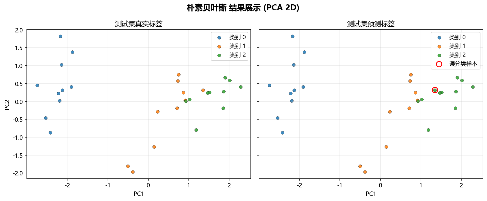

# 工程实现

## 本章目标

1. 从工程角度看清 Naive Bayes 在本仓库中的完整调用链。
2. 理解数据加载、模型训练、流水线编排和结果可视化分别负责什么。
3. 理解 GaussianNB 工程实现与其他分类算法的关键差异——无需迭代、极简封装。

## 对应代码速览

| 组件 | 路径 | 说明 |
|---|---|---|
| 数据生成 | `data_generation/classification.py` | `ClassificationData.naive_bayes()` 加载 iris 真实数据集 |
| 数据导出 | `data_generation/__init__.py` | 向外暴露 `naive_bayes_data` |
| 训练封装 | `model_training/classification/naive_bayes.py` | 构建并训练 `GaussianNB`，打印 `classes_`、`class_prior_` |
| 流水线入口 | `pipelines/classification/naive_bayes.py` | 组织切分、标准化、训练、预测与可视化的完整编排 |
| 混淆矩阵可视化 | `result_visualization/confusion_matrix.py` | 绘制并保存 3×3 多分类混淆矩阵图 |
| ROC 曲线可视化 | `result_visualization/roc_curve.py` | 绘制并保存多分类 One-vs-Rest ROC 曲线图 |
| 决策边界可视化 | `result_visualization/decision_boundary.py` | 绘制并保存 PCA 二维决策边界图 |
| 学习曲线可视化 | `result_visualization/learning_curve.py` | 绘制并保存训练/验证得分曲线图 |

## 1. 端到端运行入口

### 示例代码

```bash
python -m pipelines.classification.naive_bayes
```

### 理解重点

- 这个命令串起当前 Naive Bayes 分册中最核心的工程流程。
- 依次完成：数据复制 → 特征/标签拆分 → 切分 → 标准化 → GaussianNB `fit()`（统计 $\mu_{kj}$、$\sigma_{kj}^2$）→ 预测 → 概率输出 → 四种可视化。
- 对大多数读者来说，`pipelines/classification/naive_bayes.py` 是理解工程实现的最佳起点。

## 2. `run()` 串起了整个流程

当前流水线的核心函数 `run()` 采用线性编排风格：

```python
def run():
    # 1. 复制数据 & 拆出特征/标签
    data = naive_bayes_data.copy()
    X = data.drop(columns=["label"])
    y = data["label"]

    # 2. 划分训练/测试集
    X_train, X_test, y_train, y_test = train_test_split(
        X, y, test_size=0.2, random_state=42, stratify=y
    )

    # 3. 标准化（仅训练集上 fit）
    scaler = StandardScaler()
    X_train_s = scaler.fit_transform(X_train)
    X_test_s = scaler.transform(X_test)

    # 4. 统计各类别的先验、均值和方差 & 正式预测
    model = train_model(X_train_s, y_train)
    y_pred = model.predict(X_test_s)
    y_scores = model.predict_proba(X_test_s)

    # 5. 可视化诊断（混淆矩阵、ROC、决策边界、学习曲线）
    plot_confusion_matrix(y_test, y_pred, ...)
    plot_roc_curve(y_test, y_scores, ...)
    plot_decision_boundary(model_2d, X_2d, y.values, ...)
    plot_learning_curve(GaussianNB(), X_train_s, y_train, ...)
```

### 理解重点

- `run()` 的职责是编排，不是算法实现——真正的训练在 `GaussianNB.fit()`（统计 $\mu_{kj}$ 和 $\sigma_{kj}^2$）中。
- 数据流是单向的：数据 → 切分 → 标准化 → 参数估计 → 预测 → 评估。
- 与其他分类流水线（逻辑回归、KNN、决策树）结构高度一致——统一采用"数据准备 → 训练 → 预测 → 四类可视化"的模式。

## 3. 训练模块负责什么

`model_training/classification/naive_bayes.py` 里的 `train_model(...)` 主要负责四件事：

1. 创建 `GaussianNB(var_smoothing=1e-9)` 实例
2. 调用 `model.fit(X_train, y_train)`——纯统计计算：计数 $n_k$，估计 $P(Y=c_k)$、$\mu_{kj}$、$\sigma_{kj}^2$
3. 打印训练日志：耗时、`var_smoothing`、`classes_`、`class_prior_`
4. 返回训练完成的主模型对象

### 参数速览

适用函数：`train_model(X_train, y_train, var_smoothing=1e-9)`

| 参数名 | 类型 | 说明 | 示例取值 |
|---|---|---|---|
| `X_train` | `array_like` | 标准化后的训练特征矩阵，传入 `GaussianNB.fit()` | `X_train_s` |
| `y_train` | `array_like` | 训练标签向量，$y_i \in \{0, 1, 2\}$ | `y_train` |
| `var_smoothing` | `float` | 方差平滑项 $\epsilon$，防止 $\sigma_{kj}^2 \to 0$ 数值崩溃。默认 `1e-9` | `1e-9`、`1e-8` |
| 返回值 | `GaussianNB` | 已完成 `fit()` 的模型对象，含 `classes_`、`class_prior_`、`theta_`、`var_` 等 | — |

### 理解重点

- GaussianNB 的 `fit()` 本质是扫描数据算统计量——不需要迭代、不需要梯度、不需要收敛判断。这是它工程上最大的亮点。
- 训练日志中的 `class_prior_` 直接对应 $P(Y=c_k)$，是连接数学理论与工程实现的桥梁。

## 4. 四类评估模块分别负责什么

### 模块职责速览

| 模块 | 函数 | 输入 | 输出 |
|---|---|---|---|
| 混淆矩阵 | `plot_confusion_matrix(...)` | `y_test`、`y_pred` | 3×3 多分类混淆矩阵图（PNG） |
| ROC 曲线 | `plot_roc_curve(...)` | `y_test`、`y_scores` | 多分类 One-vs-Rest ROC 曲线图（PNG）——3 条曲线 |
| 决策边界 | `plot_decision_boundary(...)` | `model_2d`、`X_2d`、`y.values` | PCA 二维分类边界图（PNG） |
| 学习曲线 | `plot_learning_curve(...)` | `GaussianNB()`、`X_train_s`、`y_train` | 训练/验证得分随样本量变化曲线（PNG） |

### 理解重点

- 四类可视化都不是训练的一部分，而是训练完成后的诊断步骤。
- 决策边界图依赖额外训练的 `model_2d`（PCA 空间中），ROC 曲线依赖 `predict_proba(...)` 的连续后验概率——两者各有特殊依赖。
- GaussianNB 没有特征重要性评估（决策树特有），也没有 `coef_`（逻辑回归特有）——但 `theta_` 的各类别均值差异在评估阶段同样有参考价值。

## 5. 模块间的数据依赖关系

| 数据 | 生产者 | 消费者 |
|---|---|---|
| `naive_bayes_data` | `data_generation/classification.py` | `pipelines/classification/naive_bayes.py` |
| `model`（主模型） | `train_model(...)` | `predict`、`predict_proba` |
| `y_pred` | `model.predict(...)` | `plot_confusion_matrix` |
| `y_scores` | `model.predict_proba(...)` | `plot_roc_curve` |
| `model_2d` | `GaussianNB().fit(...)`（PCA 空间） | `plot_decision_boundary` |
| 图片产物 | 各可视化函数 | `outputs/naive_bayes/` 目录 |

### 理解重点

- 数据流向单向、无循环依赖，每个模块可以独立测试和替换。
- Naive Bayes 的流水线结构与逻辑回归、KNN 高度一致——这体现了当前仓库工程架构的统一性。

## 6. 运行后能得到什么

### 输出项

| 输出类型 | 当前结果 | 用途 |
|---|---|---|
| 终端标题 | `朴素贝叶斯分类流水线` | 在终端中定位当前运行入口 |
| 训练日志 | 训练耗时、`var_smoothing`、`classes_`、`class_prior_` | 查看参数估计耗时和各类别先验概率 |
| 混淆矩阵图 | `outputs/naive_bayes/confusion_matrix.png` | 观察三分类误分类方向——哪两类最易混淆 |
| ROC 曲线图 | `outputs/naive_bayes/roc_curve.png` | 评估各类别贝叶斯后验概率的区分能力（3 条曲线） |
| 决策边界图 | `outputs/naive_bayes/decision_boundary.png` | 观察 PCA 2D 空间中的高斯似然区域划分 |
| 学习曲线图 | `outputs/naive_bayes/learning_curve.png` | 诊断样本量对高斯参数估计的影响趋势 |

### 理解重点

- 训练日志中的 `class_prior_` 是 GaussianNB 独有的信息——它直接揭示三类鸢尾花的先验分布。
- 与逻辑回归输出 `coef_` 不同，GaussianNB 输出 `class_prior_` 反映的是生成式建模的视角。
- 输出不仅是图片，还有终端日志中可观察的关键统计量。

## 7. 推荐的源码阅读顺序

1. 先看 `pipelines/classification/naive_bayes.py` — 入口，了解整体流程
2. 再看 `model_training/classification/naive_bayes.py` — 训练封装，理解参数估计和日志输出
3. 再看 `result_visualization/confusion_matrix.py` — 基础分类结果评估（3×3 矩阵）
4. 再看 `result_visualization/roc_curve.py` — One-vs-Rest 概率区分能力评估
5. 再看 `result_visualization/decision_boundary.py` — PCA 空间边界可视化
6. 再看 `result_visualization/learning_curve.py` — 训练行为诊断
7. 最后回到 `data_generation/classification.py` — 理解 iris 数据加载逻辑

### 理解重点

- 从入口看整体流程，再下钻到训练与可视化细节，阅读成本最低。
- 这个顺序对应数据流方向：数据 → 标准化 → 参数估计 → 预测 → 评估。

## 运行结果



## 常见坑

1. 把 `pipeline` 文件误认为训练算法实现本体——它只是编排层，真正的算法在 `GaussianNB.fit()` 中。
2. 不区分"主模型"（4 维空间）、"二维可视化模型"（PCA 空间）和"学习曲线模型实例"（CV 循环克隆）的职责边界。
3. 忽略 `train_model(...)` 中打印的 `class_prior_` 日志——这是理解生成式模型先验概率的入口。
4. 只看单个文件，不顺着调用链理解整体执行流程。

## 小结

- 当前 Naive Bayes 工程实现采用清晰的模块分层：数据生成 → 训练封装 → 流水线编排 → 结果可视化。
- `run()` 负责串联，`train_model(...)` 负责参数估计（纯统计计算），各可视化函数负责结果展示与诊断。
- GaussianNB 在工程上最不同于逻辑回归/决策树的地方：`fit()` 不涉及迭代优化——纯粹的统计量扫描；训练日志输出 `class_prior_` 而非 `coef_`；封装极简（仅 2 个构造器参数）。
