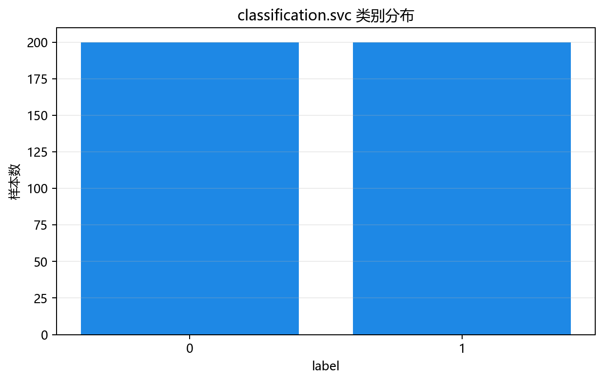
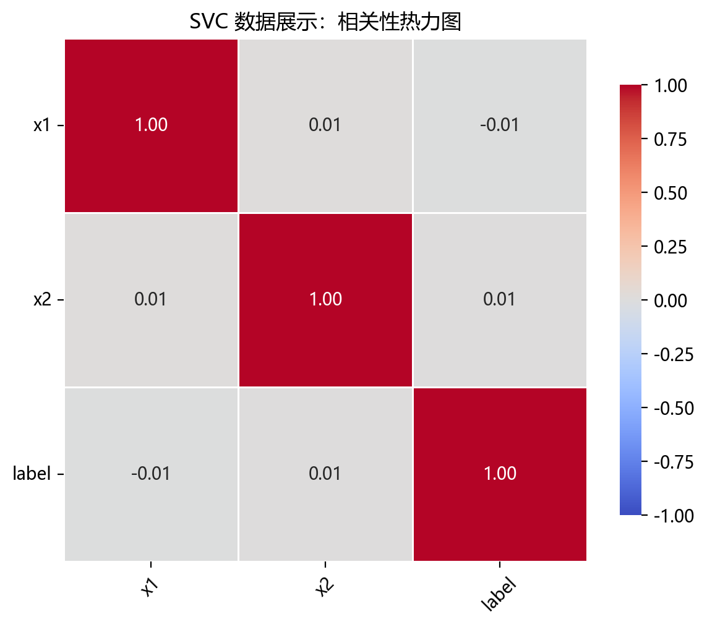
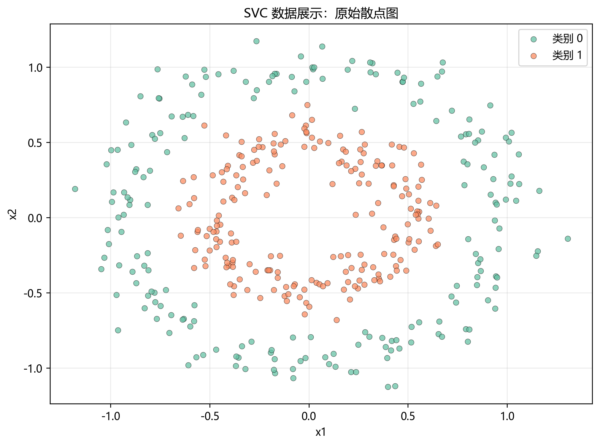

# 数据构成

## 本章目标

1. 明确本仓库 SVC 数据来自 `make_circles(...)` 构造的同心圆二分类数据。
2. 理解 `noise`、`factor` 参数对同心圆数据形态的控制。
3. 明确训练集/测试集切分与标准化的顺序和边界。

## 重点方法与概念速览

| 名称 | 类型 | 作用 |
|---|---|---|
| `ClassificationData.svc()` | 方法 | 生成 SVC 使用的非线性二分类同心圆数据 |
| `make_circles(...)` | 函数 | scikit-learn 提供的同心圆数据生成器 |
| `svc_data` | 变量 | 在 `data_generation/__init__.py` 中导出的 DataFrame |
| `label` | 列名 | 当前流水线中的监督分类标签，取值 $\{0, 1\}$ |
| `StandardScaler` | 类 | 对特征做 Z-score 标准化——对 RBF 核的距离计算至关重要 |

## 1. 数据生成：`make_circles()`

当前 SVC 数据来自 `ClassificationData.svc()`，底层调用 `sklearn.datasets.make_circles()`。

### 参数速览

适用函数：`make_circles(n_samples=400, noise=0.1, factor=0.5, random_state=42)`

| 参数名 | 类型 | 说明 | 示例取值 |
|---|---|---|---|
| `n_samples` | `int` | 总样本数（如果指定了 `factor`，会按比例分配到内外圈）。默认 `400` | `400`、`1000` |
| `noise` | `float` | 添加到 x 和 y 坐标上的高斯噪声标准差。`0` 表示完全无噪声的同心圆，`0.1` 使样本轻微偏离理想圆 | `0.1`、`0.05`、`0.2` |
| `factor` | `float` | 内圈半径与外圈半径之比，取值 $(0, 1)$。`0.5` 表示内圈半径是外圈的一半 | `0.5`、`0.3`、`0.8` |
| `random_state` | `int` | 随机种子，保证数据可复现。默认 `42` | `42` |
| `shuffle` | `bool` | 是否打乱样本顺序。默认 `True` | `True` |
| 返回值 | `(ndarray, ndarray)` | `(X, y)` 元组，$X$ 形状 $(400, 2)$，$y$ 取值 $\{0, 1\}$ | — |

### 示例代码

```python
X, y = make_circles(
    n_samples=400,
    noise=0.1,
    factor=0.5,
    random_state=42,
)
columns = [f"x{i + 1}" for i in range(2)]
data = DataFrame(X, columns=columns)
data["label"] = y
```

### 理解重点

- 同心圆数据是典型的数据集，刻意排除了直接用线性边界正确分类的可能。
- 外圈（label=0）和内圈（label=1）构成环形嵌套结构——这一几何特征恰好需要 RBF 核的非线性映射能力。
- `noise=0.1` 使样本偏离理想圆，增加了一定的分类难度但保留了环形结构的主体特征。
- 只包含 $x_1$、$x_2$ 两个特征，既适合 RBF 核训练，也适合通过二维决策边界图直接展示非线性分类效果。

## 2. 特征列与标签列

### 参数速览

| 参数名 | 类型 | 说明 | 示例取值 |
|---|---|---|---|
| `X` | `DataFrame` | 含 2 个连续特征的特征矩阵，列名 `x1`、`x2` | `data.drop(columns=["label"])` |
| `y` | `Series` | 监督二分类标签，取值 $y_i \in \{0, 1\}$，0 为外圈、1 为内圈 | `data["label"]` |

### 示例代码

```python
X = data.drop(columns=["label"])
y = data["label"]
```

### 理解重点

- 标签 $y=0$ 对应外圈（样本数较多），$y=1$ 对应内圈（样本数较少）。
- `label` 是监督标签，会真实参与 `model.fit(X_train, y_train)`。
- 将特征和标签明确拆分是后续切分、标准化和训练的前提。

## 3. 训练/测试集切分

### 参数速览

适用函数：`train_test_split(X, y, test_size=0.2, random_state=42, stratify=y)`

| 参数名 | 类型 | 说明 | 示例取值 |
|---|---|---|---|
| `X` | `DataFrame` | 特征矩阵，形状 $(400, 2)$ | `X` |
| `y` | `Series` | 标签向量，取值 $\{0, 1\}$ | `y` |
| `test_size` | `float` | 测试集占比。400 × 0.2 = 80 测试样本，320 训练样本 | `0.2` |
| `random_state` | `int` | 随机种子，保证切分可复现 | `42` |
| `stratify` | `array_like` | 传入 `y` 使训练/测试集类别比例与原始一致 | `y` |

### 示例代码

```python
X_train, X_test, y_train, y_test = train_test_split(
    X, y, test_size=0.2, random_state=42, stratify=y
)
```

### 理解重点

- `stratify=y` 确保内外圈比例在训练/测试集中一致——对 `factor=0.5` 下内外圈面积不等引起的样本数差异尤其重要。
- 切分必须在标准化之前执行，否则测试集信息会通过 $\mu_j$、$\sigma_j$ 泄露到训练流程中。

## 4. 标准化

### 参数速览

适用 API：`StandardScaler().fit_transform(X_train)` / `StandardScaler().transform(X_test)`

| 参数名 | 类型 | 说明 | 示例取值 |
|---|---|---|---|
| `X_train` | `array_like`，形状 $(320, 2)$ | 训练特征矩阵，用于 `fit_transform`——计算 $\mu_j, \sigma_j$ 并原地变换 | `X_train` |
| `X_test` | `array_like`，形状 $(80, 2)$ | 测试特征矩阵，用训练集统计量 `transform` | `X_test` |
| 返回值 | `ndarray` | $z_{ij} = (x_{ij} - \mu_j) / \sigma_j$，均值为 0 标准差为 1 | `X_train_s`、`X_test_s` |

### 示例代码

```python
scaler = StandardScaler()
X_train_s = scaler.fit_transform(X_train)
X_test_s = scaler.transform(X_test)
```

### 理解重点

- 对 SVC 而言，标准化不是可选的——RBF 核 $K(\mathbf{x}, \mathbf{z}) = \exp(-\gamma\|\mathbf{x} - \mathbf{z}\|^2)$ 直接依赖欧氏距离，未标准化的特征会让距离计算被量纲绑架。
- `gamma='scale'` 会使用标准化后的特征方差计算 $\gamma$，使核宽度自动适配数据尺度。
- `fit_transform` 在训练集上同时计算统计量和变换，`transform` 在测试集上使用同一统计量——这是避免数据泄露的标准工程做法。

## 数据可视化







## 常见坑

1. 忘记把 `label` 从特征表中剥离出来——特征矩阵不能包含标签列。
2. 在切分之前就对全量数据做标准化——这是数据泄露，测试信息混入了训练统计量。
3. 忽略标准化对 RBF 核的绝对必要性——不标准化的 SVC 等于让核函数基于失真的距离工作。
4. 看到二维数据就误以为线性分类器足够——同心圆的环形嵌套结构决定了线性不可分。

## 小结

- 当前 SVC 数据来自 `make_circles(n_samples=400, noise=0.1, factor=0.5)`：2 个连续特征、环形嵌套的二分类结构。
- 数据流为：`make_circles` → DataFrame（`x1`、`x2` + `label`）→ 切分（`stratify=y`）→ 标准化（仅在训练集 `fit`）。
- 同心圆数据与 RBF 核 SVC 的组合，是展示非线性核方法最经典的教学配置。
