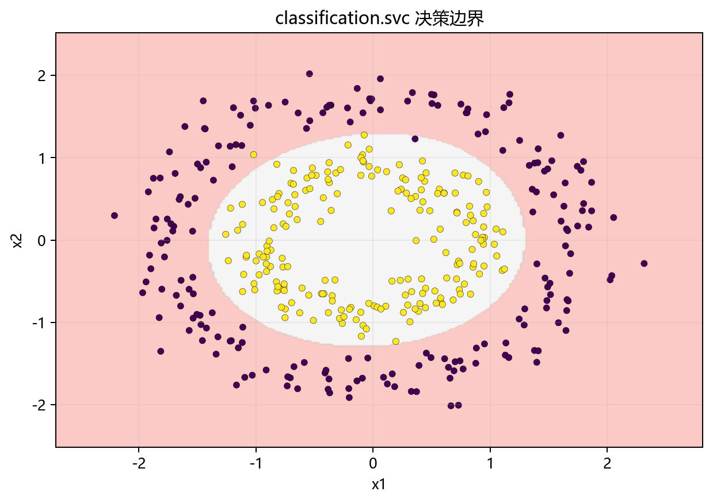

# 思路与直觉

> 对应代码：`data_generation/classification.py`、`pipelines/classification/svc.py`
>
> 对比对象：`docs/classification/logistic_regression/`

## 本章目标

1. 用直观方式理解 SVC 到底在做什么。
2. 理解为什么它在当前同心圆数据上需要依赖 RBF 核。
3. 理解它与更偏线性边界的方法在思路上的关键差异。

## 重点方法与概念速览

| 名称 | 类型 | 作用 |
|---|---|---|
| 最大间隔 | 核心直觉 | 用更稳健的边界分开不同类别 |
| 支持向量 | 关键样本 | 真正决定边界位置的少量样本 |
| 非线性边界 | 决策形状 | 用于处理同心圆这类线性不可分数据 |
| RBF 核 | 核函数 | 当前仓库中最关键的非线性能力来源 |
| 逻辑回归 | 对比算法 | 更偏线性决策边界 |

## 1. 为什么需要 SVC

对于很多分类问题，我们不只是想“找到一条能分开的线”，还希望这条边界尽量稳健，不要因为少量样本扰动就发生剧烈变化。

SVC 给出的思路是：

- 找到能把类别分开的边界。
- 让边界尽量离两边样本都远一些。
- 让真正靠近边界的关键样本来决定最终分类面。

### 理解重点

- 这就是“最大间隔”的直觉来源。
- SVC 关注的不是所有样本都同等重要，而是离边界最近的那部分关键点。
- 因为这种机制，SVC 往往比“只拟合一条线”的思路更强调边界稳健性。

## 2. 为什么当前仓库示例里必须用核方法

当前 SVC 数据来自：

```python
make_circles(
    n_samples=400,
    noise=0.1,
    factor=0.5,
    random_state=42,
)
```

这类数据的特点是：

- 外圈包着内圈
- 类别边界呈环状
- 无法用一条直线把两类分开

### 理解重点

- 如果只用线性边界，模型最多只能把平面切成两半，而无法正确圈出内层类别。
- 当前数据正是核方法最典型的教学场景之一。
- 这也是当前源码默认选择 `kernel='rbf'` 的直接原因。

## 3. 用“支持向量决定边界”理解算法

可以把 SVC 理解成：

1. 先尝试找到一条分类边界。
2. 再关注离边界最近的那些样本。
3. 让这些关键样本把边界“卡”在最合理的位置。

### 示例代码

```text
不是所有训练样本都同等决定边界
真正重要的是靠近边界的支持向量
边界最终由这些关键样本共同确定
```

### 理解重点

- 这也是为什么 `model.n_support_` 在当前分册中值得专门观察。
- 如果把 SVC 仅理解成“一个会分类的黑盒”，就会错过它最有辨识度的思想。

## 4. 用“高维空间更容易线性可分”理解 RBF 核

当前源码默认使用的是 `rbf` 核：

```python
SVC(C=1.0, kernel="rbf", gamma="scale", random_state=42)
```

### 理解重点

- RBF 核可以理解为：虽然原空间里边界很弯，但在更高维的表示空间里，它可能变成更容易处理的线性分隔问题。
- 文档不需要把重点放在抽象映射细节上，而应强调它解决了“同心圆无法线性切分”的现实问题。
- 当前仓库里，RBF 核不是理论展示品，而是对当前数据形状的直接回应。

## 5. 与逻辑回归的直觉差异

两者的核心差异可以这样理解：

| 算法 | 更擅长的数据形状 | 核心依据 |
|---|---|---|
| LogisticRegression | 近似线性可分的数据 | 线性决策边界 |
| SVC（RBF） | 非线性边界明显的数据 | 间隔最大化 + 核技巧 |

### 理解重点

- 逻辑回归在本质上更适合线性边界场景。
- 当前同心圆数据更像是在测试“模型是否能形成弯曲边界”。
- 因此 SVC 在这个示例里不是简单替代逻辑回归，而是展示另一类问题的解法。

## 可视化



## 常见坑

1. 只知道 SVC 很强，却说不出它为什么适合当前同心圆数据。
2. 把所有样本都看成同等重要，而忽略支持向量的作用。
3. 把 RBF 核理解成“更复杂所以更好”，而不结合数据形状来理解。
4. 忽略标准化，让核函数基于失真的距离工作。

## 小结

- SVC 的直觉重点有两个：最大间隔和支持向量。
- 当前仓库使用同心圆数据，正好体现了 RBF 核处理非线性边界的能力。
- 如果已经理解“为什么直线分不开同心圆”，就已经抓住了本分册最核心的直觉。
