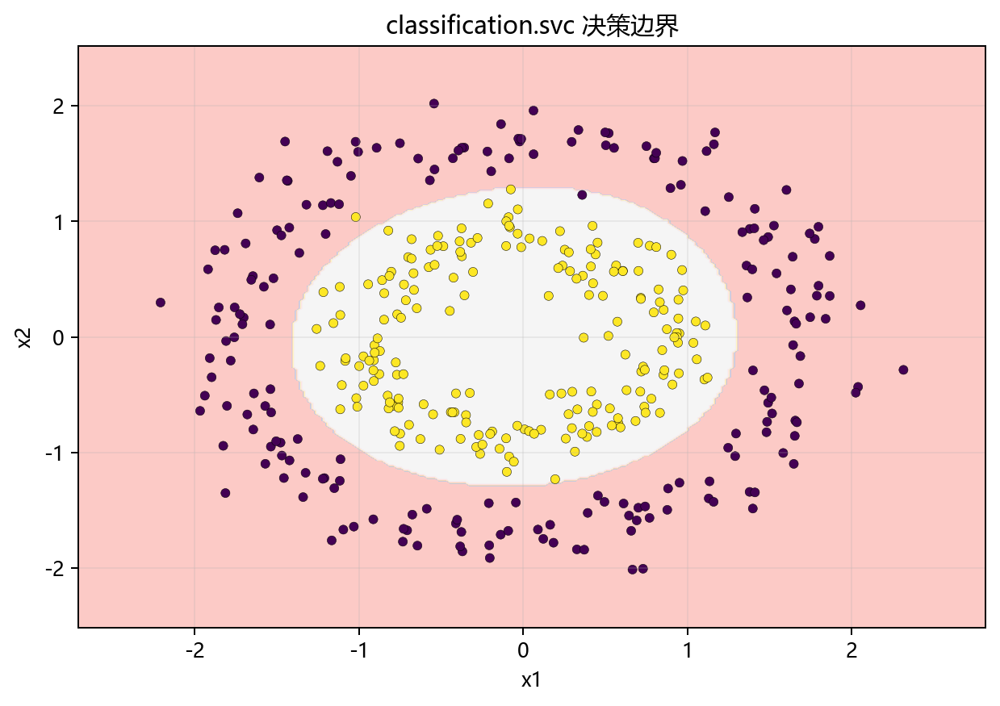

# 思路与直觉

## 本章目标

1. 用直观方式理解 SVC 的"最大间隔"直觉——不只追求分类正确，还追求边界稳健。
2. 理解为什么同心圆数据必须依赖核方法，以及 RBF 核的直觉。
3. 通过与其他分类算法的对比，建立 SVC 在整个分类算法图中的定位。

## 重点方法与概念速览

| 名称 | 类型 | 作用 |
|---|---|---|
| 最大间隔 | 核心直觉 | 让分类边界离两边样本都尽可能远，提升泛化能力 |
| 支持向量 | 关键样本 | 只有离边界最近的样本才决定边界位置——其余样本可丢弃 |
| 软间隔 | 容错机制 | 允许少量样本违反间隔约束，换取更宽的边距和更好的泛化 |
| 核技巧 | 非线性能力 | 不显式构造高维特征就能获得非线性边界——RBF 核是其最经典实现 |
| RBF 核 | 局部相似度 | 离得近的点影响大、离得远的点影响小——以此构造弯曲边界 |

## 1. 为什么 SVC 追求"最大间隔"

大多数分类器只要能分开就行。但 SVC 追问一个更深层的问题：**在所有能正确分类的边界中，哪一个最稳健？**

如果把边界想象成一道墙，SVC 的目标是让这道墙离两边最近的房屋都尽可能远——这样即使将来有略微偏移的新样本落入，也不会轻易跨过边界。

### 理解重点

- 这不是为了在训练集上拿更高分——而是为了在未见过的测试数据上表现更好。
- 直觉上：窄边界意味着稍微移动一点就可能翻转预测，宽边界意味着容错空间更大。
- 这就是"最大间隔"的根本直觉——它不是数学技巧，而是泛化能力的直观追求。

## 2. 为什么同心圆数据需要核方法

当前 SVC 数据来自 `make_circles(n_samples=400, noise=0.1, factor=0.5)`——外圈包着内圈，标签 0 在外、标签 1 在内。

如果是逻辑回归或线性 SVM：一条直线只能把平面切成两半，无论如何切都无法将内圈从外圈中完整挖出。

### 理解重点

- 线性分类器在这个数据上的天花板极低——无论怎么调参，一条直线画不出一个圆。
- 这正是核方法的核心应用场景：原空间中无法用简单形状分离的数据，在高维映射后可能变得线性可分。
- 当前选择 `SVC(kernel='rbf')` 不是追求更复杂，而是对数据形状的直接回应。

## 3. 用"支持向量卡住边界"理解 SVC

可以把 SVC 的训练过程想象成：

1. 先假设一条初始分类边界
2. 观察离边界最近的那些样本——它们是"争议区"
3. 调整边界，让这些关键样本把边界"卡"在最合理的位置上
4. 距离边界较远的样本不参与边界的最终确定

### 理解重点

- 训练集中可能只有 20%~40% 的样本真正参与了决策——其余样本的去除不改变边界。
- 这也是 `model.n_support_` 的教学价值所在：它直接量化了"模型到底依赖了哪些样本"。
- 这种稀疏性是 SVC 区别于 KNN（必须记住全部训练样本）和逻辑回归（所有权重由全量数据决定）的关键特征。

## 4. 用"高维空间更容易分离"理解 RBF 核

RBF 核的直觉可以这样理解：

- 在原始二维平面上，内圈和外圈混在一起无法用直线分开。
- RBF 核隐式地将每个点映射到一个更高维的空间——在这个空间中，不同圈层的点可能自动"散开"。
- 核技巧的妙处在于：虽然映射是高维甚至无穷维的，但我们从不需要显式构造它——只需计算两点在原空间的相似度 $K(\mathbf{x}, \mathbf{z}) = \exp(-\gamma\|\mathbf{x} - \mathbf{z}\|^2)$。

### 理解重点

- RBF 核本质上是"局部相似度度量"：$\|\mathbf{x} - \mathbf{z}\|$ 越小，$K(\mathbf{x}, \mathbf{z})$ 越接近 1；距离越远，相似度迅速衰减到 0。
- $\gamma$ 控制"多远算远"——$\gamma$ 大意味着只有非常近的点才被认为相似，边界精细弯曲；$\gamma$ 小意味着较远的点仍有影响，边界更平滑。
- 对于同心圆数据，RBF 核为内圈和外圈的点各自分配了不同的"高维特征签名"，使得 SVM 能在高维空间中找到分离超平面。

## 5. 与逻辑回归、决策树的直觉对比

| 算法 | 核心问题 | 决策边界形状 | 依赖哪些样本 |
|---|---|---|---|
| SVC (RBF) | 怎样画一条弯曲的边界，且让它离两边样本尽量远？ | 非线性曲线——由支持向量和 RBF 核决定 | 仅支持向量（$\alpha_i > 0$） |
| 逻辑回归 | 怎样画一条直线，让正负类概率差异最大化？ | 全局直线 $\mathbf{w}^T \mathbf{x} + b = 0$ | 所有训练样本（通过梯度） |
| KNN | 离当前样本最近的邻居投给谁？ | 局部蜿蜒——无全局参数形式 | 所有训练样本（查询时） |
| 决策树 | 先按哪个特征切一刀，再按哪个特征切？ | 轴对齐分段 | 所有训练样本（通过划分） |

### 理解重点

- 在同心圆数据上，逻辑回归和线性 SVM 必然失败——它们的直线边界无法包裹内圈。
- 决策树可以通过多次轴对齐切分近似圆形边界，但需要较深的树；SVC 的 RBF 核能自然地产生光滑曲线边界。
- SVC 和 KNN 虽然都能产生非线性边界，但原理完全不同：KNN 在预测时现场计算邻居，SVC 在训练时已经确定了支持向量和边界形状。

## 6. 标准化对 SVC 直觉的影响

RBF 核把"两点距离的平方"转化为相似度。如果 $x_1$ 取值在 $[-2, 2]$ 而 $x_2$ 取值在 $[-1000, 1000]$，那么距离计算几乎完全由 $x_2$ 主导——$x_1$ 的差异被淹没。

### 理解重点

- 标准化让所有特征站在同一起跑线上——每个维度对距离的贡献平等。
- 对 SVC 来说这不是锦上添花，而是核函数几何意义正确的前提。
- 这一点与逻辑回归高度一致（梯度优化 + 系数可比），与决策树根本不同（决策树不依赖距离计算）。

## 可视化

## 常见坑

1. 只知道 SVC 是"强大的分类器"，却说不出"最大间隔"和"支持向量"的直觉意义。
2. 把 RBF 核理解成"更复杂所以更好"，而不是结合数据形状来理解选择理由。
3. 把支持向量当成"模型拟合不完全的标记"——实际上它们是 SVC 设计的核心，不是缺陷。
4. 忽略标准化，让 RBF 核基于失真的距离计算工作。

## 小结

- SVC 的直觉核心有两个：最大间隔（追求稳健边界）和支持向量（只让关键样本决定边界）。
- 当前仓库使用同心圆数据 + RBF 核，恰恰是展示"为什么有些数据需要非线性边界"的最佳教学组合。
- 理解 SVC 与其他分类算法在直觉层面的差异，是理解"何时选 SVC"的前提——它不是万能的默认选项，而是非线性富边界场景的利器。
