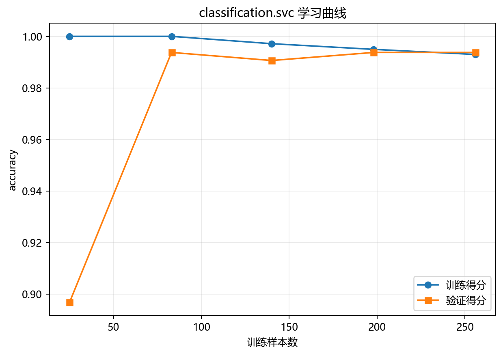

# 训练与预测

## 本章目标

1. 按源码顺序看清当前 SVC 流水线从数据复制到硬分类预测的完整步骤。
2. 理解主模型 (`model`)、二维可视化模型 (`model_2d`) 和学习曲线实例三者的职责边界。
3. 理解 SVC 的 `predict(...)` 基于决策函数 $\text{sign}(f(\mathbf{x}))$——而非概率阈值。

## 重点方法与概念速览

| 名称 | 类型 | 作用 |
|---|---|---|
| `svc_data.copy()` | 方法 | 复制原始数据，避免修改源对象 |
| `train_test_split(...)` | 函数 | 按 `stratify=y` 划分训练/测试集 |
| `StandardScaler` | 类 | 对特征做一致性标准化——对 RBF 核的距离计算至关重要 |
| `train_model(...)` | 函数 | 训练主 `SVC` 模型，求解二次规划并输出支持向量统计 |
| `model.predict(X_test_s)` | 方法 | 输出测试集类别预测——$\text{sign}(f(\mathbf{x}))$ 硬分类 |
| `PCA(n_components=2)` | 类 | 将标准化特征投影到 2 维，为决策边界可视化提供服务 |
| `model_2d` | 模型 | 在 PCA 2D 空间单独训练的 `SVC(kernel='rbf')`，专用于决策边界绘图 |

## 1. 流水线起点：复制数据并拆出特征/标签

### 示例代码

```python
data = svc_data.copy()
X = data.drop(columns=["label"])
y = data["label"]
```

### 理解重点

- `.copy()` 确保后续处理不修改在模块导入时已经加载的全局 `svc_data`。
- 当前任务是有监督二分类，$y$ 既参与训练 `fit(X_train_s, y_train)`，也参与评估（混淆矩阵）。
- 这一步只是数据准备，不涉及任何算法逻辑。

## 2. 训练/测试集切分

### 参数速览

适用函数：`train_test_split(X, y, test_size=0.2, random_state=42, stratify=y)`

| 参数名 | 类型 | 说明 | 示例取值 |
|---|---|---|---|
| `X` | `DataFrame` | 特征矩阵，形状 $(400, 2)$ | `X` |
| `y` | `Series` | 标签向量，二分类取值 $\{0, 1\}$ | `y` |
| `test_size` | `float` | 测试集占比。400 × 0.2 = 80 测试样本，320 训练样本 | `0.2` |
| `random_state` | `int` | 随机种子，保证切分可复现 | `42` |
| `stratify` | `array_like` | 传入 `y` 使训练/测试集内外圈比例与原始一致 | `y` |

### 示例代码

```python
X_train, X_test, y_train, y_test = train_test_split(
    X, y, test_size=0.2, random_state=42, stratify=y
)
```

### 理解重点

- `stratify=y` 确保内外圈样本比例在训练/测试集中稳定——`factor=0.5` 下内外圈面积不等，分层采样尤为重要。
- 切分必须在标准化之前执行，否则测试集统计量会泄露到训练中。

## 3. 标准化

### 参数速览

适用 API：`StandardScaler().fit_transform(X_train)` / `StandardScaler().transform(X_test)`

| 参数名 | 类型 | 说明 | 示例取值 |
|---|---|---|---|
| `X_train` | `array_like`，形状 $(320, 2)$ | 训练特征矩阵，用于计算 $\mu_j, \sigma_j$ 并原地标准化 | `X_train` |
| `X_test` | `array_like`，形状 $(80, 2)$ | 测试特征矩阵，使用训练集统计量进行标准化变换 | `X_test` |
| 输出 | `ndarray` | $z_{ij} = (x_{ij} - \mu_j) / \sigma_j$，每个特征化为均值 0 标准差 1 | `X_train_s`、`X_test_s` |

### 示例代码

```python
scaler = StandardScaler()
X_train_s = scaler.fit_transform(X_train)
X_test_s = scaler.transform(X_test)
```

### 理解重点

- 对 SVC 而言，标准化是硬性要求——RBF 核 $\exp(-\gamma\|\mathbf{x} - \mathbf{z}\|^2)$ 直接依赖欧氏距离，不标准化会让距离计算被量纲主导。
- `gamma='scale'` 在标准化后自动计算 $\gamma = 1/(2 \cdot 1.0) = 0.5$，获得合理的默认核宽度。
- `fit_transform` 在训练集上同时计算统计量和变换，`transform` 在测试集上使用同一统计量。

## 4. 主模型训练与硬分类预测

### 参数速览

适用 API：`train_model(X_train_s, y_train)` → `model.predict(X_test_s)`

| 参数名 | 类型 | 说明 | 示例取值 |
|---|---|---|---|
| `X_train_s` | `ndarray`，形状 $(320, 2)$ | 标准化后的训练特征，传入 `SVC.fit()`——内部求解对偶二次规划 | `X_train_s` |
| `y_train` | `array_like` | 训练标签，内部转换为 $\{-1, +1\}$ 后参与优化 | `y_train` |
| `X_test_s` | `ndarray`，形状 $(80, 2)$ | 标准化后的测试特征，传入 `model.predict()` | `X_test_s` |
| 返回值 (`y_pred`) | `ndarray`，形状 $(80,)$ | 硬分类预测标签，来自 $\hat{y} = \text{sign}(f(\mathbf{x}))$ | `y_pred` |

### 示例代码

```python
model = train_model(X_train_s, y_train)
y_pred = model.predict(X_test_s)
```

### 理解重点

- `train_model(...)` 的 `fit()` 内部：求解对偶二次规划问题 → 确定支持向量集合 → 存储 $\alpha_i y_i$ 和 $b$。这是真正的迭代优化（SMO 算法），而非解析解。
- `predict(...)` 内部：对每个测试样本计算 $f(\mathbf{x}) = \sum_{i\in SV} \alpha_i y_i K(\mathbf{x}_i, \mathbf{x}) + b$，取符号得到类别——仅支持向量参与计算。
- `y_pred` 是后续混淆矩阵的直接输入。与逻辑回归不同，当前 SVC 流水线不调用 `predict_proba(...)` 也不画 ROC 曲线。

## 5. 决策边界需要单独训练 `model_2d`

### 参数速览

| 参数名 | 类型 | 说明 | 示例取值 |
|---|---|---|---|
| `pca` | `PCA(n_components=2, random_state=42)` | 将标准化特征投影到 2 维主成分空间 | `pca` |
| `X_all_s` | `ndarray`，形状 $(400, 2)$ | 全量标准化特征，用于 PCA 拟合 | `scaler.transform(X)` |
| `X_2d` | `ndarray`，形状 $(400, 2)$ | PCA 二维投影后的全量特征，用于画散点 | `pca.fit_transform(X_all_s)` |
| `model_2d` | `SVC(kernel='rbf', random_state=42)` | 在 PCA 二维空间单独训练的 SVC，专用于决策边界绘图 | `model_2d` |

### 示例代码

```python
pca = PCA(n_components=2, random_state=42)
X_all_s = scaler.transform(X)
X_2d = pca.fit_transform(X_all_s)
model_2d = SVC_Model(kernel="rbf", random_state=42)
model_2d.fit(pca.transform(X_train_s), y_train)
```

### 理解重点

- `model_2d` 不是主评估模型——它的唯一目的是在二维空间提供可绘制的决策边界。
- 主模型 `model` 训练在原始 2 维标准化空间（`X_train_s` 就是 2 维的），`model_2d` 训练在 PCA 降维后的 2 维空间——两者特征空间不同。
- 由于原始数据就是 2 维的，PCA 主要做旋转和缩放——决策边界图仍能较好反映原始空间的非线性边界形态。

## 6. 学习曲线使用新的模型实例

### 参数速览

适用函数：`plot_learning_curve(SVC_Model(kernel='rbf', random_state=42), X_train_s, y_train, ...)`

| 参数名 | 类型 | 说明 | 示例取值 |
|---|---|---|---|
| `estimator` | `SVC` | 新创建的 `SVC(kernel='rbf', random_state=42)` 实例，学习曲线内部会克隆和重复训练 | `SVC_Model(kernel='rbf', random_state=42)` |
| `X` | `ndarray`，形状 $(320, 2)$ | 标准化后的训练特征矩阵 | `X_train_s` |
| `y` | `array_like` | 训练标签向量 | `y_train` |
| `scoring` | `str` | 评分类指标，当前取 `"accuracy"` | `"accuracy"` |
| `cv` | `int` | 交叉验证折数，默认 `5` | `5` |

### 示例代码

```python
plot_learning_curve(
    SVC_Model(kernel="rbf", random_state=42),
    X_train_s,
    y_train,
    title="SVC 学习曲线",
    dataset_name=DATASET,
    model_name=MODEL,
)
```

### 理解重点

- 传入的是 `SVC_Model(kernel='rbf', random_state=42)` 新实例而非 `model`——学习曲线内部会通过 `learning_curve()` 函数多次克隆和训练模型。
- 学习曲线函数会按不同训练样本量（如 10%、33%、55%、78%、100%）做交叉验证，绘制训练得分和验证得分的变化趋势。

## 训练诊断可视化



## 常见坑

1. 忘记标准化是 SVC 的硬性要求——不标准化的 RBF 核等于让距离计算被特征量纲绑架。
2. 把 `model_2d` 误认为正式预测模型——它只在 PCA 空间训练，仅服务于决策边界可视化。
3. 混淆主模型（原始 2 维标准化空间）、二维可视化模型（PCA 空间）和学习曲线模型（CV 克隆）的三者职责。
4. 期望 `predict_proba(...)` 可用——当前流水线未启用 `probability=True`，SVC 默认只输出硬分类标签。

## 小结

- 当前 SVC 流水线的训练过程：复制数据 → 特征/标签拆分 → 切分（`stratify=y`）→ 标准化 → 求解对偶二次规划 → 硬分类预测。
- 三个模型实例各司其职：`model`（原始 2 维空间主评估）、`model_2d`（PCA 空间画边界）、`SVC_Model(...)`（学习曲线克隆）。
- SVC 的 `predict(...)` 基于 $\text{sign}(f(\mathbf{x}))$，不依赖概率阈值——这与逻辑回归的 Sigmoid → 0.5 阈值机制不同。
- 当前流水线不使用 ROC 曲线——SVC 默认 `probability=False`，启用概率输出需要额外 Platt scaling 开销。
