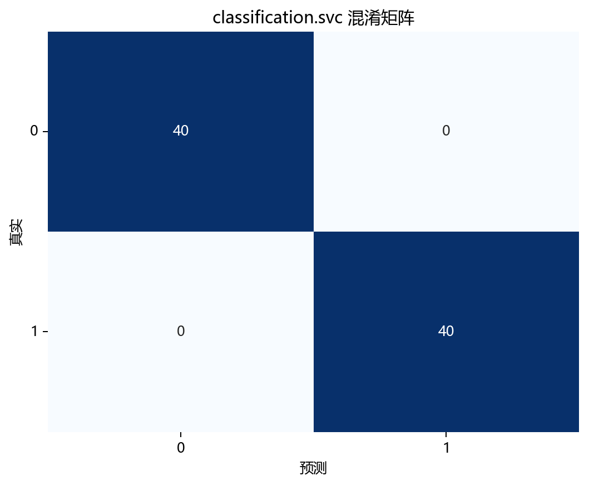
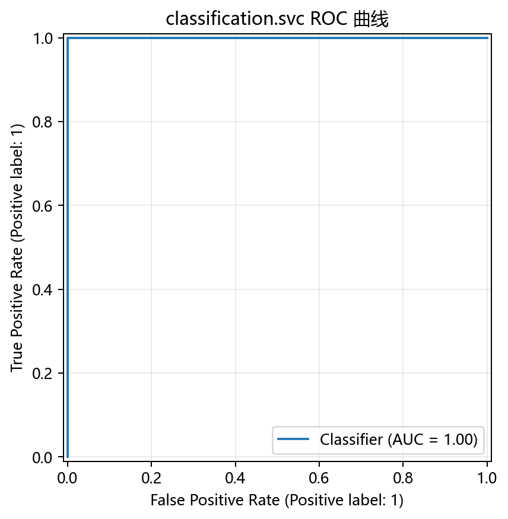

# 评估与诊断

> 对应代码：`pipelines/classification/svc.py`、`result_visualization/confusion_matrix.py`、`result_visualization/decision_boundary.py`、`result_visualization/learning_curve.py`
>
> 相关对象：`y_pred`、`plot_confusion_matrix(...)`、`plot_decision_boundary(...)`、`plot_learning_curve(...)`

## 本章目标

1. 明确当前仓库 SVC 实现实际上是如何做结果诊断的。
2. 理解混淆矩阵、PCA 决策边界图和学习曲线分别能说明什么。
3. 理解决策边界图是可视化近似，而不是原始特征空间决策面的完整替代。

## 重点方法与概念速览

| 名称 | 类型 | 作用 |
|---|---|---|
| `y_pred` | 预测结果 | 测试集分类输出 |
| `plot_confusion_matrix(...)` | 函数 | 绘制预测标签与真实标签的混淆矩阵 |
| `plot_decision_boundary(...)` | 函数 | 绘制 PCA 2D 空间下的分类边界 |
| `plot_learning_curve(...)` | 函数 | 绘制训练/验证得分随样本量变化的曲线 |
| `model_2d` | 模型 | 专门用于二维决策边界展示 |

## 1. 当前仓库的评估入口

当前 SVC 流水线里的主要结果诊断手段有三个：

1. 混淆矩阵
2. PCA 2D 决策边界图
3. 学习曲线

### 示例代码

```python
y_pred = model.predict(X_test_s)

plot_confusion_matrix(y_test, y_pred, title="SVC 混淆矩阵", dataset_name=DATASET, model_name=MODEL)

plot_decision_boundary(
    model_2d, X_2d, y.values, title="SVC 决策边界 (PCA 2D)", dataset_name=DATASET
)

plot_learning_curve(
    SVC_Model(kernel="rbf", random_state=42),
    X_train_s,
    y_train,
    title="SVC 学习曲线",
    dataset_name=DATASET,
    model_name=MODEL,
)
```

### 理解重点

- 当前实现没有把所有诊断都压缩成一个数字，而是同时提供结果矩阵、边界图和曲线图三类视角。
- 对教学型仓库来说，这样的设计比只打印单个分数更利于理解模型行为。
- 三种可视化分别回答的是不同问题，不能互相替代。

## 2. 混淆矩阵能观察什么

### 参数速览（本节）

适用函数：`plot_confusion_matrix(y_true, y_pred, ...)`

| 参数名 | 当前对象 | 说明 |
|---|---|---|
| `y_true` | `y_test` | 测试集真实标签 |
| `y_pred` | `model.predict(X_test_s)` | 测试集预测标签 |

### 理解重点

- 混淆矩阵最适合回答：模型把哪一类分对了，哪一类更容易混淆。
- 对二分类任务来说，它比单个准确率更具体，因为能看出错分方向。
- 当前流水线没有显式打印 accuracy，但混淆矩阵已经能给出很强的误差结构信息。

## 3. PCA 2D 决策边界图能观察什么

### 参数速览（本节）

适用函数：`plot_decision_boundary(model_2d, X_2d, y.values, ...)`

| 参数名 | 当前对象 | 说明 |
|---|---|---|
| `model_2d` | 单独训练的二维 SVC | 用于可视化边界 |
| `X_2d` | `PCA` 降到二维后的特征 | 用于画图 |
| `y.values` | 全量标签数组 | 用于点着色 |

### 理解重点

- 这张图最适合回答：当前核方法在二维投影视角下，形成了怎样的非线性边界。
- 对同心圆数据来说，它能直观展示模型是否学会了把内圈和外圈区分开。
- 但它只是 PCA 投影空间中的近似展示，不是原始特征空间决策面的完整几何真相。

## 4. 学习曲线能观察什么

### 参数速览（本节）

适用函数：`plot_learning_curve(model, X_train_s, y_train, scoring='accuracy', ...)`

| 参数名 | 当前对象 | 说明 |
|---|---|---|
| `model` | `SVC_Model(kernel='rbf', random_state=42)` | 用于曲线诊断的新模型实例 |
| `X_train_s` | 标准化后的训练特征 | 学习曲线输入特征 |
| `y_train` | 训练标签 | 学习曲线输入标签 |
| `scoring` | `accuracy` | 当前评分类指标 |

### 理解重点

- 学习曲线最适合回答：当前模型是否随着训练样本数增加而继续改善。
- 训练得分与验证得分之间的距离，也能帮助判断是否存在欠拟合或过拟合倾向。
- 当前实现采用 `accuracy` 作为学习曲线评分指标，但这不等于对模型质量的全部评价。

## 5. 当前实现中尚未纳入但常见的分类指标

在一般分类任务中，还常见以下指标：

- 准确率（Accuracy）
- 精确率（Precision）
- 召回率（Recall）
- F1 分数
- ROC-AUC

### 理解重点

- 当前仓库并没有在 SVC 流水线中显式打印这些指标。
- 文档可以提到它们是常见扩展方向，但不能写成“当前源码已经在计算”。
- 现阶段最准确的表述是：当前实现以混淆矩阵、决策边界图和学习曲线为主要诊断手段。

## 评估图表





## 常见坑

1. 把 PCA 决策边界图误认为原始特征空间决策面的完整表达。
2. 把 `model_2d` 误认为测试集正式预测模型。
3. 只看一张图，不结合混淆矩阵和学习曲线一起判断。
4. 把当前仓库未实现的 accuracy、precision、recall、f1、AUC 写成现有流程的一部分。

## 小结

- 当前仓库对 SVC 的评估方式很明确：结果矩阵上看混淆矩阵，边界形状上看 PCA 决策边界图，训练行为上看学习曲线。
- 三者组合起来，比单一指标更能解释当前 RBF 核 SVC 的实际表现。
- 对当前同心圆教学数据而言，这样的评估设计兼顾了直观性与工程可读性。
