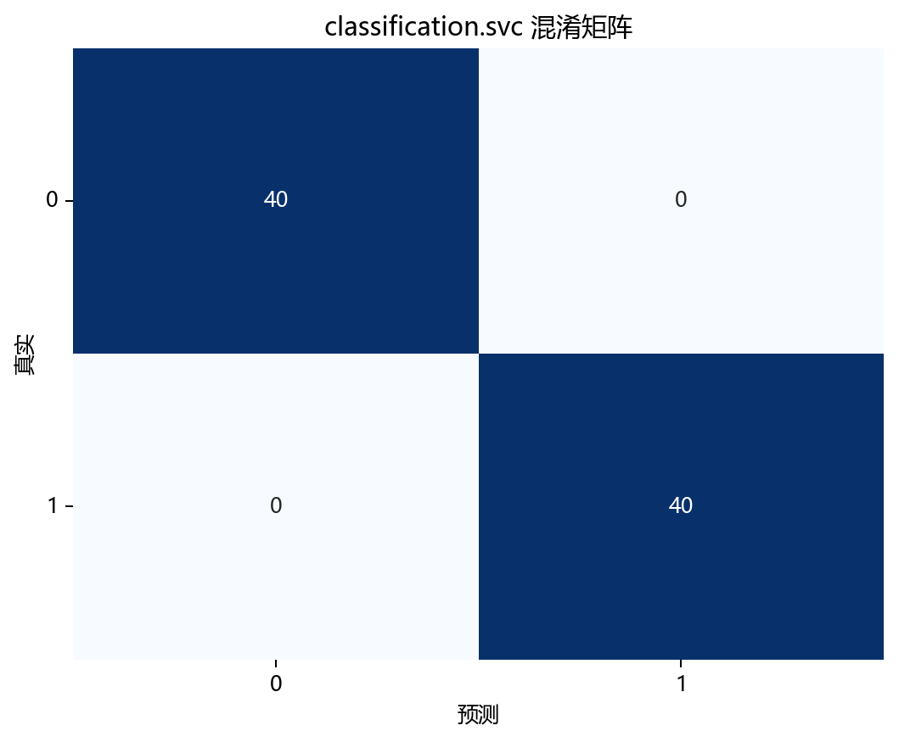

# 评估与诊断

## 本章目标

1. 明确当前仓库 SVC 实现的三种评估手段及其分别回答的问题。
2. 理解 2×2 混淆矩阵和 PCA 决策边界图在同心圆二分类场景下的解读方式。
3. 理解当前 SVC 流水线为何不使用 ROC 曲线——与 `probability=False` 的默认配置直接相关。

## 重点方法与概念速览

| 名称 | 类型 | 作用 |
|---|---|---|
| `y_pred` | 预测结果 | 测试集类别输出，由 $\text{sign}(f(\mathbf{x}))$ 硬分类产生 |
| `plot_confusion_matrix(...)` | 函数 | 绘制 2×2 二分类混淆矩阵 |
| `plot_decision_boundary(...)` | 函数 | 绘制 PCA 2D 空间下的分类边界——对同心圆数据最能体现模型非线性能力 |
| `plot_learning_curve(...)` | 函数 | 绘制训练/验证得分随样本量变化的曲线 |
| `model.n_support_` | 属性 | 各类别支持向量数量——SVC 独有的诊断信息 |

## 1. 当前仓库的评估入口

当前 SVC 流水线里的主要诊断手段有三个：

1. 混淆矩阵 —— 回答"分对了多少？两类各有多少被误分类？"
2. PCA 2D 决策边界图 —— 回答"RBF 核能否正确画出弯曲边界将内外圈分离？"
3. 学习曲线 —— 回答"更多训练样本还能提升表现吗？"

### 示例代码

```python
y_pred = model.predict(X_test_s)

plot_confusion_matrix(...)
plot_decision_boundary(...)
plot_learning_curve(...)
```

### 理解重点

- 当前 SVC 流水线**不使用 ROC 曲线**——因为 SVC 默认 `probability=False`，不启用概率估计（启用 `probability=True` 需额外 5 折交叉验证 Platt scaling，显著增加训练耗时）。
- SVC 独有的诊断信息是 `n_support_`——支持向量数量直接反映分类任务的难度和模型的稀疏性。
- 三种可视化分别回答不同问题，不能互相替代。

## 2. 混淆矩阵能观察什么

对于二分类任务，混淆矩阵 $\mathbf{C}$ 是一个 $2 \times 2$ 矩阵：

$$
C = \begin{bmatrix} \text{TN} & \text{FP} \\ \text{FN} & \text{TP} \end{bmatrix}
$$

### 参数速览

适用函数：`plot_confusion_matrix(y_true, y_pred, ...)`

| 参数名 | 类型 | 说明 | 示例取值 |
|---|---|---|---|
| `y_true` | `array_like`，形状 `(n_samples,)` | 测试集真实标签，取值 $\{0, 1\}$ | `y_test` |
| `y_pred` | `array_like`，形状 `(n_samples,)` | 模型硬分类预测标签，来自 $\text{sign}(f(\mathbf{x}))$ | `y_pred` |
| `normalize` | `bool` 或 `str` | 归一化方式。`True`/`'true'` 按行（真实类别），`'pred'` 按列，`'all'` 按全体。默认 `False` | `True`、`'true'` |

### 示例代码

```python
plot_confusion_matrix(
    y_true=y_test,
    y_pred=y_pred,
    title="SVC 混淆矩阵",
    dataset_name=DATASET,
    model_name=MODEL,
)
```

### 理解重点

- 在同心圆二分类上，混淆矩阵最直观地反映 RBF 核 SVC 是否正确分离了内外圈。
- 对于 `noise=0.1` 的数据，少量样本可能跨越环形边界进入错误区域——这些误分类会出现在非对角线上。
- 混淆矩阵已经隐式包含计算 Accuracy、Precision、Recall、F1 所需的所有信息（TP、TN、FP、FN），但当前流水线未显式计算这些指标。

## 3. PCA 2D 决策边界图能观察什么

### 参数速览

适用函数：`plot_decision_boundary(model_2d, X_2d, y.values, ...)`

| 参数名 | 类型 | 说明 | 示例取值 |
|---|---|---|---|
| `model_2d` | `SVC(kernel='rbf')` | 在 PCA 二维空间单独训练的 SVC，共享主模型的 RBF 核配置 | `model_2d` |
| `X_2d` | `ndarray`，形状 `(n_samples, 2)` | 标准化后 PCA 投影到二维的全量特征 | `X_2d` |
| `y` | `array_like`，形状 `(n_samples,)` | 全量标签数组，用于散点的真实类别着色 | `y.values` |

### 示例代码

```python
plot_decision_boundary(
    model_2d,
    X_2d,
    y.values,
    title="SVC 决策边界 (PCA 2D)",
    dataset_name=DATASET,
)
```

### 理解重点

- 这是 SVC 分册最重要的一张图——它直观展示了 RBF 核能否生成弯曲的环形分类边界。
- 如果 RBF 核工作正常，决策边界应呈现弯曲形态，将内圈区域与外圈区域正确分离——这是非线性核能力的视觉见证。
- 线性核（`kernel='linear'`）的决策边界将是一条直线，无法分离同心圆——这在实验对比中是最有说服力的教学画面。
- 由于原始数据本身就是二维的（$x_1$、$x_2$），PCA 主要做旋转和缩放——决策边界图基本反映原始空间的真实几何形态。

## 4. 学习曲线能观察什么

### 参数速览

适用函数：`plot_learning_curve(estimator, X, y, ...)`

| 参数名 | 类型 | 说明 | 示例取值 |
|---|---|---|---|
| `estimator` | `SVC` | 新创建的 `SVC(kernel='rbf', random_state=42)` 实例——内部会通过 CV 克隆并重复训练 | `SVC_Model(kernel='rbf', random_state=42)` |
| `X` | `ndarray`，形状 `(n_train, 2)` | 标准化后的训练特征矩阵 | `X_train_s` |
| `y` | `array_like` | 训练标签向量 | `y_train` |
| `scoring` | `str` | 评分指标，默认 `"accuracy"` | `"accuracy"` |
| `cv` | `int` | 交叉验证折数，默认 `5` | `5` |
| `train_sizes` | `array_like` | 训练样本量的递增序列，默认为 `np.linspace(0.1, 1.0, 5)` | `[0.1, 0.33, 0.55, 0.78, 1.0]` |

### 示例代码

```python
plot_learning_curve(
    SVC_Model(kernel="rbf", random_state=42),
    X_train_s,
    y_train,
    title="SVC 学习曲线",
    dataset_name=DATASET,
    model_name=MODEL,
)
```

### 理解重点

- SVC 是参数化模型（参数由支持向量决定），样本量增加时支持向量集合逐渐稳定——学习曲线反映这一收敛过程。
- 在同心圆数据中，一定数量的样本是构造环形边界所必需的——样本太少时模型可能找不到正确的圆形边界形状。
- 训练得分与验证得分之间的差距反映 $C=1.0$ 和 $\gamma$ 配置下的过拟合/欠拟合倾向。

## 5. 当前实现中尚未纳入但常见的评估手段

| 手段 | 公式/说明 | 不在当前流水线中的原因 |
|---|---|---|
| ROC 曲线 / AUC | $\text{TPR} = \frac{\text{TP}}{\text{TP}+\text{FN}}$，$\text{FPR} = \frac{\text{FP}}{\text{FP}+\text{TN}}$ | SVC 默认 `probability=False`——启用需额外 Platt scaling 交叉验证 |
| 准确率（Accuracy） | $\frac{\text{TP}+\text{TN}}{\text{TP}+\text{TN}+\text{FP}+\text{FN}}$ | 未显式计算，但混淆矩阵已包含所需全部信息 |
| 精确率（Precision） | $\frac{\text{TP}}{\text{TP}+\text{FP}}$ | 同上——可从混淆矩阵直接推导 |
| 召回率（Recall） | $\frac{\text{TP}}{\text{TP}+\text{FN}}$ | 同上 |
| F1 分数 | $2 \cdot \frac{\text{Precision} \cdot \text{Recall}}{\text{Precision} + \text{Recall}}$ | 同上 |

### 理解重点

- 当前仓库未在 SVC 流水线中显式打印 accuracy、precision、recall、f1——文档可以提到它们作为扩展方向，但不可写成"当前源码已在计算"。
- SVC 在 `probability=False` 下的评估体系天然比逻辑回归少一个维度（无概率输出、无 ROC）——这不是缺陷，而是 SVC 设计哲学（关注决策函数符号 $f(\mathbf{x})$，而非概率校准）的体现。

## 评估图表



## 常见坑

1. 期望 ROC 曲线出现在 SVC 评估中——当前流水线不启用概率估计（`probability=False`），没有 ROC。
2. 把 PCA 决策边界图误认为原始特征空间决策面的完整表达——虽然当前数据本身是二维的，但 PCA 的旋转仍可能改变视角。
3. 只看混淆矩阵的绝对数值，忽略 RBF 核决策边界的弯曲形状——后者才是理解 SVC 能力的核心视觉证据。
4. 把当前仓库未显式计算的 accuracy、precision、recall、f1 写成现有流程的一部分。

## 小结

- 当前仓库对 SVC 的评估：混淆矩阵看错误分布（2×2 二分类），PCA 决策边界图看 RBF 核弯曲边界的形状，学习曲线看样本量对支持向量收敛的影响。
- SVC 没有 `predict_proba` 驱动的 ROC 曲线评估——这是它与其他分类算法分册在评估体系上的关键差异。
- 对于同心圆数据，PCA 决策边界图中的环形边界是最有说服力的评估——它直接展示了 RBF 核将线性不可分问题转化为可解问题的能力。
