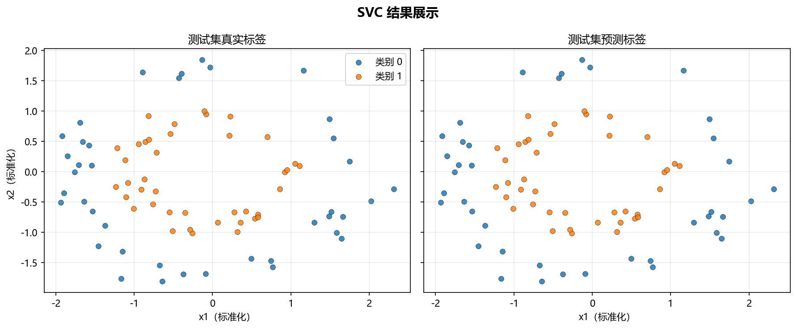

# 工程实现

> 对应代码：`pipelines/classification/svc.py`、`model_training/classification/svc.py`、`data_generation/classification.py`
>
> 运行方式：`python -m pipelines.classification.svc`

## 本章目标

1. 从工程角度看清 SVC 在本仓库中的完整调用链。
2. 理解数据生成、模型训练、流水线编排和结果可视化分别负责什么。
3. 理解为什么当前实现要把训练逻辑、正式预测逻辑和可视化逻辑拆开。

## 对应代码速览

| 组件 | 路径 | 说明 |
|---|---|---|
| 数据生成 | `data_generation/classification.py` | 生成 `svc_data` |
| 数据导出 | `data_generation/__init__.py` | 向外暴露 `svc_data` |
| 训练封装 | `model_training/classification/svc.py` | 构建并训练 `SVC` |
| 流水线入口 | `pipelines/classification/svc.py` | 组织切分、标准化、训练、预测与评估 |
| 混淆矩阵可视化 | `result_visualization/confusion_matrix.py` | 保存混淆矩阵图 |
| 决策边界可视化 | `result_visualization/decision_boundary.py` | 保存二维决策边界图 |
| 学习曲线可视化 | `result_visualization/learning_curve.py` | 保存学习曲线图 |

## 1. 端到端运行入口

### 示例代码

```bash
python -m pipelines.classification.svc
```

### 理解重点

- 对大多数读者来说，这个命令是理解当前 SVC 工程实现的最佳入口。
- 它会依次完成数据读取、特征准备、模型训练、测试集预测和结果绘图。
- 如果只读一个文件，建议先读 `pipelines/classification/svc.py`。

## 2. `run()` 串起了整个流程

当前流水线的核心函数是：

```python
def run():
    data = svc_data.copy()
    X = data.drop(columns=["label"])
    y = data["label"]

    X_train, X_test, y_train, y_test = train_test_split(
        X, y, test_size=0.2, random_state=42, stratify=y
    )
    scaler = StandardScaler()
    X_train_s = scaler.fit_transform(X_train)
    X_test_s = scaler.transform(X_test)

    model = train_model(X_train_s, y_train)
    y_pred = model.predict(X_test_s)

    ...
```

### 理解重点

- `run()` 本身没有复杂算法，它的职责是把不同模块串起来。
- 这类文件更像“编排层”，重点是流程顺序正确、调用关系清楚。
- 文档要帮助读者看到：真正训练模型的是 `train_model(...)`，真正做测试集预测的是 `model.predict(...)`，真正画图的是各个可视化函数。

## 3. 训练模块负责什么

`model_training/classification/svc.py` 里的 `train_model(...)` 主要负责：

1. 创建 `SVC(...)`
2. 调用 `fit(X_train, y_train)`
3. 打印训练日志
4. 返回训练完成的主模型对象

### 理解重点

- 这层抽离让“模型训练逻辑”和“业务流程编排逻辑”分开。
- 这样写的好处是，训练函数既可以被流水线调用，也可以单独运行做局部验证。
- 这也是当前仓库多个算法分册共享的组织方式。

## 4. 三类评估模块分别负责什么

### 混淆矩阵模块

`plot_confusion_matrix(...)` 负责：

- 接收 `y_test` 和 `y_pred`
- 绘制分类结果矩阵
- 保存图片文件

### 决策边界模块

`plot_decision_boundary(...)` 负责：

- 接收二维模型和二维特征
- 对网格点做预测
- 绘制二维分类边界

### 学习曲线模块

`plot_learning_curve(...)` 负责：

- 对不同训练样本规模重复训练模型
- 计算训练得分和验证得分
- 绘制曲线并保存图片

### 理解重点

- 当前 SVC 文档必须明确：三类可视化不是训练的一部分，而是训练完成后的诊断步骤。
- 其中决策边界图尤其特殊，因为它依赖单独训练的 `model_2d`。
- 这也是为什么本分册的工程实现，比很多简单分册多一层“主模型 vs 可视化模型”的区分。

## 5. 运行后能得到什么

### 输出项

| 输出类型 | 当前结果 |
|---|---|
| 终端标题 | `SVC 分类流水线` |
| 训练日志 | 训练耗时、支持向量总数、各类别支持向量数 |
| 图像文件 | 混淆矩阵图、决策边界图、学习曲线图 |

### 理解重点

- 运行结果并不只是一个模型对象，还包括面向阅读者的日志和多种图像产物。
- 对教学仓库而言，这种“代码 + 日志 + 图像”的组合比单纯返回分类结果更易理解。

## 6. 推荐的源码阅读顺序

1. 先看 `pipelines/classification/svc.py`
2. 再看 `model_training/classification/svc.py`
3. 再看 `result_visualization/confusion_matrix.py`
4. 再看 `result_visualization/decision_boundary.py`
5. 再看 `result_visualization/learning_curve.py`
6. 最后回到 `data_generation/classification.py`

### 理解重点

- 先从入口看整体流程，再下钻到训练与可视化细节，阅读成本最低。
- 如果一开始就只看某一个可视化模块，容易看见局部却看不见完整链路。

## 运行结果



## 常见坑

1. 把 `pipeline` 文件误认为训练算法实现本体。
2. 不区分“主模型”“二维可视化模型”和“学习曲线模型实例”的职责边界。
3. 忽略 `plot_decision_boundary(...)` 仅支持二维特征这一条件。
4. 只看单个文件，不顺着调用链理解整体执行流程。

## 小结

- 当前 SVC 工程实现采用了清晰的模块分层：数据生成、训练封装、流水线编排、结果可视化。
- `run()` 负责串联流程，`train_model(...)` 负责训练主模型，各可视化函数负责结果展示与诊断。
- 这种拆分方式既便于教学讲解，也便于后续扩展其他分类算法的同类结构。
