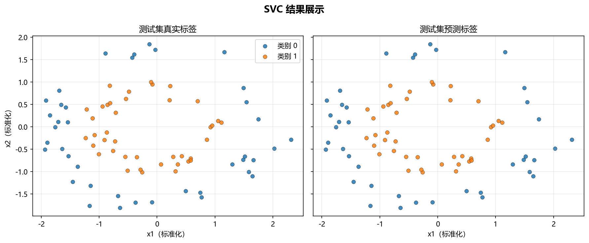

# 工程实现

## 本章目标

1. 从工程角度看清 SVC 在本仓库中的完整调用链。
2. 理解数据生成、模型训练、流水线编排和结果可视化分别负责什么。
3. 理解 SVC 工程实现与其他分类算法的关键差异——支持向量统计日志、无 ROC 评估、标准化是硬性要求。

## 对应代码速览

| 组件 | 路径 | 说明 |
|---|---|---|
| 数据生成 | `data_generation/classification.py` | `ClassificationData.svc()` 生成同心圆二分类数据 |
| 数据导出 | `data_generation/__init__.py` | 向外暴露 `svc_data` |
| 训练封装 | `model_training/classification/svc.py` | 构建并训练 `SVC(kernel='rbf')`，打印支持向量统计 |
| 流水线入口 | `pipelines/classification/svc.py` | 组织切分、标准化、训练、预测与可视化的完整编排 |
| 混淆矩阵可视化 | `result_visualization/confusion_matrix.py` | 绘制并保存 2×2 二分类混淆矩阵图 |
| 决策边界可视化 | `result_visualization/decision_boundary.py` | 绘制并保存 PCA 二维决策边界图 |
| 学习曲线可视化 | `result_visualization/learning_curve.py` | 绘制并保存训练/验证得分曲线图 |

## 1. 端到端运行入口

### 示例代码

```bash
python -m pipelines.classification.svc
```

### 理解重点

- 这个命令串起当前 SVC 分册中最核心的工程流程。
- 依次完成：数据复制 → 特征/标签拆分 → 切分 → 标准化 → SVC `fit()`（求解对偶二次规划）→ 硬分类预测 → 三种可视化。
- 对大多数读者来说，`pipelines/classification/svc.py` 是理解工程实现的最佳起点。

## 2. `run()` 串起了整个流程

当前流水线的核心函数 `run()` 采用线性编排风格：

```python
def run():
    # 1. 复制数据 & 拆出特征/标签
    data = svc_data.copy()
    X = data.drop(columns=["label"])
    y = data["label"]

    # 2. 划分训练/测试集
    X_train, X_test, y_train, y_test = train_test_split(
        X, y, test_size=0.2, random_state=42, stratify=y
    )

    # 3. 标准化（仅训练集上 fit）—— RBF 核的硬性要求
    scaler = StandardScaler()
    X_train_s = scaler.fit_transform(X_train)
    X_test_s = scaler.transform(X_test)

    # 4. 求解对偶二次规划 & 硬分类预测
    model = train_model(X_train_s, y_train)
    y_pred = model.predict(X_test_s)

    # 5. 可视化诊断（混淆矩阵、决策边界、学习曲线）
    plot_confusion_matrix(y_test, y_pred, ...)
    plot_decision_boundary(model_2d, X_2d, y.values, ...)
    plot_learning_curve(SVC_Model(kernel='rbf', ...), X_train_s, y_train, ...)
```

### 理解重点

- `run()` 的职责是编排，不是算法实现——真正的优化在 `SVC.fit()`（`libsvm` 的 SMO 算法求解对偶二次规划）中。
- 数据流是单向的：数据 → 切分 → 标准化 → 二次规划求解 → 硬分类预测 → 评估。
- 与逻辑回归流水线的关键差异：无 `predict_proba` 调用、无 ROC 曲线——因为 SVC 默认 `probability=False`。

## 3. 训练模块负责什么

`model_training/classification/svc.py` 里的 `train_model(...)` 主要负责四件事：

1. 创建 `SVC(C=1.0, kernel='rbf', gamma='scale', random_state=42)` 实例
2. 调用 `model.fit(X_train, y_train)`——`libsvm` SMO 算法求解对偶二次规划
3. 打印训练日志：耗时、支持向量总数、各类别支持向量数
4. 返回训练完成的主模型对象

### 参数速览

适用函数：`train_model(X_train, y_train, C=1.0, kernel='rbf', gamma='scale', random_state=42)`

| 参数名 | 类型 | 说明 | 示例取值 |
|---|---|---|---|
| `X_train` | `array_like` | 标准化后的训练特征矩阵，传入 `SVC.fit()` | `X_train_s` |
| `y_train` | `array_like` | 训练标签向量，内部转换为 $\{-1, +1\}$ | `y_train` |
| `C` | `float` | 软间隔惩罚系数。默认 `1.0` | `0.1`、`1.0`、`10.0` |
| `kernel` | `str` | 核函数类型。默认 `'rbf'` | `'rbf'`、`'linear'`、`'poly'` |
| `gamma` | `float` 或 `str` | RBF 核系数。默认 `'scale'` | `'scale'`、`'auto'`、`0.1` |
| `random_state` | `int` | 随机种子。默认 `42` | `42` |
| 返回值 | `SVC` | 已完成 `fit()` 的模型对象，含 `n_support_`、`support_vectors_` 等属性 | — |

### 理解重点

- SVC 的 `fit()` 本质是迭代优化——`libsvm` 的 SMO 算法求解对偶二次规划，在计算特征上既不同于 GaussianNB（解析解）也不同于 KNN（无训练）。
- 训练日志中的 `n_support_` 是 SVC 最有教学意义的输出——它直接将"支持向量决定边界"理论量化为可观察的数字。

## 4. 三类评估模块分别负责什么

### 模块职责速览

| 模块 | 函数 | 输入 | 输出 |
|---|---|---|---|
| 混淆矩阵 | `plot_confusion_matrix(...)` | `y_test`、`y_pred` | 2×2 二分类混淆矩阵图（PNG） |
| 决策边界 | `plot_decision_boundary(...)` | `model_2d`、`X_2d`、`y.values` | PCA 二维分类边界图（PNG） |
| 学习曲线 | `plot_learning_curve(...)` | `SVC_Model(kernel='rbf', ...)`、`X_train_s`、`y_train` | 训练/验证得分随样本量变化曲线（PNG） |

### 理解重点

- 三类可视化都不是训练的一部分，而是训练完成后的诊断步骤。
- 决策边界图依赖额外训练的 `model_2d`（PCA 空间中 `SVC(kernel='rbf')`）——与主模型配置一致但特征空间不同。
- 当前 SVC 流水线**不使用 ROC 曲线模块**（`result_visualization/roc_curve.py`）——这是 SVC 与其他分类分册在评估体系上的重要差异。

## 5. 模块间的数据依赖关系

| 数据 | 生产者 | 消费者 |
|---|---|---|
| `svc_data` | `data_generation/classification.py` | `pipelines/classification/svc.py` |
| `model`（主模型） | `train_model(...)` | `predict` |
| `y_pred` | `model.predict(...)` | `plot_confusion_matrix` |
| `model_2d` | `SVC_Model(kernel='rbf').fit(...)`（PCA 空间） | `plot_decision_boundary` |
| 图片产物 | 各可视化函数 | `outputs/svc/` 目录 |

### 理解重点

- 数据流向单向、无循环依赖，每个模块可以独立测试和替换。
- SVC 的流水线结构与逻辑回归、KNN 高度一致——但缺少 `predict_proba` → ROC 评估分支。
- `model_2d` 与主模型共享 `kernel='rbf'` 配置，确保决策边界图反映的是同类核函数的表现。

## 6. 运行后能得到什么

### 输出项

| 输出类型 | 当前结果 | 用途 |
|---|---|---|
| 终端标题 | `SVC 分类流水线` | 在终端中定位当前运行入口 |
| 训练日志 | 训练耗时、支持向量总数、各类别支持向量数 | 查看二次规划求解耗时和模型稀疏性 |
| 混淆矩阵图 | `outputs/svc/confusion_matrix.png` | 观察内外圈误分类方向 |
| 决策边界图 | `outputs/svc/decision_boundary.png` | 观察 RBF 核弯曲边界的形状——环形嵌套分离效果 |
| 学习曲线图 | `outputs/svc/learning_curve.png` | 诊断样本量对支持向量收敛的影响 |

### 理解重点

- 训练日志中的 `n_support_` 是 SVC 独有的信息——它直接揭示模型依赖了多少关键样本来确定环形边界。
- 与逻辑回归输出 `coef_` 不同，SVC 输出 `n_support_` 反映的是稀疏解的特征——支持向量越少，模型越简洁。
- 决策边界图是 SVC 分册最具教学说服力的输出——环形边界直观展示了 RBF 核的非线性能力。

## 7. 推荐的源码阅读顺序

1. 先看 `pipelines/classification/svc.py` — 入口，了解整体流程（注意无 ROC 分支）
2. 再看 `model_training/classification/svc.py` — 训练封装，理解超参数和支持向量日志
3. 再看 `result_visualization/confusion_matrix.py` — 基础分类结果评估（2×2 矩阵）
4. 再看 `result_visualization/decision_boundary.py` — PCA 空间 RBF 核边界可视化
5. 再看 `result_visualization/learning_curve.py` — 训练行为诊断
6. 最后回到 `data_generation/classification.py` — 理解同心圆数据生成参数

### 理解重点

- 从入口看整体流程，再下钻到训练与可视化细节，阅读成本最低。
- 这个顺序对应数据流方向：数据 → 标准化 → 二次规划求解 → 硬分类预测 → 评估。

## 运行结果



## 常见坑

1. 把 `pipeline` 文件误认为训练算法实现本体——它只是编排层，真正的优化在 `SVC.fit()`（`libsvm`）中。
2. 不区分"主模型"（原始 2 维标准化空间）、"二维可视化模型"（PCA 空间）和"学习曲线模型实例"（CV 克隆）的职责边界。
3. 忽略 `n_support_` 和 `各类别支持向量数` 的日志输出——这是理解 SVC 稀疏性的入口。
4. 期望 ROC 曲线评估——当前流水线未调用 `plot_roc_curve`，因为 SVC 默认不启用概率估计。
5. 只看单个文件，不顺着调用链理解整体执行流程。

## 小结

- 当前 SVC 工程实现采用清晰的模块分层：数据生成 → 训练封装 → 流水线编排 → 结果可视化（三种评估）。
- `run()` 负责串联，`train_model(...)` 负责二次规划求解（SMO 迭代优化），各可视化函数负责结果展示与诊断。
- SVC 在工程上最不同于其他分类算法的地方：标准化是硬性要求（RBF 核距离敏感）、训练日志输出 `n_support_`（稀疏性）、无 `predict_proba` / ROC 评估分支（`probability=False`）。
