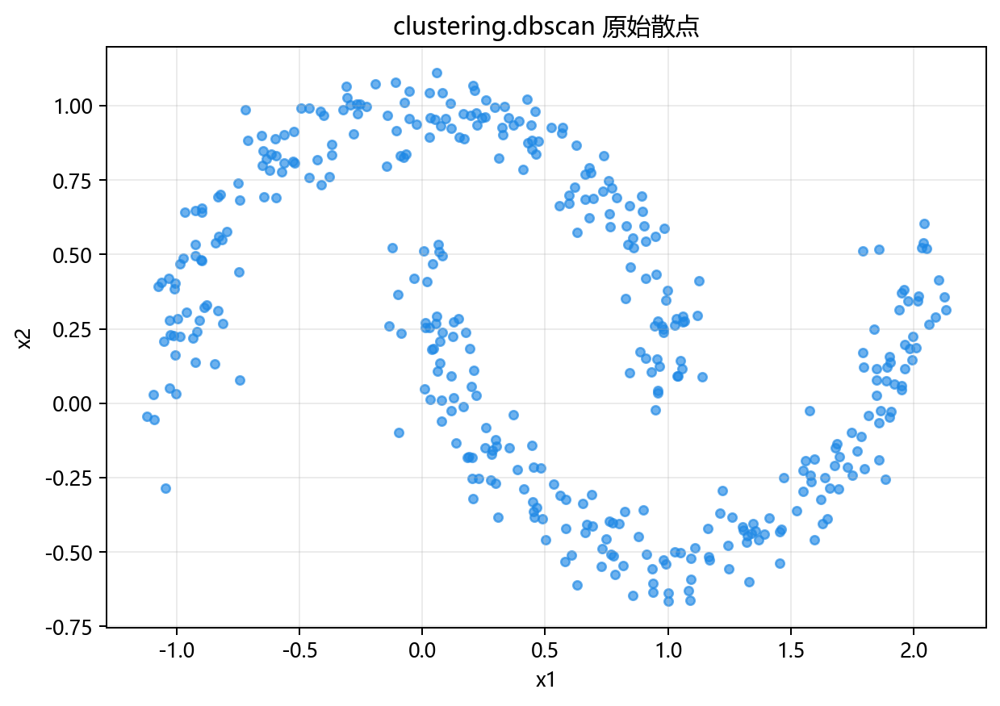
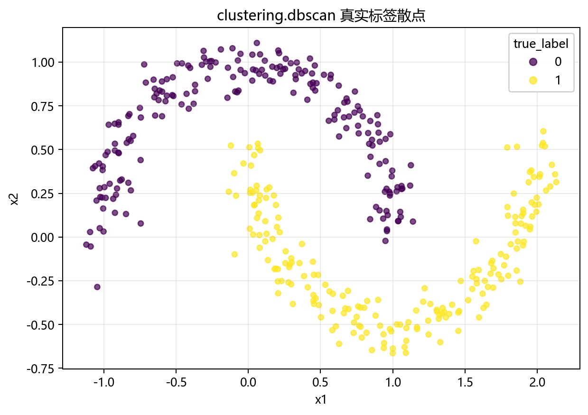
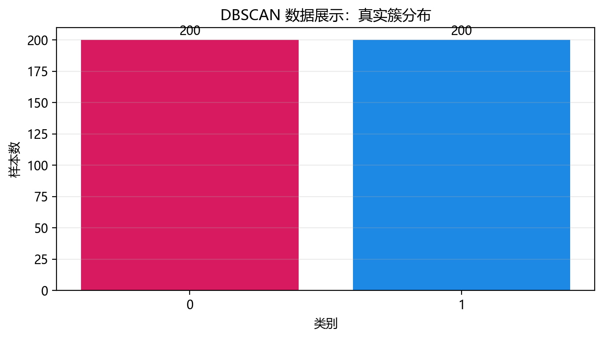
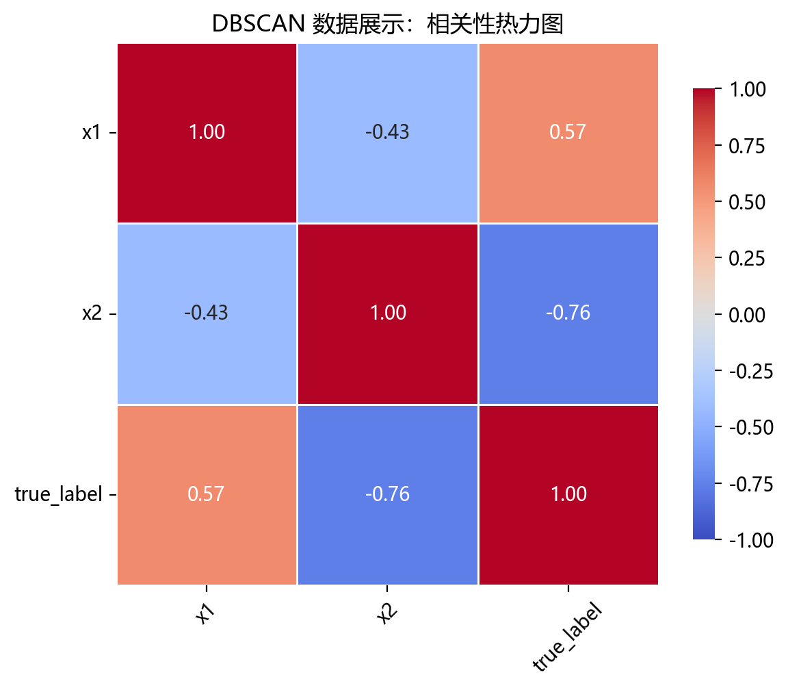

# 数据构成

## 本章目标

1. 明确本仓库 DBSCAN 数据来自 `make_moons(...)` 构造的双月牙聚类数据。
2. 明确特征列与 `true_label` 在当前流水线中的角色差异——这是无监督聚类，`true_label` 仅用于结果对照。
3. 明确标准化发生在什么位置，以及为什么它对基于距离的 `eps` 邻域判定至关重要。

## 重点方法与概念速览

| 名称 | 类型 | 作用 |
|---|---|---|
| `ClusteringData.dbscan()` | 方法 | 生成 DBSCAN 使用的二维双月牙聚类数据 |
| `make_moons(...)` | 函数 | scikit-learn 提供的双月牙数据生成器 |
| `dbscan_data` | 变量 | 在 `data_generation/__init__.py` 中导出的 DataFrame |
| `true_label` | 列名 | 真实簇标签——仅用于与预测结果视觉对照，不参与 `fit()` |
| `StandardScaler` | 类 | 对特征做 Z-score 标准化——`eps` 邻域判定的前置条件 |

## 1. 数据生成：`make_moons()`

当前 DBSCAN 数据来自 `ClusteringData.dbscan()`，底层调用 `sklearn.datasets.make_moons()`。

### 参数速览

适用函数：`make_moons(n_samples=400, noise=0.08, random_state=42)`

| 参数名 | 类型 | 说明 | 示例取值 |
|---|---|---|---|
| `n_samples` | `int` | 总样本数。默认 400，两个月牙各约 200 个样本 | `400`、`500` |
| `noise` | `float` | 添加到 x 和 y 坐标上的高斯噪声标准差。`0` 表示完全平滑的月牙弧线，`0.08` 使样本轻微偏离理想弧线 | `0.08`、`0.05`、`0.12` |
| `random_state` | `int` | 随机种子，保证数据可复现。默认 `42` | `42` |
| `shuffle` | `bool` | 是否打乱样本顺序。默认 `True` | `True` |
| 返回值 | `(ndarray, ndarray)` | `(X, y)` 元组，$X$ 形状 $(400, 2)$，$y$ 取值 $\{0, 1\}$ | — |

### 示例代码

```python
X, y = make_moons(
    n_samples=400,
    noise=0.08,
    random_state=42,
)
data = DataFrame({"x1": X[:, 0], "x2": X[:, 1], "true_label": y})
```

### 理解重点

- 双月牙数据是展示 DBSCAN 优势的经典基准——两个月牙弧形弯曲、互不连通，无法用球形簇或线性边界有效分离。
- `noise=0.08` 在保持月牙弧形结构可辨识的前提下，增加了一定的局部密度波动——少量点可能落在两个月牙之间的间隙中。
- 只包含 $x_1$、$x_2$ 两个特征，非常适合二维散点图直观展示聚类效果。

## 2. 特征列与 `true_label` 的角色

### 参数速览

| 参数名 | 类型 | 说明 | 示例取值 |
|---|---|---|---|
| `X` | `DataFrame` | 含 2 个连续特征的特征矩阵，列名 `x1`、`x2` | `data.drop(columns=["true_label"])` |
| `y_true` | `ndarray` | 真实簇标签 $y_i \in \{0, 1\}$，**仅用于结果对照**，不参与 DBSCAN 的 `fit()` | `data["true_label"].values` |

### 示例代码

```python
y_true = data["true_label"].values
X = data.drop(columns=["true_label"])
```

### 理解重点

- 这是分类分册与聚类分册的核心差异——`true_label` 不传入 `model.fit()`。
- DBSCAN 是无监督算法：`fit(X)` 只接收特征矩阵，不接收标签。
- `true_label` 的唯一目的是在 `plot_clusters(...)` 中与 `model.labels_` 做左右对照——帮助读者判断算法是否恢复了真实的簇结构。

## 3. 标准化

### 参数速览

适用 API：`StandardScaler().fit_transform(X)`

| 参数名 | 类型 | 说明 | 示例取值 |
|---|---|---|---|
| `X` | `DataFrame` | 去掉 `true_label` 后的二维特征矩阵 | `X` |
| 返回值 | `ndarray` | $z_{ij} = (x_{ij} - \mu_j) / \sigma_j$，均值为 0 标准差为 1 | `X_scaled` |

### 示例代码

```python
scaler = StandardScaler()
X_scaled = scaler.fit_transform(X)
```

### 理解重点

- DBSCAN 使用 `eps` 定义 $\epsilon$ 邻域半径——这是一个绝对数。如果特征量纲不同，同样的 `eps` 在不同维度上代表完全不同的邻域范围。
- 标准化后每个特征具有相同的尺度，`eps=0.3` 在所有维度上含义一致。
- 与分类分册不同，DBSCAN 流水线没有训练/测试切分——因为无监督聚类不需要验证集，标准化在全量数据上执行。

## 数据可视化









## 常见坑

1. 把 `true_label` 当成训练标签传入 `model.fit()`——DBSCAN 是无监督算法，不接受标签参数。
2. 误以为 `true_label` 和分类分册中的 `y_train` 有相同角色——一个是无监督对照，一个是有监督训练目标。
3. 忽略标准化——`eps` 是绝对数值，不标准化的数据会让邻域判定在不同维度上含义不一致。
4. 看到双月牙效果很好，就误以为 DBSCAN 在所有密度分布上都同样稳定。

## 小结

- 当前 DBSCAN 数据来自 `make_moons(n_samples=400, noise=0.08)`：2 个连续特征、双月牙弧形结构。
- 数据流为：`make_moons` → DataFrame（`x1`、`x2` + `true_label`）→ 剥离 `true_label` → 全量标准化。
- `true_label` 仅用于结果对照——这是无监督聚类与有监督分类在数据处理上的最根本差异。
