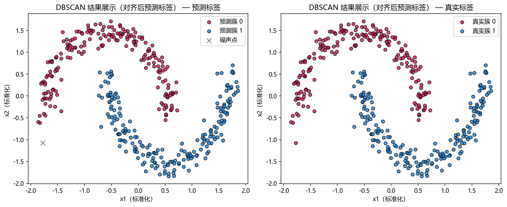

# 思路与直觉

## 本章目标

1. 用直观方式理解 DBSCAN 的密度聚类思路——从"哪里密集就从哪里向外扩展"而非"先定中心再划分"。
2. 理解为什么 DBSCAN 在双月牙数据上能恢复真实簇结构，而中心式聚类方法会失败。
3. 通过对比 KMeans，建立 DBSCAN 在聚类算法图中的定位。

## 重点方法与概念速览

| 名称 | 类型 | 作用 |
|---|---|---|
| 密度聚类 | 核心直觉 | 不预设簇形状，而是把"局部密集且连通"的区域识别为簇 |
| 核心点扩展 | 生长机制 | 只有周围足够密集的点才有资格向外"生长"出簇 |
| 噪声识别 | 天然输出 | 不落入任何密集区域的点自动被标为噪声——无需额外后处理 |
| 双月牙数据 | 教学示例 | 最能体现 DBSCAN 相对中心式聚类优势的非球形数据 |
| KMeans | 对比算法 | 擅长球形簇，在弯曲结构中会将月牙沿 Voronoi 边界切开 |

## 1. 为什么需要密度聚类

大多数聚类算法（如 KMeans）的核心思路是：先假设簇是围绕某个中心的球形区域，然后把每个点分配给最近的中心。

但当簇的形状弯曲、拉长或不规则时，"距离最近中心"的划分方式会切出违反直觉的结果——例如把一条弯月从中间斩断。

DBSCAN 换了另一种思路：

- **不找中心**——找高密度区域
- **不从全局划分**——从局部连通出发
- **不预设簇数**——让密度结构自己决定有多少个簇

### 理解重点

- 密度聚类的出发点是"哪里人多就往哪里聚"，而不是"谁离我近我跟谁"。
- 这种直觉在物理上很自然——银河系、城市群、社交网络社区也都是密度驱动的聚类。
- 因为不依赖中心假设，DBSCAN 天然适合任意形状的簇。

## 2. 为什么 DBSCAN 在双月牙数据上表现好

当前数据是两个弯曲的月牙形簇，内侧相对。这种结构有四个特征：

- 月牙**内部**密度较高且均匀——容易形成核心点
- 月牙**之间**有明显的低密度间隙——密度扩展不会跨月牙跳跃
- 月牙形状**弯曲**——无法用球形区域描述
- 维度只有 **2**——便于直观观察

### 理解重点

- 如果 `eps=0.3` 小于两个月牙之间的最小间距（标准化后约 0.5），密度扩展会自然地止步于月牙边缘——这正是正确的聚类结果。
- KMeans 会沿两个球形簇的 Voronoi 边界将弯月切分成两个"半球"——这不是 KMeans 的错误，而是它的设计假设（球形簇）与双月牙数据不匹配的必然结果。
- DBSCAN 不需要"知道"数据是月牙形的——它只关心局部密度和连通性，形状信息是被密度结构间接表达的。

## 3. 用"从核心点向外生长"理解算法

DBSCAN 的过程可以直观地想象为：

1. **找种子**：遍历所有点，找到满足"周围足够密集"的核心点
2. **向外生**：从核心点出发，把 $\epsilon$ 邻域内所有点拉入当前簇
3. **继续扩**：如果新拉入的点中还有核心点，就继续向外扩散
4. **止于边界**：当扩展到边界点（邻域不够密）时停止——边界点本身不能继续扩展
5. **收尾**：遍历结束后，没有被任何核心点触达的点标为噪声

### 理解重点

- DBSCAN 更像"菌落生长"——从密集中心向外扩散，直到遇到密度不达标的边缘。
- KMeans 更像"行政区划"——先划定中心点，再按最近原则分配。
- 两种直觉对应了两类截然不同的聚类哲学。

## 4. 噪声是设计，不是失败

DBSCAN 会把不满足密度连通条件的点标为噪声（`labels_ == -1`）。

### 理解重点

- 在 KMeans 中，每个点都会被强行分配到一个簇——即使它离所有中心都很远。而 DBSCAN 允许点"不属于任何簇"。
- 噪声识别是 DBSCAN 的天然输出——这在异常检测、离群点分析等场景中本身就是有价值的信息。
- 如果噪声点过多（如超过 20%），通常说明 `eps` 太小或 `min_samples` 太大——参数需要调整，但机制本身是合理的。

## 5. 与 KMeans 的直觉对比

| 维度 | DBSCAN | KMeans |
|---|---|---|
| 核心问题 | 哪些点是局部密集且彼此连通的？ | 每个点离哪个中心最近？ |
| 簇的形状假设 | 任意形状（仅需密度连通） | 球形/凸形（基于到中心的距离） |
| 簇数 | 由密度结构自动决定 | 必须预设 $k$ |
| 噪声处理 | 天然识别为标签 $-1$ | 强制分配——每个点都属于某个簇 |
| 对标准化的依赖 | 强——`eps` 是绝对数值 | 强——距离是划分依据 |
| 对新样本的扩展 | sklearn 不支持 `predict()` | 支持 `predict(X_new)` |

### 理解重点

- DBSCAN 和 KMeans 不是"谁更好"的关系——它们分别精通不同类型的数据。
- 球形数据选 KMeans，弯曲/不规则形状选 DBSCAN，密度差异极大的数据两者都可能不适用。
- 当前仓库选择 `make_moons` 作为 DBSCAN 的教学数据，正是为了展示这种差异。

## 可视化

## 常见坑

1. 因为当前双月牙示例效果很好，就认为 DBSCAN 适合所有聚类数据——它假设各簇密度相近。
2. 把噪声点理解成算法出错——噪声识别是 DBSCAN 的核心设计，不是 bug。
3. 只调 `eps` 而忽略 `min_samples`——两者是联动参数，单独调一个往往达不到预期效果。
4. 不区分"局部密度连通"与"全局几何距离接近"——两个点可能几何上很近，但被低密度区域阻隔，DBSCAN 不会将它们归入同一簇。

## 小结

- DBSCAN 的直觉核心是密度聚类：从高密度的核心点出发，沿密度连通关系逐步扩展出簇——不预设簇数和簇形状。
- 双月牙数据与这种直觉高度匹配——两个月牙内部密集、月牙之间有间隙、形状弯曲无规则。
- 噪声识别是 DBSCAN 区别于 KMeans 的关键特征——它允许点"不属于任何簇"，这在很多实际场景中是优势而非缺陷。
- 理解 DBSCAN 与 KMeans 的直觉差异，是理解"何时选 DBSCAN、何时选 KMeans"的前提。
