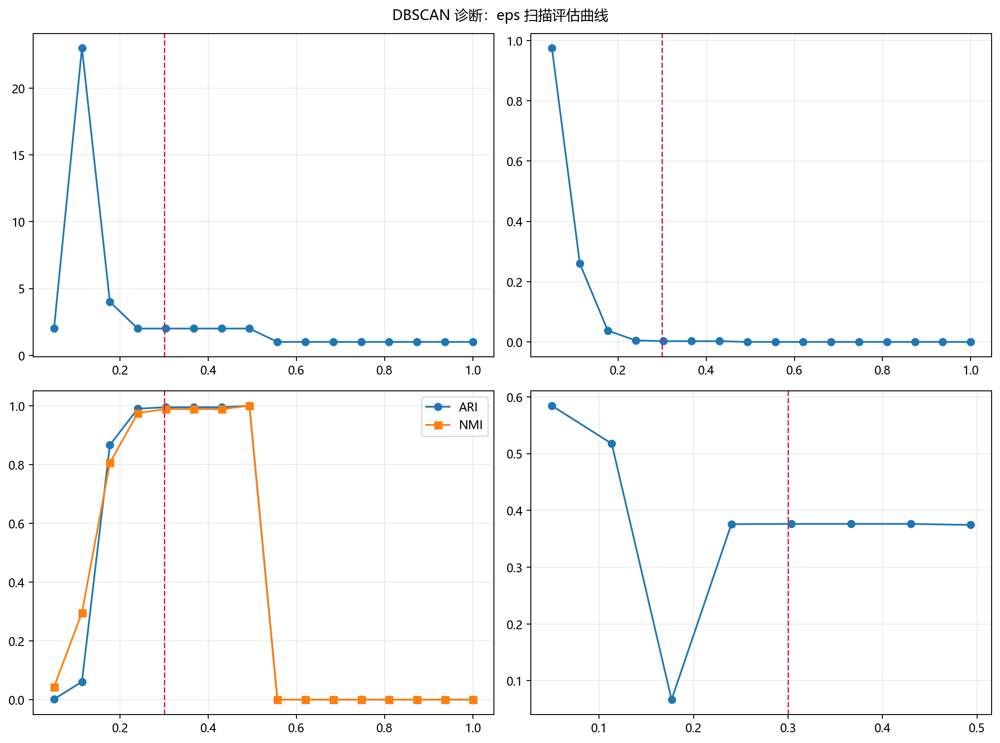
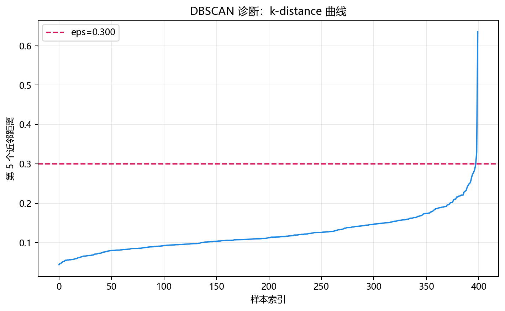

# 模型构建

> 对应代码：`model_training/clustering/dbscan.py`
>
> 运行方式：`python -m model_training.clustering.dbscan`

## 本章目标

1. 明确 `train_model(...)` 如何构建并训练 `DBSCAN`。
2. 理解 `labels_`、簇数量和噪声点数量在当前源码中的作用。
3. 看清训练函数除了 `fit(...)` 之外还做了哪些工程封装。

## 重点方法与概念速览

| 名称 | 类型 | 作用 |
|---|---|---|
| `train_model(...)` | 函数 | 构建并训练一个 `sklearn.cluster.DBSCAN` 模型 |
| `DBSCAN(...)` | 类 | scikit-learn 提供的密度聚类器 |
| `model.fit(X_train)` | 方法 | 在训练数据上执行密度聚类 |
| `model.labels_` | 属性 | 返回训练样本的簇分配结果，噪声为 `-1` |
| `n_clusters` | 统计量 | 从 `labels_` 推导出的簇数量 |
| `n_noise` | 统计量 | 从 `labels_ == -1` 推导出的噪声点数量 |
| `@print_func_info` / `@timeit` | 装饰器 | 打印函数信息并统计训练耗时 |

## 1. `train_model(...)` 的函数签名

### 参数速览（本节）

适用函数：`train_model(X_train, eps=0.3, min_samples=5, metric='euclidean')`

| 参数名 | 本例取值 | 说明 |
|---|---|---|
| `X_train` | 标准化后的特征 | 输入给 `DBSCAN.fit(...)` 的训练矩阵 |
| `eps` | `0.3` | 邻域半径 |
| `min_samples` | `5` | 核心点判定阈值 |
| `metric` | `'euclidean'` | 距离度量方式 |
| 返回值 | `DBSCAN` | 已训练完成的模型对象 |

### 示例代码

```python
from model_training.clustering.dbscan import train_model

model = train_model(X_scaled)
```

### 理解重点

- 当前训练入口很直接，只负责训练一个 `DBSCAN` 模型。
- 和监督学习分册不同，这里没有 `y_train`，也没有训练集/测试集拆分。
- 所有默认超参数都写在函数签名里，阅读成本较低，适合作为源码入口。

## 2. `DBSCAN(...)` 的实际构建方式

### 参数速览（本节）

适用 API（分项）：

1. `DBSCAN(...)`
2. `model.fit(X_train)`

| 项目 | 当前实现 | 说明 |
|---|---|---|
| 训练模型 | `DBSCAN(...)` | 使用源码中显式给出的超参数 |
| 输入特征 | `X_train` | 当前流水线传入的是标准化后的二维特征 |
| 训练方式 | `fit(X_train)` | 无监督拟合，不需要监督标签 |
| 返回值 | 已训练模型 | 含 `labels_` 等聚类结果 |

### 示例代码

```python
model = DBSCAN(
    eps=eps,
    min_samples=min_samples,
    metric=metric,
)
model.fit(X_train)
```

### 理解重点

- 仓库没有自己实现密度扩展过程，而是直接调用 scikit-learn 的成熟实现。
- 当前封装的重点，不是重写算法，而是把超参数、训练耗时和结果日志组织清楚。
- `fit(X_train)` 只接收特征，不接收标签，这一点和监督学习的 `.fit(X, y)` 有本质差异。

## 3. 训练完成后最重要的模型属性与统计量

### 参数速览（本节）

适用属性/统计量（分项）：

1. `model.labels_`
2. `n_clusters`
3. `n_noise`

| 名称 | 当前含义 | 作用 |
|---|---|---|
| `labels_` | 每个训练样本所属簇编号 | 用于绘制预测簇标签图 |
| `-1` | 特殊标签 | 表示噪声点 |
| `n_clusters` | 排除 `-1` 后的簇数量 | 用于日志观察聚类结构 |
| `n_noise` | `labels_ == -1` 的样本数 | 用于日志观察噪声规模 |

### 示例代码

```python
labels = model.labels_
n_clusters = len(set(labels)) - (1 if -1 in labels else 0)
n_noise = (labels == -1).sum()
```

### 理解重点

- `labels_` 是当前训练样本的聚类结果，因此它在本仓库里承担了“训练后簇分配输出”的角色。
- 对 DBSCAN 来说，没有 KMeans 那样的 `cluster_centers_` 概念。
- 当前分册最核心的结果解释，不是“簇中心在哪里”，而是“分出了几个簇、多少点被视为噪声”。

## 4. 训练阶段的工程封装

除了 `DBSCAN(...).fit(...)` 之外，`train_model(...)` 还做了几层工程包装。

### 参数速览（本节）

适用装饰与输出（分项）：

1. `@print_func_info`
2. `@timeit`
3. `with timer(name="模型训练耗时")`
4. 日志输出 `eps`、`min_samples`、`簇数量`、`噪声点数量`

| 输出项 | 作用 |
|---|---|
| 函数调用标题 | 帮助在终端中定位训练入口 |
| 训练耗时 | 观察当前模型拟合时间 |
| `模型训练完成` | 明确训练阶段已结束 |
| `eps` / `min_samples` | 确认当前参数配置 |
| `簇数量` / `噪声点数量` | 快速查看当前聚类结构 |

### 理解重点

- 当前封装强调的是教学型可读性，而不是复杂训练框架。
- 这一层封装把“构建模型”“训练模型”“打印结果”收在一个函数里，方便文档和流水线复用。
- 从工程角度看，这样的拆分也让 `pipelines/clustering/dbscan.py` 保持简洁。

## 参数诊断可视化





## 常见坑

1. 误以为 `train_model(...)` 需要传入 `y_train`。
2. 误以为 DBSCAN 训练完成后也会得到簇中心。
3. 只看 `labels_`，却忽略 `-1`、簇数量和噪声点数量才是当前实现的关键输出。
4. 忘记当前 `X_train` 应该是标准化后的特征。

## 小结

- `train_model(...)` 是本仓库 DBSCAN 的核心训练入口。
- 它本质上是对 `sklearn.cluster.DBSCAN` 的薄封装，重点在于把超参数、训练结果和日志输出组织清楚。
- 读懂这一层之后，再看流水线中的数据准备、可视化和评估过程会更顺畅。
