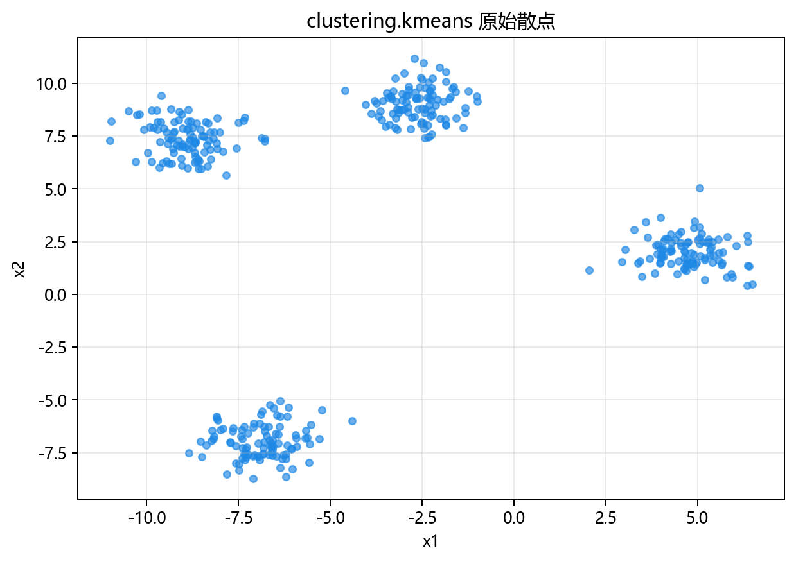
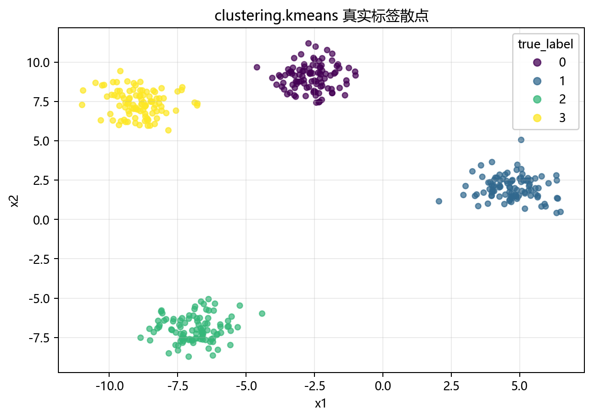
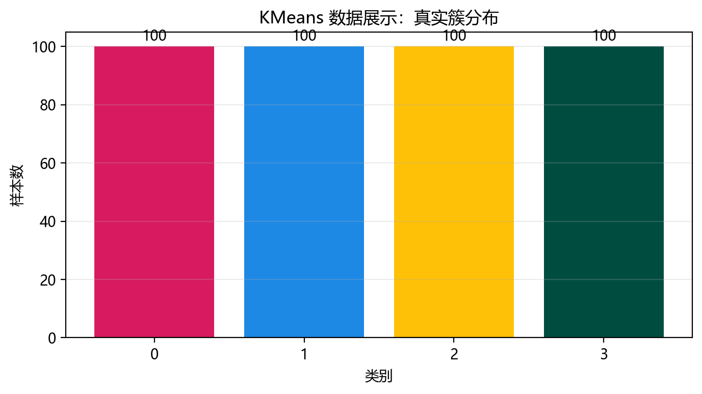
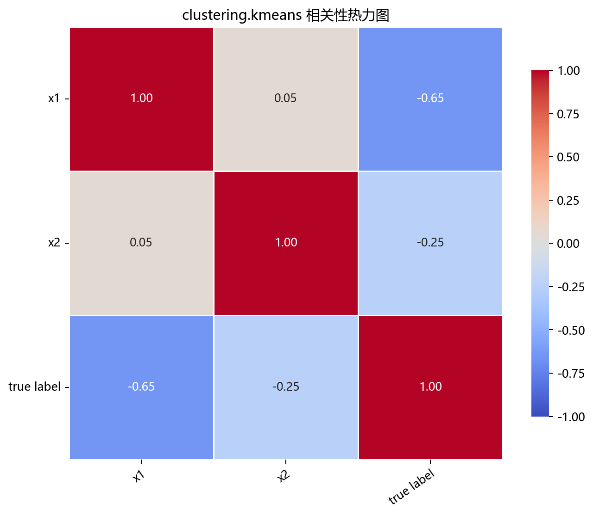

# 数据构成

## 本章目标

1. 明确本仓库 KMeans 数据来自 `make_blobs(...)` 构造的球形高斯簇数据。
2. 明确特征列与 `true_label` 在当前流水线中的角色差异——这是无监督聚类，`true_label` 仅用于结果对照。
3. 明确标准化发生在什么位置，以及为什么它对基于距离的 KMeans 至关重要。

## 重点方法与概念速览

| 名称 | 类型 | 作用 |
|---|---|---|
| `ClusteringData.kmeans()` | 方法 | 生成 KMeans 使用的二维球形 blob 聚类数据 |
| `make_blobs(...)` | 函数 | scikit-learn 提供的各向同性高斯簇数据生成器 |
| `kmeans_data` | 变量 | 在 `data_generation/__init__.py` 中导出的 DataFrame |
| `true_label` | 列名 | 真实簇标签——仅用于与预测结果视觉对照，不参与 `fit()` |
| `StandardScaler` | 类 | 对特征做 Z-score 标准化——距离度量的前置条件 |

## 1. 数据生成：`make_blobs()`

当前 KMeans 数据来自 `ClusteringData.kmeans()`，底层调用 `sklearn.datasets.make_blobs()`。

### 参数速览

适用函数：`make_blobs(n_samples=400, centers=4, cluster_std=0.8, random_state=42)`

| 参数名 | 类型 | 说明 | 示例取值 |
|---|---|---|---|
| `n_samples` | `int` | 总样本数。默认 400，4 个簇各约 100 个样本 | `400`、`500` |
| `centers` | `int` 或 `ndarray` | 簇的数量（传入整数时随机生成质心坐标）或质心坐标矩阵。默认 `4` | `4`、`3`、`[[0,0],[5,5]]` |
| `cluster_std` | `float` 或 `array` | 各簇的标准差。`0.8` 使簇内样本适度分散——标准差越大簇越松散、越难聚类 | `0.5`、`0.8`、`1.5` |
| `random_state` | `int` | 随机种子，保证数据可复现。默认 `42` | `42` |
| `shuffle` | `bool` | 是否打乱样本顺序。默认 `True` | `True` |
| 返回值 | `(ndarray, ndarray)` | `(X, y)` 元组，$X$ 形状 $(400, 2)$，$y$ 取值 $\{0, 1, 2, 3\}$ | — |

### 示例代码

```python
X, y = make_blobs(
    n_samples=400,
    centers=4,
    cluster_std=0.8,
    random_state=42,
)
data = DataFrame({"x1": X[:, 0], "x2": X[:, 1], "true_label": y})
```

### 理解重点

- `make_blobs` 生成的是各向同性高斯簇——簇内点在质心周围球形散布，与 KMeans 的平方欧氏距离优化目标完美匹配。
- `cluster_std=0.8` 在"足够紧凑可清晰聚类"和"适度分散有真实感"之间取得了教学平衡。
- 4 个簇的质心随机分布在二维平面的不同区域——确保簇间距离 >> 簇内散布，分配步骤易于判断。

## 2. 特征列与 `true_label` 的角色

### 参数速览

| 参数名 | 类型 | 说明 | 示例取值 |
|---|---|---|---|
| `X` | `DataFrame` | 含 2 个连续特征的特征矩阵，列名 `x1`、`x2` | `data.drop(columns=["true_label"])` |
| `y_true` | `ndarray` | 真实簇标签 $y_i \in \{0, 1, 2, 3\}$，**仅用于结果对照**，不参与 KMeans 的 `fit()` | `data["true_label"].values` |

### 示例代码

```python
y_true = data["true_label"].values
X = data.drop(columns=["true_label"])
```

### 理解重点

- `true_label` 不传入 `model.fit()`——KMeans 是无监督算法，`fit(X)` 只接收特征。
- `true_label` 的唯一目的是在 `plot_clusters(...)` 中与 `model.labels_` 做左右对照——帮助读者判断算法是否恢复了真实的 4 簇结构。
- 簇标签编号（0, 1, 2, 3）在 `labels_` 和 `true_label` 之间不一定对应——这是聚类评估的正常情况。

## 3. 标准化

### 参数速览

适用 API：`StandardScaler().fit_transform(X)`

| 参数名 | 类型 | 说明 | 示例取值 |
|---|---|---|---|
| `X` | `DataFrame` | 去掉 `true_label` 后的二维特征矩阵 | `X` |
| 返回值 | `ndarray` | $z_{ij} = (x_{ij} - \mu_j) / \sigma_j$，均值为 0 标准差为 1 | `X_scaled` |

### 示例代码

```python
scaler = StandardScaler()
X_scaled = scaler.fit_transform(X)
```

### 理解重点

- KMeans 依赖欧氏距离到质心：$\|\mathbf{x} - \boldsymbol{\mu}_k\|^2 = \sum_j (x_j - \mu_{kj})^2$。如果特征量纲不同，距离计算被尺度主导。
- 标准化后各特征平等贡献于分配决策——质心的位置和形状在几何上才有意义。
- 与 DBSCAN 流水线一致——无切分，在全量数据上直接 `fit_transform`。

## 数据可视化









## 常见坑

1. 把 `true_label` 当成训练标签传入 `model.fit()`——KMeans 是无监督算法，不接受标签参数。
2. 忽略标准化——距离度量被特征量纲绑架，聚类结果失真。
3. 期望 `labels_` 的簇编号（0, 1, 2, 3）与 `true_label` 完全对应——标签编号是任意的。

## 小结

- 当前 KMeans 数据来自 `make_blobs(n_samples=400, centers=4, cluster_std=0.8)`：2 个连续特征、4 个各向同性高斯簇。
- 数据流为：`make_blobs` → DataFrame（`x1`、`x2` + `true_label`）→ 剥离 `true_label` → 全量标准化。
- `true_label` 仅用于结果对照——这是无监督聚类与有监督分类在数据处理上的根本差异。
- `make_blobs` 的球形高斯假设与 KMeans 的平方欧氏距离优化天然匹配——这使其成为 KMeans 教学的理想基准数据。
