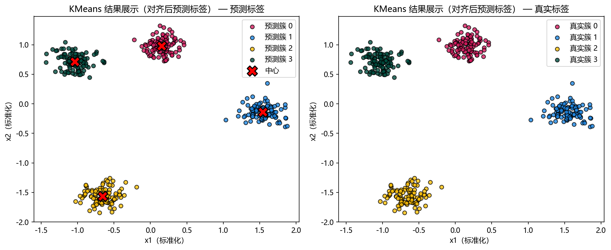

# 思路与直觉

> 对应代码：`data_generation/clustering.py`、`pipelines/clustering/kmeans.py`
>
> 对比对象：`docs/clustering/dbscan/`

## 本章目标

1. 用直观方式理解 KMeans 到底在做什么。
2. 理解为什么它在当前 blob 数据上效果很好。
3. 理解它与 DBSCAN 在数据假设上的关键差异。

## 重点方法与概念速览

| 名称 | 类型 | 作用 |
|---|---|---|
| 聚类 | 任务 | 在没有监督标签参与训练时发现样本群组 |
| 最近中心 | 几何直觉 | 每个点归属离自己最近的中心 |
| 簇均值 | 更新规则 | 每轮用簇内样本均值刷新中心位置 |
| blob 数据 | 示例数据 | 当前仓库里最适合演示 KMeans 的球形簇数据 |
| DBSCAN | 对比算法 | 更擅长处理任意形状和噪声数据 |

## 1. 为什么需要 KMeans

在很多场景里，数据只有特征，没有可直接用于训练的标签。这时我们仍然希望回答一个问题：

这些样本能否自然分成几群？

KMeans 给出的思路很直接：

- 先假设数据里有 `K` 个簇。
- 为每个簇放一个中心点。
- 让每个样本都归到最近的中心。
- 再根据当前归属关系，重新更新每个中心的位置。

### 理解重点

- 这是一种非常“几何化”的聚类方法，它关注的是空间距离，而不是概率密度或连通关系。
- 因为思路简单、实现高效，KMeans 常常是聚类任务的第一基线方法。
- 但它的效果高度依赖数据是否适合“按最近中心切分”。

## 2. 为什么当前仓库示例里它表现很好

当前 KMeans 数据来自：

```python
make_blobs(
    n_samples=400,
    centers=4,
    cluster_std=0.8,
    random_state=42,
)
```

这类数据的特点是：

- 簇形状近似球形
- 簇间距离较明显
- 簇内方差相近
- 维度只有 2，便于直观看图

### 理解重点

- KMeans 本质上更偏好“圆团状”或“球形”簇。
- 当前数据正好满足这个假设，所以 `model.labels_` 与 `true_label` 通常会较为接近。
- 这也是为什么该数据适合作为 KMeans 的教学演示入口。

## 3. 用两步循环理解算法

可以把 KMeans 理解成一个不断重复的循环：

1. 把每个点分给最近的中心。
2. 把每个中心移动到自己负责的点的平均位置。

### 示例代码

```text
初始化若干中心
重复执行:
  1. 按最近距离分配样本
  2. 用簇内均值更新中心
直到中心基本不再变化
```

### 理解重点

- 第一步解决“谁属于哪个簇”。
- 第二步解决“这个簇的代表位置应该在哪里”。
- 算法不断交替做这两件事，直到分配结果稳定下来。

## 4. 为什么标准化会明显影响结果

在当前流水线中，训练前有这样一步：

```python
scaler = StandardScaler()
X_scaled = scaler.fit_transform(X)
```

### 理解重点

- KMeans 用的是距离，因此距离度量对尺度非常敏感。
- 如果一个特征的取值范围明显更大，它会主导“最近中心”的判断。
- 所以即便当前示例数据较规整，文档仍要明确强调标准化的重要性。

## 5. 与 DBSCAN 的直觉差异

`ClusteringData` 里同时还生成了 DBSCAN 使用的 `make_moons(...)` 数据。

两者的直觉差异可以这样理解：

| 算法 | 更擅长的数据形状 | 核心依据 |
|---|---|---|
| KMeans | 球形、凸形、方差接近的簇 | 到中心的距离 |
| DBSCAN | 任意形状、含噪声点的数据 | 局部密度与连通性 |

### 理解重点

- KMeans 看到的是“离哪个中心更近”。
- DBSCAN 看到的是“哪些点在局部上彼此足够密集并连成一片”。
- 因此 `make_blobs` 更适合 KMeans，而 `make_moons` 更能体现 DBSCAN 的优势。

## 可视化



## 常见坑

1. 因为当前示例效果很好，就误以为 KMeans 适合所有聚类数据。
2. 把聚类结果标签编号当成有固定语义的类别编号。
3. 忽略标准化带来的距离偏差。
4. 不区分“簇的几何形状假设”和“簇的真实业务含义”。

## 小结

- KMeans 的直觉非常简单：反复做“最近中心分配”和“均值更新中心”。
- 当前仓库使用的 blob 数据与它的几何假设高度一致，因此很适合做入门演示。
- 如果数据呈现弯曲结构、噪声较多或簇密度差异很大，就需要考虑 DBSCAN 等其他方法。
