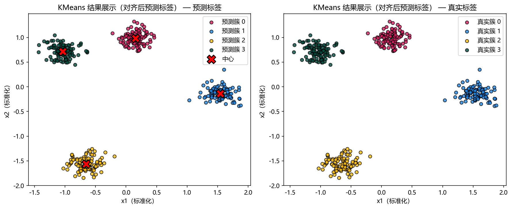

# 评估与诊断

## 本章目标

1. 明确当前仓库 KMeans 实现的评估手段——聚类对照散点图（含质心标记）+ `inertia_` 日志。
2. 理解 KMeans 特有的评估逻辑——`inertia_` 作为簇紧密度指标、肘部法则作为选 $K$ 的方法。
3. 理解轮廓系数等常见聚类指标的原理，以及它们未在流水线中显式计算的原因。

## 重点方法与概念速览

| 名称 | 类型 | 作用 |
|---|---|---|
| `plot_clusters(...)` | 函数 | 绘制预测簇标签与真实标签的左右对照散点图（含质心 `X` 标记） |
| `inertia_` | 指标 | 最终簇内平方和——衡量簇紧密度，值越小簇越紧凑 |
| 肘部法则（Elbow Method） | 诊断方法 | 绘制 `inertia_` 随 $K$ 变化的曲线，拐点即为推荐的 $K$ |
| 轮廓系数（Silhouette Score） | 指标 | 量化聚类紧密度与分离度——$s_i \in [-1, 1]$，越接近 1 越好 |
| 质心位置对照 | 诊断 | 观察 `cluster_centers_` 是否落在各簇的几何中心——判断收敛质量 |

## 1. 当前仓库的评估入口

KMeans 的评估与分类分册截然不同——没有混淆矩阵、没有 ROC 曲线、没有决策边界、没有学习曲线。评估依赖两种手段：

1. **聚类对照散点图** —— 左右并列显示算法聚类结果（含红色 `X` 质心标记）与真实标签，视觉上判断簇结构恢复质量
2. **`inertia_` 日志** —— 训练完成后打印的簇内平方和，量化聚类紧密度

### 示例代码

```python
plot_clusters(
    X_scaled,
    labels_pred=model.labels_,
    labels_true=y_true,
    centers=model.cluster_centers_,
    title="KMeans 聚类分布",
    dataset_name=DATASET,
    model_name=MODEL,
)
```

### 理解重点

- 聚类评估不能像分类那样用 `y_pred == y_test` 计算准确率——簇标签编号（0, 1, 2, 3）与真实标签编号不一定对应，且聚类关注的是簇结构而非逐样本正确率。
- 当前评估方法对教学场景来说足够直观——读者可以一眼看出 KMeans 是否恢复了 4 个球形簇，质心标记是否落在各簇几何中心。
- `inertia_` 是最简明的定量参考——配合肘部法则可以辅助判断 $K$ 的选择是否合理。

## 2. 聚类对照散点图能观察什么

### 参数速览

适用函数：`plot_clusters(X, labels_pred, labels_true, centers, ...)`

| 参数名 | 类型 | 说明 | 示例取值 |
|---|---|---|---|
| `X` | `ndarray`，形状 `(n_samples, 2)` | 标准化后的全量特征矩阵 | `X_scaled` |
| `labels_pred` | `ndarray`，形状 `(n_samples,)` | KMeans 聚类结果——来自 `model.labels_` | `model.labels_` |
| `labels_true` | `ndarray`，形状 `(n_samples,)` | 真实簇标签——来自 `make_blobs` 生成时的 `y` | `y_true` |
| `centers` | `ndarray`，形状 `(n_clusters, 2)` | 质心坐标——以红色 `X` 标记显示 | `model.cluster_centers_` |

### 理解重点

- 左侧图展示 KMeans 的聚类结果——用不同颜色标记不同簇，红色 `X` 标记各簇质心位置。
- 右侧图展示真实簇标签——为读者提供"正确答案"的视觉基准。
- 对比重点：
  - 簇的边界是否符合 Voronoi 划分预期——直线边界将平面划分为 $K$ 个凸区域
  - 质心是否落在各簇的几何中心——偏离说明收敛到局部最优或 $K$ 设置不当
  - 预测簇与真实簇在空间分布上的一致性——颜色编号可以不同，但空间分组应对应
- 与 DBSCAN 的可视化差异：KMeans 有红色 `X` 质心标记，无边界的噪声点——这反映了"中心式聚类"与"密度聚类"在可视化上的根本区别。

## 3. `inertia_` 与肘部法则

### `inertia_` 的含义

`inertia_`（簇内平方和）是 KMeans 的核心定量输出：

$$
\text{inertia} = \sum_{k=1}^{K} \sum_{\mathbf{x}_i \in C_k} \|\mathbf{x}_i - \boldsymbol{\mu}_k\|^2
$$

- 值越小 → 簇内样本离质心越近 → 簇越紧凑
- 但 `inertia_` **随 $K$ 增大单调递减**——当 $K = N$（每个点自成簇）时 `inertia_ = 0`。因此不能直接用 `inertia_` 比较不同 $K$ 的模型

### 肘部法则

肘部法则是 KMeans 选 $K$ 的经典方法：

1. 对 $K = 1, 2, 3, \dots, K_{\max}$ 分别训练 KMeans
2. 记录每个 $K$ 对应的 `inertia_`
3. 绘制 $K$-`inertia_` 曲线——拐点（"肘部"）即为推荐的 $K$

### 理解重点

- 肘部法则用"边际收益递减"的直觉选 $K$——当增加一个簇带来的紧密度提升显著变小时，就是合理的 $K$。
- 当前流水线直接使用 `n_clusters=4`（与 `make_blobs(centers=4)` 一致），没有演示肘部法则——但文档应说明这是选 $K$ 的标准方法。
- `inertia_` 是 KMeans 独有的诊断指标——DBSCAN 没有对应物（DBSCAN 用 `n_clusters` 和 `n_noise` 做诊断）。

## 4. 当前实现中尚未纳入但常见的聚类指标

| 指标 | 公式 / 含义 | 当前未使用的原因 |
|---|---|---|
| 轮廓系数（Silhouette Score） | $s_i = \frac{b_i - a_i}{\max(a_i, b_i)}$，其中 $a_i$ 为点到同簇其他点的平均距离（紧密度），$b_i$ 为点到最近邻簇的平均距离（分离度）。$s_i \in [-1, 1]$，越接近 1 越好 | 当前侧重直观教学而非量化评估，且轮廓系数需要额外计算步骤 |
| 调整兰德指数（ARI） | 度量两个聚类分配之间的相似度（共识），扣除随机期望。ARI $\in [-1, 1]$，1 表示完全一致 | 需要真实标签——当前 `true_label` 确实存在，但流水线选择直接用视觉对照而非数值指标 |
| Davies-Bouldin 指数 | 簇间相似度均值（越小越好）——衡量簇内紧密度与簇间分离度的比值 | 无需真实标签——但当前分册的教学重点是理解 KMeans 机制，而非指标对比 |
| Calinski-Harabasz 指数 | 簇间离散度与簇内离散度的比值（越大越好）——基于方差分析的思路 | 同 Davies-Bouldin——教学型仓库优先展示直观的视觉诊断 |

### 理解重点

- 聚类评估体系与分类评估有本质区别——分类可以直接比对预测标签与真实标签，而聚类的"正确性"更多体现在簇结构的合理性（紧密度 + 分离度）。
- 当前流水线不显式计算这些指标——文档可以提到它们是扩展方向，但不能写成"当前源码已在计算"。
- 对于教学型仓库，散点图视觉对照（含质心标记）+ `inertia_` 日志 + 肘部法则概念已经能有效支撑 KMeans 的诊断需求。

## 5. KMeans 评估与 DBSCAN 评估的关键差异

| 维度 | KMeans | DBSCAN |
|---|---|---|
| 核心定量指标 | `inertia_`（簇内平方和） | `n_clusters`、`n_noise` |
| 选参方法 | 肘部法则（$K$-`inertia_` 曲线） | `eps`/`min_samples` 联合调试 |
| 可视化特征 | 红色 `X` 质心标记 | 噪声点特殊着色（$-1$） |
| 簇数来源 | 预设 $K$（用户指定） | 自动决定（密度结构驱动） |
| 噪声概念 | 无——每个点强制归属一簇 | 有——噪声点标记为 $-1$ |

### 理解重点

- KMeans 的评估围绕"簇紧密度"展开（`inertia_`、肘部法则），DBSCAN 的评估围绕"密度结构恢复"展开（簇数量、噪声比例）。
- 两种评估哲学的差异源于算法本质：KMeans 优化几何紧密度，DBSCAN 检测密度连通区域。
- 一个关注"中心在哪、有多紧"，另一个关注"核心在哪、谁被排除"。

## 评估图表



## 常见坑

1. 直接用 `inertia_` 比较不同 $K$ 的模型——`inertia_` 随 $K$ 单调递减，需配合肘部法则使用。
2. 把分类的评估框架（混淆矩阵、ROC、accuracy）搬到聚类评估——两者评估哲学根本不同。
3. 看到 `labels_` 编号与 `true_label` 不对应就认为模型失败——簇标签编号是任意的，空间分组对应才重要。
4. 忽略质心在散点图中的位置——质心偏离簇几何中心是收敛到局部最优的信号。

## 小结

- 当前仓库对 KMeans 的评估简洁而直观：聚类对照散点图（含质心标记）看簇结构恢复质量，`inertia_` 日志看聚类紧密度。
- KMeans 没有混淆矩阵、没有 ROC、没有准确率——这些是监督分类的评估手段，不适用于无监督聚类。
- `inertia_` 是 KMeans 的核心诊断指标——配合肘部法则可以在无真实标签的情况下辅助选择 $K$。
- KMeans 评估与 DBSCAN 评估的核心差异：前者关注"紧密度"（`inertia_`），后者关注"密度结构"（`n_clusters`/`n_noise`）。
