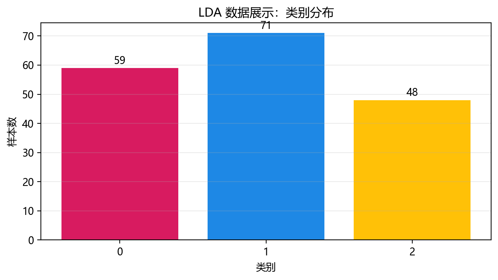
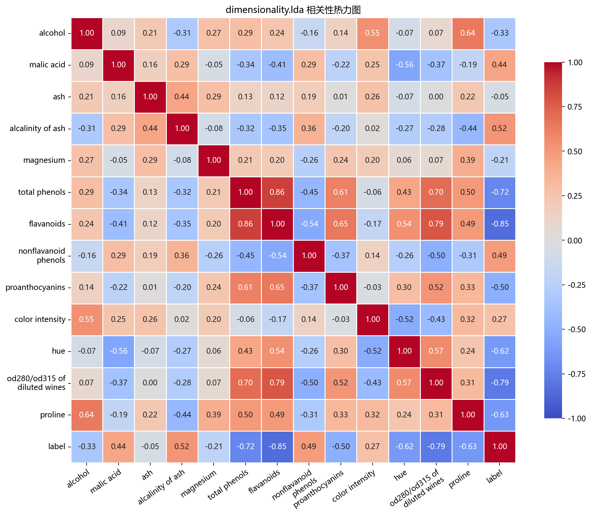
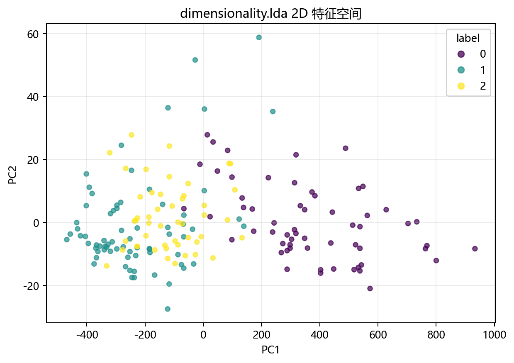

# 数据构成

## 本章目标

1. 明确本仓库 LDA 数据来自 `DimensionalityData.lda()` 加载的 Wine 真实数据集。
2. 明确特征列与 `label` 在当前流水线中的角色差异——这是有监督降维，`label` 参与训练。
3. 明确标准化发生在什么位置，以及为什么它对基于散度矩阵的 LDA 至关重要。

## 重点方法与概念速览

| 名称 | 类型 | 作用 |
|---|---|---|
| `DimensionalityData.lda()` | 方法 | 加载 LDA 使用的 Wine 真实数据集 |
| `load_wine(as_frame=True)` | 函数 | scikit-learn 提供的红酒化学成分数据集加载器 |
| `lda_data` | 变量 | 在 `data_generation/__init__.py` 中导出的 DataFrame |
| `label` | 列名 | 3 分类标签——既参与 LDA 训练（定义类间/类内散度），也用于可视化着色 |
| `StandardScaler` | 类 | 对特征做 Z-score 标准化——散度矩阵计算的前置条件 |

## 1. 数据生成：`DimensionalityData.lda()`

当前 LDA 数据来自 `DimensionalityData.lda()`，底层调用 `sklearn.datasets.load_wine()`。

### 参数速览

适用函数：`load_wine(as_frame=True)`

| 参数名 | 类型 | 说明 | 示例取值 |
|---|---|---|---|
| `as_frame` | `bool` | 是否返回带列名的 `DataFrame`。当前设为 `True` | `True`、`False` |
| 返回值 | `Bunch` 或 `(DataFrame, Series)` | `as_frame=True` 时返回含 `frame`（DataFrame）和 `target`（Series）的 Bunch 对象 | — |

### 示例代码

```python
data = load_wine(as_frame=True)
df = data.frame.copy().rename(columns={"target": "label"})
```

### 理解重点

- Wine 数据集是 UCI 经典真实数据集——178 个红酒样本，13 种化学成分特征，3 个葡萄品种类别。
- 标签列在源码中被统一重命名为 `label`——这使降维分册中的数据接口更一致（PCA 和 LDA 都使用此命名）。
- 与 PCA 使用的 `make_classification` 合成数据不同，LDA 使用真实数据——类别差异明显，适合展示监督降维的判别效果。

## 2. 特征列与 `label` 的角色

### 参数速览

| 参数名 | 类型 | 说明 | 示例取值 |
|---|---|---|---|
| `X` | `DataFrame`，形状 $(178, 13)$ | 含 13 个连续特征的特征矩阵，列名为 `alcohol`、`malic_acid`、`ash` 等 | `data.drop(columns=["label"])` |
| `y` | `ndarray`，形状 $(178,)$ | 类别标签 $y_i \in \{0, 1, 2\}$——**参与 LDA 训练**，定义类间/类内散度结构 | `data["label"].values` |

### 示例代码

```python
X = data.drop(columns=["label"])
y = data["label"].values
```

### 理解重点

- `label` 参与 LDA 的 `fit()`——它被用于计算各类均值 $\boldsymbol{\mu}_k$、类内散度 $\mathbf{S}_W$ 和类间散度 $\mathbf{S}_B$。
- 这与 PCA 分册有根本区别——PCA 的 `label` 仅用于可视化着色，不参与训练。LDA 的 `label` 既参与训练，也用于着色。
- Wine 数据恰好有 $K=3$ 个类别——这意味着 LDA 最多提取 $K-1=2$ 个判别方向，恰好可以完整展示在 2D 平面上。

## 3. 标准化

### 参数速览

适用 API：`StandardScaler().fit_transform(X)`

| 参数名 | 类型 | 说明 | 示例取值 |
|---|---|---|---|
| `X` | `DataFrame`，形状 $(178, 13)$ | 去掉 `label` 后的全量特征矩阵 | `X` |
| 返回值 | `ndarray` | $z_{ij} = (x_{ij} - \mu_j) / \sigma_j$，均值为 0 标准差为 1 | `X_scaled` |

### 示例代码

```python
scaler = StandardScaler()
X_scaled = scaler.fit_transform(X)
```

### 理解重点

- LDA 依赖散度矩阵的计算——$\mathbf{S}_W$ 和 $\mathbf{S}_B$ 的元素是平方和与叉积，对特征尺度高度敏感。
- Wine 数据的特征量纲差异巨大——`alcohol` 取值约 11-15，`proline` 取值约 278-1680。不标准化将使 `proline` 主导全部判别方向。
- 当前流水线没有 train/test split——直接在全量数据上 `fit_transform`。这是教学型简化，目标是展示整体判别结构而非评估泛化能力。

## 4. Wine 数据集特征清单

| 特征名 | 含义 | 典型量纲范围 |
|---|---|---|
| `alcohol` | 酒精含量 | 11.0 – 14.8 |
| `malic_acid` | 苹果酸 | 0.7 – 5.8 |
| `ash` | 灰分 | 1.4 – 3.2 |
| `alcalinity_of_ash` | 灰分碱度 | 10.6 – 30.0 |
| `magnesium` | 镁含量 | 70 – 162 |
| `total_phenols` | 总酚 | 0.98 – 3.88 |
| `flavanoids` | 黄酮类 | 0.34 – 5.08 |
| `nonflavanoid_phenols` | 非黄酮类酚 | 0.13 – 0.66 |
| `proanthocyanins` | 原花青素 | 0.41 – 3.58 |
| `color_intensity` | 颜色强度 | 1.3 – 13.0 |
| `hue` | 色调 | 0.48 – 1.71 |
| `od280/od315_of_diluted_wines` | 稀释酒 OD280/OD315 | 1.27 – 4.00 |
| `proline` | 脯氨酸 | 278 – 1680 |

### 理解重点

- 13 个特征中 `proline` 的量纲范围比 `nonflavanoid_phenols` 大约 3000 倍——不标准化的后果非常直观。
- 这三类分别对应意大利同一地区三种不同品种的葡萄酒——类别间化学成分确实存在系统差异，适合展示 LDA 的判别能力。

## 数据可视化







## 常见坑

1. 把 `label` 当成 PCA 那样仅用于着色的辅助列——LDA 中 `label` 是训练输入，定义散度结构。
2. 忽略标准化——Wine 数据特征量纲差异巨大，散度矩阵计算被 `proline` 等大尺度特征主导。
3. 期望当前流水线有 train/test split——当前实现为教学型简化，直接在全量数据上训练和投影。
4. 误以为可以训练 `n_components=3` 的 LDA——$K=3$ 类数据最多 2 个判别方向。

## 小结

- 当前 LDA 数据来自 `load_wine(as_frame=True)`：178 个样本 × 13 个连续特征 × 3 个类别。
- 数据流为：`load_wine` → DataFrame（13 特征 + `label`）→ 全量标准化。
- `label` 既参与训练（定义 $\mathbf{S}_W$ 和 $\mathbf{S}_B$）也参与可视化（着色）——这是有监督降维与无监督降维在数据处理上的根本差异。
- Wine 真实数据集类别差异明显、特征量纲丰富——是展示 LDA 判别能力的理想教学数据。
