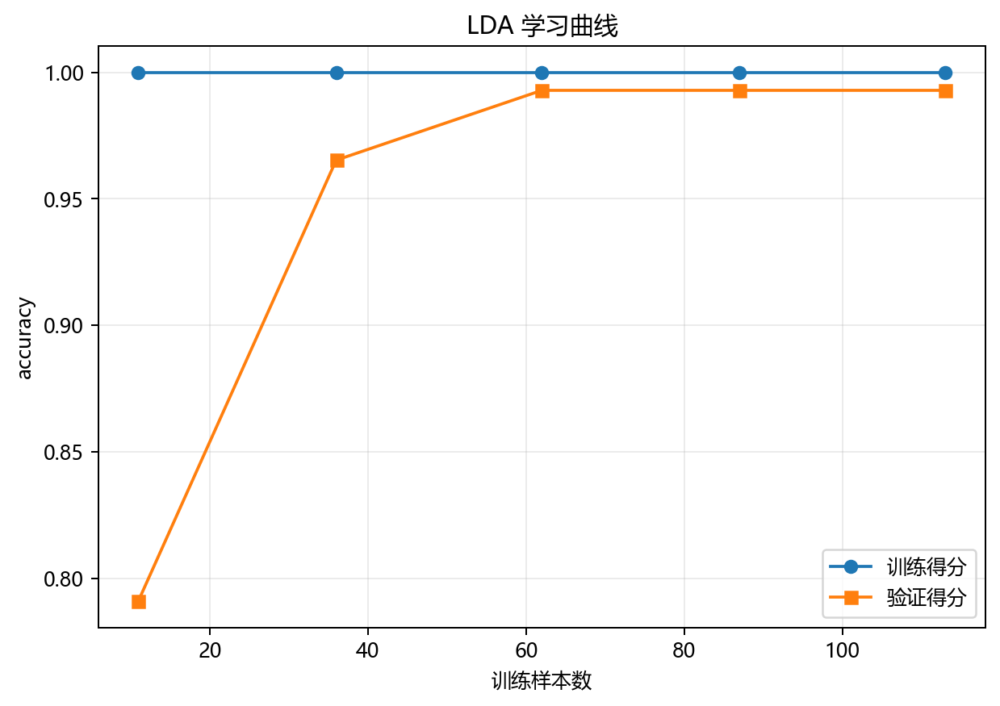

# 训练与预测

## 本章目标

1. 按源码顺序看清当前 LDA 流水线从数据复制到 2D 判别图输出的完整步骤。
2. 理解 LDA 有监督训练、无切分、`transform()` 为输出的工程特征——与 PCA 既有相似又有本质差异。
3. 理解 `label` 在当前流程中的双重角色——既是训练输入，也是可视化着色依据。

## 重点方法与概念速览

| 名称 | 类型 | 作用 |
|---|---|---|
| `lda_data.copy()` | 方法 | 复制原始数据，避免修改源对象 |
| `data.drop(columns=["label"])` | 操作 | 去掉标签列，保留 13 个特征作为训练输入 |
| `StandardScaler().fit_transform(X)` | 方法 | 对全量特征做一致性标准化——散度矩阵计算的前置条件 |
| `train_model(X_scaled, y, n_components=2)` | 函数 | 训练 LDA 模型——有监督，标签参与判别方向学习 |
| `model.transform(X_scaled)` | 方法 | 将 13 维特征投影到 2 维判别子空间——生成降维坐标 |
| `plot_dimensionality(...)` | 函数 | 绘制降维后的 2D 散点图（按类别着色） |

## 1. 流水线起点：复制数据并拆出特征与标签

### 示例代码

```python
data = lda_data.copy()
X = data.drop(columns=["label"])
y = data["label"].values
```

### 理解重点

- `.copy()` 确保后续处理不修改全局 `lda_data`。
- `label` 被单独保存为 `y`——它**既参与后续 `train_model()`**，也用于最终的 `plot_dimensionality(...)` 着色。
- 与 PCA 流水线最关键的区别：`y` 在这里是训练输入，PCA 的 `y` 仅用于着色。

## 2. 标准化

### 参数速览

适用 API：`StandardScaler().fit_transform(X)`

| 参数名 | 类型 | 说明 | 示例取值 |
|---|---|---|---|
| `X` | `DataFrame`，形状 $(178, 13)$ | 去掉 `label` 后的全量特征矩阵 | `X` |
| 输出 | `ndarray` | $z_{ij} = (x_{ij} - \mu_j) / \sigma_j$，均值为 0 标准差为 1 | `X_scaled` |

### 示例代码

```python
scaler = StandardScaler()
X_scaled = scaler.fit_transform(X)
```

### 理解重点

- LDA 流水线**没有**训练/测试切分——当前实现为教学型简化，直接在全量数据上训练和投影。
- `fit_transform` 直接在全量数据上计算统计量并变换——目标是展示整体判别结构而非评估泛化能力。
- 标准化是必须的——散度矩阵 $\mathbf{S}_W$ 和 $\mathbf{S}_B$ 的元素对特征尺度高度敏感。Wine 数据中 `proline`（~278-1680）的量纲远大于 `nonflavanoid_phenols`（~0.13-0.66）。

## 3. 训练阶段：`fit()` 学习判别方向

### 参数速览

适用 API：`train_model(X_scaled, y, n_components=2)` → `model.fit(X_scaled, y)`

| 参数名 | 类型 | 说明 | 示例取值 |
|---|---|---|---|
| `X_scaled` | `ndarray`，形状 $(178, 13)$ | 标准化后的特征矩阵——LDA 的特征输入 | `X_scaled` |
| `y` | `ndarray`，形状 $(178,)$ | 类别标签 $\{0, 1, 2\}$——**训练必需的监督信息** | `y` |
| `n_components` | `int` | 保留的判别方向数。当前为 `2`（$K=3$ 类数据的上限） | `2` |

### 示例代码

```python
model = train_model(X_scaled, y, n_components=2)
```

### 理解重点

- `LinearDiscriminantAnalysis.fit(X_scaled, y)` 内部流程：计算各类均值 $\boldsymbol{\mu}_k$ → 构造 $\mathbf{S}_W$ 和 $\mathbf{S}_B$ → 通过 SVD 求解广义特征值问题 → 取最大的 2 个特征值对应的特征向量作为判别方向 → 存入 `scalings_`。
- 这**既有训练也有模型**——LDA 产出一个可复用的投影矩阵（`scalings_`），可以对任意新数据做 `transform()`。
- 与 PCA 对比：`fit()` 都产出一个投影矩阵，但 PCA 不需要 `y`（无监督），LDA 必须有 `y`（有监督）。

## 4. 投影阶段：`transform()` 将数据降到 2D

### 参数速览

适用方法：`model.transform(X_scaled)`

| 参数名 | 类型 | 说明 | 示例取值 |
|---|---|---|---|
| `X_scaled` | `ndarray`，形状 $(178, 13)$ | 需要降维的特征矩阵——当前为训练数据本身 | `X_scaled` |
| 返回值 | `ndarray`，形状 $(178, 2)$ | 投影到判别子空间后的 2D 坐标 | `X_transformed` |

### 示例代码

```python
X_transformed = model.transform(X_scaled)
```

### 理解重点

- `transform()` 是 LDA 流水线的"预测"步骤——它不是预测类别标签，而是预测低维坐标。
- 降维后的 2D 坐标就是判别子空间中的位置——同类样本应聚集，不同类样本应分离。
- 当前流水线对训练数据本身做 `transform()`（全量投影），目的是展示整体判别结构——这与"对新样本做投影"在数学上完全相同。

## 5. 2D 判别图：可视化如何接入流水线

### 参数速览

适用函数：`plot_dimensionality(X_transformed, y=y, explained_variance_ratio=evr, title=..., dataset_name=..., model_name=..., mode='2d')`

| 参数名 | 类型 | 说明 | 示例取值 |
|---|---|---|---|
| `X_transformed` | `ndarray`，形状 $(178, 2)$ | LDA 降维后的 2D 坐标 | `X_transformed` |
| `y` | `ndarray`，形状 $(178,)$ | 类别标签——用于散点着色和图例 | `y` |
| `explained_variance_ratio` | `ndarray` 或 `None` | 各判别方向贡献占比——若存在则标注在坐标轴上 | `evr` |
| `mode` | `str` | 输出模式。当前为 `'2d'`——LDA 只输出 2D 图 | `'2d'` |

### 示例代码

```python
evr = (
    model.explained_variance_ratio_
    if hasattr(model, "explained_variance_ratio_")
    else None
)
plot_dimensionality(
    X_transformed,
    y=y,
    explained_variance_ratio=evr,
    title="LDA 降维 (2D)",
    dataset_name=DATASET,
    model_name=MODEL,
    mode="2d",
)
```

### 理解重点

- `plot_dimensionality(...)` 是当前 LDA 分册唯一的可视化函数——与分类分册的四类评估（混淆矩阵+ROC+决策边界+学习曲线）完全不同。
- `explained_variance_ratio` 的条件传递（`if hasattr` → `evr` 或 `None`）是 LDA 特有的工程模式——不同求解器对此属性的支持不同。
- 图中 `y` 既是训练标签也是着色依据——它在当前分册中有双重作用。坐标轴标签会包含解释占比（如 `LD1 (78.5%)`）。

## 6. 用伪代码看完整流程

```python
data = lda_data.copy()
X = data.drop(columns=["label"])
y = data["label"].values

X_scaled = StandardScaler().fit_transform(X)

model = train_model(X_scaled, y, n_components=2)
X_transformed = model.transform(X_scaled)

plot_dimensionality(X_transformed, y=y, explained_variance_ratio=evr, mode="2d")
```

### 理解重点

- 当前 LDA 流水线的主线非常清楚：取数 → 标准化 → 有监督训练 → 判别投影 → 2D 可视化。
- 这条链路里最关键的中间变量是：`X_scaled`（标准化特征）、训练后的 `model`（含 `scalings_`）、二维投影结果 `X_transformed` 和标签 `y`。
- 与 PCA 流水线的步骤形式极其相似（StandardScaler → fit → transform → plot），但 `fit()` 是否传 `y` 是两套流程的本质分野。

## 训练诊断可视化



## 常见坑

1. 把 LDA 流水线写成 PCA 那种"标签仅用于着色"的无监督流程——`y` 在 LDA 中是训练输入。
2. 期望当前流水线有 `train_test_split`——当前实现为教学型简化，直接在全量数据上训练和投影。
3. 忘记 `transform()` 才是生成降维坐标的步骤——`fit()` 只学习判别方向，不生成投影坐标。
4. 把 `explained_variance_ratio_` 当成一定存在的属性——需用 `hasattr` 做保护式判断。

## 小结

- 当前 LDA 流水线非常清晰：复制数据 → 拆出 `X` 和 `y` → 全量标准化 → `fit(X, y)` 学习判别方向 → `transform(X)` 投影到 2D → 判别散点图。
- 与 PCA 流水线的核心差异：`y` 参与训练（有监督）、降维上限 $K-1$（非 $\min(d,N)$）、优化目标不同（类间/类内比 vs 方差）。
- 与分类分册的核心差异：输出是低维坐标而非类别预测、可视化是降维散点图而非混淆矩阵/ROC、无 `predict()`（用 `transform()` 替代）。
