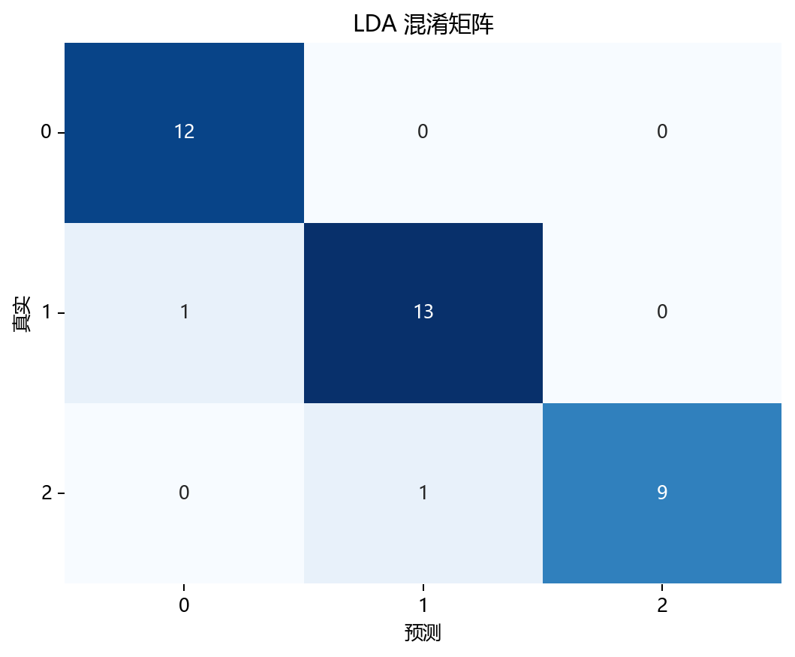
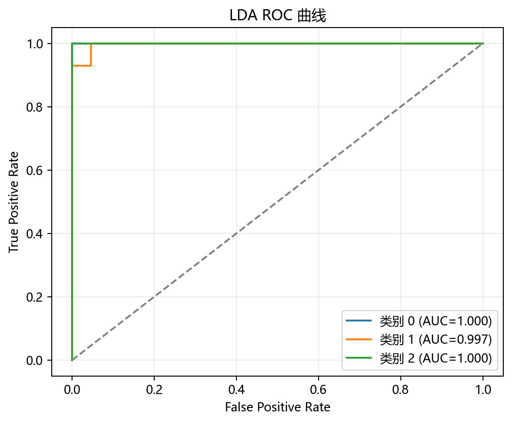

# 评估与诊断

> 对应代码：`pipelines/dimensionality/lda.py`、`model_training/dimensionality/lda.py`、`result_visualization/dimensionality_plot.py`
>  
> 相关对象：`explained_variance_ratio_`、`plot_dimensionality(...)`

## 本章目标

1. 明确当前仓库实际使用了哪些评估手段，而不是泛泛讨论所有降维指标。
2. 理解解释比例信息和 2D 判别图分别能帮助我们判断什么。
3. 明确当前实现没有做哪些更完整的监督降维诊断输出，以免误读源码能力边界。

## 重点方法与概念速览

| 名称 | 类型 | 作用 |
|---|---|---|
| `explained_variance_ratio_` | 属性 | 若存在，描述各判别方向的解释比例 |
| 累计解释方差 | 派生量 | 若存在，描述前几个判别方向总共保留了多少信息 |
| `plot_dimensionality(...)` | 函数 | 生成 2D 判别投影图 |
| `X_transformed` | 投影结果 | 当前 LDA 降维后的二维坐标 |

## 1. 当前实现真正做了什么评估

### 参数速览（本节）

适用评估手段（本节）：

1. 若存在则输出解释方差比
2. 若存在则输出累计解释方差
3. 2D 判别投影图

| 评估方式 | 来源 | 用途 |
|---|---|---|
| 解释比例信息 | `model.explained_variance_ratio_` | 看各判别方向的相对贡献 |
| 累计解释比例 | `model.explained_variance_ratio_.sum()` | 看当前保留方向总共携带多少判别信息 |
| 2D 图 | `plot_dimensionality(...)` | 看类别在判别空间中是否被拉开 |

### 理解重点

- 当前 LDA 流水线没有显式打印下游分类准确率、混淆矩阵、ROC、学习曲线或更多监督指标。
- 这并不表示这些指标不重要，而是说明本仓库当前实现更强调判别投影结构本身。
- 因此阅读这一分册时，不能把更完整的分类诊断面板想成已经在源码里实现的内容。

## 2. 为什么解释方差相关输出是“若存在才打印”

### 参数速览（本节）

适用逻辑：`hasattr(model, "explained_variance_ratio_")`

| 条件 | 当前含义 |
|---|---|
| 属性存在 | 打印解释方差比和累计解释方差 |
| 属性不存在 | 当前流程不强行输出这部分信息 |

### 示例代码

```python
if hasattr(model, "explained_variance_ratio_"):
    print(f"解释方差比: {model.explained_variance_ratio_.round(4)}")
    print(f"累计解释方差: {model.explained_variance_ratio_.sum():.4f}")
```

### 理解重点

- 当前 LDA 代码没有假设所有求解器都会稳定提供 `explained_variance_ratio_`。
- 因此它使用“若存在才输出”的保护式逻辑。
- 文档必须如实写清这个边界，不能把它写成必然存在的固定指标。

## 3. 2D 判别图是怎么生成的

### 参数速览（本节）

适用函数：`plot_dimensionality(X_transformed, y=y, explained_variance_ratio=evr, title=..., dataset_name=..., model_name=..., mode='2d')`

| 参数名 | 本例取值 | 说明 |
|---|---|---|
| `X_transformed` | 2D 投影结果 | 当前 LDA 降维后的坐标 |
| `y` | `label` 数组 | 用于着色和图例 |
| `explained_variance_ratio` | `evr` | 若存在则用于坐标轴标签 |
| `mode` | `'2d'` | 当前只输出二维图 |

### 示例代码

```python
plot_dimensionality(
    X_transformed,
    y=y,
    explained_variance_ratio=evr,
    title="LDA 降维 (2D)",
    dataset_name=DATASET,
    model_name=MODEL,
    mode="2d",
)
```

### 理解重点

- 当前 LDA 图不是在看“哪条主成分解释方差最大”，而是在看类别在判别子空间中是否更容易分开。
- 这也是为什么当前 `label` 在这里既是训练输入，也是图像着色依据。
- 图像结构是否更清晰，是当前分册最核心的直观评估方式。

## 4. 看 2D 判别图时重点观察什么

### 参数速览（本节）

适用观察点（本节）：

1. 不同类别是否明显拉开
2. 同类样本是否相对更集中
3. 类间边界是否更清晰

| 现象 | 可能含义 |
|---|---|
| 类别投影后明显分开 | 当前判别方向学得较好 |
| 同类样本聚得更紧 | 类内散度被有效压缩 |
| 投影后类别仍明显重叠 | 当前数据结构或求解设定可能不理想 |

### 理解重点

- 当前图像的价值不在“好不好看”，而在于它是否体现了类间可分性的增强。
- 如果不同颜色在 2D 空间里更容易区分，说明当前 LDA 投影有比较好的判别效果。
- 这也是为什么 LDA 的评估重点和 PCA 明显不同。

## 5. 当前实现没有做什么

### 参数速览（本节）

当前源码未包含的内容：

1. 下游分类精度比较
2. 混淆矩阵与 ROC 曲线
3. 3D LDA 可视化
4. Train/test 分离评估

| 未实现项 | 当前状态 |
|---|---|
| 降维后分类器精度对比 | 未在流水线中出现 |
| 混淆矩阵 / ROC | 当前流程未调用相关函数 |
| 3D LDA 图 | 当前流程未实现 |
| train/test split | 当前流程未使用 |

### 理解重点

- 评估章节必须以源码为准，不能把“LDA 常见下游分类分析”写成“当前仓库已经实现”。
- 当前实现的评估重点是判别结构图和可选解释比例，而不是完整分类指标。
- 如果后续扩展这部分，最自然的方向是补下游分类比较或更完整的判别效果量化。

## 评估图表





## 常见坑

1. 把 LDA 当前评估写成 PCA 那种“只看方差保留”，忽略这里更强调类别可分性。
2. 把 `explained_variance_ratio_` 当成总会存在的固定属性。
3. 误以为当前流水线已经输出了监督分类效果指标，实际源码并没有这些步骤。

## 小结

- 当前 LDA 的评估主线由两部分组成：解释比例信息（若存在）和 2D 判别投影图。
- 它们分别从“方向贡献”和“类别可分性”两个角度解释结果。
- 只有把这两条线索一起看，才能更完整地理解当前实现的表现。
