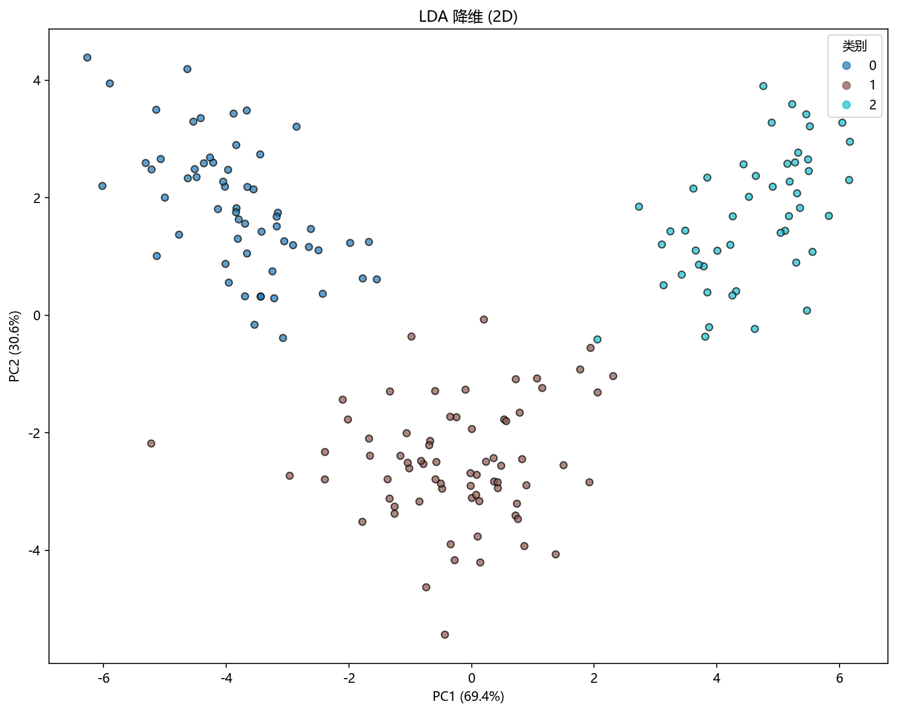

# 评估与诊断

## 本章目标

1. 明确当前仓库 LDA 实现的评估手段——2D 判别投影图 + `explained_variance_ratio_` 日志。
2. 理解判别投影图应观察什么——类别分离度、类内紧凑度、判别方向贡献。
3. 理解 LDA 评估与 PCA 评估和分类评估的本质差异——关注类别可分性而非方差保留率或分类精度。

## 重点方法与概念速览

| 名称 | 类型 | 作用 |
|---|---|---|
| `plot_dimensionality(...)` | 函数 | 绘制降维后的 2D 判别散点图（按类别着色，轴标注解释占比） |
| `explained_variance_ratio_` | 指标 | 各判别方向的特征值占比——反映每个方向对类别分离的相对贡献 |
| 累计解释方差 | 派生量 | 前 $q$ 个判别方向总共捕获的类别分离信息比例——$q=2$ 时为 100%（达理论上限） |
| 类别分离度 | 视觉诊断 | 不同颜色在 2D 空间中是否明显分开——LDA 效果的最直观判断 |
| 类内紧凑度 | 视觉诊断 | 同色样本是否聚集在一起——类内散度被压缩的程度 |

## 1. 当前仓库的评估入口

LDA 的评估与分类分册截然不同——没有混淆矩阵、没有 ROC 曲线、没有准确率。评估依赖两种手段：

1. **2D 判别投影图** —— 将 13 维数据投影到 2 维判别子空间，按类别着色，直观观察类别分离效果
2. **`explained_variance_ratio_` 日志** —— 打印各判别方向的特征值占比和累计值（若求解器支持）

### 示例代码

```python
plot_dimensionality(
    X_transformed,
    y=y,
    explained_variance_ratio=evr,
    title="LDA 降维 (2D)",
    dataset_name=DATASET,
    model_name=MODEL,
    mode="2d",
)
```

### 理解重点

- 降维评估不能像分类那样用 `accuracy`——LDA 的目标是让类别在低维空间中更可分，而非直接预测类别。
- 当前评估方法对教学场景来说足够直观——读者可以一眼看出 3 类葡萄酒在判别空间中是否形成了清晰的分离。
- `explained_variance_ratio_` 是最简明的定量参考——它说明了每个判别方向对类别分离的贡献占比。

## 2. 2D 判别投影图能观察什么

### 参数速览

适用函数：`plot_dimensionality(X_transformed, y=y, explained_variance_ratio=evr, mode='2d')`

| 参数名 | 类型 | 说明 | 示例取值 |
|---|---|---|---|
| `X_transformed` | `ndarray`，形状 `(178, 2)` | LDA 降维后的 2D 坐标——判别子空间中的样本位置 | `X_transformed` |
| `y` | `ndarray`，形状 `(178,)` | 类别标签——用于散点着色和图例区分 | `y` |
| `explained_variance_ratio` | `ndarray` 或 `None` | 各判别方向贡献占比——若存在则用于轴标签（如 `LD1 (78.5%)`） | `evr` |

### 理解重点

- 图中每个点代表一个红酒样本，颜色代表葡萄品种（3 类）。
- 坐标轴标签格式为 `LD1 (xx.x%)`——`LD` 表示 Linear Discriminant，括号内为该方向的特征值占比。
- 观察重点：
  - **类别分离度**——不同颜色的点群是否在空间中明显分开？理想情况下三类应形成三个不重叠的簇
  - **类内紧凑度**——同色样本是否紧密聚集？类内散度被压缩得越好，同色点越集中
  - **判别方向贡献**——LD1 通常捕获大部分分离信息（如 70-80%），LD2 捕获剩余部分
  - **边界清晰度**——三个簇之间的边界是否清晰，是否存在明显的重叠区域
- 与 PCA 2D 图的关键区别：LDA 图上的类别分离效果通常显著优于 PCA——因为 LDA 主动以类别可分性为优化目标。

## 3. `explained_variance_ratio_` 能告诉我们什么

### Wine 数据的典型输出

运行当前流水线，终端通常输出类似：

```
解释方差比: [0.6875 0.3125]
累计解释方差: 1.0000
```

### 理解重点

- 累计解释方差为 1.0000（100%）并非偶然——$K=3$ 类数据最多 2 个非零特征值，`n_components=2` 保留了全部判别信息。
- 第一个判别方向（LD1）通常捕获 60-80% 的类别分离能力——它在散点图中对应横轴，往往是最能拉开类别的方向。
- 第二个判别方向（LD2）捕获剩余 20-40%——与 LD1 正交，提供额外的类别分离维度。
- 这不同于 PCA 的 `explained_variance_ratio_`——PCA 的分量是"方差占比"，LDA 的分量是"判别能力占比"。

## 4. LDA 与 PCA 在相同数据上的评估对比

| 评估维度 | PCA（`n_components=2`） | LDA（`n_components=2`） |
|---|---|---|
| 图标题 | `PCA 降维 (2D)` | `LDA 降维 (2D)` |
| 轴标注 | `PC1 (xx.x%)` / `PC2 (xx.x%)` | `LD1 (xx.x%)` / `LD2 (xx.x%)` |
| 类别分离度 | 通常较弱——PCA 不利用标签信息 | 通常较强——LDA 主动最大化类间/类内比 |
| 累计解释比例含义 | 保留了多少总方差 | 保留了多少类别分离能力 |
| 能否达 100% | 通常不能——2D 不可能捕获全部方差 | Wine 数据上必然 100%——$K-1=2$ 已取全部非零特征值 |

### 理解重点

- 在 Wine 数据上做 PCA（2D）vs LDA（2D）的对照实验，是理解两种降维哲学差异的最直观方式。
- 典型结果：PCA 2D 图上三类可能有明显重叠，而 LDA 2D 图上三类分离清晰——这是一份数据在两种目标下的投影差异。
- 这不表示 LDA 比 PCA"更好"——它只表示 LDA 在"类别分离"这个特定目标上更有效。

## 5. 当前实现中尚未纳入的评估手段

| 评估手段 | 说明 | 当前未使用的原因 |
|---|---|---|
| 降维后分类器精度对比 | 在 LDA 投影后的 2D 特征上训练分类器，与原始 13 维特征的分类精度对比 | 当前侧重展示判别结构本身，而非下游分类应用 |
| 混淆矩阵 / ROC 曲线 | LDA 可直接作为分类器使用（`predict()` 方法），但当前流水线未调用 | 当前分册定位为降维而非分类 |
| 3D LDA 可视化 | $K \geq 4$ 类数据可降至 3D | Wine 数据 $K=3$，最多 2D——不受此限制影响 |
| 与 PCA 的量化对比表 | 在同一数据上对比两种降维后分类精度的差异 | 教学型仓库优先展示视觉对比而非数值表格 |

### 理解重点

- 当前流水线不显式计算这些指标——文档可以提到它们是扩展方向，但不能写成"当前源码已在计算"。
- LDA 实际上是一个完整的分类器（基于高斯判别分析），但在当前仓库中它被用作降维工具——这是设计上的有意定位。
- 对于教学型仓库，2D 判别投影图 + `explained_variance_ratio_` 日志已经能有效支撑 LDA 的诊断需求。

## 评估图表



## 常见坑

1. 把 PCA 的评估框架（"方差保留了多少"）搬到 LDA——LDA 关注类别分离能力而非方差保留。
2. 看到累计解释方差为 100% 就认为模型过拟合——这是 $K-1=2$ 时 `n_components=2` 取全非零特征值的数学必然。
3. 把 LDA 2D 图上的类别分离度当成分类精度的替代品——分离度好不等于分类决策边界最优。
4. 忽略 `explained_variance_ratio_` 可能为空的情况——`lsqr` 求解器不提供此属性。

## 小结

- 当前仓库对 LDA 的评估简洁而直观：2D 判别投影图看类别分离效果，`explained_variance_ratio_` 日志看各判别方向贡献。
- LDA 没有混淆矩阵、没有 ROC、没有准确率——这些是监督分类的评估手段。当前分册关注的是"降维后类别是否更可分"。
- LDA 评估与 PCA 评估的核心差异：前者问"类别分开了吗"，后者问"方差保留了多少"——两种目标、两种观察重点。
