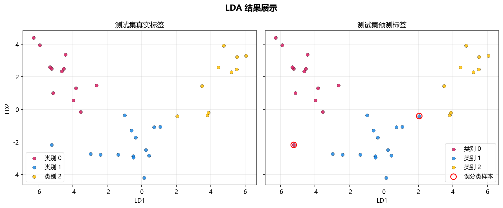

# 工程实现

> 对应代码：`data_generation/dimensionality.py`、`model_training/dimensionality/lda.py`、`pipelines/dimensionality/lda.py`、`result_visualization/dimensionality_plot.py`
>  
> 运行方式：`python -m pipelines.dimensionality.lda`

## 本章目标

1. 看清当前 LDA 分册在仓库中的模块分层与调用关系。
2. 理解从命令行入口到 2D 判别图落盘，中间依次发生了什么。
3. 明确哪些逻辑属于数据层、训练层、流水线层和可视化层。

## 对应代码速览

| 组件 | 路径 | 说明 |
|---|---|---|
| 数据生成层 | `data_generation/dimensionality.py` | `DimensionalityData.lda()` 加载 Wine 数据集 |
| 数据导出层 | `data_generation/__init__.py` | 提供 `lda_data` 给外部导入 |
| 训练层 | `model_training/dimensionality/lda.py` | 定义 `train_model(...)` 并训练 LDA 模型 |
| 流水线层 | `pipelines/dimensionality/lda.py` | 负责标准化、训练、投影、画图 |
| 可视化层 | `result_visualization/dimensionality_plot.py` | 负责 2D 降维图绘制与保存 |

## 1. 入口命令如何触发整条链路

### 示例代码

```bash
python -m pipelines.dimensionality.lda
```

### 理解重点

- 这个命令会执行 `pipelines/dimensionality/lda.py` 中的 `run()`。
- `run()` 是真正的工程入口，其他模块都被它按顺序调用。
- 所以理解工程实现时，最清晰的方式也是先从入口脚本往下追踪。

## 2. 模块之间的调用关系

### 示例代码

```python
from data_generation import lda_data
from model_training.dimensionality.lda import train_model
from result_visualization.dimensionality_plot import plot_dimensionality
```

### 理解重点

- `pipelines` 层不自己造数据、不自己实现 LDA，也不自己画图，而是扮演调度者角色。
- 这种分层使每个文件职责单一：数据文件只关心数据，训练文件只关心模型，画图文件只关心结果展示。
- 当前 LDA 分册虽然没有更多分类图表，但工程层次依然很清晰。

## 3. 流水线层真正负责什么

### 参数速览（本节）

适用逻辑（分项）：

1. 复制数据
2. 拆分特征与标签
3. 全量标准化
4. 训练 2D LDA
5. 投影并画图

| 步骤 | 所在文件 | 当前职责 |
|---|---|---|
| 读取 `lda_data` | `pipelines/dimensionality/lda.py` | 拿到统一数据入口 |
| `X` / `label` 拆分 | `pipelines/dimensionality/lda.py` | 区分训练输入与标签 |
| 标准化 `X` | `pipelines/dimensionality/lda.py` | 生成 LDA 训练输入 |
| 调用 `train_model(...)` | `pipelines/dimensionality/lda.py` | 获得 2D LDA 模型 |
| `transform(...)` + `plot_dimensionality(...)` | `pipelines/dimensionality/lda.py` | 完成投影与结果输出 |

### 理解重点

- 当前仓库没有使用 `Pipeline` 类，也没有把更多维度输出或下游分类评估继续串进当前流程。
- 这种显式写法更适合教学，因为每一步都能直接看到变量名和执行顺序。
- LDA 分册最容易被误读的地方，是把它写成 PCA 那样的无监督流程，因此这里要特别明确标签真的参与训练。

## 4. 为什么这里没有 train/test split

### 理解重点

- 当前 LDA 分册的目标，是展示监督降维后的判别结构，而不是先做独立监督分类评估。
- 当前实现选择直接在全量数据上标准化、训练和投影，以便更直观看到整体类别分离效果。
- 这是一种教学型简化实现，文档需要如实说明，而不是套用监督分类默认结构。

## 5. 训练层真正负责什么

### 参数速览（本节）

适用函数：`train_model(...)`

| 输出项 | 作用 |
|---|---|
| `model` | 返回已训练好的 `LinearDiscriminantAnalysis` 模型 |
| 控制台日志 | 打印 `n_components`、可选解释比例和训练耗时 |

### 理解重点

- 训练层并不负责标准化数据，也不负责画降维图。
- 它的核心任务是学习判别方向，并输出解释比例相关日志。
- 和 PCA 分册相比，这里训练多了一份真实标签输入，因此模型学到的是“判别方向”而不是“最大方差方向”。

## 6. 为什么当前只训练一个 2D LDA 模型

### 示例代码

```python
model = train_model(X_scaled, y, n_components=2)
```

### 理解重点

- 当前实现没有像 PCA 那样再训练 3D 版本。
- 这是因为当前 Wine 数据有 3 个类别，LDA 最多只能降到 `K - 1 = 2` 维。
- 因此当前 2D 输出既是工程实现选择，也是理论上限约束的直接体现。

## 7. 常量 `DATASET` 和 `MODEL` 的作用

### 参数速览（本节）

适用常量：

1. `DATASET = "lda"`
2. `MODEL = "lda"`

| 常量 | 当前作用 |
|---|---|
| `DATASET` | 决定图片输出的上层目录 |
| `MODEL` | 决定图片文件名前缀 |

### 理解重点

- 这两个常量的作用，不是影响模型训练，而是统一结果文件的命名和归档。
- 这样当前 LDA 分册生成的图像会被稳定保存到固定位置。
- 这也是为什么当前工程结构适合后续继续扩展更多判别式降维图表。

## 8. 从命令到结果图的执行链

### 示例代码

```python
python -m pipelines.dimensionality.lda
    -> run()
    -> lda_data.copy()
    -> data.drop(columns=["label"]), data["label"]
    -> StandardScaler().fit_transform(...)
    -> train_model(..., n_components=2)
    -> model.transform(...)
    -> plot_dimensionality(..., mode="2d")
    -> savefig(...)
```

### 理解重点

- 这条链里最关键的中间产物有四个：`X_scaled`、训练后的 `model`、二维投影结果 `X_transformed`、标签 `y`。
- 一旦这些中间变量理解清楚，整个 lda 分册的代码结构就基本串起来了。
- 文档中的各章节，其实就是在拆解这条执行链上的不同环节。

## 运行结果



## 常见坑

1. 把 `pipelines` 层和 `model_training` 层职责混在一起，误以为训练函数负责全部工程流程。
2. 不理解为什么当前分册没有 3D 输出，从而误读当前实现能力边界。
3. 忽略 `label` 参与训练、`K-1` 上限和解释比例条件性输出这些关键工程细节。

## 小结

- 当前 LDA 实现采用了清晰的分层结构：数据层、训练层、流水线层、可视化层各司其职。
- 入口脚本负责调度，训练模块负责模型，画图模块负责结果呈现。
- 这种结构既方便阅读，也方便后续继续补下游分类比较、更多判别分析或其它监督降维实验。
