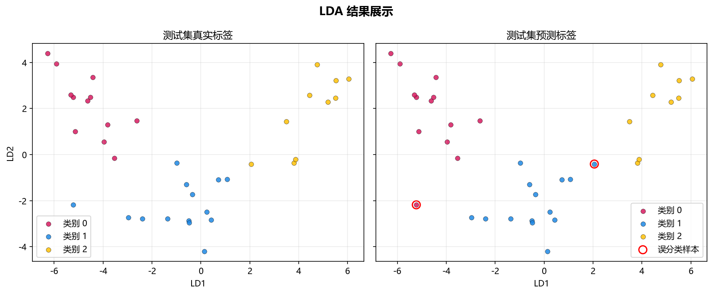

# 工程实现

## 本章目标

1. 从工程角度看清 LDA 在本仓库中的完整调用链。
2. 理解数据生成、模型训练、流水线编排和降维可视化分别负责什么。
3. 理解 LDA 工程实现与 PCA 在架构上的相似性与关键差异——有监督 `fit()`、`transform()` 投影、$K-1$ 维约束。

## 对应代码速览

| 组件 | 路径 | 说明 |
|---|---|---|
| 数据生成 | `data_generation/dimensionality.py` | `DimensionalityData.lda()` 加载 Wine 真实数据集 |
| 数据导出 | `data_generation/__init__.py` | 向外暴露 `lda_data` |
| 训练封装 | `model_training/dimensionality/lda.py` | 构建并训练 `LinearDiscriminantAnalysis`，打印解释方差比日志 |
| 流水线入口 | `pipelines/dimensionality/lda.py` | 组织数据拆分、标准化、训练、投影与降维可视化 |
| 降维可视化 | `result_visualization/dimensionality_plot.py` | 绘制降维后的 2D 散点图（按类别着色，轴标注解释占比） |

## 1. 端到端运行入口

### 示例代码

```bash
python -m pipelines.dimensionality.lda
```

### 理解重点

- 这个命令串起当前 LDA 分册中最核心的工程流程。
- 依次完成：数据复制 → 拆出 `X` 和 `y` → 全量标准化 → LDA `fit(X, y)`（学习判别方向）→ `transform(X)`（投影到 2D）→ 判别散点图。
- 对大多数读者来说，`pipelines/dimensionality/lda.py` 是理解工程实现的最佳起点——代码量少、流程清晰。

## 2. `run()` 串起了整个流程

当前流水线的核心函数 `run()` 采用线性编排风格：

```python
def run():
    # 1. 复制数据 & 拆出特征与标签
    data = lda_data.copy()
    X = data.drop(columns=["label"])
    y = data["label"].values

    # 2. 全量标准化——无切分（教学型简化）
    scaler = StandardScaler()
    X_scaled = scaler.fit_transform(X)

    # 3. 有监督训练——fit() 学习判别方向（y 是训练输入）
    model = train_model(X_scaled, y, n_components=2)

    # 4. 判别投影——transform() 将 13 维降到 2 维
    X_transformed = model.transform(X_scaled)

    # 5. 单一可视化（2D 判别散点图）
    evr = (
        model.explained_variance_ratio_
        if hasattr(model, "explained_variance_ratio_")
        else None
    )
    plot_dimensionality(
        X_transformed,
        y=y,
        explained_variance_ratio=evr,
        title="LDA 降维 (2D)",
        dataset_name=DATASET,
        model_name=MODEL,
        mode="2d",
    )
```

### 理解重点

- `run()` 的职责是编排，不是算法实现——真正的广义特征值求解在 `LinearDiscriminantAnalysis.fit()` 中。
- 数据流是单向的：数据 → 标准化 → 判别方向学习 → 投影 → 2D 散点图。
- 与分类流水线的核心差异：
  - **无 `predict()` 调用**——LDA 在这里是降维工具，输出是 `transform()` 而非类别标签
  - **无 `predict_proba`**——当前流水线不涉及分类概率
  - **单一可视化**（`plot_dimensionality`）而非四类（混淆矩阵+ROC+决策边界+学习曲线）
- 与 PCA 流水线的核心差异：
  - **`fit()` 传入 `y`**——LDA 是有监督的，PCA 是无监督的
  - **`n_components` 受 $K-1$ 约束**——不能像 PCA 那样自由扩展

## 3. 训练模块负责什么

`model_training/dimensionality/lda.py` 里的 `train_model(...)` 主要负责四件事：

1. 创建 `LinearDiscriminantAnalysis(n_components=2, solver='svd')` 实例
2. 调用 `model.fit(X_train, y_train)`——学习判别方向（有监督，标签用于计算散度矩阵）
3. 打印 `n_components`、`explained_variance_ratio_` 和累计解释方差（若求解器支持）
4. 返回训练完成的模型对象

### 参数速览

适用函数：`train_model(X_train, y_train, n_components=2, solver='svd')`

| 参数名 | 类型 | 说明 | 示例取值 |
|---|---|---|---|
| `X_train` | `array_like` | 标准化后的特征矩阵，传入 `LDA.fit()` | `X_scaled` |
| `y_train` | `array_like` | 类别标签 $\{0, 1, 2\}$——LDA 训练必需的监督信息 | `y` |
| `n_components` | `int` | 保留的判别方向数。默认 `2` | `1`、`2` |
| `solver` | `str` | 求解器。默认 `'svd'` | `'svd'`、`'eigen'`、`'lsqr'` |
| 返回值 | `LinearDiscriminantAnalysis` | 已完成 `fit()` 的模型对象，含 `scalings_`、`explained_variance_ratio_` 等 | — |

### 理解重点

- LDA 的 `fit()` 是有监督的——接收 `y_train` 参数。这与 PCA 分册形成鲜明对比，与分类分册一致。
- 训练日志中的 `explained_variance_ratio_` 是 LDA 独有的统计输出——它反映判别方向贡献，PCA 的对应物含义不同（方差占比 vs 判别能力占比）。
- `@print_func_info` 和 `@timeit` 装饰器提供函数标题和耗时——增强了教学型仓库的可读性。

## 4. 可视化模块负责什么

### 模块职责

| 模块 | 函数 | 输入 | 输出 |
|---|---|---|---|
| 降维可视化 | `plot_dimensionality(...)` | `X_transformed`（投影坐标）、`y`（着色标签）、`explained_variance_ratio`（轴标注） | 2D 判别散点图（PNG），坐标轴标注解释占比 |

### 理解重点

- `plot_dimensionality(...)` 是当前 LDA 流水线中**唯一**的可视化模块——与分类分册的 4 种评估函数形成鲜明对比。
- `explained_variance_ratio` 参数用于在坐标轴上标注各判别方向的贡献占比（如 `LD1 (68.8%)`）。
- 支持 `mode='2d'` 和 `mode='3d'` 两种模式——但 LDA 当前只使用 2D 模式（受 $K-1=2$ 约束）。
- 与 PCA 共用同一个可视化函数——区别在于传入的数据含义不同（判别投影 vs 主成分投影），以及轴标签前缀不同（`LD` vs `PC`）。

## 5. 模块间的数据依赖关系

| 数据 | 生产者 | 消费者 |
|---|---|---|
| `lda_data` | `data_generation/dimensionality.py` | `pipelines/dimensionality/lda.py` |
| `y` | `data["label"]` 提取 | `train_model`（训练输入）、`plot_dimensionality`（着色） |
| `X_scaled` | `StandardScaler` | `train_model`、`model.transform` |
| `model`（含 `scalings_`、`explained_variance_ratio_`） | `train_model(...)` | `model.transform`、终端日志 |
| `X_transformed` | `model.transform(X_scaled)` | `plot_dimensionality` |
| 图片产物 | `plot_dimensionality(...)` | `outputs/lda/` 目录 |

### 理解重点

- 数据依赖关系中有 6 个节点——比 PCA 流水线多了 `y` 流向 `train_model` 这一条边（有监督的核心差异）。
- 比分类流水线少了 `train_test_split`、`predict`、`predict_proba`、PCA、ROC 评估、学习曲线等节点。
- `y` 的流向是扇出的——同时流入 `train_model`（训练）和 `plot_dimensionality`（着色）。这是 LDA 流水线数据流的最关键特征。

## 6. 运行后能得到什么

### 输出项

| 输出类型 | 当前结果 | 用途 |
|---|---|---|
| 终端标题 | `LDA 降维流水线` | 在终端中定位当前运行入口 |
| 训练日志 | 训练耗时、`n_components`、`explained_variance_ratio_`（各方向 + 累计）、函数耗时 | 查看判别方向学习耗时和各方向贡献占比 |
| 降维图 | `outputs/lda/lda_dim_2d.png` | 2D 判别散点图——Wine 3 类在判别子空间中的分布 |

### 理解重点

- 输出比分类分册少得多——只有 2 类（日志 + 1 张图），而非 5 类（日志 + 4 张图）。
- `explained_variance_ratio_` 是 LDA 独有的日志输出——它在 PCA 的日志中也存在但含义不同（判别能力占比 vs 方差占比）。
- 2D 判别散点图是最核心的教学产出——它直接展示了有监督降维将高维类别差异映射到低维空间的效果。

## 7. 推荐的源码阅读顺序

1. 先看 `pipelines/dimensionality/lda.py` — 入口，代码量少，流程清晰
2. 再看 `model_training/dimensionality/lda.py` — 训练封装，理解有监督 `fit(X, y)` 和条件性日志输出
3. 再看 `result_visualization/dimensionality_plot.py` — 降维散点图绘制逻辑（含 `explained_variance_ratio` 轴标注）
4. 最后回到 `data_generation/dimensionality.py` — 理解 Wine 数据集加载和标签重命名

### 理解重点

- 从入口看整体流程，再下钻到训练和可视化细节，阅读成本最低。
- LDA 的调用链与 PCA 几乎一致（同一套模块分层），差异集中在 `fit()` 是否传 `y` 和 `n_components` 的上限约束。

## 运行结果



## 常见坑

1. 把 `pipeline` 文件误认为训练算法实现本体——它只是编排层，真正的广义特征值求解在 `LinearDiscriminantAnalysis.fit()` 中。
2. 期待当前流水线有 `train_test_split` 或 `predict()` 调用——LDA 在这里是降维工具，输出低维坐标而非类别标签。
3. 忽略 `explained_variance_ratio_` 的条件可用性——`lsqr` 求解器不提供此属性。
4. 把 `label` 的流向写成仅到可视化——它同时流入 `train_model`（训练输入）。
5. 忘记 `n_components=2` 是 $K-1$ 约束的结果而非随意选择——与 PCA 的 `n_components` 无此约束形成对比。

## 小结

- 当前 LDA 工程实现采用与 PCA 一致的模块分层：数据生成 → 训练封装（有监督）→ 流水线编排 → 单一可视化（判别散点图）。
- `run()` 负责串联，`train_model(...)` 负责判别方向学习（`fit(X, y)`），`plot_dimensionality(...)` 负责降维可视化。
- LDA 在工程上最不同于 PCA 的地方：`fit()` 有 `y` 参数（有监督）、`n_components` 受 $K-1$ 约束、`explained_variance_ratio_` 含义不同（判别能力 vs 方差）。
- LDA 在工程上最不同于分类算法的地方：输出是 `transform()` 而非 `predict()`、单一降维散点图而非多类评估图——这是由降维定位决定的。
