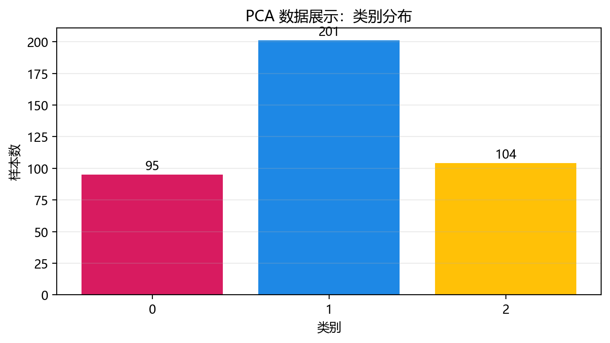
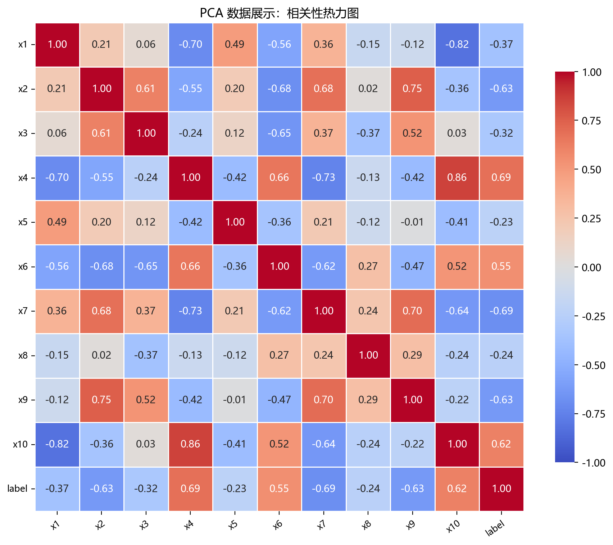
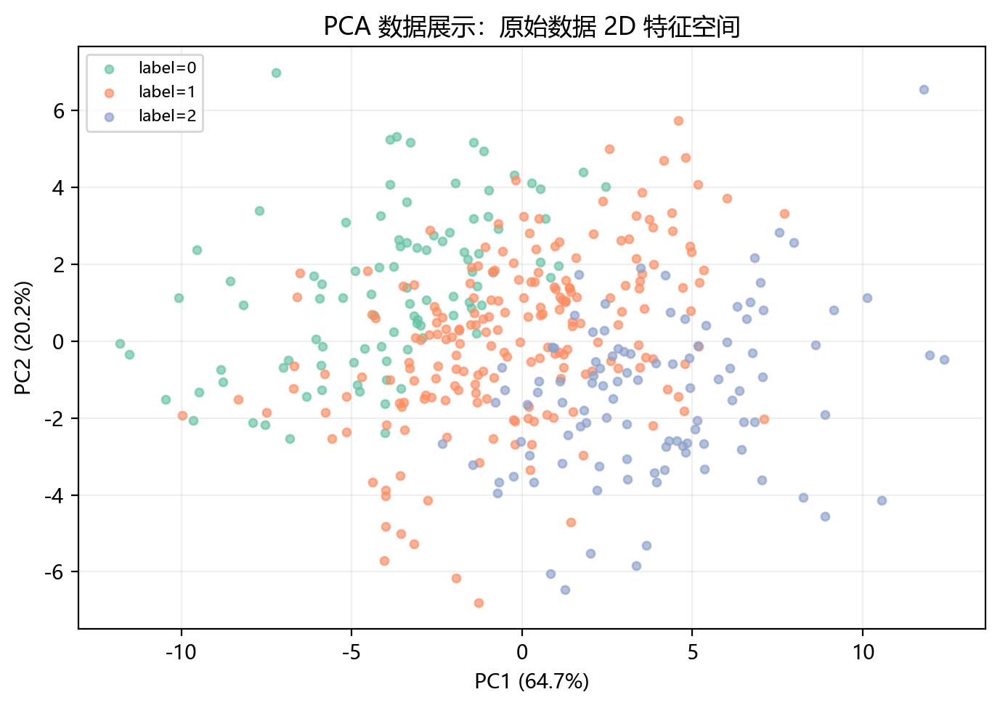
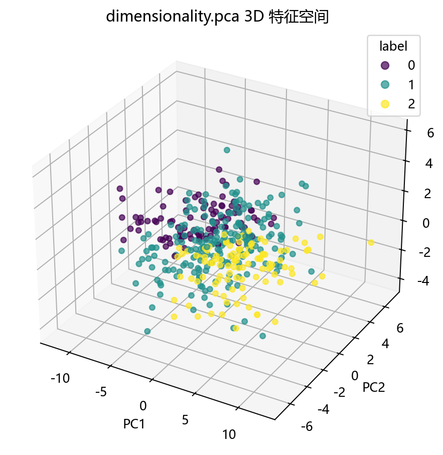

# 数据构成

## 本章目标

1. 明确本仓库 PCA 数据来自 `DimensionalityData.pca()` 构造的低秩高维合成数据。
2. 理解数据的低秩结构——10 维表面特征中仅隐藏 3 个真实维度——这正是 PCA 的价值所在。
3. 明确 `label` 的角色——它是数据生成时构造的伪标签，仅用于可视化着色，不参与 PCA 训练。

## 重点方法与概念速览

| 名称 | 类型 | 作用 |
|---|---|---|
| `DimensionalityData.pca()` | 方法 | 生成 PCA 使用的低秩高维合成数据 |
| `base @ projection + noise` | 数据构造 | 3 维真实结构经随机投影映射到 10 维 + 高斯噪声——模拟"表面维度假高"的真实场景 |
| `pca_data` | 变量 | 在 `data_generation/__init__.py` 中导出的 DataFrame |
| `label` | 列名 | 由 `(base[:,0]>0) + (base[:,1]>0)` 生成的伪标签（3 类）——仅用于可视化着色，不参与 `fit()` |
| `StandardScaler` | 类 | 对特征做 Z-score 标准化——协方差矩阵计算的前置条件 |

## 1. 数据生成：`DimensionalityData.pca()`

当前 PCA 数据来自 `DimensionalityData.pca()`，底层纯手工构造，不依赖 scikit-learn 的现成数据生成器。

### 参数速览

适用方法：`DimensionalityData.pca()` 内部使用的参数（来自 `DimensionalityData` 数据类的属性）

| 参数名 | 类型 | 说明 | 示例取值 |
|---|---|---|---|
| `n_samples` | `int` | 总样本数。默认 `400` | `400`、`500` |
| `pca_n_features` | `int` | 表面特征维度——数据的"表观维数"。默认 `10` | `10`、`20` |
| `pca_n_informative` | `int` | 真实信息维度——数据真正的固有秩。默认 `3` | `3`、`5` |
| `pca_noise_std` | `float` | 高斯噪声的标准差。`0.5` 在"可识别结构"和"适度干扰"间取得平衡 | `0.1`、`0.5`、`1.0` |
| `random_state` | `int` | 随机种子，保证数据可复现。默认 `42` | `42` |
| 返回值 | `DataFrame` | 含 10 个特征列（`x1`–`x10`）和 1 个伪标签列（`label`）的 DataFrame，形状 $(400, 11)$ | — |

### 示例代码

```python
rng = np.random.default_rng(random_state)

# 1. 生成 3 维真实结构
base = rng.standard_normal((n_samples, pca_n_informative))  # (400, 3)

# 2. 随机投影矩阵将 3 维映射到 10 维
projection = rng.standard_normal((pca_n_informative, pca_n_features))  # (3, 10)

# 3. 低秩信号 + 高斯噪声
X = base @ projection  # (400, 10) — 秩为 3
X += rng.standard_normal((n_samples, pca_n_features)) * pca_noise_std

# 4. 构造伪标签（仅用于着色）
label = (base[:, 0] > 0).astype(int) + (base[:, 1] > 0).astype(int)  # {0, 1, 2}
```

### 理解重点

- 数据有 10 个表面特征，但真正变化的维度只有 3 个（加噪声）——这正是 PCA 最擅长处理的场景。
- `base @ projection` 产生的信号矩阵秩为 $\min(3, 10) = 3$——前 3 个主成分应捕获几乎全部信号，后续主成分仅贡献噪声方差。
- `pca_noise_std=0.5` 在"结构清晰可辨识"和"不显得过于人工"之间取得了教学平衡。
- 这种构造方式直观展示了 PCA 的核心价值——从 10 维中提取 3 个真正有意义的方向。

## 2. 特征列与 `label` 的角色

### 参数速览

| 参数名 | 类型 | 说明 | 示例取值 |
|---|---|---|---|
| `X` | `DataFrame`，形状 $(400, 10)$ | 含 10 个连续特征的特征矩阵，列名 `x1`–`x10` | `data.drop(columns=["label"])` |
| `label` | `ndarray`，形状 $(400,)$ | 伪标签 $\{0, 1, 2\}$——由真实低维结构的前两个维度符号决定，**仅用于可视化着色** | `data["label"].values` |

### 示例代码

```python
X = data.drop(columns=["label"])
y = data["label"].values
```

### 理解重点

- `label` 不传入 `model.fit()`——PCA 是无监督算法，`fit(X)` 只接收特征。
- `label` 的唯一目的是在 `plot_dimensionality(...)` 中为散点着色——帮助读者观察降维后数据的几何结构，而非评估分类效果。
- `label` 由 `base[:,0] > 0` 和 `base[:,1] > 0` 共同决定——这意味着 2D PCA 投影图上的类别分布恰好与真实低维结构的两个主方向相关，但 PCA 本身并不知道这一点。
- 与 LDA 的关键区别：LDA 的 `label` 参与训练，PCA 的 `label` 只用于着色。

## 3. 标准化

### 参数速览

适用 API：`StandardScaler().fit_transform(X)`

| 参数名 | 类型 | 说明 | 示例取值 |
|---|---|---|---|
| `X` | `DataFrame`，形状 $(400, 10)$ | 去掉 `label` 后的全量特征矩阵 | `X` |
| 返回值 | `ndarray` | $z_{ij} = (x_{ij} - \mu_j) / \sigma_j$，均值为 0 标准差为 1 | `X_scaled` |

### 示例代码

```python
scaler = StandardScaler()
X_scaled = scaler.fit_transform(X)
```

### 理解重点

- PCA 依赖协方差矩阵——$\mathbf{S} = \frac{1}{N}\mathbf{X}^T\mathbf{X}$ 的元素是平方和与叉积，对特征尺度高度敏感。
- 当前合成数据各特征量纲本已相近（均为高斯噪声的线性组合），但标准化仍是最佳实践。
- 与 LDA 流水线一致——无切分，在全量数据上直接 `fit_transform`。这是降维分册（PCA 和 LDA）共有的教学型简化。

## 数据可视化









## 常见坑

1. 把 `label` 当成训练标签传入 `model.fit()`——PCA 是无监督算法，不接受标签参数。
2. 忽略标准化——协方差矩阵计算被特征量纲绑架，主成分方向失真。
3. 忘记数据是低秩合成结构——前 3 个主成分应捕获绝大部分方差，若结果与此不符，说明噪声水平或数据处理有问题。
4. 把伪标签的 3 个类别当成数据固有的分类目标——`label` 只是低维结构的符号化着色依据。

## 小结

- 当前 PCA 数据来自手工构造的低秩合成数据：`base`（400×3）@ `projection`（3×10）+ 噪声（$\sigma=0.5$）。
- 数据流为：随机生成 → 低秩信号 + 噪声 → DataFrame（`x1`–`x10` + `label`）→ 剥离 `label` → 全量标准化。
- `label` 仅用于可视化着色——这是无监督降维与有监督降维（LDA）在数据处理上的根本差异。
- 低秩构造（10 维表面仅 3 维真实变化）使 PCA 的价值直观可感——前 3 个主成分应与后续主成分形成明显的方差断层。
