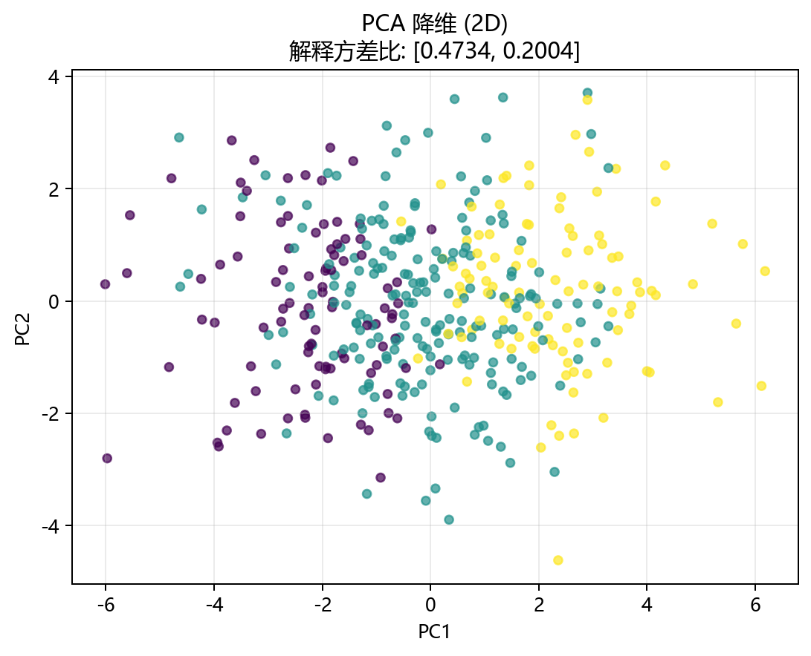
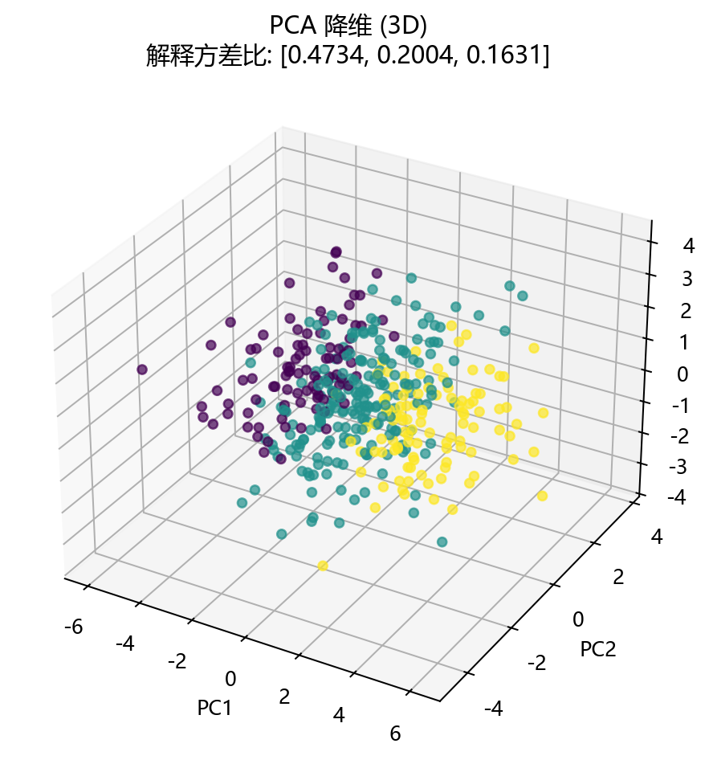

# 思路与直觉

> 对应代码：`data_generation/dimensionality.py`、`model_training/dimensionality/pca.py`
>  
> 相关对象：`DimensionalityData.pca()`、`train_model(...)`

## 本章目标

1. 理解 PCA 为什么不是分类器或回归器，而是在找“最有信息的投影方向”。
2. 理解“方差最大”为什么在 PCA 中常被当作“信息最多”的近似标准。
3. 把这些直觉和当前仓库的低秩高维合成数据对应起来。

## 重点方法与概念速览

| 名称 | 类型 | 作用 |
|---|---|---|
| 主成分 | 概念 | 方差最大的投影方向 |
| 解释方差比 | 指标 | 衡量每个主成分保留了多少信息 |
| 累计解释方差 | 指标 | 衡量前几个主成分总共保留了多少信息 |
| 降维投影 | 结果 | 把高维数据压缩到更低维空间 |

## 1. PCA 想做什么

PCA 的核心目标，不是预测标签，而是把高维数据投影到一个更低维的空间里，同时尽量保留数据中最重要的变化结构。

### 参数速览（本节）

适用过程（本节）：

1. 找主方向
2. 按主方向排序
3. 保留前几个方向
4. 做低维投影

| 阶段 | 直观含义 |
|---|---|
| 找方向 | 找到数据最“展开”的方向 |
| 排序 | 按能解释的方差大小排序 |
| 保留主成分 | 丢掉信息较少的方向 |
| 投影 | 用少数方向表示原始数据 |

### 理解重点

- PCA 关心的是数据结构，而不是标签预测。
- 它更像是在做“压缩表示”，而不是“监督学习拟合”。
- 当前分册的所有训练与输出，都要围绕这个无监督降维目标展开。

## 2. 为什么“方差大”通常意味着“信息多”

### 参数速览（本节）

适用概念（本节）：

1. 大方差方向
2. 小方差方向

| 方向类型 | 直观含义 |
|---|---|
| 方差大 | 样本在该方向上分布更分散，信息更丰富 |
| 方差小 | 样本在该方向上变化较小，更可能接近噪声或次要结构 |

### 理解重点

- 如果一个方向上所有点几乎都挤在一起，那么把这个方向保留下来的意义通常不大。
- 反过来，如果一个方向上点分布得很开，它通常承载了更重要的结构信息。
- PCA 正是利用这个直觉，把“最能展开数据”的方向排在最前面。

## 3. 为什么当前数据特别适合讲 PCA

### 参数速览（本节）

适用数据特点（本节）：

1. 原始特征维度高于真实信息维度
2. 只有少数主方向真正有信息
3. 其余部分含噪声

| 数据特点 | 对 PCA 的意义 |
|---|---|
| 表面上 10 维 | 看起来是高维问题 |
| 实际只有 3 个主方向 | 适合做降维压缩 |
| 叠加高斯噪声 | 更接近真实场景下的冗余与噪声维度 |

### 理解重点

- 如果数据每个维度都同样重要，PCA 的优势不会特别明显。
- 当前数据故意设计成“低秩结构藏在高维空间里”，就是为了让 PCA 能明显找出主方向。
- 这也是为什么 2D 和 3D 投影在当前分册里都具有很强的教学意义。

## 4. 为什么 `label` 不参与训练却仍然有用

### 参数速览（本节）

适用列（本节）：

1. `X`
2. `label`

| 列名 | 当前作用 |
|---|---|
| 特征矩阵 `X` | PCA 真正的训练输入 |
| `label` | 只用于投影后着色与结构观察 |

### 理解重点

- 当前 `label` 的存在，不是为了让 PCA 学分类边界，而是为了让你更容易在 2D / 3D 图里看出结构是否被保留。
- 这正是无监督降维里很常见的一种教学方式：训练不看标签，展示时用标签辅助解释。
- 文档必须把这个边界讲清楚，否则很容易把 PCA 误写成有监督方法。

## 5. 为什么当前实现要分别训练 2D 和 3D PCA

### 参数速览（本节）

适用配置（本节）：

1. `n_components=2`
2. `n_components=3`

| 配置 | 当前作用 |
|---|---|
| 2D PCA | 用于二维可视化和最基本压缩 |
| 3D PCA | 用于展示再多保留一个主方向时的结构变化 |

### 理解重点

- 当前流水线不是只训练一个 PCA 模型，而是分别训练 2 维和 3 维版本。
- 这样可以直观比较“保留 2 个主成分”和“保留 3 个主成分”时结构保真度的差异。
- 这也是当前分册工程实现里一个很值得强调的细节。

## 6. 与 LDA 相比，PCA 的优势和边界

### 参数速览（本节）

适用对比对象（本节）：

1. PCA
2. LDA

| 维度 | PCA | LDA |
|---|---|---|
| 学习方式 | 无监督 | 有监督 |
| 优化目标 | 最大化投影方差 | 最大化类间可分性 |
| 是否使用标签 | 否 | 是 |
| 当前分册重点 | 主方向与解释方差 | 不在本章重点内 |

### 理解重点

- PCA 擅长做“结构压缩”，不保证最适合分类边界分离。\n+- 如果任务目标本身就是分类判别，LDA 往往更直接。\n+- 当前分册因此要把“最大方差”与“最大可分性”区别开来。

## 7. 直觉如何映射到当前训练日志和可视化输出

### 参数速览（本节）

适用输出项（分项）：

1. `explained_variance_ratio_`
2. `累计解释方差`
3. 2D / 3D 降维图

| 输出项 | 可以帮助判断什么 |
|---|---|
| 解释方差比 | 每个主成分保留了多少信息 |
| 累计解释方差 | 前几个主成分总共保留了多少信息 |
| 降维图 | 主方向投影后结构是否仍清晰 |

### 理解重点

- 当前训练日志里最关键的输出，不是精度，而是解释方差比和累计解释方差。\n+- 当前可视化的重点，不是分类边界，而是投影后的结构是否依然有组织。\n+- 这说明 PCA 分册的观察重点与监督学习分册完全不同。

## 可视化

## 常见坑

1. 把 PCA 误写成分类器或回归器，忽略它本质上是无监督降维。\n+2. 看到 `label` 就误以为当前训练用到了标签。\n+3. 把“方差大”机械理解成“一定更有业务意义”，而不考虑它只是当前无监督压缩中的近似准则。

## 小结

- PCA 的核心直觉，是保留方差最大的投影方向来压缩数据表示。\n+- 当前低秩高维数据非常适合展示这种“少数主方向承载主要信息”的现象。\n+- 把这些直觉建立起来之后，再看数学原理、训练流程和降维图像会更容易。
