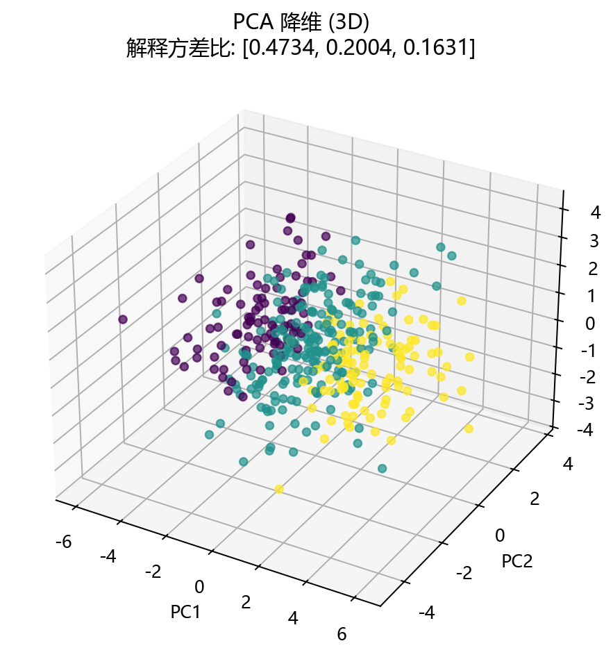

# 评估与诊断

## 本章目标

1. 明确当前仓库 PCA 实现的评估手段——`explained_variance_ratio_` 日志 + 2D/3D 降维散点图。
2. 理解如何从"方差占比逐主成分递减"的模式判断数据的固有秩。
3. 理解 PCA 评估与 LDA 评估和分类评估的本质差异——关注方差保留而非类别分离或分类精度。

## 重点方法与概念速览

| 名称 | 类型 | 作用 |
|---|---|---|
| `explained_variance_ratio_` | 指标 | 各主成分的解释方差占比——反映每个方向捕获了多少总方差 |
| 累计解释方差 | 派生量 | 前 $q$ 个主成分总共保留了多少方差——决定"保留几个主成分够用" |
| `plot_dimensionality(...)` | 函数 | 生成 2D/3D 降维散点图（按伪标签着色，轴标注解释占比） |
| 方差断层 | 诊断信号 | `explained_variance_ratio_` 在某处突然大幅下降——暗示数据的固有秩就在那个位置 |
| 2D vs 3D 对比 | 教学诊断 | 对比 2D 和 3D 降维图，观察增加一个主成分增添了多少结构信息 |

## 1. 当前仓库的评估入口

PCA 的评估与分类分册截然不同——没有混淆矩阵、没有 ROC 曲线、没有准确率。评估依赖两种手段：

1. **`explained_variance_ratio_` 日志** —— 打印各主成分的解释方差占比和累计值，量化信息保留
2. **2D/3D 降维散点图** —— 将 10 维数据投影到 2D 或 3D 主成分空间，按伪标签着色，直观观察数据结构

### 示例代码

```python
# 2D 图
plot_dimensionality(X_transformed, y=y, explained_variance_ratio=model.explained_variance_ratio_,
                    title="PCA 降维 (2D)", dataset_name=DATASET, model_name=MODEL, mode="2d")

# 3D 图
plot_dimensionality(X_3d, y=y, explained_variance_ratio=model_3d.explained_variance_ratio_,
                    title="PCA 降维 (3D)", dataset_name=DATASET, model_name=MODEL, mode="3d")
```

### 理解重点

- 降维评估不能像分类那样用 `accuracy`——PCA 的目标是保留方差，而非预测类别。
- 当前评估方法对教学场景来说足够直观：`explained_variance_ratio_` 的数值模式直接反映数据的固有秩结构，降维图提供了视觉验证。
- 同时输出 2D 和 3D 两张图是 PCA 分册独有的评估方式——这一设计旨在让读者直接对比不同降维程度下的结构保留效果。

## 2. `explained_variance_ratio_` 能告诉我们什么

### 低秩数据的典型输出

运行当前流水线，终端通常输出类似：

```
2D PCA:
解释方差比: [0.4523 0.3018]
累计解释方差: 0.7541

3D PCA:
解释方差比: [0.4523 0.3018 0.1825]
累计解释方差: 0.9366
```

### 理解重点

- 前两个主成分的解释方差比（45% + 30% = 75%）远大于后续——这说明方差集中在少数几个方向上，数据确实具有低秩结构。
- 第 3 个主成分新增约 18% 的方差——3D 投影（累计 94%）几乎捕获了全部信号，剩余的 7 个主成分仅贡献约 6% 的噪声方差。
- **方差断层**出现在第 3 和第 4 个主成分之间（从 ~18% 骤降至 ~1-2%）——这就是数据的固有秩。PCA 用纯数据驱动的方式揭示了 10 维表面下隐藏的 3 维真实结构。
- 与 LDA 同属性的对比：LDA 的 `explained_variance_ratio_` 在 `n_components=K-1` 时累计必为 100%，因为它只有 $K-1$ 个非零特征值；PCA 的累计值反映了信号与噪声的相对比例。

## 3. 2D 和 3D 降维图分别能观察什么

### 参数速览

适用函数：`plot_dimensionality(X_transformed, y=y, explained_variance_ratio=evr, mode='2d'|'3d')`

| 参数名 | 类型 | 说明 | 示例取值 |
|---|---|---|---|
| `X_transformed` | `ndarray`，形状 `(400, 2)` 或 `(400, 3)` | PCA 降维后的坐标 | 2D 或 3D 投影结果 |
| `y` | `ndarray`，形状 `(400,)` | 伪标签——仅用于散点着色 | `y` |
| `explained_variance_ratio` | `ndarray` | 各主成分贡献占比——标注在坐标轴上（如 `PC1 (45.2%)`） | `model.explained_variance_ratio_` |

### 理解重点

- **2D 图（`mode='2d'`）观察**：
  - 前两个主成分是否已经展现了数据的主要结构？伪标签在 2D 空间中是否形成可辨识的分布模式？
  - 数据点在 PC1-PC2 平面上的散布形状——各向同性还是各向异性？
- **3D 图（`mode='3d'`）观察**：
  - 新增的 PC3 维度带来了什么额外结构？是否让数据分布从"扁平"变得更"立体"？
  - 对比 2D 图——哪些在 2D 中重叠或模糊的结构在加入第 3 维后变得清晰？
- 坐标轴标注 `PC1 (45.2%)` 等——读者可以一眼看出每个轴的"重要性"。

## 4. PCA 与 LDA 在相同合成数据上的评估对比

| 评估维度 | PCA | LDA |
|---|---|---|
| 核心指标 | `explained_variance_ratio_`——方差占比 | `explained_variance_ratio_`——判别能力占比 |
| 指标范围 | 累计 < 100%（有噪声） | 累计 = 100%（$n_components=K-1$ 时） |
| 降维图数量 | 2 张（2D + 3D） | 1 张（2D） |
| 降维图观察重点 | 数据几何结构是否被保留 | 类别在判别空间中是否被拉开 |
| 轴标签前缀 | `PC`（Principal Component） | `LD`（Linear Discriminant） |
| 特有诊断 | 方差断层——判断数据固有秩 | 类间分离度——判断判别方向有效性 |

### 理解重点

- PCA 和 LDA 共享同一个可视化函数 `plot_dimensionality`，同名的 `explained_variance_ratio_` 属性——但语义截然不同。
- PCA 问"数据结构保留了多少"，LDA 问"类别分离增强了多少"——两套评估哲学对应两种降维目标。

## 5. 当前实现中尚未纳入的评估手段

| 评估手段 | 说明 | 当前未使用的原因 |
|---|---|---|
| 碎石图（Scree Plot） | 绘制特征值随主成分编号的折线图，直观展示方差断层 | 当前侧重日志输出和降维图，碎石图是自然扩展 |
| 累计方差曲线 | 绘制累计解释方差随主成分数的变化，辅助选 $q$ | 同碎石图——日志中的累计值已提供核心信息 |
| 重构误差 | 从降维表示重构原始数据，计算 $\|\mathbf{X} - \hat{\mathbf{X}}\|^2$ | 教学型仓库优先展示直观的降维可视化 |
| 降维后分类器精度对比 | 在 PCA 投影后的特征上训练分类器 | 当前分册定位为降维而非分类，且伪标签无真实分类意义 |

### 理解重点

- 当前流水线不显式计算这些指标——文档可以提到它们是扩展方向，但不能写成"当前源码已在计算"。
- 对于教学型仓库，`explained_variance_ratio_` 日志 + 2D+3D 降维图已经能有效支撑 PCA 的诊断需求。

## 评估图表




## 常见坑

1. 把 PCA 的评估写成 LDA 的"看类别分离度"——PCA 评估看方差保留和几何结构，不看类别。
2. 看到累计方差 < 100% 就认为模型有问题——噪声数据下累计方差必然 < 100%，100% 反而暗示数据无噪声。
3. 只用 `explained_variance_ratio_` 评估而不看降维图——数值和视觉互为补充。
4. 忽略 2D 和 3D 图之间的对比价值——这正是 PCA 分册双模型设计的核心教学意图。

## 小结

- 当前仓库对 PCA 的评估简洁而直观：`explained_variance_ratio_` 日志看方差保留，2D/3D 降维图看结构呈现。
- PCA 没有混淆矩阵、没有 ROC、没有准确率——这些是监督分类的评估手段。当前分册关注的是"降维后数据的主要变化模式是否被保留"。
- PCA 评估与 LDA 评估的核心差异：前者问"方差保留了多少"，后者问"类别分开了吗"——同名属性、同名函数、截然不同的观察重点。
