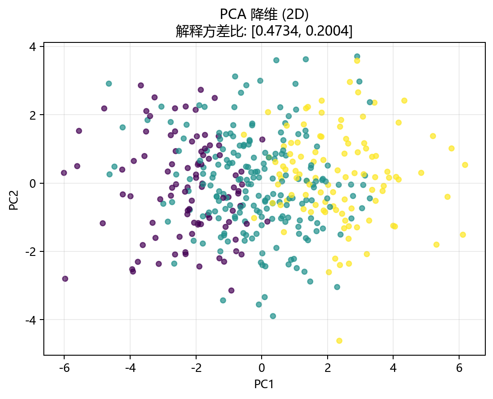

# 工程实现

## 本章目标

1. 从工程角度看清 PCA 在本仓库中的完整调用链。
2. 理解数据生成、模型训练、流水线编排和降维可视化分别负责什么。
3. 理解 PCA 工程实现的独特之处——双模型（2D+3D）、无监督、与 LDA 共用可视化模块。

## 对应代码速览

| 组件 | 路径 | 说明 |
|---|---|---|
| 数据生成 | `data_generation/dimensionality.py` | `DimensionalityData.pca()` 生成低秩高维合成数据 |
| 数据导出 | `data_generation/__init__.py` | 向外暴露 `pca_data` |
| 训练封装 | `model_training/dimensionality/pca.py` | 构建并训练 `PCA`，打印解释方差比日志 |
| 流水线入口 | `pipelines/dimensionality/pca.py` | 组织标准化、2D/3D PCA 训练、投影与降维可视化 |
| 降维可视化 | `result_visualization/dimensionality_plot.py` | 绘制降维后的 2D/3D 散点图（按类别着色，轴标注解释占比） |

## 1. 端到端运行入口

### 示例代码

```bash
python -m pipelines.dimensionality.pca
```

### 理解重点

- 这个命令串起当前 PCA 分册中最核心的工程流程。
- 依次完成：数据复制 → 剥离 `label` → 全量标准化 → 2D PCA `fit(X)`（SVD）→ `transform(X)` → 2D 降维图 → 3D PCA `fit(X)` → `transform(X)` → 3D 降维图。
- PCA 流水线独有的两阶段结构：先训练 2D 模型并画图，再训练 3D 模型并画图。这与 LDA 的单模型单图结构不同。

## 2. `run()` 串起了整个流程

当前流水线的核心函数 `run()` 采用线性编排风格：

```python
def run():
    # 1. 复制数据 & 拆出特征与伪标签
    data = pca_data.copy()
    X = data.drop(columns=["label"])
    y = data["label"].values

    # 2. 全量标准化——无切分（教学型简化）
    scaler = StandardScaler()
    X_scaled = scaler.fit_transform(X)

    # 3. 第一阶段：2D PCA
    model = train_model(X_scaled, n_components=2)
    X_transformed = model.transform(X_scaled)
    plot_dimensionality(X_transformed, y=y, explained_variance_ratio=...,
                        title="PCA 降维 (2D)", dataset_name=DATASET,
                        model_name=MODEL, mode="2d")

    # 4. 第二阶段：3D PCA（第二个独立模型）
    model_3d = train_model(X_scaled, n_components=3)
    X_3d = model_3d.transform(X_scaled)
    plot_dimensionality(X_3d, y=y, explained_variance_ratio=...,
                        title="PCA 降维 (3D)", dataset_name=DATASET,
                        model_name=MODEL, mode="3d")
```

### 理解重点

- `run()` 的职责是编排，不是算法实现——真正的 SVD 分解在 `PCA.fit()` 中。
- 数据流是单向且分两支：标准化数据 → 2D PCA `fit`+`transform` → 2D 图，然后再 → 3D PCA `fit`+`transform` → 3D 图。
- 与分类流水线的核心差异：
  - **无 `train_test_split`**——当前实现为教学型简化
  - **无 `predict()` 调用**——PCA 是降维工具，输出是 `transform()` 而非类别标签
  - **双模型双图**（2D+3D）而非分类的四图（混淆矩阵+ROC+决策边界+学习曲线）
- 与 LDA 流水线的核心差异：
  - **`fit()` 不传 `y`**——无监督 vs 有监督
  - **双模型**（2D+3D）vs 单模型（2D only）
  - **`n_components` 无上限**（不受 $K-1$ 约束）

## 3. 训练模块负责什么

`model_training/dimensionality/pca.py` 里的 `train_model(...)` 主要负责四件事：

1. 创建 `PCA(n_components=n_components, svd_solver='auto', random_state=42)` 实例
2. 调用 `model.fit(X_train)`——SVD 分解（无监督，不传标签）
3. 打印 `n_components`、`explained_variance_ratio_` 和累计解释方差
4. 返回训练完成的模型对象

### 参数速览

适用函数：`train_model(X_train, n_components=2, svd_solver='auto', random_state=42)`

| 参数名 | 类型 | 说明 | 示例取值 |
|---|---|---|---|
| `X_train` | `array_like` | 标准化后的特征矩阵，传入 `PCA.fit()` | `X_scaled` |
| `n_components` | `int` | 保留的主成分数。2D 模型为 `2`，3D 模型为 `3` | `2`、`3` |
| `svd_solver` | `str` | SVD 求解器。默认 `'auto'`——自动选择最优实现 | `'auto'`、`'full'`、`'randomized'` |
| `random_state` | `int` | 随机种子。默认 `42` | `42` |
| 返回值 | `PCA` | 已完成 `fit()` 的模型对象，含 `components_`、`explained_variance_ratio_` 等 | — |

### 理解重点

- PCA 的 `fit()` 是无监督的——不接收标签参数。这与 LDA 分册形成鲜明对比（LDA 必须传 `y`），与聚类分册一致。
- 训练日志中的 `explained_variance_ratio_` 是 PCA 的核心输出——它直接反映各主成分的相对重要性。
- 当前流水线调用了两次 `train_model()`——分别创建和训练了两个独立的 PCA 实例。

## 4. 可视化模块负责什么

### 模块职责

| 模块 | 函数 | 输入 | 输出 |
|---|---|---|---|
| 降维可视化 | `plot_dimensionality(...)` | `X_transformed`（投影坐标）、`y`（着色标签）、`explained_variance_ratio`（轴标注）、`mode`（`'2d'` 或 `'3d'`） | 2D 或 3D 降维散点图（PNG），坐标轴标注解释占比 |

### 理解重点

- `plot_dimensionality(...)` 是当前 PCA 流水线中**唯一**的可视化模块——与分类分册的 4 种评估函数形成鲜明对比。
- 与 LDA **共用同一个可视化函数**——区别在于传入的数据含义不同（主成分投影 vs 判别投影），以及 `mode` 参数（PCA 用了 2D 和 3D 两种模式，LDA 只用 2D）。
- 轴标签前缀为 `PC`（Principal Component）——如 `PC1 (45.2%)`。LDA 使用时为 `LD`（Linear Discriminant）。
- 3D 模式下使用 matplotlib 的 `projection='3d'` 创建三维坐标轴。

## 5. 模块间的数据依赖关系

| 数据 | 生产者 | 消费者 |
|---|---|---|
| `pca_data` | `data_generation/dimensionality.py` | `pipelines/dimensionality/pca.py` |
| `y` | `data["label"]` 提取 | `plot_dimensionality`（仅着色，两次调用） |
| `X_scaled` | `StandardScaler` | `train_model`（2D）、`train_model`（3D）、`model.transform`（2D）、`model_3d.transform`（3D） |
| `model`（2D PCA） | `train_model(X_scaled, n_components=2)` | `model.transform`、`plot_dimensionality`（2D） |
| `model_3d`（3D PCA） | `train_model(X_scaled, n_components=3)` | `model_3d.transform`、`plot_dimensionality`（3D） |
| `X_transformed`（2D） | `model.transform(X_scaled)` | `plot_dimensionality`（2D） |
| `X_3d`（3D） | `model_3d.transform(X_scaled)` | `plot_dimensionality`（3D） |
| 图片产物 | `plot_dimensionality(...)` | `outputs/pca/` 目录 |

### 理解重点

- 数据依赖关系中有两个并行的模型分支——这是 PCA 流水线独有的结构。LDA 只有一个分支。
- `y` 的流向是单向且单一的——只到 `plot_dimensionality`，不进任何模型。这与 LDA（`y` 同时流入 `train_model` 和 `plot_dimensionality`）形成鲜明对比。
- `X_scaled` 被 4 个下游节点共享（2D 训练、3D 训练、2D 投影、3D 投影）——标准化是整个流水线的计算基础。

## 6. 运行后能得到什么

### 输出项

| 输出类型 | 当前结果 | 用途 |
|---|---|---|
| 终端标题 | `PCA 降维流水线` | 在终端中定位当前运行入口 |
| 训练日志（2D） | 训练耗时、`n_components=2`、`explained_variance_ratio_`（各方向 + 累计） | 查看 2D PCA 的方差保留情况 |
| 训练日志（3D） | 训练耗时、`n_components=3`、`explained_variance_ratio_`（各方向 + 累计） | 查看 3D PCA 的方差保留情况——与 2D 对比 |
| 2D 降维图 | `outputs/pca/pca_dim_2d.png` | 2D 主成分空间中的样本分布 |
| 3D 降维图 | `outputs/pca/pca_dim_3d.png` | 3D 主成分空间中的样本分布 |

### 理解重点

- 输出是所有分册中最丰富的——2 组日志 + 2 张图（其他降维分册只有 1 组日志 + 1 张图）。
- 两次 `explained_variance_ratio_` 日志输出的前 2 个主成分占比应一致——因为 2D PCA 和 3D PCA 的前两个主成分方向相同。
- 2D 和 3D 降维图的对比是最核心的教学产出——它直接展示了"增加主成分如何提升结构保留"。

## 7. 推荐的源码阅读顺序

1. 先看 `pipelines/dimensionality/pca.py` — 入口，双模型双图结构一目了然
2. 再看 `model_training/dimensionality/pca.py` — 训练封装，理解无监督 `fit(X)` 和日志输出
3. 再看 `result_visualization/dimensionality_plot.py` — 降维散点图绘制逻辑（含 2D/3D 分支和 `explained_variance_ratio` 轴标注）
4. 最后回到 `data_generation/dimensionality.py` — 理解低秩合成数据的构造方式

### 理解重点

- 从入口看整体流程（特别是双模型结构），再下钻到训练和可视化细节，阅读成本最低。
- PCA 的调用链与 LDA 几乎一致（同一套模块分层），差异集中在：`fit()` 有无 `y`、是否双模型、`mode` 是否含 `'3d'`。

## 运行结果



## 常见坑

1. 把 2D 和 3D PCA 当成同一个模型——它们是两个独立 `PCA` 实例，各自 `fit()` 了一次。
2. 期待当前流水线有 `train_test_split` 或 `predict()`——PCA 是降维工具，输出低维坐标。
3. 忽略 `y` 在 PCA 流水线中只到可视化、不进模型——这是无监督降维与有监督降维（LDA）在数据流上的根本差异。
4. 忘记可视化模块是 PCA 和 LDA 共用的——轴标签前缀 `PC` vs `LD` 由调用者决定（在 `plot_dimensionality` 内部是写死的，目前用 `PC`）。

## 小结

- 当前 PCA 工程实现采用与 LDA 一致的模块分层，但具有独特的双模型结构：数据生成 → 训练封装（无监督，两次调用）→ 流水线编排（两阶段）→ 可视化（2D+3D）。
- `run()` 负责串联两阶段流水线，`train_model(...)` 负责 SVD 分解（仅 `fit(X)`），`plot_dimensionality(...)` 负责降维可视化（2D 和 3D 两种模式）。
- PCA 在工程上最不同于 LDA 的地方：无监督（`fit` 无 `y`）、双模型双图、`n_components` 无 $K-1$ 约束。
- PCA 在工程上最不同于分类算法的地方：输出是 `transform()` 而非 `predict()`、降维散点图而非分类评估图。
